# Computational Economics

This repository gives graduate students and researchers short, executable models from computational and structural economics. Each example is motivated by a by distinct economic question or computational method. Each can be run from its folders with `python run.py`.

This repo was sourced from ideas and contributions of PhD colleagues [Shahzoor Safdar](https://github.com/shahzoor), [Simon Lebastard](https://github.com/slebastard), [Max Blesch](https://github.com/MaxBlesch), [Enoch H. Kang](https://sites.google.com/view/hyunwookkang), [Hoang Nguyen](https://github.com/huuhoang2211), [Kathryn Nicholson](https://sites.google.com/gwmail.gwu.edu/kathrynnicholson/home), and [Weipeng Zhang](https://www.linkedin.com/in/weipengz/). It also reflects the teaching and guidance of professors [John Rust](https://editorialexpress.com/jrust/), [Nathan Miller](http://www.nathanhmiller.org/), [Harry Paarsch](https://sites.google.com/site/hjpaarsch/), [Sanjog Misra](https://sanjogmisra.com/), [Toshihiko Mukoyama](https://sites.google.com/view/toshimukoyama/home), [Mark Huggett](https://sites.google.com/georgetown.edu/mark-huggett/home), [Dan Cao](https://dan-cao.facultysite.georgetown.edu/), and [Benjamin Moll](https://benjaminmoll.com/). At the bottom you will find a wider list of resources. 

## Contents

- [Quick Start](#quick-start)
- [Numerical Methods](#numerical-methods)
- [Dynamic Programming](#dynamic-programming)
- [Macroeconomics](#macroeconomics)
- [Industrial Organization](#industrial-organization)
- [Structural Econometrics](#structural-econometrics)
- [Choice and Demand](#choice-and-demand)
- [Computational Game Theory](#computational-game-theory)
- [Time Series and Filtering Methods](#time-series-and-filtering-methods)
- [Agent-Based Models](#agent-based-models)
- [Selected External Resources](#selected-external-resources)

## Quick Start

```bash
pip install -r requirements.txt
cd dynamic-programming/cake-eating
python run.py
# -> generates README.md + figures/ + tables/
```

## Numerical Methods

Here we cover common tools the rest of the repo uses. This covers solving `f(x) = 0`, finding extrema of `f(x)`, and approximating a function.

| Preview | Tutorial | Description |
|---|---|---|
| [](numerical-methods/root-finding/figures/trajectories.png) | **[Scalar Root Finding for Equilibrium Rates](numerical-methods/root-finding/)** | Find the interest rate that clears a stylized bond market by using root finding methods that solve for $f(x) = 0$. |
| [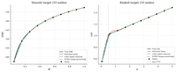](numerical-methods/interpolation/figures/target-vs-fit.png) | **[Off-Grid Function Approximation by Interpolation](numerical-methods/interpolation/)** | How to estimate a function from known values at a finite set of points. Linear, cubic spline, and PCHIP each fit smooth and kinked curves differently. |
| [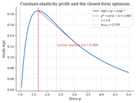](numerical-methods/scalar-optimization-monopoly-pricing/figures/profit-curve.png) | **[Scalar Optimization for Monopoly Pricing](numerical-methods/scalar-optimization-monopoly-pricing/)** | Maximize a monopolist's profit under constant-elasticity demand. Grid search, golden section, and Newton's method are benchmarked against the analytical solution. |
| [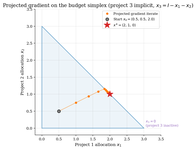](numerical-methods/constrained-optimization-kkt/figures/simplex-paths.png) | **[Constrained Optimization and KKT Conditions](numerical-methods/constrained-optimization-kkt/)** | Allocate a fixed budget across three projects with diminishing returns. We compare projected gradient, log barrier, and SLSQP. |
| [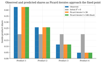](numerical-methods/fixed-point-acceleration/figures/share-fit.png) | **[Fixed-Point Iteration and Acceleration](numerical-methods/fixed-point-acceleration/)** | Recover product mean utilities from observed plain-logit shares using fixed point solvers. Picard, damped Picard, and Anderson acceleration are compared against the closed-form solution. |
| [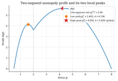](numerical-methods/global-search-multistart/figures/profit-surface.png) | **[Global Search and Multi-Start Diagnostics](numerical-methods/global-search-multistart/)** | Optimize a two-segment monopoly profit with one local and one global optima. Multi-start, random search, and simulated annealing are able to recover the global optima. |

## Dynamic Programming

These tutorials start from one-state decision problems and build toward risk, search, asset pricing, business cycles, and general equilibrium.

| Preview | Tutorial | Description |
|---|---|---|
| [](dynamic-programming/shock-discretization/figures/stationary-mass.png) | **[Discretizing Persistent Shocks](dynamic-programming/shock-discretization/)** | Tauchen and Rouwenhorst methods allow continous persistent income or productivity shocks to enter Bellman equations as a finite Markov chains. |
| [](dynamic-programming/cake-eating/figures/value-function.png) | **[Finite-Resource Cake Eating](dynamic-programming/cake-eating/)** | Allocate a fixed resource over time. Value function iteration recovers the closed-form optimal policy. |
| [](dynamic-programming/optimal-growth/figures/value-function.png) | **[Optimal Growth by Value Function Iteration](dynamic-programming/optimal-growth/)** | Allocate output between consumption and productive capital. Value function iteration recovers the log-utility policy and checks it against the closed form. |
| [](computational-methods/projection-methods/figures/chebyshev-basis.png) | **[Growth-Model Capital Policy by Chebyshev Projection](computational-methods/projection-methods/)** | Study the planner's capital-saving rule in a deterministic growth model. Chebyshev polynomial help represent the optimal policy in just a few coefficients. |
| [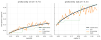](dynamic-programming/q-learning-growth/figures/policy-comparison.png) | **[Stochastic Optimal Growth by Q-Learning](dynamic-programming/q-learning-growth/)** | Solve a Brock-Mirman growth MDP without knowing the transitions. Tabular Q-learning learns the saving rule from sampled transitions. |
| [](dynamic-programming/solow-growth/figures/solow-diagram.png) | **[Solow Growth and Conditional Convergence](dynamic-programming/solow-growth/)** | Capital per effective worker converges to a Solow steady state. Iterating the transition shows how saving shifts levels. |
| [](dynamic-programming/consumption-savings/figures/value-functions.png) | **[Buffer-Stock Saving with Persistent Income by VFI](dynamic-programming/consumption-savings/)** | Households save under persistent income risk and a borrowing limit. Value function iteration on the asset-income grid recovers high MPCs near zero assets and a buffer-stock target. |
| [](dynamic-programming/job-search-mccall/figures/accept-vs-reject.png) | **[McCall Job Search and the Reservation Wage](dynamic-programming/job-search-mccall/)** | Unemployed workers choose when to accept wage offers. A scalar Bellman fixed point gives the reservation wage and checks finite-grid VFI. |
| [](dynamic-programming/asset-pricing/figures/asset-price-function.png) | **[Lucas Tree I: SDF Baseline by Scaled-Price Iteration](dynamic-programming/asset-pricing/)** | Price a Lucas tree from the household Euler equation. The stochastic discount factor links dividend risk and mean reversion to equilibrium prices. |
| [](dynamic-programming/rbc/figures/comovements.png) | **[RBC Capital, Labor, and Business-Cycle Moments](dynamic-programming/rbc/)** | Study a representative-household RBC model with endogenous labor. Global-grid VFI maps productivity shocks into investment, hours, and simulated moments. |
| [](dynamic-programming/diamond-mortensen-pissarides/figures/productivity-tightness.png) | **[DMP Search, Vacancies, and Unemployment](dynamic-programming/diamond-mortensen-pissarides/)** | Productivity shocks move tightness, vacancies, and unemployment through DMP free entry. A nonlinear fixed point shows surplus calibration drives amplification. |
| [](dynamic-programming/aiyagari/figures/capital-market.png) | **[Aiyagari Saving and Capital-Market Clearing](dynamic-programming/aiyagari/)** | Households save to self-insure under incomplete markets. Value function iteration and bisection recover the equilibrium interest rate. |

## Macroeconomics

This section covers heterogeneous households, DSGE models, nonlinear global solutions, and continuous-time control.

### Heterogeneous Agents

These tutorials focus on incomplete-markets households and equilibrium interest rates.

| Preview | Tutorial | Description |
|---|---|---|
| [](heterogeneous-agents/endogenous-grid-points/figures/consumption-policy.png) | **[Buffer-Stock Saving with IID Income by EGP](heterogeneous-agents/endogenous-grid-points/)** | Solve a buffer-stock saving problem under IID income without an inner asset-choice search. EGP works backward from next-period assets through the Euler equation, skipping the grid maximization that VFI does. |
| [](heterogeneous-agents/envelope-equation-iteration/figures/consumption-policy.png) | **[Buffer-Stock Saving with Persistent Income by Envelope-Equation Iteration](heterogeneous-agents/envelope-equation-iteration/)** | Study buffer-stock saving under IID income risk by iterating the marginal continuation value. EEI recovers the consumption policy via the envelope condition. |
| [](heterogeneous-agents/huggett-incomplete-markets/figures/bond-market.png) | **[Huggett Equilibrium and the Risk-Free Rate](heterogeneous-agents/huggett-incomplete-markets/)** | Find the risk-free rate in a one-bond economy with income risk and a borrowing limit. An HJB/KFE solve plus bisection clears aggregate bond demand. |
| [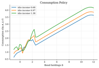](heterogeneous-agents/huggett-aggregate-risk-srl/figures/policy-consumption.png) | **[Structural Reinforcement Learning for Huggett with Aggregate Risk](heterogeneous-agents/huggett-aggregate-risk-srl/)** | Households save under idiosyncratic and aggregate income risk while the interest rate clears the bond market. A structural policy-gradient algorithm learns price-conditioned saving rules from simulated equilibrium paths. |

### Linearized DSGE

These tutorials log-linearize DSGE models around steady state and solve the rational-expectations transition. They use coefficient matching or Klein-style QZ, the same first-order logic behind standard DSGE solvers.

| Preview | Tutorial | Description |
|---|---|---|
| [](dsge/rbc/figures/irf-fixed-labor.png) | **[Linearized RBC by Perturbation and QZ (with and without endogenous labor)](dsge/rbc/)** | A TFP shock propagates through investment and (when labor is endogenous) hours. The fixed-labor 3x3 case is solved by hand-derived undetermined coefficients with Klein QZ as cross-check. The endogenous-labor 4x4 case is solved by Klein QZ alone. Each linear policy is checked against the exact nonlinear transition. |
| [](dsge/nkdsge/figures/irf-monetary-shock.png) | **[Sticky-Price Monetary Transmission in a New Keynesian DSGE](dsge/nkdsge/)** | Policy-rate wedges and demand shocks move output and inflation when prices are sticky. Coefficient matching solves the log-linear equilibrium. |
| [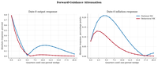](dsge/behavioral-nk/figures/forward-guidance-attenuation.png) | **[Cognitive Discounting in a Behavioral New Keynesian Model](dsge/behavioral-nk/)** | Compare rational and behavioral New Keynesian transmission when agents cognitively discount the future. Forward-guidance news has smaller current effects. |
| [](dsge/assetNews/figures/irf-surprise-vs-news.png) | **[Lucas Tree II: Dividend News by Linearized Pricing](dsge/assetNews/)** | Price a tree claim when investors learn about future dividends before cash flows arrive. A first-order pricing rule separates payoffs from discounting. |
| [](computational-methods/perturbation-linearization/figures/local-approximations.png) | **[Aggregate Adjustment Around a Steady State](computational-methods/perturbation-linearization/)** | A macro state returns after equal positive and negative shocks. Taylor perturbations approximate the nonlinear law near steady state. |

### Global Nonlinear DSGE

These tutorials solve macro models on grids so constraints, taxes, and risk sharing remain visible.

| Preview | Tutorial | Description |
|---|---|---|
| [](global-dsge/rbc-capital-tax/figures/steady-state-tax.png) | **[Capital Taxes and Saving in a Global RBC Model](global-dsge/rbc-capital-tax/)** | A rebated capital-income tax lowers saving by cutting the private return to capital. A global RBC grid traces the saving rule across productivity states. |
| [](global-dsge/rbc-irreversible-investment/figures/policy-functions.png) | **[Capital Overhang from Irreversible Investment in RBC](global-dsge/rbc-irreversible-investment/)** | Installed capital can become an overhang after a bad productivity draw. Global value function iteration locates the zero-investment boundary. |
| [](global-dsge/heaton-lucas/figures/equity-premium-and-distribution.png) | **[Heaton-Lucas Risk Sharing and Equity Premia](global-dsge/heaton-lucas/)** | Study why incomplete risk sharing makes wealth shares matter for equity premia. STPFI solves the implicit wealth-share transition under portfolio constraints. |
| [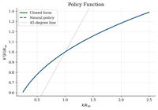](global-dsge/deep-learning-optimal-growth/figures/policy-comparison.png) | **[Deep Learning for Optimal Growth](global-dsge/deep-learning-optimal-growth/)** | Approximate the Brock-Mirman saving rule with a small JAX neural policy. Euler-residual training learns the policy on simulated capital states. |

### Continuous-Time Macro and Optimal Control

These examples cover HJB equations, phase diagrams, shooting, and shadow prices.

| Preview | Tutorial | Description |
|---|---|---|
| [](optimal-control/hjb-growth/figures/value-function.png) | **[Ramsey Capital Accumulation by HJB Upwinding](optimal-control/hjb-growth/)** | Follow Ramsey capital accumulation toward its steady state. An upwind HJB links the shadow value of capital to consumption and drift. |
| [](optimal-control/phase-diagrams/figures/phase-diagram.png) | **[Ramsey Consumption Choice and Saddle Paths](optimal-control/phase-diagrams/)** | Study initial consumption in Ramsey growth. The phase diagram and backward stable-arm integration select the path that reaches the saddle steady state. |
| [](optimal-control/ramsey-growth/figures/phase-diagram.png) | **[Ramsey Saving by Saddle-Path Shooting](optimal-control/ramsey-growth/)** | A Ramsey planner chooses initial consumption with inherited capital. Shooting adjusts the jump variable until the path reaches the saddle steady state. |

## Industrial Organization

The IO section covers firm boundaries, vertical relationships, demand, pricing, production, mergers, collusion, bargaining, and industry dynamics.

| Preview | Tutorial | Description |
|---|---|---|
| [](industrial-organization/theory-of-the-firm/figures/investment-incentives.png) | **[Firm Boundaries, Hold-Up, and Vertical Integration](industrial-organization/theory-of-the-firm/)** | Study when ownership should move inside the firm for relationship-specific investment. A grid comparison weighs incentives against hierarchy costs. |
| [](industrial-organization/vertical-relationships/figures/price-quantity.png) | **[Double Marginalization in Vertical Supply Chains](industrial-organization/vertical-relationships/)** | Compare a manufacturer-retailer channel with the integrated benchmark. Backward induction shows when a two-part tariff restores the joint optimum. |
| [](industrial-organization/vertical-contracts/figures/assortment-selection.png) | **[Vending Assortments Under Vertical Contracts](industrial-organization/vertical-contracts/)** | Vending contracts decide which products fit in scarce slots. Exact enumeration compares assortments under wholesale pricing, rebates, and slotting fees. |
| [](industrial-organization/logit-supply-side/figures/estimation-comparison.png) | **[Cereal Demand and Markup Recovery from Prices](industrial-organization/logit-supply-side/)** | Cereal demand has endogenous prices and unobserved costs. Berry inversion, IV/2SLS, and Bertrand-Nash FOCs recover markups and marginal costs. |
| [](industrial-organization/blp-random-coefficients/figures/observed-vs-predicted-shares.png) | **[Differentiated-Products Demand with BLP](industrial-organization/blp-random-coefficients/)** | Study how consumer heterogeneity changes substitution in differentiated-products markets. A BLP contraction with IV/GMM estimates taste dispersion. |
| [](industrial-organization/production-functions-markups/figures/production-estimates.png) | **[Production Elasticities and Firm Markups](industrial-organization/production-functions-markups/)** | Recover firm-year markups from materials elasticities and shares. A proxy-control regression corrects productivity bias before the markup formula. |
| [](industrial-organization/dynamic-games/figures/investment-policy.png) | **[Quality-Ladder Dynamic Game: Solving the MPE](industrial-organization/dynamic-games/)** | Firms invest to climb a quality ladder while rivals move too. A Markov-perfect fixed point gives investment policies and continuation values. |
| [](industrial-organization/dynamic-games-estimation/figures/ccp-heatmaps.png) | **[Quality-Ladder Dynamic Game: Estimating with CCPs](industrial-organization/dynamic-games-estimation/)** | Estimate payoff primitives in a two-firm quality ladder from observed investment choices. CCPs and forward-value evaluation replace repeated MPE solves. |
| [](industrial-organization/dynamic-entry-exit/figures/value-function.png) | **[Entry, Exit, and Market Structure in Oligopoly](industrial-organization/dynamic-entry-exit/)** | Sunk entry costs make the firm count persistent in oligopoly. A finite-state Bellman fixed point yields entry, exit, and the long-run market structure. |
| [](industrial-organization/nash-in-nash/figures/negotiated-prices.png) | **[Hospital-Insurer Network Bargaining](industrial-organization/nash-in-nash/)** | Hospital networks shape insurer outside options and negotiated payments. A Nash-in-Nash surplus split compares separate hospitals with a merged system. |
| [](industrial-organization/merger-simulation/figures/hhi-vs-nfirms.png) | **[Merger Pricing: Concentration Screens, Diversion, and Bertrand-Nash Equilibrium](industrial-organization/merger-simulation/)** | A horizontal merger reshapes pricing by internalizing diversion among co-owned products. Three layers stack: HHI screens, a four-product calibrated logit baseline, and a six-product extension across logit, linear, and log-linear demand with UPP, GUPPI, welfare, and an efficiency frontier. |

## Structural Econometrics

Structural econometrics focuses on estimating economic primitives from observed choices, transitions, and policies. These tutorials connect likelihoods, dynamic programs, revealed decisions, and reward recovery.

| Preview | Tutorial | Description |
|---|---|---|
| [](industrial-organization/dynamic-discrete-choice/figures/value-and-ccp.png) | **[Bus Engine Replacement: NFXP, CCP, MPEC, and the MCE-IRL Equivalence](industrial-organization/dynamic-discrete-choice/)** | Study bus engine replacement when mileage changes future operating costs. NFXP, CCP, and MPEC recover the same replacement hazard. Maximum-causal-entropy IRL recovers the identical fixed point in different vocabulary. |
| [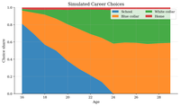](structural-econometrics/keane-wolpin-career-choice/figures/choice-shares.png) | **[Keane-Wolpin Career Choice by Emax Approximation](structural-econometrics/keane-wolpin-career-choice/)** | Study schooling and occupation choice over a finite horizon. Backward induction and sampled Emax regression show how interpolation cuts the state-space cost. |
| [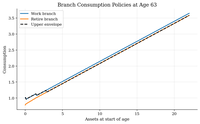](structural-econometrics/dcegm-retirement-saving/figures/branch-consumption.png) | **[Retirement and Saving by Discrete-Continuous EGM](structural-econometrics/dcegm-retirement-saving/)** | Solve a life-cycle retirement model with continuous saving. DC-EGM builds work and retirement branches and takes an upper envelope at the kink. |
| [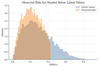](structural-econometrics/auction-valuation-recovery/figures/recovered-cdf.png) | **[Recovering Auction Values from First-Price Bids](structural-econometrics/auction-valuation-recovery/)** | Turn observed bids into pseudo-values using first-price equilibrium conditions. A simulated IPV benchmark shows where bid-density inversion recovers the value distribution. |
| [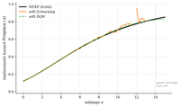](structural-econometrics/q-learning-bus-engine/figures/replacement-hazard.png) | **[Rust Bus Replacement by Soft Q-Learning and DQN](structural-econometrics/q-learning-bus-engine/)** | Recover Rust's replacement hazard without a transition matrix. Soft Q-learning matches NFXP, and a DQN appendix shows the same with function approximation. |
| [](choice/maximum-score-binary-choice/figures/score-objectives.png) | **[Binary Participation with Maximum Score](choice/maximum-score-binary-choice/)** | Recover the participation boundary behind a yes/no decision without a logit error. Maximum score searches over the normalized surplus index, with smoothing for tractability. |
| [](choice/bayesian-learning/figures/belief-evolution.png) | **[Sequential Investment Under Bayesian Learning](choice/bayesian-learning/)** | An investment option with hidden project quality. Bayesian filtering and backward induction show when to invest, reject, or wait. |
| [](computational-methods/numerical-optimization/figures/optimizer-paths.png) | **[Latent-Regime Likelihoods and Optimizer Basins](computational-methods/numerical-optimization/)** | Estimate parameters in a latent-regime likelihood where two regions fit the data. Multi-start and global search expose basin dependence. |
| [](computational-methods/simulation-based-estimation/figures/criterion-surfaces.png) | **[Estimating a Search Acceptance Rule by Simulation](computational-methods/simulation-based-estimation/)** | Estimate a reservation-wage rule from offers and acceptances. MSM matches economic moments; indirect inference matches an auxiliary model. |
| [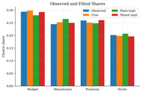](choice/mixed-logit-simulation/figures/choice-fit.png) | **[Mixed Logit Demand with Simulated Likelihood](choice/mixed-logit-simulation/)** | Consumers differ in price sensitivity and quality tastes. Fixed simulation draws approximate mixed-logit probabilities and break IIA. |
| [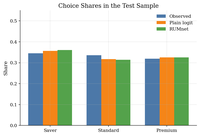](structural-econometrics/rum-choice-networks/figures/choice-fit.png) | **[Choice Prediction with RUMnets](structural-econometrics/rum-choice-networks/)** | Estimate product choices with a neural random-utility model. Fixed latent draws give RUMnet probabilities while preserving utility maximization. |
| [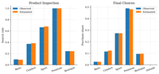](choice/sequential-search-ursu/figures/search-and-choice-fit.png) | **[Consumer Search with Sequential Inspection Costs](choice/sequential-search-ursu/)** | Consumers inspect products one at a time before buying. A Weitzman-style search rule and simulated moments recover search costs from search paths and purchases. |
| [](computational-methods/metropolis-hastings/figures/mh-walk.png) | **[Sampling a Two-Regime Structural Posterior](computational-methods/metropolis-hastings/)** | Sample a structural posterior with two plausible regimes. Random-walk Metropolis-Hastings shows how proposal scale changes mode crossing and posterior averages. |
| [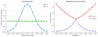](spatial-economics/allen-arkolakis/figures/equilibrium-wages-population.png) | **[Allen-Arkolakis Spatial Equilibrium on a Grid](spatial-economics/allen-arkolakis/)** | Solve a many-location spatial model with trade costs, labor mobility, and agglomeration. A two-equation fixed point delivers wages and population. |

## Choice and Demand

Choice and demand focuses on revealed preference, learning, and choice models.

| Preview | Tutorial | Description |
|---|---|---|
| [](choice/revealed-preference-afriat/figures/budget-lines-consistent.png) | **[Consumer Rationalizability with Afriat's Test](choice/revealed-preference-afriat/)** | Ask whether observed bundles could come from one stable utility function. Revealed-preference edges and transitive closure give a finite GARP test. |
| [](choice/preference-recoverability/figures/budget-lines.png) | **[Recovering Preference Bounds from Budget Choices](choice/preference-recoverability/)** | Finite budget choices reveal partial preference orderings. Afriat inequalities recover one rationalizing contour from the data. |
| [](choice/money-pump-index/figures/money-pump-cycle.png) | **[Revealed-Preference Cycles and the Money Pump Index](choice/money-pump-index/)** | Measure the expenditure exposed by inconsistent budget choices. A maximum mean-cycle program turns a GARP rejection into a severity index. |
| [](choice/houtman-maks-rational-subsets/figures/conflict-graph.png) | **[Rationalizable Choice Cores with Houtman-Maks](choice/houtman-maks-rational-subsets/)** | Choice data can reject one stable utility while keeping a rationalizable core. Houtman-Maks subset search finds the largest GARP-consistent subset. |
| [](choice/revealed-price-preference/figures/price-cost-ratios.png) | **[Price-Regime Revealed Preference](choice/revealed-price-preference/)** | Compare tax, tariff, or menu schedules using the bundles consumers chose. The price-vector GAPP graph can cycle even when bundle GARP passes. |
| [](choice/logit-discrete-choice/figures/log-likelihood-surface.png) | **[Product Demand with Plain Logit and IIA](choice/logit-discrete-choice/)** | Study demand for five products with prices and quality. Maximum likelihood estimates plain-logit tastes, and IIA reallocates lost buyers by existing shares. |
| [](choice/urn-behavioral-mixtures/figures/bayes-likelihood-ratio.png) | **[Are People Bayesian? Decision-Rule Mixtures via EM](choice/urn-behavioral-mixtures/)** | Do subjects classify hidden urn states by Bayes' rule or by simpler cutoffs? An EM mixture recovers the shares of four candidate rules from repeated choices. |
| [](choice/risk-aversion-monotone-choice/figures/risky-choice-fits.png) | **[Lottery Risk Aversion with Monotone Choice](choice/risk-aversion-monotone-choice/)** | Estimate CRRA risk aversion from a lottery ladder. Monotone constrained logits remove sample reversals in row shares. |
| [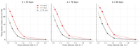](choice/convex-time-budget-present-bias/figures/identification-profile.png) | **[Estimating Present Bias from Convex Time Budgets](choice/convex-time-budget-present-bias/)** | Recover quasi-hyperbolic beta-delta-alpha from continuous CTB allocations. NLS on the closed-form demand and Tobit MLE on the log tangency both rely on front-end-delay variation to separate present bias from patience. |
| [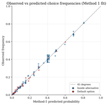](choice/consideration-set-estimation/figures/menu-removal-asymmetry.png) | **[Stochastic Choice and Random Consideration Sets](choice/consideration-set-estimation/)** | Recover a preference ranking and per-alternative attention probabilities from menu-varying stochastic choice. Manzini-Mariotti's closed-form likelihood identifies both jointly and produces structured violations of Luce's IIA. |
| [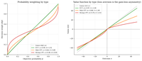](choice/probability-distortion-mixture/figures/weighting-functions.png) | **[Heterogeneous Probability Distortion via Finite-Mixture EM](choice/probability-distortion-mixture/)** | Recover latent risk-taking types from certainty-equivalent data. The Bruhin-Fehr-Duda-Epper finite-mixture EM endogenously classifies subjects into EUT, mild-CPT, and strong-CPT types and BIC selects the right number of types. |
| [](choice/nested-logit/figures/elasticity-heatmap.png) | **[Cereal Demand with Nested Logit Substitution](choice/nested-logit/)** | Cereal buyers shift after a sugary cereal price increase. Nested-logit IV estimates the nesting parameter, then turns shares into elasticities and diversion ratios. |

## Computational Game Theory

These tutorials introduce computational methods to solve game theoretic equilibria.

| Preview | Tutorial | Description |
|---|---|---|
| [](game-theory/normal-form-games/figures/pure-deviation-gains.png) | **[Finite Strategic Games and Nash Equilibrium Checks](game-theory/normal-form-games/)** | Small payoff tables encode coordination and matching games. Deviation-gain enumeration finds pure Nash cells; 2x2 indifference gives mixed probabilities. |
| [](game-theory/static-games/figures/cournot-best-response.png) | **[Cournot Quantity Competition and Best-Response Iteration](game-theory/static-games/)** | Two firms choose quantities in a linear Cournot market. First-order conditions give the Nash quantity, and damped best-response iteration checks the fixed point. |
| [](game-theory/first-price-auctions/figures/bid-functions.png) | **[First-Price Auctions, Bid Shading, and Deviation Checks](game-theory/first-price-auctions/)** | Private-value bidders shade bids when the winner pays its own bid. A closed-form Bayesian Nash rule is checked by a type-by-type bid-grid deviation test. |
| [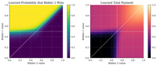](game-theory/deep-optimal-auctions/figures/learned-mechanism.png) | **[Deep Learning for Optimal Auction Design](game-theory/deep-optimal-auctions/)** | Learn a two-bidder auction as a neural mechanism. Revenue is trained with a regret penalty and audited against Myerson's reserve-price benchmark. |
| [](game-theory/quantal-response-equilibrium/figures/qre-path.png) | **[Market Entry with Quantal Response Equilibrium](game-theory/quantal-response-equilibrium/)** | Two firms decide whether to enter a small market. Logit QRE solves the noisy entry probability as a fixed point. |

## Time Series and Filtering Methods

These tutorials cover stochastic processes, macroeconomic data, forecasting, and state-space filtering.

| Preview | Tutorial | Description |
|---|---|---|
| [](time-series/fred-macro-data/figures/time-series.png) | **[Business-Cycle Moments from a FRED-Style Macro Panel](time-series/fred-macro-data/)** | Measure business-cycle moments for GDP, inflation, unemployment, and a policy rate. HP filtering yields cycles, comovement, and an Okun slope. |
| [](time-series/ar-processes/figures/ar1-irfs.png) | **[Fiscal-Shock Persistence and Income Dynamics](time-series/ar-processes/)** | Track a spending innovation through income dynamics. AR(1) impulse responses and multiplier-accelerator recursions show how persistence becomes an income path. |
| [](time-series/stock-watson/figures/factor-comparison.png) | **[Macro Forecasting with Stock-Watson Diffusion Indexes](time-series/stock-watson/)** | Forecast industrial production from many macro indicators. PCA estimates a common business-cycle factor for an expanding-window AR comparison. |
| [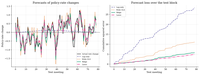](time-series/ridge-lasso-sparsity/figures/forecast-comparison.png) | **[Policy Forecasting with Ridge, Lasso, and Sparsity](time-series/ridge-lasso-sparsity/)** | Measure monetary policy shocks by first forecasting rate changes from many noisy indicators. Ridge and lasso give different meanings of shrinkage and selection. |
| [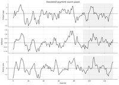](time-series/minnesota-svar/figures/policy-shock-irfs.png) | **[Monetary Policy SVARs with Minnesota Priors](time-series/minnesota-svar/)** | Estimate a small monetary-policy VAR with OLS and Minnesota-prior shrinkage. A recursive SVAR identifies a policy-rate shock and compares stable forecasts and impulse responses. |
| [](computational-methods/kalman-filter/figures/simulated-signal.png) | **[Nowcasting a Latent Business-Cycle State by Kalman Filtering](computational-methods/kalman-filter/)** | Nowcast hidden activity from a noisy indicator. The Kalman filter weighs each signal with model-implied uncertainty and records the likelihood. |
| [](computational-methods/particle-filter/figures/filter-comparison.png) | **[Nowcasting Hidden Economic States by Particle Filtering](computational-methods/particle-filter/)** | Nowcast a hidden economic state from a noisy signal. Particle filters approximate the filtered distribution with weighted simulations, and ESS reveals proposal failure. |

## Agent-Based Models

These tutorials simulate local behavior and market institutions, then compare the aggregate outcome with an economic benchmark.

| Preview | Tutorial | Description |
|---|---|---|
| [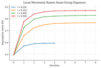](agent-based-models/schelling-segregation/figures/phase-transition.png) | **[Schelling Segregation on a Checkerboard](agent-based-models/schelling-segregation/)** | Local tolerance rules can sort a city without a planner or global objective. A 50 x 50 checkerboard simulation tracks the segregation index as neighborhood demands rise. |
| [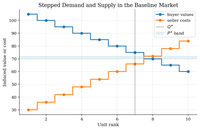](agent-based-models/zero-intelligence-traders/figures/demand-supply-schedule.png) | **[Zero-Intelligence Traders in a Double Auction](agent-based-models/zero-intelligence-traders/)** | Budget-constrained random traders recover most surplus in a double auction, since ZIC is already close to efficient and ZIP mainly narrows price dispersion. |
| [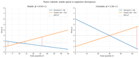](agent-based-models/cobweb-arifovic-ga-learning/figures/price-paths.png) | **[Cobweb Markets and Arifovic Genetic-Algorithm Learning](agent-based-models/cobweb-arifovic-ga-learning/)** | Strawberry-style firms encode production as binary chromosomes. Arifovic's election operator drives the population to rational expectations where naive expectations explode. |
| [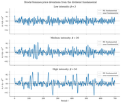](agent-based-models/brock-hommes-asset-pricing/figures/price-paths.png) | **[Brock-Hommes Asset Pricing with Strategy Switching](agent-based-models/brock-hommes-asset-pricing/)** | Asset traders switch between fundamentalist and trend rules by logit profitability, and SMM estimates the switching parameter from simulated return moments. |
| [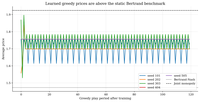](agent-based-models/algorithmic-collusion-q-learning/figures/price-paths.png) | **[Algorithmic Collusion by Q-Learning](agent-based-models/algorithmic-collusion-q-learning/)** | Q-learning pricing agents in repeated Bertrand competition can learn supra-Bertrand prices and respond to a forced deviation like a short price war. |

## Selected External Resources

### Core Computational Economics

- [QuantEcon](https://github.com/QuantEcon)
- [John Stachurski GitHub](https://github.com/jstac)
- [OpenSourceEcon CompMethods](https://github.com/OpenSourceEcon/CompMethods)
- [OpenSourceEconomics](https://github.com/OpenSourceEconomics)
- [CompEcon (Iskhakov)](https://github.com/fediskhakov/CompEcon)
- [Sciences Po CompEcon CoursePack](https://github.com/ScPo-CompEcon/CoursePack)
- [EconRL](https://github.com/SimonHashtag/EconRL)

### Heterogeneous-Agent & HANK Models

- [Sequence-Jacobian](https://github.com/shade-econ/sequence-jacobian)
- [Rognlie ECON 411-3](https://github.com/mrognlie/econ411-3)
- [HARK](https://github.com/econ-ark/HARK)
- [Benjamin Moll Codes](https://benjaminmoll.com/codes/)
- [Quantitative Macro Models](https://github.com/hessjacob/Quantitative-Macro-Models)
- [BASEforHANK](https://github.com/BASEforHANK)

### Empirical IO & Structural Estimation

- [PyBLP](https://github.com/jeffgortmaker/pyblp)
- [Chris Conlon Grad IO](https://github.com/chrisconlon/Grad-IO)
- [Courthoud PhD Industrial Organization](https://github.com/matteocourthoud/Phd-Industrial-Organization)
- [respy](https://github.com/OpenSourceEconomics/respy)
- [Dynamic Structural Econometrics (DSE 2023)](https://github.com/dseconf/DSE2023)]
- [Kenneth Train Software](https://eml.berkeley.edu/~train/software.html)
- [Victor Aguirregabiria Computer Code](https://sites.google.com/view/victoraguirregabiriaswebsite/computer-code?authuser=0)
- [EmpiricalIO](https://github.com/kohei-kawaguchi/EmpiricalIO)
- [Archive of Empirical Dynamic Programming Research](https://github.com/CForg/Archive-of-Empirical-Dynamic-Programming-Research)

### DSGE, Dynamics, and Filtering

- [New York Fed DSGE.jl](https://github.com/FRBNY-DSGE/DSGE.jl)
- [Global DGSE Solver](https://github.com/gdsge/gdsge)
- [DSGE_mod](https://github.com/JohannesPfeifer/DSGE_mod)
- [DynamicalSystems.jl](https://github.com/JuliaDynamics/DynamicalSystems.jl)
- [Kalman and Bayesian Filters in Python](https://github.com/rlabbe/Kalman-and-Bayesian-Filters-in-Python)
