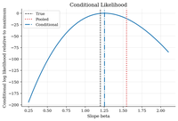

# Computational Economics

This repository gives graduate students and researchers short, executable examples in computational economics. Tutorials are organized by economic question and can be run from their folders with `python run.py`.

## Contents

- [Quick Start](#quick-start)
- [Dynamic Programming](#dynamic-programming)
- [Macroeconomics](#macroeconomics)
- [Industrial Organization](#industrial-organization)
- [Choice and Demand](#choice-and-demand)
- [Computational Game Theory](#computational-game-theory)
- [Time Series and Data](#time-series-and-data)
- [Computational Finance](#computational-finance)
- [Computational Methods](#computational-methods)
- [Other Code Repositories](#other-code-repositories)

## Quick Start

```bash
pip install -r requirements.txt
cd dynamic-programming/cake-eating
python run.py
# -> generates README.md + figures/ + tables/
```

## Dynamic Programming

These tutorials start from one-state decision problems and build toward risk, search, asset pricing, business cycles, and general equilibrium.

| Preview | Tutorial | Description |
|---|---|---|
| [](dynamic-programming/shock-discretization/figures/stationary-mass.png) | **[Discretizing Persistent Shocks](dynamic-programming/shock-discretization/)** | Compare finite-state approximations to persistent income or productivity risk. The shock process is itself part of the economic model, not a fixed background. |
| [](dynamic-programming/cake-eating/figures/value-function.png) | **[Finite-Resource Cake Eating](dynamic-programming/cake-eating/)** | Solve a simple finite-resource consumption problem. The Bellman recursion maps directly into a consumption path. |
| [](dynamic-programming/optimal-growth/figures/value-function.png) | **[Optimal Growth by Value Function Iteration](dynamic-programming/optimal-growth/)** | Study saving, capital accumulation, and the transition to the Ramsey steady state. The numerical policy stays anchored to a steady-state benchmark. |
| [](dynamic-programming/solow-growth/figures/solow-diagram.png) | **[Solow Growth and Conditional Convergence](dynamic-programming/solow-growth/)** | Follow how saving, depreciation, population growth, and technology growth shape the Solow transition. Levels, growth rates, and convergence all shift with these primitives. |
| [](dynamic-programming/consumption-savings/figures/value-functions.png) | **[Income Risk and Buffer-Stock Saving](dynamic-programming/consumption-savings/)** | See how households use assets to self-insure against persistent income risk. Borrowing limits make consumption especially sensitive near low asset levels. |
| [](dynamic-programming/job-search-mccall/figures/accept-vs-reject.png) | **[McCall Job Search and the Reservation Wage](dynamic-programming/job-search-mccall/)** | Compute the wage cutoff that makes an unemployed worker accept a job. Benefits, patience, and wage risk all move the value of waiting. |
| [](dynamic-programming/asset-pricing/figures/asset-price-function.png) | **[Lucas Tree Prices and the Stochastic Discount Factor](dynamic-programming/asset-pricing/)** | Price a dividend claim when dividends also affect marginal utility. Risk aversion shows up directly in state-dependent price-dividend ratios. |
| [](dynamic-programming/rbc/figures/value-function.png) | **[RBC Capital, Labor, and Business-Cycle Moments](dynamic-programming/rbc/)** | Solve a real-business-cycle model with capital and labor choices. The simulation shows how productivity shocks move consumption, investment, hours, and capital. |
| [](dynamic-programming/diamond-mortensen-pissarides/figures/unemployment-vacancies.png) | **[DMP Search, Vacancies, and Unemployment](dynamic-programming/diamond-mortensen-pissarides/)** | Trace how match surplus drives vacancy posting, job finding, and unemployment. The basic calibration can understate amplification, and the residuals show why. |
| [](dynamic-programming/aiyagari/figures/value-functions.png) | **[Aiyagari Saving and Capital-Market Clearing](dynamic-programming/aiyagari/)** | Aggregate household buffer-stock saving into a capital supply curve. Market clearing links idiosyncratic risk, wealth inequality, and the interest rate. |

## Macroeconomics

This section covers heterogeneous households, DSGE models, nonlinear global solutions, and continuous-time control.

### Heterogeneous Agents

These tutorials focus on incomplete-markets households and equilibrium interest rates.

| Preview | Tutorial | Description |
|---|---|---|
| [](heterogeneous-agents/endogenous-grid-points/figures/consumption-policy.png) | **[Buffer-Stock Saving by Endogenous Grid Points](heterogeneous-agents/endogenous-grid-points/)** | Solve an income-risk saving problem by choosing tomorrow's assets first. This makes the Euler equation a practical tool for finding today's policy. |
| [](heterogeneous-agents/envelope-equation-iteration/figures/consumption-policy.png) | **[Envelope-Equation Iteration for Buffer-Stock Saving](heterogeneous-agents/envelope-equation-iteration/)** | Compute the same buffer-stock problem through marginal values. The example keeps the self-insurance motive in terms of the value of one more asset. |
| [](heterogeneous-agents/huggett-incomplete-markets/figures/value-function.png) | **[Huggett Equilibrium and the Risk-Free Rate](heterogeneous-agents/huggett-incomplete-markets/)** | Find the bond return that clears an incomplete-markets economy. Precautionary saving pushes the equilibrium rate below the rate of time preference. |

### Linearized DSGE

These tutorials log-linearize a DSGE model around steady state and solve the resulting rational-expectations system. The first three use closed-form method of undetermined coefficients (cross-checked against Klein-style generalized Schur QZ to machine precision); the fourth uses QZ as the primary solver — the same algorithm Dynare implements at first order.

| Preview | Tutorial | Description |
|---|---|---|
| [](dsge/rbc/figures/irf-tfp-shock.png) | **[RBC TFP Shocks and Capital Propagation](dsge/rbc/)** | Follow a productivity shock through consumption, investment, and capital. The transition makes the timing of investment adjustment visible. |
| [](dsge/nkdsge/figures/irf-monetary-shock.png) | **[New Keynesian Monetary Shocks and Determinacy](dsge/nkdsge/)** | Study how sticky prices turn policy and demand shocks into output and inflation movements. The Taylor rule determines whether the forward-looking path is stable. |
| [](dsge/assetNews/figures/irf-surprise-vs-news.png) | **[Lucas-Tree News Shocks and Stochastic Discounting](dsge/assetNews/)** | Price anticipated dividend news in a Lucas-tree economy. Prices can move before dividends because expected payoffs and discounting both change. |
| [](dsge/rbc-with-labor/figures/irf-tfp-shock.png) | **[RBC with Endogenous Labor by Klein QZ](dsge/rbc-with-labor/)** | Solve a 4-equation rational-expectations system by generalized Schur decomposition. Endogenous labor amplifies the impact of TFP shocks; the QZ algorithm scales to larger DSGEs. |

### Global Nonlinear DSGE

These tutorials solve macro models on grids so constraints, taxes, and risk sharing remain visible.

| Preview | Tutorial | Description |
|---|---|---|
| [](global-dsge/rbc-capital-tax/figures/steady-state-tax.png) | **[Capital Tax Wedges in an RBC Model](global-dsge/rbc-capital-tax/)** | Show how a capital tax changes saving even when revenue is rebated. The exercise separates the resource effect from the after-tax return wedge. |
| [](global-dsge/rbc-irreversible-investment/figures/policy-functions.png) | **[Irreversible Investment and Capital Overhang in RBC](global-dsge/rbc-irreversible-investment/)** | Add an investment nonnegativity constraint to a business-cycle model. The constraint matters most when low productivity meets high installed capital. |
| [](global-dsge/heaton-lucas/figures/equity-premium-and-distribution.png) | **[Heaton-Lucas Risk Sharing and Asset Prices](global-dsge/heaton-lucas/)** | Study how limited asset trade affects risk sharing and prices. The wealth distribution matters because households value risky payoffs differently. |

### Continuous-Time Macro and Optimal Control

These examples cover HJB equations, phase diagrams, shooting, and shadow prices.

| Preview | Tutorial | Description |
|---|---|---|
| [](optimal-control/hjb-growth/figures/value-function.png) | **[HJB Growth and Capital Accumulation](optimal-control/hjb-growth/)** | Solve a continuous-time growth problem from the planner's marginal value of capital. The policy converges toward the Ramsey steady state. |
| [](optimal-control/phase-diagrams/figures/phase-diagram.png) | **[Ramsey Phase Diagrams and Saddle Paths](optimal-control/phase-diagrams/)** | Use nullclines and the stable arm to select the Ramsey path. The picture shows why the initial consumption choice is pinned down. |
| [](optimal-control/ramsey-growth/figures/phase-diagram.png) | **[Ramsey Growth by Shooting](optimal-control/ramsey-growth/)** | Search for the initial consumption level that satisfies the long-run condition. Wrong guesses either exhaust capital or overaccumulate it. |
| [](optimal-control/continuous-cake-eating/figures/consumption-path.png) | **[Continuous-Time Cake Eating and Shadow Prices](optimal-control/continuous-cake-eating/)** | Solve a fixed-resource consumption problem in continuous time. The shadow price rises as the remaining resource becomes scarce. |

## Industrial Organization

The IO section covers firm boundaries, vertical relationships, demand, pricing, production, mergers, collusion, bargaining, and industry dynamics.

| Preview | Tutorial | Description |
|---|---|---|
| [](industrial-organization/theory-of-the-firm/figures/investment-incentives.png) | **[Theory of the Firm: Incomplete Contracts and Hold-Up](industrial-organization/theory-of-the-firm/)** | Compare market exchange, contracts, and ownership when investments are hard to contract on. Ownership helps only when stronger incentives outweigh hierarchy costs. |
| [](industrial-organization/vertical-relationships/figures/price-quantity.png) | **[Vertical Relationships and Double Marginalization](industrial-organization/vertical-relationships/)** | Show why separate upstream and downstream markups can reduce sales. Fixed fees move profits without distorting the retail price margin. |
| [](industrial-organization/vertical-contracts/figures/assortment-selection.png) | **[Vertical Contracts and Vending Assortments](industrial-organization/vertical-contracts/)** | Study how rebates and slotting fees affect scarce product availability. Contracts can reshape assortment even when retail prices barely move. |
| [](industrial-organization/bertrand-logit-demand/figures/price-comparison.png) | **[Bertrand Pricing with Logit Demand](industrial-organization/bertrand-logit-demand/)** | Connect product substitution to pricing incentives. The merger exercise shows how diversion and cost efficiencies change equilibrium prices. |
| [](industrial-organization/logit-supply-side/figures/estimation-comparison.png) | **[Logit Demand and Markup Recovery](industrial-organization/logit-supply-side/)** | Estimate demand and recover markups and marginal costs from pricing conditions. The tutorial shows why price endogeneity affects both demand slopes and costs. |
| [](industrial-organization/blp-random-coefficients/figures/observed-vs-predicted-shares.png) | **[BLP Random Coefficients Demand](industrial-organization/blp-random-coefficients/)** | Use consumer heterogeneity to build richer substitution patterns. Matching shares is only the first step; substitution still has to be checked. |
| [](industrial-organization/production-functions-markups/figures/production-estimates.png) | **[Production Functions and Markup Measurement](industrial-organization/production-functions-markups/)** | Recover production elasticities and translate them into markups. Input choice matters because productivity can bias both estimates and markup measurement. |
| [](industrial-organization/effective-hhi/figures/hhi-vs-nfirms.png) | **[HHI, Effective Firms, and Merger Screens](industrial-organization/effective-hhi/)** | Use ownership shares to compute concentration screens. The example also shows why HHI is not the same thing as a pricing model. |
| [](industrial-organization/collusion-detection/figures/profits-by-regime.png) | **[Cartel Stability and Price Screens](industrial-organization/collusion-detection/)** | Study when repeated interaction can support collusion. Simulated price breaks show how screening evidence relates to the incentive constraint. |
| [](industrial-organization/dynamic-games/figures/investment-policy.png) | **[Dynamic Games and Markov-Perfect Investment](industrial-organization/dynamic-games/)** | Model firms that invest in quality while watching rivals' states. Future rivalry makes today's investment payoff depend on the whole industry state. |
| [](industrial-organization/dynamic-games-estimation/figures/ccp-heatmaps.png) | **[Dynamic Games Estimation from First-Stage CCPs](industrial-organization/dynamic-games-estimation/)** | Estimate a small investment game from first-stage policies and forward values. The likelihood avoids solving a full MPE at every trial parameter. |
| [](industrial-organization/dynamic-entry-exit/figures/value-function.png) | **[Dynamic Entry and Exit in Oligopoly](industrial-organization/dynamic-entry-exit/)** | Separate entry costs from exit decisions in a dynamic market. A stable firm count can still hide turnover and option-value hysteresis. |
| [](industrial-organization/dynamic-discrete-choice/figures/value-and-ccp.png) | **[Bus Engine Replacement and Dynamic Choice](industrial-organization/dynamic-discrete-choice/)** | Estimate a replacement decision by NFXP, CCP, and MPEC. The same hazard can be handled by nested fixed points or Bellman constraints. |
| [](industrial-organization/three-part-tariffs/figures/usage-policy.png) | **[Three-Part Tariffs and Forward-Looking Broadband Demand](industrial-organization/three-part-tariffs/)** | Study plan choice when data allowances make usage forward-looking. The allowance has value before the cap is actually reached. |
| [](industrial-organization/nash-in-nash/figures/negotiated-prices.png) | **[Nash-in-Nash Hospital-Insurer Bargaining](industrial-organization/nash-in-nash/)** | Solve bilateral bargaining over hospital-insurer transfers. Network outside options matter because losing a system is not the same as losing one hospital. |
| [](industrial-organization/merger-simulation/figures/price-comparison.png) | **[Differentiated-Products Merger Simulation](industrial-organization/merger-simulation/)** | Simulate post-merger pricing with differentiated products. Screens such as GUPPI help, but the solved equilibrium depends on substitution and efficiencies. |

## Choice and Demand

Choice and demand focuses on revealed preference, learning, and choice models.

| Preview | Tutorial | Description |
|---|---|---|
| [](choice/revealed-preference-afriat/figures/budget-lines-consistent.png) | **[Afriat's Revealed-Preference Test](choice/revealed-preference-afriat/)** | Test finite choice data without assuming a demand curve. The tutorial shows how revealed-preference cycles become a rationalizability failure. |
| [](choice/preference-recoverability/figures/budget-lines.png) | **[Preference Bounds from Revealed Choices](choice/preference-recoverability/)** | Use observed choices to bound the utilities that could explain them. Finite data restrict preferences without identifying one exact demand system. |
| [](choice/money-pump-index/figures/money-pump-cycle.png) | **[Money Pump Index for Revealed Preference](choice/money-pump-index/)** | Put an economic size on revealed-preference violations. The same pass-fail result can hide very different expenditure losses. |
| [](choice/houtman-maks-rational-subsets/figures/conflict-graph.png) | **[Houtman-Maks Rational Cores](choice/houtman-maks-rational-subsets/)** | Find the largest subset of choices that can be rationalized. This helps distinguish a few inconsistent observations from broad inconsistency. |
| [](choice/revealed-price-preference/figures/price-cost-ratios.png) | **[Revealed Price Preference](choice/revealed-price-preference/)** | Ask whether price regimes can be ranked from the bundles they make affordable. Bundle choices can look rational even when price-regime rankings fail. |
| [](choice/logit-discrete-choice/figures/log-likelihood-surface.png) | **[Plain Logit Demand and IIA](choice/logit-discrete-choice/)** | Estimate a baseline product-choice model and inspect its substitution restriction. Lost buyers from one product get reallocated mechanically across the rest. |
| [](choice/conditional-logit-panel/figures/conditional-likelihood.png) | **[Conditional Logit for Fixed Effects Panels](choice/conditional-logit-panel/)** | Condition on each agent's total choices to remove fixed effects. The slope comes from within-agent variation rather than persistent tastes. |
| [](choice/maximum-score-binary-choice/figures/score-objectives.png) | **[Maximum Score Binary Choice](choice/maximum-score-binary-choice/)** | Estimate a binary-choice index with a nonsmooth classification criterion. Scale normalization and smoothing make the semiparametric target visible. |
| [](choice/bayesian-learning/figures/belief-evolution.png) | **[Bayesian Learning and Sequential Investment](choice/bayesian-learning/)** | Track how signals update beliefs and change the decision to invest or wait. Waiting is valuable when beliefs are still uncertain enough to move. |
| [](choice/urn-behavioral-mixtures/figures/bayes-likelihood-ratio.png) | **[Bayesian Urn Classification and Behavioral Mixtures](choice/urn-behavioral-mixtures/)** | Use likelihood ratios to classify urn states and finite mixtures to recover latent decision rules from repeated choices. |
| [](choice/risk-aversion-monotone-choice/figures/risky-choice-fits.png) | **[Risk Aversion and Monotone Stochastic Choice](choice/risk-aversion-monotone-choice/)** | Estimate lottery choice with unconstrained, structural, and monotonicity-constrained logits. Shape restrictions discipline noisy row shares. |
| [](choice/nested-logit/figures/elasticity-heatmap.png) | **[Nested Logit Demand and Within-Nest Substitution](choice/nested-logit/)** | Group products into nests so substitution can be stronger among close alternatives. The nesting parameter changes where lost buyers go. |

## Computational Game Theory

These tutorials introduce computational methods to solve game theoretic equilibria.

| Preview | Tutorial | Description |
|---|---|---|
| [](game-theory/normal-form-games/figures/pure-deviation-gains.png) | **[Normal-Form Games and Nash Equilibrium Checks](game-theory/normal-form-games/)** | Read finite games as no-profitable-deviation conditions. Pure and mixed equilibria are checked directly against payoff tables. |
| [](game-theory/static-games/figures/cournot-best-response.png) | **[Cournot Oligopoly and Best-Response Dynamics](game-theory/static-games/)** | Solve a quantity-setting game and watch best responses converge. Equilibrium is where each firm is happy with its quantity given the others. |
| [](game-theory/first-price-auctions/figures/bid-functions.png) | **[First-Price Auctions and Bid Shading](game-theory/first-price-auctions/)** | Show how bidders trade off a higher win probability against a lower surplus if they win. More competition reduces bid shading. |
| [](game-theory/quantal-response-equilibrium/figures/qre-path.png) | **[Entry Game QRE and Noisy Best Responses](game-theory/quantal-response-equilibrium/)** | Let players make payoff-sensitive mistakes in a small entry game. Finite precision smooths behavior while keeping a fixed-point discipline. |

## Time Series and Data

These tutorials cover stochastic processes, macroeconomic data, and forecasting.

| Preview | Tutorial | Description |
|---|---|---|
| [](time-series/fred-macro-data/figures/time-series.png) | **[FRED-Style Macro Data and Business-Cycle Moments](time-series/fred-macro-data/)** | Turn GDP, inflation, unemployment, and policy-rate series into business-cycle moments. The tutorial is about the data objects behind macro targets. |
| [](time-series/ar-processes/figures/ar1-irfs.png) | **[Persistent Shocks and Multiplier-Accelerator Dynamics](time-series/ar-processes/)** | Study how persistence changes shock half-lives, spectra, and income dynamics. The coefficient is an economic timing assumption, not just a statistic. |
| [](time-series/stock-watson/figures/factor-comparison.png) | **[Stock-Watson Diffusion Index Forecasts](time-series/stock-watson/)** | Extract a common factor from a large macro panel and use it for forecasting. The example compares factor forecasts with simpler benchmarks. |

## Computational Finance

These tutorials cover elementary finance: bond prices, yield curves, predictability tests, and portfolio frontiers.

| Preview | Tutorial | Description |
|---|---|---|
| [](computational-finance/bond-yield-to-maturity/figures/price-yield-curve.png) | **[Bond Prices and Yield to Maturity](computational-finance/bond-yield-to-maturity/)** | Convert promised bond payments into implied annual yields. Yield to maturity is an internal discount rate for promised cash flows, not a realized return. |
| [](computational-finance/treasury-yield-curve/figures/yield-curve-snapshots.png) | **[Treasury Yield Curves and Term-Structure Shape](computational-finance/treasury-yield-curve/)** | Read maturity-specific Treasury rates as level, slope, and curvature. The tutorial keeps the distinction between par yields and traded zero-coupon prices clear. |
| [](computational-finance/fama-bliss-forward-regression/figures/forward-regression-10y.png) | **[Fama-Bliss Forward-Rate Predictability](computational-finance/fama-bliss-forward-regression/)** | Use forward spreads to test whether future yields are predictable. Interpretation depends on the measurement choice and forecast horizon. |
| [](computational-finance/efficient-market-tests/figures/autocorrelations.png) | **[Weak-Form Efficiency in Treasury Yield Changes](computational-finance/efficient-market-tests/)** | Check whether lagged yield changes predict future changes. The exercise ties simple diagnostics to a clear random-walk benchmark. |
| [](computational-finance/mean-variance-frontier/figures/frontier.png) | **[Mean-Variance Portfolio Frontier](computational-finance/mean-variance-frontier/)** | Build the risk-return frontier for portfolios with and without constraints. Random portfolios are useful for intuition, but the frontier is the object of interest. |

## Computational Methods

These tutorials are standalone references for optimization, approximation, simulation, filtering, and sampling.

| Preview | Tutorial | Description |
|---|---|---|
| [](computational-methods/numerical-optimization/figures/optimizer-paths.png) | **[Multimodal Likelihood Optimization](computational-methods/numerical-optimization/)** | Optimize an objective with more than one plausible mode. Starting values matter because different optimizers can settle in different basins. |
| [](computational-methods/simulation-based-estimation/figures/criterion-surfaces.png) | **[Simulation-Based Estimation: MSM and Indirect Inference](computational-methods/simulation-based-estimation/)** | Estimate one stochastic search DGP by moment matching and auxiliary-model matching. Criterion surfaces show simulation noise and identification. |
| [](computational-methods/projection-methods/figures/chebyshev-basis.png) | **[Chebyshev Projection for a Growth Policy](computational-methods/projection-methods/)** | Approximate a smooth growth policy with a small set of coefficients. Euler errors away from the fitted nodes show whether the approximation is reliable. |
| [](computational-methods/perturbation-linearization/figures/local-approximations.png) | **[Perturbation Around a Steady State](computational-methods/perturbation-linearization/)** | Linearize nonlinear dynamics near a steady state. Higher-order terms show where curvature and asymmetric responses start to matter. |
| [](computational-methods/metropolis-hastings/figures/mh-walk.png) | **[Metropolis-Hastings for a Bimodal Posterior](computational-methods/metropolis-hastings/)** | Diagnose how a finite MCMC run explores a two-mode posterior. Proposal tuning changes acceptance, mode switching, and effective sample size. |
| [](computational-methods/kalman-filter/figures/simulated-signal.png) | **[Kalman Filtering a Latent Economic State](computational-methods/kalman-filter/)** | Filter a latent economic state from noisy signals. Prediction errors update the state estimate, uncertainty, and likelihood together. |
| [](computational-methods/particle-filter/figures/filter-comparison.png) | **[Particle Filtering Latent Economic States](computational-methods/particle-filter/)** | Approximate latent-state filtering with weighted simulated particles. Proposal choices drive weight collapse and Monte Carlo error. |

## Other Code Repositories

- [QuantEcon](https://github.com/QuantEcon) - Open-source lectures and libraries for quantitative economics.
- [John Stachurski GitHub](https://github.com/jstac) - Repositories on computational economics, stochastic dynamics, and econometric theory.
- [Dynamic Structural Econometrics (DSE 2023)](https://github.com/dseconf/DSE2023) - Summer-school materials on solving and estimating dynamic models.
- [New York Fed DSGE.jl](https://github.com/FRBNY-DSGE/DSGE.jl) - Julia tools for solving and estimating DSGE models.
- [GDSGE](https://github.com/gdsge/gdsge) - Toolbox for global nonlinear DSGE solution.
- [DSGE_mod](https://github.com/JohannesPfeifer/DSGE_mod) - Dynare `.mod` files for canonical DSGE models.
- [Chris Conlon Grad IO](https://github.com/chrisconlon/Grad-IO) - PhD empirical IO course materials.
- [Kenneth Train Software](https://eml.berkeley.edu/~train/software.html) - Mixed logit and discrete-choice estimation code.
- [Victor Aguirregabiria Computer Code](https://sites.google.com/view/victoraguirregabiriaswebsite/computer-code?authuser=0) - Dynamic discrete-choice and dynamic-game estimation code.
- [EconRL](https://github.com/SimonHashtag/EconRL) - Bibliography of economics and finance papers using reinforcement learning.
- [CompEcon](https://github.com/fediskhakov/CompEcon) - Foundations of Computational Economics course materials.
- [CompEcon Fall 2017](https://github.com/ScPo-CompEcon/CoursePack) - Sciences Po computational economics course pack.
- [EmpiricalIO](https://github.com/kohei-kawaguchi/EmpiricalIO) - Empirical IO lecture notes, assignments, and R code.
- [Quantitative Macro Models](https://github.com/hessjacob/Quantitative-Macro-Models) - Python implementations of heterogeneous-agent and firm-dynamics models.
- [Benjamin Moll Codes](https://benjaminmoll.com/codes/) - Finite-difference codes for continuous-time heterogeneous-agent models.
- [Archive of Empirical Dynamic Programming Research](https://github.com/CForg/Archive-of-Empirical-Dynamic-Programming-Research) - Replication materials for empirical dynamic programming.
- [Dynamical Systems](https://github.com/JuliaDynamics/DynamicalSystems.jl) - Julia library for nonlinear dynamics and time-series analysis.
- [Heterogeneous Agents Bayes](https://github.com/BASEforHANK) - Julia toolboxes for Bayesian HANK solution and estimation.
- [Kalman and Bayesian Filters in Python](https://github.com/rlabbe/Kalman-and-Bayesian-Filters-in-Python) - Interactive book on Kalman and Bayesian filters.
- [OpenSourceEcon CompMethods](https://github.com/OpenSourceEcon/CompMethods) - Executable Jupyter Book on computational methods for economists.
