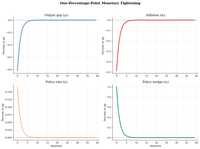
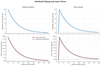
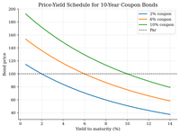
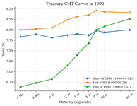
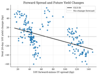
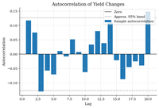
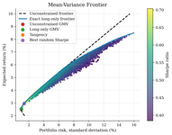

# Computational Economics

This repository is for graduate students and researchers in economics, business, public policy, finance, and neighboring quantitative fields who want executable examples of computational economics.

It is independent from QuantEcon, but it is written for a similar audience: readers who already have the standard foundations and want short, self-contained examples that push further into structural modeling, computational macro, IO, demand, finance, and numerical methods.

The tutorials are organized around economic questions first: dynamic programming, computational macro, industrial organization, revealed preference and demand, computational game theory, time series, finance, and numerical methods. Each example is meant to be readable in one sitting and runnable from its folder with `python run.py`, producing a short report with equations, computation, figures, and takeaways.

**Built with:** Python, JAX, NumPy, SciPy, Matplotlib | **License:** MIT

## Contents

- [Quick Start](#quick-start)
- [Dynamic Programming](#dynamic-programming)
- [Macroeconomics](#macroeconomics)
- [Industrial Organization](#industrial-organization)
- [Choice and Demand](#choice-and-demand)
- [Computational Game Theory](#computational-game-theory)
- [Time Series and Data](#time-series-and-data)
- [Computational Finance](#computational-finance)
- [Computational Methods](#computational-methods)
- [Other Code Repositories](#other-code-repositories)
- [License](#license)

## Quick Start

```bash
pip install -r requirements.txt
cd dynamic-programming/cake-eating
python run.py
# -> generates README.md + figures/ + tables/
```

## Dynamic Programming

Dynamic programming is both a method and a language for many structural models. This section starts with grids and one-state problems, then moves into savings, search, asset pricing, business cycles, and general equilibrium.

| | Tutorial | What it teaches | Method | Key Insight |
|:---:|---|---|---|---|
|  | [**Discretizing Persistent Shocks**](dynamic-programming/shock-discretization/) | Approximating persistent income or productivity risk with finite Markov states | Tauchen + Rouwenhorst | The Markov chain is part of the economic model, not preprocessing |
|  | [**Finite-Resource Cake Eating**](dynamic-programming/cake-eating/) | Finite-resource allocation, Bellman recursion, and a closed-form benchmark | Value function iteration | Log utility implies a constant consumption share |
|  | [**Optimal Growth by Value Function Iteration**](dynamic-programming/optimal-growth/) | Productive capital, saving, and the Ramsey transition | Grid VFI + exact benchmark | Saving the share $\alpha\beta$ of output drives capital to $k_{ss}$ |
|  | [**Solow Growth and Conditional Convergence**](dynamic-programming/solow-growth/) | Growth dynamics in effective-labor units without household optimization | Deterministic transition map | Saving changes levels; technology growth changes long-run per-capita growth |
|  | [**Income Risk and Buffer-Stock Saving**](dynamic-programming/consumption-savings/) | How persistent income risk and borrowing limits shape household consumption and saving | Grid VFI + Rouwenhorst income | Assets are self-insurance: MPCs are high near the constraint and saving rises after good shocks |
|  | [**McCall Job Search and the Reservation Wage**](dynamic-programming/job-search-mccall/) | How wage-offer risk, benefits, and patience determine an acceptance cutoff | VFI + continuous benchmark | The option value of waiting can put the cutoff above the mean offer |
|  | [**Lucas Tree Prices and the Stochastic Discount Factor**](dynamic-programming/asset-pricing/) | How dividend risk and marginal utility pin down equilibrium price-dividend ratios | Euler-equation iteration + quadrature | Risk aversion tilts valuation across dividend states |
|  | [**RBC Capital, Labor, and Business-Cycle Moments**](dynamic-programming/rbc/) | How persistent TFP shocks move consumption, investment, hours, and capital | Global VFI + simulation | Investment absorbs most cyclical adjustment while capital moves slowly |
|  | [**DMP Search, Vacancies, and Unemployment**](dynamic-programming/diamond-mortensen-pissarides/) | How match surplus drives vacancy posting, job finding, and the Beveridge curve | Free-entry fixed point + log-linearization | The standard surplus calibration gets the signs right but leaves too little amplification |
|  | [**Aiyagari Saving and Capital-Market Clearing**](dynamic-programming/aiyagari/) | How uninsurable income risk turns household buffer stocks into aggregate capital supply | VFI + stationary distribution + bisection | Self-insurance lowers $r$ below $1/\beta-1$ and creates skewed wealth |

## Macroeconomics

This section collects the heavier macro material: heterogeneous households, incomplete markets, DSGE perturbation, global nonlinear solution, and continuous-time optimal-control tools.

### Heterogeneous Agents

These tutorials are the incomplete-markets method library: Euler-equation inversion, marginal-value iteration, and continuous-time HJB/KFE equilibrium.

| | Tutorial | What it teaches | Method | Key Insight |
|:---:|---|---|---|---|
|  | [**Buffer-Stock Saving by Endogenous Grid Points**](heterogeneous-agents/endogenous-grid-points/) | How Euler-equation inversion computes the IID income-risk saving policy | EGP + fine-grid policy check | Choosing $a'$ first maps the Euler equation back to current assets without a VFI search |
|  | [**Envelope-Equation Iteration for Buffer-Stock Saving**](heterogeneous-agents/envelope-equation-iteration/) | How the envelope condition computes the IID income-risk saving policy from marginal continuation values | EEI + fine-grid policy check | Iterating on $W_a(a)$ keeps the self-insurance motive in marginal-value form |
|  | [**Huggett Equilibrium and the Risk-Free Rate**](heterogeneous-agents/huggett-incomplete-markets/) | How idiosyncratic income risk and a borrowing limit price a zero-net-supply bond | HJB + KFE + bisection | Precautionary saving lowers the clearing return below the rate of time preference |

### DSGE and Dynare

These examples show DSGE shock propagation and Dynare-style model files wrapped in the same Python report format.

| | Tutorial | What it teaches | Method | Key Insight |
|:---:|---|---|---|---|
|  | [**RBC TFP Shocks and Capital Propagation**](dynare/rbc/) | How a persistent productivity shock is split across consumption, investment, and capital | First-order perturbation + nonlinear transition check | Investment jumps while consumption and capital adjust gradually |
|  | [**New Keynesian Monetary Shocks and Determinacy**](dynare/nkdsge/) | How sticky prices turn policy and demand shocks into output and inflation dynamics | Undetermined coefficients | A Taylor rule that leans against inflation selects a stable forward-looking path |
|  | [**Lucas-Tree News Shocks and Stochastic Discounting**](dynare/assetNews/) | How anticipated dividend news is priced when dividends also determine marginal utility | First-order pricing rule + nonlinear transition | News moves prices before dividends, but the sign depends on stochastic discounting |

### Global Nonlinear DSGE

These tutorials solve macro models on grids to keep taxes, constraints, and nonlinear risk sharing visible.

| | Tutorial | What it teaches | Method | Key Insight |
|:---:|---|---|---|---|
|  | [**Capital Tax Wedges in an RBC Model**](global-dsge/rbc-capital-tax/) | How a revenue-neutral capital tax lowers after-tax returns, saving, and the capital base | Global VFI + Euler refinement | Lump-sum rebates leave resources intact but do not undo the Euler wedge |
|  | [**Irreversible Investment and Capital Overhang in RBC**](global-dsge/rbc-irreversible-investment/) | How an $I_t \geq 0$ constraint changes policy only when low productivity meets high installed capital | Global VFI + fine-grid check | The steady state is unchanged, but recession states have a real policy kink |
|  | [**Heaton-Lucas Risk Sharing and Asset Prices**](global-dsge/heaton-lucas/) | How constrained equity and bond trade makes the wealth distribution price aggregate risk | STPFI + Euler residual check | Risk premia move with the wealth share because constrained households carry high marginal utility |

### Continuous-Time Macro and Optimal Control

These examples cover Hamilton-Jacobi-Bellman equations, phase diagrams, shooting methods, and Pontryagin problems.

| | Tutorial | What it teaches | Method | Key Insight |
|:---:|---|---|---|---|
|  | [**HJB Growth and Capital Accumulation**](optimal-control/hjb-growth/) | How a Ramsey planner turns marginal value into consumption and capital drift | Implicit upwind HJB | The drift selects the derivative direction, so the policy converges to the Ramsey steady state without a grid search |
|  | [**Ramsey Phase Diagrams and Saddle Paths**](optimal-control/phase-diagrams/) | How nullclines and the transversality condition select initial consumption | Linearization + reverse ODE integration | The stable arm, not the direction field alone, picks the Ramsey path |
|  | [**Ramsey Growth by Shooting**](optimal-control/ramsey-growth/) | How predetermined capital and the transversality condition select initial consumption | Forward shooting + ODE integration | Wrong $c_0$ paths exhaust capital or overaccumulate; the root is the stable path |
|  | [**Continuous-Time Cake Eating and Shadow Prices**](optimal-control/continuous-cake-eating/) | How a fixed resource maps into declining consumption and scarcity prices | Pontryagin maximum principle + exact check | The present-value costate is flat while the current-value shadow price rises at $\rho$ |

## Industrial Organization

The IO section covers firm boundaries, vertical relationships, differentiated-products demand and pricing, production functions, merger screening, collusion, bargaining, and dynamic industry models. BLP appears once as a random-coefficients demand tool rather than as the center of the chapter.

| | Tutorial | What it teaches | Method | Key Insight |
|:---:|---|---|---|---|
|  | [**Theory of the Firm: Incomplete Contracts and Hold-Up**](industrial-organization/theory-of-the-firm/) | Why asset specificity changes the boundary between market exchange, contracts, and ownership | First-best benchmark + regime search | Ownership wins only when stronger investment incentives outweigh hierarchy costs |
|  | [**Vertical Relationships and Double Marginalization**](industrial-organization/vertical-relationships/) | How marginal wholesale prices make a separated channel under-sell relative to integration | Backward induction + contract comparison | Fixed fees move profit without distorting the retailer's pricing margin |
|  | [**Vertical Contracts and Vending Assortments**](industrial-organization/vertical-contracts/) | How rebates and slotting fees move scarce shelf space in a vertical channel | Exact finite-assortment search | Transfers and rebate thresholds can reshape availability without much retail-price movement |
|  | [**Bertrand Pricing with Logit Demand**](industrial-organization/bertrand-logit-demand/) | How diversion and common ownership turn logit demand into unilateral price effects | FOC inversion + root finding | A merger changes the pricing FOC by internalizing diverted sales; efficiencies work through marginal cost |
|  | [**Logit Demand and Markup Recovery**](industrial-organization/logit-supply-side/) | Using IV demand estimates to recover markups and marginal costs from pricing FOCs | Berry inversion + IV/2SLS + FOC | Price endogeneity distorts both demand slopes and recovered costs |
|  | [**BLP Random Coefficients Demand**](industrial-organization/blp-random-coefficients/) | How random coefficients turn differentiated-products demand into a richer substitution matrix | BLP contraction + IV/GMM | Fitting shares is only the inversion step; heterogeneity is what changes merger and markup counterfactuals |
|  | [**Production Functions and Markup Measurement**](industrial-organization/production-functions-markups/) | How productivity-driven input choice affects production elasticities and measured markups | Proxy-control regression + DLW markup formula | OLS elasticity bias becomes markup bias once divided by variable-input shares |
|  | [**HHI, Effective Firms, and Merger Screens**](industrial-organization/effective-hhi/) | How ownership shares become concentration screens, and why HHI is not a pricing model | HHI arithmetic + Bertrand FOC check | HHI can jump mechanically even when segmented products imply no price effect |
|  | [**Cartel Stability and Price Screens**](industrial-organization/collusion-detection/) | How repeated interaction disciplines cartel deviations and how price/margin breaks become screens | Grim-trigger Cournot + price simulation | More firms dilute collusive rents; at $\delta=0.9$ the symmetric cutoff is 33 firms |
|  | [**Dynamic Games and Markov-Perfect Investment**](industrial-organization/dynamic-games/) | How quality investment makes future rivalry a payoff-relevant state | Finite-state MPE VFI + deviation check | Firms invest until the ladder cap, while quality leads carry continuation value |
|  | [**Dynamic Entry and Exit in Oligopoly**](industrial-organization/dynamic-entry-exit/) | How sunk entry costs separate the entry margin from the exit margin | Entry-exit VFI + invariant distribution | A stable firm count can hide option-value hysteresis and turnover |
|  | [**Bus Engine Replacement and Dynamic Choice**](industrial-organization/dynamic-discrete-choice/) | How replacement hazards reveal maintenance payoffs and continuation values | Nested fixed-point ML + Hotz-Miller CCP | The same observed action mixes today's maintenance cost with the value of resetting tomorrow's state |
|  | [**Three-Part Tariffs and Forward-Looking Broadband Demand**](industrial-organization/three-part-tariffs/) | How data allowances turn monthly broadband demand into a dynamic usage and plan-choice problem | Finite-horizon DP + type sorting | The allowance has a shadow value before the cap is hit |
|  | [**Nash-in-Nash Hospital-Insurer Bargaining**](industrial-organization/nash-in-nash/) | How disagreement networks pin down bilateral hospital-insurer transfers | Nash-in-Nash + network counterfactuals | Ownership changes the outside option, so losing a system is not losing one hospital |
|  | [**Differentiated-Products Merger Simulation**](industrial-organization/merger-simulation/) | How demand curvature turns the same ownership change into different price and welfare predictions | FOC calibration + counterfactual pricing | GUPPI and CMCR are useful screens, but the solved equilibrium depends on substitution patterns and efficiencies |

## Choice and Demand

Choice and demand stays focused on choice theory, revealed preference, Bayesian learning, and demand basics. IO supply-side methods and full counterfactual workflows live in the Industrial Organization section.

| | Tutorial | What it teaches | Method | Key Insight |
|:---:|---|---|---|---|
|  | [**Afriat's Revealed-Preference Test**](choice/revealed-preference-afriat/) | Testing finite choice data without choosing a demand functional form | GARP transitive closure + Afriat inequalities | Rationalizability fails exactly when revealed-preference chains create a strict budget cycle |
|  | [**Preference Bounds from Revealed Choices**](choice/preference-recoverability/) | Constructing rationalizing utility contours from GARP-consistent budgets | Afriat inequalities + contour recovery | Finite choices restrict a set of utilities rather than identifying one demand system |
|  | [**Money Pump Index for Revealed Preference**](choice/money-pump-index/) | Putting economic size on revealed-preference cycles after GARP rejects | Maximum mean cycle | The same binary violation can expose 3 percent or 17 percent of expenditure per trade |
|  | [**Houtman-Maks Rational Cores**](choice/houtman-maks-rational-subsets/) | Diagnosing whether a GARP rejection is concentrated in a few receipts or spread through the dataset | Exact subset search + SCC greedy diagnostic | The index recovers the largest rationalizable core, not an oracle label for every bad row |
|  | [**Revealed Price Preference**](choice/revealed-price-preference/) | Testing whether price regimes can be ranked from the bundles they make cheap | GAPP graph + transitive closure | A dataset can pass bundle GARP while failing consistency over price regimes |
|  | [**Plain Logit Demand and IIA**](choice/logit-discrete-choice/) | Estimating a baseline product-choice model and reading the substitution restriction it imposes | MLE | Closed-form shares make estimation easy, but lost buyers are reallocated by rival shares |
|  | [**Bayesian Learning and Sequential Investment**](choice/bayesian-learning/) | How noisy signals become posterior beliefs and stopping regions | Bayes' rule + finite-horizon stopping | The likelihood ratio is the sufficient state; waiting has value only at intermediate beliefs |
|  | [**Nested Logit Demand and Within-Nest Substitution**](choice/nested-logit/) | Grouped products and stronger same-nest substitution | Berry inversion | Same-nest substitution can be much larger than cross-nest substitution |

## Computational Game Theory

This section covers equilibrium concepts directly, before they are embedded in IO or macro models. It starts with small normal-form games and Cournot oligopoly, then moves to auctions and noisy equilibrium.

| | Tutorial | What it teaches | Method | Key Insight |
|:---:|---|---|---|---|
|  | [**Normal-Form Games and Mixed Equilibrium**](game-theory/normal-form-games/) | Pure and mixed Nash equilibria in small games | Enumeration + indifference | Small games are equilibrium checks, not black-box solver problems |
|  | [**Cournot Oligopoly and Best-Response Dynamics**](game-theory/static-games/) | How Nash conditions and best-response iteration solve a static quantity game | Closed-form Cournot + damped iteration | Equilibrium is where best responses cross and residuals vanish |
|  | [**First-Price Auctions and Bid Shading**](game-theory/first-price-auctions/) | Bayesian Nash bidding in private-value auctions | Bayesian Nash | Bidders trade off surplus against win probability |
|  | [**Quantal Response Equilibrium**](game-theory/quantal-response-equilibrium/) | Noisy best responses and stochastic choice | Logit fixed point | QRE bridges finite games and probabilistic choice |

## Time Series and Data

These tutorials are for stochastic processes, macro data handling, and reduced-form forecasting tools that support structural work.

| | Tutorial | What it teaches | Method | Key Insight |
|:---:|---|---|---|---|
|  | [**FRED-Style Business Cycle Facts**](time-series/fred-macro-data/) | Business-cycle moments from macro time series | HP filter | Cyclical components reveal Okun and Phillips patterns |
|  | [**Persistent Shocks and Multiplier-Accelerator Dynamics**](time-series/ar-processes/) | How AR(1) persistence changes shock half-lives, spectra, and income dynamics | Analytic IRFs + simulation | Persistence is an economic timing assumption, not just a coefficient |
|  | [**Stock-Watson Factor Forecasting**](time-series/stock-watson/) | Extracting common factors from large panels | PCA | A small number of factors can improve forecasts |

## Computational Finance

These tutorials convert the old computational-finance notebooks into short, reproducible finance examples. The emphasis is interpretation: bond prices, yield curves, predictability tests, and portfolio frontiers are useful only when the data object and maintained assumptions are clear.

| | Tutorial | What it teaches | Method | Key Insight |
|:---:|---|---|---|---|
|  | [**Bond Prices and Yield to Maturity**](computational-finance/bond-yield-to-maturity/) | Pricing promised cash flows and solving for implied yields | Root finding | YTM is an implied discount rate, not a guaranteed realized return |
|  | [**Treasury Yield Curve Snapshots**](computational-finance/treasury-yield-curve/) | Reading curve levels, slopes, and maturity patterns | Static data analysis | CMT rates summarize an interpolated par-yield curve |
|  | [**Fama-Bliss-Style Forward Regressions**](computational-finance/fama-bliss-forward-regression/) | Testing whether forward spreads predict future yield changes | OLS regression | Forward-rate predictability needs careful data and horizon choices |
|  | [**Weak-Form Efficient-Market Diagnostics**](computational-finance/efficient-market-tests/) | Autocorrelation, variance-ratio, and predictability checks | Random-walk diagnostics | Rejections test both market efficiency and the expected-return model |
|  | [**Mean-Variance Portfolio Frontier**](computational-finance/mean-variance-frontier/) | Diversification, covariance, and efficient portfolios | Markowitz frontier | Covariance drives risk, and frontiers are input-sensitive |

## Computational Methods

These tutorials are useful as standalone references when optimization or sampling is the bottleneck.

| | Tutorial | What it teaches | Method | Key Insight |
|:---:|---|---|---|---|
|  | [**Optimization Methods for Economic Objectives**](computational-methods/numerical-optimization/) | Local, derivative-free, and stochastic search | Newton + BFGS + annealing | Starting points and multimodality decide what optimizers find |
|  | [**Projection Methods with Chebyshev Polynomials**](computational-methods/projection-methods/) | Approximating policy functions with basis coefficients | Chebyshev collocation | Euler errors reveal whether a smooth approximation is actually accurate |
|  | [**Perturbation and Linearization**](computational-methods/perturbation-linearization/) | Local Taylor approximations and nonlinear impulse responses | Taylor expansion | Linearization is fast, but higher-order terms capture curvature and asymmetry |
|  | [**Metropolis-Hastings Sampling Diagnostics**](computational-methods/metropolis-hastings/) | Random-walk MCMC tuning and diagnostics | Random-walk MCMC | Proposal tuning trades off acceptance and exploration |
|  | [**Kalman Filtering Hidden States**](computational-methods/kalman-filter/) | Recursive signal extraction in linear Gaussian systems | Kalman filter | Prediction and updating deliver states, uncertainty, and likelihood together |
|  | [**Particle Filtering and Degeneracy**](computational-methods/particle-filter/) | Simulation-based filtering when analytic updates are unavailable | Sequential Monte Carlo | Proposal design controls particle collapse and Monte Carlo error |

## Other Code Repositories

- [QuantEcon](https://github.com/QuantEcon) - Open-source lectures and libraries for quantitative economics, founded and led by Thomas J. Sargent and John Stachurski.
- [John Stachurski GitHub](https://github.com/jstac) - John Stachurski's repositories for computational economics, stochastic dynamics, econometric theory, and QuantEcon-adjacent course materials.
- [Dynamic Structural Econometrics (DSE 2023)](https://github.com/dseconf/DSE2023) - University of Lausanne summer-school and conference materials on deep learning for solving and estimating dynamic models; contributors include Simon Scheidegger, John Rust, John Stachurski, Fedor Iskhakov, Bertel Schjerning, Jesus Fernandez-Villaverde, and others.
- [New York Fed DSGE.jl](https://github.com/FRBNY-DSGE/DSGE.jl) - The Federal Reserve Bank of New York's Julia package for solving and estimating DSGE models, including the New York Fed DSGE model.
- [GDSGE](https://github.com/gdsge/gdsge) - Dan Cao, Wenlan Luo, and Guangyu Nie's Matlab/C++ toolbox for global solution of nonlinear DSGE models using simultaneous transition and policy function iteration.
- [DSGE_mod](https://github.com/JohannesPfeifer/DSGE_mod) - Johannes Pfeifer's collection of Dynare `.mod` files that demonstrate best practices and replicate important DSGE models.
- [Chris Conlon Grad IO](https://github.com/chrisconlon/Grad-IO) - Chris Conlon's first PhD course in empirical industrial organization, covering demand, BLP, welfare, conduct, dynamic discrete choice, and entry.
- [Kenneth Train Software](https://eml.berkeley.edu/~train/software.html) - Kenneth E. Train's UC Berkeley software page with Matlab code for mixed logit estimation, including maximum simulated likelihood and Bayesian/hierarchical Bayes methods.
- [Victor Aguirregabiria Computer Code](https://sites.google.com/view/victoraguirregabiriaswebsite/computer-code?authuser=0) - Victor Aguirregabiria's code page for dynamic discrete choice structural models, including NPL, BBL, Bayesian estimation, dynamic games, and NFXP materials.
- [EconRL](https://github.com/SimonHashtag/EconRL) - Simon G. Haastert's curated bibliography of economics and finance papers using reinforcement learning.
- [CompEcon](https://github.com/fediskhakov/CompEcon) - Fedor Iskhakov's Foundations of Computational Economics course materials.
- [CompEcon Fall 2017](https://github.com/ScPo-CompEcon/CoursePack) - Florian Oswald's Sciences Po computational economics course pack, with Julia notebooks, slides, and assignments.
- [EmpiricalIO](https://github.com/kohei-kawaguchi/EmpiricalIO) - Kohei Kawaguchi's empirical industrial organization lecture notes, assignments, and R code.
- [Quantitative Macro Models](https://github.com/hessjacob/Quantitative-Macro-Models) - Jacob Hess's Python/Numba implementations of heterogeneous-agent macro, firm dynamics, Aiyagari, Hopenhayn, Restuccia-Rogerson, and related models.
- [Benjamin Moll Codes](https://benjaminmoll.com/codes/) - Benjamin Moll's finite-difference codes for continuous-time heterogeneous-agent models, including Huggett, Aiyagari, sequence-space, lifecycle, and transition-dynamics examples.
- [Archive of Empirical Dynamic Programming Research](https://github.com/CForg/Archive-of-Empirical-Dynamic-Programming-Research) - Christopher Ferrall's archive of published papers and replication materials for empirical dynamic programming and dynamic structural estimation.
- [Dynamical Systems](https://github.com/JuliaDynamics/DynamicalSystems.jl) - JuliaDynamics' general-purpose Julia library for nonlinear dynamics and time-series analysis, led by George Datseris.
- [Heterogeneous Agents Bayes](https://github.com/BASEforHANK) - BASEforHANK Julia toolboxes for Bayesian solution and estimation of HANK models, based on work by Christian Bayer, Benjamin Born, and Ralph Luetticke.
- [Kalman and Bayesian Filters in Python](https://github.com/rlabbe/Kalman-and-Bayesian-Filters-in-Python) - Roger Labbe's interactive Python/Jupyter book on Kalman filters, Bayesian filters, and state estimation.
- [OpenSourceEcon CompMethods](https://github.com/OpenSourceEcon/CompMethods) - Richard W. Evans's executable Jupyter Book, *Computational Methods for Economists using Python*.

## License

MIT License. Copyright (c) 2021 Pranjal Rawat.
