# Computational Economics

This repository gives graduate students and researchers short, executable examples in computational economics. Tutorials are organized by economic question and can be run from their folders with `python run.py`.

## Contents

- [Quick Start](#quick-start)
- [Numerical Methods](#numerical-methods)
- [Dynamic Programming](#dynamic-programming)
- [Macroeconomics](#macroeconomics)
- [Industrial Organization](#industrial-organization)
- [Structural Econometrics](#structural-econometrics)
- [Choice and Demand](#choice-and-demand)
- [Computational Game Theory](#computational-game-theory)
- [Time Series and Data](#time-series-and-data)
- [Computational Methods](#computational-methods)
- [Selected External Resources](#selected-external-resources)

## Quick Start

```bash
pip install -r requirements.txt
cd dynamic-programming/cake-eating
python run.py
# -> generates README.md + figures/ + tables/
```

## Numerical Methods

These tutorials cover the scalar building blocks the rest of the catalog uses: solving `f(x) = 0`, finding extrema of `f(x)`, and approximating a function from finite information.

| Preview | Tutorial | Description |
|---|---|---|
| [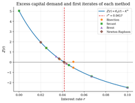](numerical-methods/root-finding/figures/excess-demand.png) | **[Scalar Root Finding for Equilibrium Rates](numerical-methods/root-finding/)** | A stylized bond market clears at the rate that sets aggregate excess demand to zero. Bisection, secant, Brent, and Newton-Raphson recover the rate; the comparison shows where bracket safety beats local speed. |
| [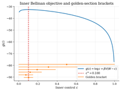](numerical-methods/scalar-optimization/figures/golden-section-trace.png) | **[One-Dimensional Optimization for Bellman Inner Steps](numerical-methods/scalar-optimization/)** | The cake-eating per-state max $u(c) + \beta V(W-c)$ has a log-utility closed-form argmax. Golden section contracts a unimodal bracket; Newton on the FOC is faster locally but overshoots feasibility from far-off starts. |

## Dynamic Programming

These tutorials start from one-state decision problems and build toward risk, search, asset pricing, business cycles, and general equilibrium.

| Preview | Tutorial | Description |
|---|---|---|
| [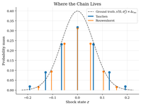](dynamic-programming/shock-discretization/figures/stationary-mass.png) | **[Discretizing Persistent Shocks](dynamic-programming/shock-discretization/)** | Persistent income or productivity shocks enter Bellman equations as finite Markov chains. Tauchen and Rouwenhorst differ in variance and persistence errors. |
| [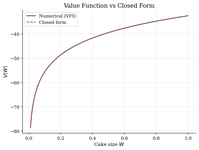](dynamic-programming/cake-eating/figures/value-function.png) | **[Finite-Resource Cake Eating](dynamic-programming/cake-eating/)** | Allocate a fixed resource over time. Value function iteration recovers the log-utility Euler rule and closed-form policy. |
| [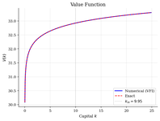](dynamic-programming/optimal-growth/figures/value-function.png) | **[Optimal Growth by Value Function Iteration](dynamic-programming/optimal-growth/)** | Allocate output between consumption and productive capital. Value function iteration recovers the log-utility policy and checks it against the closed form. |
| [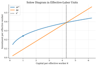](dynamic-programming/solow-growth/figures/solow-diagram.png) | **[Solow Growth and Conditional Convergence](dynamic-programming/solow-growth/)** | Capital per effective worker converges to a Solow steady state. Iterating the transition shows how saving shifts levels. |
| [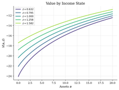](dynamic-programming/consumption-savings/figures/value-functions.png) | **[Income Risk and Buffer-Stock Saving](dynamic-programming/consumption-savings/)** | Households save under persistent income risk and a borrowing limit. Value function iteration shows high consumption responses near zero assets and a buffer-stock target. |
| [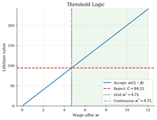](dynamic-programming/job-search-mccall/figures/accept-vs-reject.png) | **[McCall Job Search and the Reservation Wage](dynamic-programming/job-search-mccall/)** | Unemployed workers choose when to accept wage offers. A scalar Bellman fixed point gives the reservation wage and checks finite-grid VFI. |
| [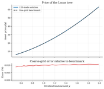](dynamic-programming/asset-pricing/figures/asset-price-function.png) | **[Lucas Tree Prices and the Stochastic Discount Factor](dynamic-programming/asset-pricing/)** | Price a Lucas tree from the household Euler equation. The stochastic discount factor links dividend risk and mean reversion to equilibrium prices. |
| [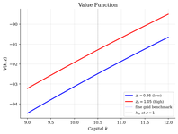](dynamic-programming/rbc/figures/comovements.png) | **[RBC Capital, Labor, and Business-Cycle Moments](dynamic-programming/rbc/)** | Study a representative-household RBC model with endogenous labor. Global-grid VFI maps productivity shocks into investment, hours, and simulated moments. |
| [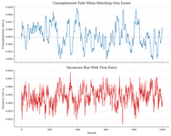](dynamic-programming/diamond-mortensen-pissarides/figures/productivity-tightness.png) | **[DMP Search, Vacancies, and Unemployment](dynamic-programming/diamond-mortensen-pissarides/)** | Productivity shocks move tightness, vacancies, and unemployment through DMP free entry. A local rule and nonlinear fixed point show surplus calibration drives amplification. |
| [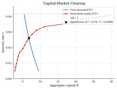](dynamic-programming/aiyagari/figures/capital-market.png) | **[Aiyagari Saving and Capital-Market Clearing](dynamic-programming/aiyagari/)** | In an incomplete-markets economy, households save to self-insure and clear the capital market. Value function iteration and bisection recover the equilibrium interest rate. |

## Macroeconomics

This section covers heterogeneous households, DSGE models, nonlinear global solutions, and continuous-time control.

### Heterogeneous Agents

These tutorials focus on incomplete-markets households and equilibrium interest rates.

| Preview | Tutorial | Description |
|---|---|---|
| [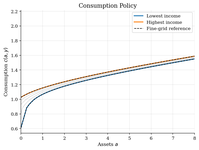](heterogeneous-agents/endogenous-grid-points/figures/consumption-policy.png) | **[Buffer-Stock Saving by Endogenous Grid Points](heterogeneous-agents/endogenous-grid-points/)** | Solve a buffer-stock saving problem without an inner asset-choice search. EGP works backward from next-period assets through the Euler equation, then simulates MPCs under income risk. |
| [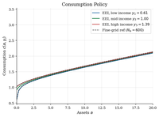](heterogeneous-agents/envelope-equation-iteration/figures/consumption-policy.png) | **[Envelope-Equation Iteration for Buffer-Stock Saving](heterogeneous-agents/envelope-equation-iteration/)** | Study buffer-stock saving under IID income risk by iterating the marginal continuation value. EEI uses the envelope condition and Euler root to recover the consumption policy. |
| [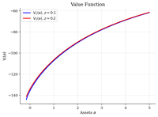](heterogeneous-agents/huggett-incomplete-markets/figures/bond-market.png) | **[Huggett Equilibrium and the Risk-Free Rate](heterogeneous-agents/huggett-incomplete-markets/)** | Find the risk-free rate in a one-bond economy with income risk and a borrowing limit. An HJB/KFE solve plus bisection clears aggregate bond demand. |

### Linearized DSGE

These tutorials log-linearize DSGE models around steady state and solve the rational-expectations transition. They use coefficient matching or Klein-style QZ, the same first-order logic behind standard DSGE solvers.

| Preview | Tutorial | Description |
|---|---|---|
| [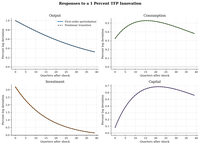](dsge/rbc/figures/irf-tfp-shock.png) | **[RBC TFP Shocks and Capital Propagation](dsge/rbc/)** | A productivity shock raises output today, and investment carries the response into future capital. First-order perturbation solves the local RBC transition, with a nonlinear path checking the approximation. |
| [](dsge/nkdsge/figures/irf-monetary-shock.png) | **[Sticky-Price Monetary Transmission in a New Keynesian DSGE](dsge/nkdsge/)** | Trace how policy-rate wedges and natural-rate demand shocks move output and inflation when prices are sticky. Coefficient matching solves the log-linear equilibrium, with Klein QZ checking determinacy. |
| [](dsge/assetNews/figures/irf-surprise-vs-news.png) | **[Lucas-Tree Dividend News and Asset Prices](dsge/assetNews/)** | Price a tree claim when investors learn about future dividends before cash flows arrive. A first-order pricing rule separates expected payoffs from stochastic discounting. |
| [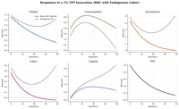](dsge/rbc-with-labor/figures/irf-tfp-shock.png) | **[RBC Labor Supply and TFP Shocks](dsge/rbc-with-labor/)** | A productivity shock moves hours on impact and capital over time in an RBC model. Klein QZ solves the log-linear system for the impulse responses. |

### Global Nonlinear DSGE

These tutorials solve macro models on grids so constraints, taxes, and risk sharing remain visible.

| Preview | Tutorial | Description |
|---|---|---|
| [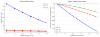](global-dsge/rbc-capital-tax/figures/steady-state-tax.png) | **[Capital Taxes and Saving in a Global RBC Model](global-dsge/rbc-capital-tax/)** | A rebated capital-income tax lowers saving by cutting the private return to capital. A global RBC grid with Euler refinement traces the saving rule across productivity states. |
| [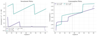](global-dsge/rbc-irreversible-investment/figures/policy-functions.png) | **[Capital Overhang from Irreversible Investment in RBC](global-dsge/rbc-irreversible-investment/)** | Installed capital can become an overhang after a bad productivity draw. Global value function iteration finds the zero-investment boundary and the recession states where it binds. |
| [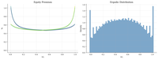](global-dsge/heaton-lucas/figures/equity-premium-and-distribution.png) | **[Heaton-Lucas Risk Sharing and Equity Premia](global-dsge/heaton-lucas/)** | Study why incomplete risk sharing makes wealth shares matter for equity premia. STPFI solves the implicit wealth-share transition and portfolio constraints in one global system. |

### Continuous-Time Macro and Optimal Control

These examples cover HJB equations, phase diagrams, shooting, and shadow prices.

| Preview | Tutorial | Description |
|---|---|---|
| [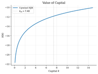](optimal-control/hjb-growth/figures/value-function.png) | **[Ramsey Capital Accumulation by HJB Upwinding](optimal-control/hjb-growth/)** | Follow Ramsey capital accumulation toward its steady state. An upwind HJB links the shadow value of capital to consumption and drift. |
| [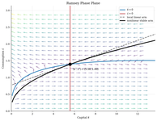](optimal-control/phase-diagrams/figures/phase-diagram.png) | **[Ramsey Consumption Choice and Saddle Paths](optimal-control/phase-diagrams/)** | Study initial consumption in Ramsey growth. The phase diagram and backward stable-arm integration select the path that reaches the saddle steady state. |
| [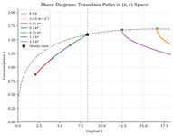](optimal-control/ramsey-growth/figures/phase-diagram.png) | **[Ramsey Saving by Saddle-Path Shooting](optimal-control/ramsey-growth/)** | A Ramsey planner chooses initial consumption with inherited capital. Shooting adjusts the jump variable until the path reaches the saddle steady state. |
| [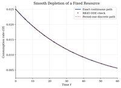](optimal-control/continuous-cake-eating/figures/consumption-path.png) | **[Fixed-Resource Consumption and Pontryagin Shadow Prices](optimal-control/continuous-cake-eating/)** | A planner allocates a fixed resource over continuous time. Pontryagin's costate equation prices remaining stock and pins down the depletion path. |

## Industrial Organization

The IO section covers firm boundaries, vertical relationships, demand, pricing, production, mergers, collusion, bargaining, and industry dynamics.

| Preview | Tutorial | Description |
|---|---|---|
| [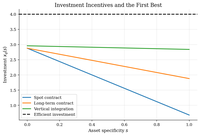](industrial-organization/theory-of-the-firm/figures/investment-incentives.png) | **[Firm Boundaries, Hold-Up, and Vertical Integration](industrial-organization/theory-of-the-firm/)** | Study when ownership should move inside the firm for relationship-specific investment. A grid comparison weighs incentive gains against contracting and hierarchy costs. |
| [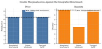](industrial-organization/vertical-relationships/figures/price-quantity.png) | **[Double Marginalization in Vertical Supply Chains](industrial-organization/vertical-relationships/)** | Study a manufacturer-retailer channel against the integrated benchmark. Backward induction shows how a linear wholesale price raises retailer marginal cost, while a two-part tariff fixes the pricing margin. |
| [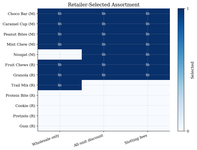](industrial-organization/vertical-contracts/figures/assortment-selection.png) | **[Vending Assortments Under Vertical Contracts](industrial-organization/vertical-contracts/)** | Vending contracts decide which products fit in scarce slots. Exact enumeration compares the retailer's best assortment under wholesale pricing, rebates, and slotting fees. |
| [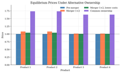](industrial-organization/bertrand-logit-demand/figures/price-comparison.png) | **[Differentiated-Products Merger Pricing with Logit Demand](industrial-organization/bertrand-logit-demand/)** | A four-product merger changes pricing through diversion. A logit-demand Bertrand FOC solve gives post-merger prices with and without lower costs. |
| [](industrial-organization/logit-supply-side/figures/estimation-comparison.png) | **[Cereal Demand and Markup Recovery from Prices](industrial-organization/logit-supply-side/)** | Cereal demand has endogenous prices and unobserved costs. Berry inversion, IV/2SLS, and Bertrand-Nash FOCs recover markups and marginal costs. |
| [](industrial-organization/blp-random-coefficients/figures/observed-vs-predicted-shares.png) | **[Differentiated-Products Demand with BLP](industrial-organization/blp-random-coefficients/)** | Study how consumer heterogeneity changes substitution in differentiated-products markets. A BLP contraction and IV/GMM estimate taste dispersion before comparing elasticities with plain logit. |
| [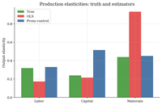](industrial-organization/production-functions-markups/figures/production-estimates.png) | **[Production Elasticities and Firm Markups](industrial-organization/production-functions-markups/)** | Recover firm-year markups from a corrected materials elasticity and materials shares. A proxy-control regression corrects productivity bias before the markup formula is applied. |
| [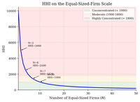](industrial-organization/effective-hhi/figures/hhi-vs-nfirms.png) | **[Market Concentration Screens with HHI](industrial-organization/effective-hhi/)** | Measure market concentration for merger screening from firm ownership shares. HHI and effective firm counts give the screen, while a small Bertrand pricing exercise separates concentration from price effects. |
| [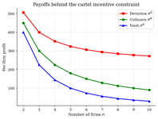](industrial-organization/collusion-detection/figures/profits-by-regime.png) | **[Repeated-Game Cartels and Price Screens](industrial-organization/collusion-detection/)** | Repeated Cournot cartels face a discipline condition. Closed-form payoffs set the sustainability threshold. A simulated price path shows the screen. |
| [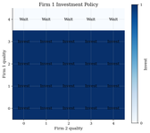](industrial-organization/dynamic-games/figures/investment-policy.png) | **[Quality Investment in Dynamic Oligopoly](industrial-organization/dynamic-games/)** | Study firms that invest to climb a quality ladder while rivals move too. A Markov-perfect fixed point maps each industry state into investment policies and continuation values. |
| [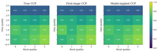](industrial-organization/dynamic-games-estimation/figures/ccp-heatmaps.png) | **[Quality Investment Game Estimation with CCPs](industrial-organization/dynamic-games-estimation/)** | Estimate payoff primitives in a two-firm quality ladder from observed investment choices. CCPs and forward-value evaluation replace repeated MPE solves. |
| [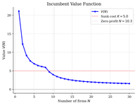](industrial-organization/dynamic-entry-exit/figures/value-function.png) | **[Entry, Exit, and Market Structure in Oligopoly](industrial-organization/dynamic-entry-exit/)** | Study how sunk entry costs make the firm count persistent in an oligopoly. A finite-state Bellman fixed point turns incumbent continuation values into entry, exit, and the long-run distribution of market structures. |
| [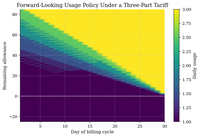](industrial-organization/three-part-tariffs/figures/usage-policy.png) | **[Broadband Data Caps and Forward-Looking Plan Choice](industrial-organization/three-part-tariffs/)** | Broadband data caps shape plan choice. Backward induction values unused allowance before the cap is reached. |
| [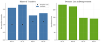](industrial-organization/nash-in-nash/figures/negotiated-prices.png) | **[Hospital-Insurer Network Bargaining](industrial-organization/nash-in-nash/)** | Hospital networks shape insurer outside options and negotiated payments. Enumerate disagreement networks and apply a Nash-in-Nash surplus split to compare separate hospitals with a merged system. |
| [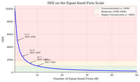](industrial-organization/merger-simulation/figures/price-comparison.png) | **[Merger Pricing in Differentiated-Products Markets](industrial-organization/merger-simulation/)** | Horizontal mergers change prices by internalizing diversion among close substitutes. Calibrated demand and Bertrand-Nash FOC solves compare GUPPI screens with equilibrium prices and cost efficiencies. |

## Structural Econometrics

Structural econometrics focuses on estimating economic primitives from observed choices, transitions, and policies. These tutorials connect likelihoods, dynamic programs, revealed decisions, and reward recovery.

| Preview | Tutorial | Description |
|---|---|---|
| [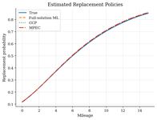](industrial-organization/dynamic-discrete-choice/figures/value-and-ccp.png) | **[Bus Engine Replacement in a Dynamic Choice Model](industrial-organization/dynamic-discrete-choice/)** | Study bus engine replacement when mileage changes future operating costs. NFXP, CCP, and MPEC recover the same replacement hazard through different Bellman objects. |
| [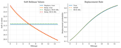](industrial-organization/inverse-rl-rust-bus/figures/value-policy-equivalence.png) | **[Inverse Reinforcement Learning for the Rust Bus Problem](industrial-organization/inverse-rl-rust-bus/)** | Show that maximum causal entropy IRL and Rust-style NFXP recover the same replacement rule. The soft Bellman likelihood links DDC estimation to reward recovery. |
| [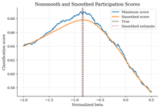](choice/maximum-score-binary-choice/figures/score-objectives.png) | **[Binary Participation with Maximum Score](choice/maximum-score-binary-choice/)** | Recover the participation boundary behind a yes/no decision without committing to a full logit error. Maximum score searches over the normalized surplus index, and smoothing makes the nonsmooth classification problem easier to compute. |
| [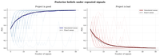](choice/bayesian-learning/figures/belief-evolution.png) | **[Sequential Investment Under Bayesian Learning](choice/bayesian-learning/)** | Study an investment option with hidden project quality. Bayesian filtering turns signals into posterior beliefs, and backward induction shows when to invest, reject, or wait. |

## Choice and Demand

Choice and demand focuses on revealed preference, learning, and choice models.

| Preview | Tutorial | Description |
|---|---|---|
| [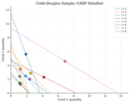](choice/revealed-preference-afriat/figures/budget-lines-consistent.png) | **[Consumer Rationalizability with Afriat's Test](choice/revealed-preference-afriat/)** | Ask whether observed bundles could come from one stable utility function. Revealed-preference edges and transitive closure turn budget comparisons into a finite GARP test. |
| [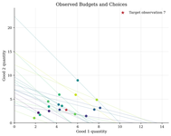](choice/preference-recoverability/figures/budget-lines.png) | **[Recovering Preference Bounds from Budget Choices](choice/preference-recoverability/)** | Finite budget choices reveal partial preference orderings. Afriat inequalities recover one rationalizing contour and show where price variation provides support. |
| [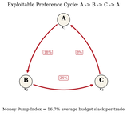](choice/money-pump-index/figures/money-pump-cycle.png) | **[Revealed-Preference Cycles and the Money Pump Index](choice/money-pump-index/)** | Measure the expenditure exposed by inconsistent budget choices. A weighted revealed-preference graph and maximum mean-cycle dynamic program turn a GARP rejection into a severity index. |
| [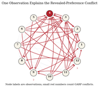](choice/houtman-maks-rational-subsets/figures/conflict-graph.png) | **[Rationalizable Choice Cores with Houtman-Maks](choice/houtman-maks-rational-subsets/)** | Choice data can reject one stable utility while still having a rationalizable core. Houtman-Maks subset search finds the largest GARP-consistent subset. |
| [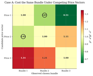](choice/revealed-price-preference/figures/price-cost-ratios.png) | **[Price-Regime Revealed Preference](choice/revealed-price-preference/)** | Compare tax, tariff, or menu schedules using the bundles consumers chose. Build the price-vector graph behind GAPP, where bundle GARP can pass even when price-regime rankings cycle. |
| [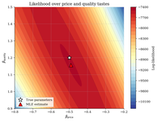](choice/logit-discrete-choice/figures/log-likelihood-surface.png) | **[Product Demand with Plain Logit and IIA](choice/logit-discrete-choice/)** | Study demand for five products with prices and quality. Maximum likelihood estimates plain-logit tastes, and IIA reallocates lost buyers by existing shares. |
| [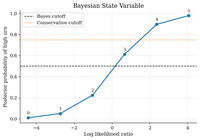](choice/urn-behavioral-mixtures/figures/bayes-likelihood-ratio.png) | **[Urn Choices and Latent Decision Rules](choice/urn-behavioral-mixtures/)** | Study how subjects classify hidden urn states from samples. Likelihood-ratio Bayesian updating gives the benchmark, and an EM mixture recovers latent decision-rule shares from repeated choices. |
| [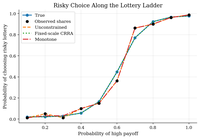](choice/risk-aversion-monotone-choice/figures/risky-choice-fits.png) | **[Lottery Risk Aversion with Monotone Choice](choice/risk-aversion-monotone-choice/)** | Estimate CRRA risk aversion from a lottery ladder. Monotone constrained logits remove sample reversals in row shares. |
| [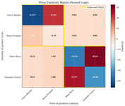](choice/nested-logit/figures/elasticity-heatmap.png) | **[Cereal Demand with Nested Logit Substitution](choice/nested-logit/)** | Cereal buyers shift after a sugary cereal price increase. Nested-logit IV estimates the nesting parameter, then turns shares into elasticities and diversion ratios. |

## Computational Game Theory

These tutorials introduce computational methods to solve game theoretic equilibria.

| Preview | Tutorial | Description |
|---|---|---|
| [](game-theory/normal-form-games/figures/pure-deviation-gains.png) | **[Finite Strategic Games and Nash Equilibrium Checks](game-theory/normal-form-games/)** | Small payoff tables encode strategic coordination and matching games. Deviation-gain enumeration finds pure Nash cells; 2x2 indifference equations find mixed probabilities. |
| [](game-theory/static-games/figures/cournot-best-response.png) | **[Cournot Quantity Competition and Best-Response Iteration](game-theory/static-games/)** | Two firms choose quantities in a linear Cournot market. First-order conditions give the Nash quantity, and damped best-response iteration checks the fixed point. |
| [](game-theory/first-price-auctions/figures/bid-functions.png) | **[First-Price Auctions, Bid Shading, and Deviation Checks](game-theory/first-price-auctions/)** | Private-value bidders shade bids when the winner pays its own bid. A closed-form Bayesian Nash rule is checked by a type-by-type bid-grid deviation test. |
| [](game-theory/quantal-response-equilibrium/figures/qre-path.png) | **[Market Entry with Quantal Response Equilibrium](game-theory/quantal-response-equilibrium/)** | Two firms decide whether to enter a small market. Logit QRE solves the noisy entry probability as a fixed point. |

## Time Series and Data

These tutorials cover stochastic processes, macroeconomic data, and forecasting.

| Preview | Tutorial | Description |
|---|---|---|
| [](time-series/fred-macro-data/figures/time-series.png) | **[Business-Cycle Moments from a FRED-Style Macro Panel](time-series/fred-macro-data/)** | Measure business-cycle moments for GDP, inflation, unemployment, and a policy rate. HP filtering turns the panel into cycles, comovement, persistence, and an Okun slope. |
| [](time-series/ar-processes/figures/ar1-irfs.png) | **[Fiscal-Shock Persistence and Income Dynamics](time-series/ar-processes/)** | Track a spending innovation through income dynamics. AR(1) impulse responses and multiplier-accelerator recursions show how persistence becomes an income path. |
| [](time-series/stock-watson/figures/factor-comparison.png) | **[Macro Forecasting with Stock-Watson Diffusion Indexes](time-series/stock-watson/)** | Forecast industrial production from many macro indicators. PCA estimates a common business-cycle factor for an expanding-window AR comparison. |

## Computational Methods

These tutorials are standalone references for optimization, approximation, simulation, filtering, and sampling.

| Preview | Tutorial | Description |
|---|---|---|
| [](computational-methods/numerical-optimization/figures/optimizer-paths.png) | **[Latent-Regime Likelihoods and Optimizer Basins](computational-methods/numerical-optimization/)** | Estimate parameters in a latent-regime likelihood where two regions fit the data. Multi-start local optimization and global search show when a reported estimate depends on the likelihood basin. |
| [](computational-methods/simulation-based-estimation/figures/criterion-surfaces.png) | **[Estimating a Search Acceptance Rule by Simulation](computational-methods/simulation-based-estimation/)** | Estimate a reservation-wage rule from wage offers and worker acceptances. MSM matches economic moments, while indirect inference matches an auxiliary acceptance model. |
| [](computational-methods/projection-methods/figures/chebyshev-basis.png) | **[Growth-Model Capital Policy by Chebyshev Projection](computational-methods/projection-methods/)** | Study the planner's capital-saving rule in a deterministic growth model. Chebyshev collocation stores the smooth policy in a few coefficients, and Euler residuals check the fit between nodes. |
| [](computational-methods/perturbation-linearization/figures/local-approximations.png) | **[Aggregate Adjustment Around a Steady State](computational-methods/perturbation-linearization/)** | A macro state returns after equal positive and negative shocks. Taylor perturbations approximate the nonlinear law near steady state and show when curvature matters. |
| [](computational-methods/metropolis-hastings/figures/mh-walk.png) | **[Sampling a Two-Regime Structural Posterior](computational-methods/metropolis-hastings/)** | Sample a structural posterior with two plausible regimes. Random-walk Metropolis-Hastings shows how proposal scale changes mode crossing and posterior averages. |
| [](computational-methods/kalman-filter/figures/simulated-signal.png) | **[Nowcasting a Latent Business-Cycle State](computational-methods/kalman-filter/)** | Nowcast hidden activity from a noisy indicator. The Kalman filter weighs each signal with model-implied uncertainty and records the likelihood. |
| [](computational-methods/particle-filter/figures/filter-comparison.png) | **[Nowcasting Hidden Economic States with Particle Filters](computational-methods/particle-filter/)** | Nowcast a hidden economic state from a noisy signal. Particle filters approximate the filtered distribution with weighted simulations, and ESS reveals proposal failure. |

## Selected External Resources

### Core Computational Economics

- [QuantEcon](https://github.com/QuantEcon) - Open-source lectures and libraries for quantitative economics.
- [John Stachurski GitHub](https://github.com/jstac) - Computational economics, stochastic dynamics, and numerical-methods code.
- [OpenSourceEcon CompMethods](https://github.com/OpenSourceEcon/CompMethods) - Executable course materials on computational methods for economists.
- [OpenSourceEconomics](https://github.com/OpenSourceEconomics) - Open-source tools for structural modeling, simulation, and policy analysis.

### Heterogeneous-Agent & HANK Models

- [Sequence-Jacobian](https://github.com/shade-econ/sequence-jacobian) - Python toolkit for solving heterogeneous-agent macro models with sequence-space Jacobians.
- [Rognlie ECON 411-3](https://github.com/mrognlie/econ411-3) - Graduate macro materials on heterogeneous-agent models and sequence-space methods.
- [HARK](https://github.com/econ-ark/HARK) - Econ-ARK toolkit for heterogeneous-agent consumption, saving, and portfolio models.
- [Benjamin Moll Codes](https://benjaminmoll.com/codes/) - Finite-difference codes for continuous-time heterogeneous-agent models.

### Empirical IO & Structural Estimation

- [PyBLP](https://github.com/jeffgortmaker/pyblp) - Python package for estimating differentiated-products demand and supply models.
- [Chris Conlon Grad IO](https://github.com/chrisconlon/Grad-IO) - PhD empirical IO course materials with practical estimation code.
- [Courthoud PhD Industrial Organization](https://github.com/matteocourthoud/Phd-Industrial-Organization) - Applied IO notes and code for demand, auctions, and structural estimation.
- [respy](https://github.com/OpenSourceEconomics/respy) - Python package for estimating and simulating dynamic discrete-choice models.

### DSGE, Dynamics, and Filtering

- [New York Fed DSGE.jl](https://github.com/FRBNY-DSGE/DSGE.jl) - Julia tools for solving and estimating DSGE models.
- [GDSGE](https://github.com/gdsge/gdsge) - Toolbox for global nonlinear DSGE solution.
- [Kalman and Bayesian Filters in Python](https://github.com/rlabbe/Kalman-and-Bayesian-Filters-in-Python) - Interactive book on Kalman filtering, particle filtering, and Bayesian state estimation.
