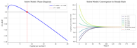
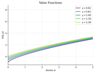
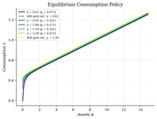
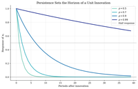
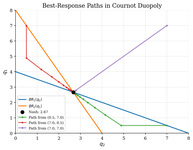
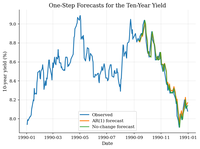

# After Quant Econ

[QuantEcon](https://quantecon.org/) is the starting point; this repo continues with executable structural and computational economics examples.

Executable examples for applied structural and computational economics after the Quant Econ foundations. Every model is self-contained, runs with `python run.py`, and produces a documented report with equations, solutions, visualizations, and takeaways.

**Built with:** Python, JAX, NumPy, SciPy, Matplotlib | **License:** MIT

## Contents

- [Quick Start](#quick-start)
- [Dynamic Programming](#dynamic-programming)
- [Macroeconomics](#macroeconomics)
- [Industrial Organization](#industrial-organization)
- [Choice and Demand](#choice-and-demand)
- [Game Theory](#game-theory)
- [Time Series and Data](#time-series-and-data)
- [Computational Finance](#computational-finance)
- [Computational Methods](#computational-methods)
- [Structure](#structure)
- [Other Code Repositories](#other-code-repositories)
- [License](#license)

## Quick Start

```bash
pip install -r requirements.txt
cd dynamic-programming/cake-eating
python run.py
# -> generates README.md + figures/ + tables/
```

---

## Dynamic Programming

Dynamic programming is both a method and a language for many structural models. This section starts with grids and one-state problems, then moves into savings, search, asset pricing, business cycles, and general equilibrium.

| | Tutorial | What it teaches | Method | Key Insight |
|:---:|---|---|---|---|
|  | [**Discretizing Persistent Shocks**](dynamic-programming/shock-discretization/) | Turning continuous AR(1) risk into finite Markov states | Tauchen + Rouwenhorst | Shock grids are part of the model, not harmless preprocessing |
|  | [**Finite-Resource Cake Eating**](dynamic-programming/cake-eating/) | The cleanest infinite-horizon Bellman problem | Value function iteration | Optimal depletion consumes fraction $(1-\beta)$ each period |
|  | [**Optimal Growth by Value Function Iteration**](dynamic-programming/optimal-growth/) | Capital accumulation with an optimizing representative household | VFI | Capital converges to $k_{ss} = (\alpha\beta A)^{1/(1-\alpha)}$ |
|  | [**Solow Growth with Exogenous Saving**](dynamic-programming/solow-growth/) | Baseline growth dynamics without household optimization | Simulation | Savings, depreciation, and technology pin down long-run output |
|  | [**Precautionary Saving with Income Risk**](dynamic-programming/consumption-savings/) | Buffer-stock saving under idiosyncratic uncertainty | VFI + Markov income | Income risk generates precautionary savings |
|  | [**McCall Job Search and Reservation Wages**](dynamic-programming/job-search-mccall/) | Sequential search with accept/reject decisions | VFI | Patient workers hold out for better offers |
|  | [**Lucas Asset Pricing with Risk Aversion**](dynamic-programming/asset-pricing/) | Equilibrium asset prices in a representative-agent exchange economy | Functional VFI | Risk aversion moves the price-dividend ratio |
|  | [**Real Business Cycles with Capital Accumulation**](dynamic-programming/rbc/) | Aggregate productivity shocks and optimal investment | VFI + simulation | Investment is much more volatile than output |
|  | [**Search and Matching Unemployment**](dynamic-programming/diamond-mortensen-pissarides/) | Labor-market matching, vacancies, and unemployment dynamics | Log-linearization | Matching frictions generate a Beveridge curve |
|  | [**Aiyagari Incomplete-Markets Equilibrium**](dynamic-programming/aiyagari/) | Household saving with income risk inside a capital-market-clearing loop | VFI + GE bisection | Precautionary savings push $r < 1/\beta - 1$ |
|  | [**Economic ODEs and Phase Diagrams**](dynamic-programming/ode-methods/) | Continuous-time model dynamics as differential equations | ODE integration | Solow, Ramsey, and nonlinear systems can be read from phase diagrams |

## Macroeconomics

This section collects the heavier macro material: heterogeneous households, incomplete markets, DSGE perturbation, global nonlinear solution, continuous-time equilibrium, and optimal-control tools.

### Heterogeneous Agents

These tutorials focus on household heterogeneity, wealth distributions, and faster solvers for incomplete-market economies.

| | Tutorial | What it teaches | Method | Key Insight |
|:---:|---|---|---|---|
|  | [**Deterministic Consumption-Savings by VFI**](heterogeneous-agents/vfi-deterministic/) | A savings problem without income risk | VFI | With $\beta R < 1$, assets run down to zero |
|  | [**IID Income Risk by VFI**](heterogeneous-agents/vfi-iid-income/) | The same savings problem with uninsurable shocks | VFI | Income risk creates a buffer-stock motive |
|  | [**Endogenous Grid Method for Income Risk**](heterogeneous-agents/endogenous-grid-points/) | Carroll's Euler-equation inversion for savings models | EGP | Inverting the Euler equation avoids costly root-finding |
|  | [**Fast Aiyagari Equilibrium by EGP**](heterogeneous-agents/egp-aiyagari/) | Aiyagari general equilibrium with a faster household solver | EGP + GE bisection | EGP makes the equilibrium loop much cheaper |
|  | [**Envelope Equation Iteration for Savings**](heterogeneous-agents/envelope-equation-iteration/) | Solving from marginal values instead of levels | EEI | Iterating on $V'(a)$ is a third route around brute-force VFI |

### DSGE and Dynare

These examples show linearized macro models, impulse responses, and Dynare-style model files wrapped in the same Python report format.

| | Tutorial | What it teaches | Method | Key Insight |
|:---:|---|---|---|---|
|  | [**AR Processes and Shock Propagation**](dynare/ar-processes/) | Persistence, autocorrelation, spectra, and simulated paths | Simulation | Persistence controls business-cycle propagation |
|  | [**Perturbation RBC in Dynare**](dynare/rbc/) | A standard log-linear RBC model and its impulse responses | First-order perturbation | TFP shocks move output immediately and capital gradually |
|  | [**New Keynesian DSGE and Taylor Rule**](dynare/nkdsge/) | IS curve, Phillips curve, monetary policy, and determinacy | Undetermined coefficients | The Taylor principle requires $\phi_\pi > 1$ |
|  | [**Asset Pricing with News Shocks**](dynare/assetNews/) | Anticipated shocks in a present-value asset-pricing model | Dynare + simulation | Prices move before dividends when news arrives |

### Global Nonlinear DSGE

These tutorials solve macro models on grids to keep nonlinearities, constraints, and asymmetries visible.

| | Tutorial | What it teaches | Method | Key Insight |
|:---:|---|---|---|---|
|  | [**Nonlinear RBC by Global VFI**](global-dsge/rbc-nonlinear/) | A full-grid RBC solution compared with perturbation | Global VFI | Recessions and expansions need not be symmetric |
|  | [**RBC with Capital Taxation**](global-dsge/rbc-capital-tax/) | Capital-income taxation in a stochastic growth model | Global VFI | Tax revenue can peak and then fall |
|  | [**RBC with Irreversible Investment**](global-dsge/rbc-irreversible-investment/) | Occasionally binding investment constraints | VFI + constraint | Irreversibility amplifies downturns |
|  | [**Heaton-Lucas Incomplete Markets via STPFI**](global-dsge/heaton-lucas/) | Portfolio choice with heterogeneous agents and trading constraints | STPFI | Trading constraints create asset-pricing kinks and risk premia |

### Continuous-Time Macro and Optimal Control

These examples cover Hamilton-Jacobi-Bellman equations, Kolmogorov Forward Equations, phase diagrams, shooting methods, and Pontryagin problems.

| | Tutorial | What it teaches | Method | Key Insight |
|:---:|---|---|---|---|
|  | [**Continuous-Time Growth by HJB**](continuous-time/hjb-growth/) | Neoclassical growth as a Hamilton-Jacobi-Bellman equation | Upwind finite differences | Continuous-time growth can be solved as an HJB |
|  | [**Continuous-Time Huggett Incomplete Markets**](continuous-time/huggett-incomplete-markets/) | Stationary equilibrium with HJB and KFE blocks | HJB + KFE | Precautionary savings push $r < \rho$ |
|  | [**Ramsey Phase Diagrams and Saddle Paths**](optimal-control/phase-diagrams/) | Reading capital-consumption dynamics in the phase plane | Linearization | The Ramsey steady state is a saddle point |
|  | [**Ramsey Growth by Shooting**](optimal-control/ramsey-growth/) | Finding the stable path by choosing initial consumption | Shooting method | Bisection recovers the saddle path |
|  | [**Continuous-Time Cake Eating by Pontryagin**](optimal-control/continuous-cake-eating/) | Resource depletion with costates and shadow prices | Pontryagin | The shadow price rises at rate $\rho$ |
|  | [**Finite-Difference HJB Methods**](optimal-control/finite-difference/) | Upwind schemes for continuous-time value functions | Upwind FD | Implicit schemes stabilize HJB computation |

## Industrial Organization

The IO section covers firm boundaries, vertical relationships, differentiated-products demand and pricing, production functions, merger screening, collusion, bargaining, and dynamic industry models. BLP appears once as a random-coefficients demand tool rather than as the center of the chapter.

| | Tutorial | What it teaches | Method | Key Insight |
|:---:|---|---|---|---|
|  | [**Theory of the Firm: Incomplete Contracts and Hold-Up**](industrial-organization/theory-of-the-firm/) | Asset specificity, hold-up, and vertical integration | Governance comparison | Integration is most useful when contracts cannot protect specific investments |
|  | [**Vertical Relationships and Double Marginalization**](industrial-organization/vertical-relationships/) | Wholesale pricing, two-part tariffs, and restraints | Backward induction | Marginal wholesale prices distort retail pricing |
|  | [**Vertical Contracts and Vending Assortments**](industrial-organization/vertical-contracts/) | Rebates, slotting fees, and assortment choice | Discrete assortment search | Fixed payments can change which products are stocked |
|  | [**Bertrand Pricing with Logit Demand**](industrial-organization/bertrand-logit-demand/) | Differentiated-product pricing and merger effects | Fixed point | Mergers raise prices unless efficiencies offset them |
|  | [**Demand Estimation and Markup Recovery**](industrial-organization/logit-supply-side/) | Recovering marginal costs from estimated demand | IV/2SLS + FOC | Demand estimates imply markups and costs |
|  | [**BLP Random Coefficients Demand**](industrial-organization/blp-random-coefficients/) | Heterogeneous preferences in differentiated-product demand | Contraction mapping | Random coefficients relax IIA |
|  | [**Production Functions and Markup Measurement**](industrial-organization/production-functions-markups/) | Proxy-control production estimation and markups | Control function | Markup estimates depend on output elasticities and input shares |
|  | [**Effective HHI for Merger Screening**](industrial-organization/effective-hhi/) | Concentration indices and merger screens | Index computation | $\Delta \text{HHI} = 2 s_1 s_2 \times 10000$ |
|  | [**Static Oligopoly Games and Nash Equilibrium**](industrial-organization/static-games/) | Cournot and normal-form equilibrium logic | Nash equilibrium | Cournot output sits between monopoly and competition |
|  | [**Repeated-Game Collusion Detection**](industrial-organization/collusion-detection/) | Cartel stability and structural breaks | Repeated games | More firms make collusion harder to sustain |
|  | [**Dynamic Games and Markov-Perfect Investment**](industrial-organization/dynamic-games/) | Ericson-Pakes style quality investment | MPE value iteration | Current investment changes tomorrow's competitive state |
|  | [**Dynamic Entry and Exit in Oligopoly**](industrial-organization/dynamic-entry-exit/) | Sunk entry costs and endogenous market structure | Dynamic programming | Entry costs sustain above-competitive profits |
|  | [**Dynamic Discrete Choice for Replacement**](industrial-organization/dynamic-discrete-choice/) | Rust-style choices, continuation values, and CCPs | Rust + CCP | Actions reveal continuation values |
|  | [**Three-Part Tariffs and Forward-Looking Broadband Demand**](industrial-organization/three-part-tariffs/) | Usage allowances and billing-cycle demand | Finite-horizon DP | Overage risk creates dynamic usage incentives |
|  | [**Nash-in-Nash Vertical Bargaining**](industrial-organization/nash-in-nash/) | Bilateral negotiations between upstream and downstream firms | Nash-in-Nash | Incremental value is bargaining leverage |
|  | [**Merger Simulation Across Demand Systems**](industrial-organization/merger-simulation/) | Comparing merger predictions under alternative demand models | Multi-demand simulation | Demand model choice changes policy conclusions |

## Choice and Demand

Choice and demand stays focused on choice theory, revealed preference, Bayesian learning, and demand basics. IO supply-side methods and full counterfactual workflows live in the Industrial Organization section.

| | Tutorial | What it teaches | Method | Key Insight |
|:---:|---|---|---|---|
|  | [**Revealed Preference via Afriat**](choice/revealed-preference-afriat/) | Testing whether choices can come from utility maximization | Afriat inequalities | GARP is a testable implication of utility maximization |
|  | [**GARP Testing with Warshall Closure**](choice/garp-warshall/) | Fast revealed-preference closure and power analysis | Warshall algorithm | Bronars power rises with more observations |
|  | [**Recovering Preferences from Finite Data**](choice/preference-recoverability/) | Bounding indifference curves without a full functional form | Afriat numbers | Data can bound preferences even without point identification |
|  | [**Money Pump Index for Revealed Preference**](choice/money-pump-index/) | Measuring how costly a revealed-preference cycle is | Maximum mean cycle | GARP failures differ in welfare severity |
|  | [**Houtman-Maks Rational Subsets**](choice/houtman-maks-rational-subsets/) | Finding the largest rationalizable core of a dataset | Exact subset search + SCC heuristic | Some violations are driven by a small set of observations |
|  | [**Revealed Price Preference**](choice/revealed-price-preference/) | Testing rationalizability of price vectors rather than bundles | Price-preference graph | Price regimes have their own revealed-preference restrictions |
|  | [**Multinomial Logit Demand Estimation**](choice/logit-discrete-choice/) | Estimating product choice probabilities from simulated data | MLE | IIA makes substitution proportional to shares |
|  | [**Bayesian Learning from Sequential Signals**](choice/bayesian-learning/) | Belief updating and optimal classification | Bayes' rule | Rational learning converges toward the Bayes classifier |
|  | [**Nested Logit Demand and Within-Nest Substitution**](choice/nested-logit/) | Grouped products and stronger same-nest substitution | Berry inversion | Same-nest substitution can be much larger than cross-nest substitution |

## Game Theory

This section covers equilibrium concepts directly, before they are embedded in IO or macro models. It starts with small normal-form games, then moves to dynamics, auctions, and noisy equilibrium.

| | Tutorial | What it teaches | Method | Key Insight |
|:---:|---|---|---|---|
|  | [**Normal-Form Games and Mixed Equilibrium**](game-theory/normal-form-games/) | Pure and mixed Nash equilibria in small games | Enumeration + indifference | Small games are equilibrium checks, not black-box solver problems |
|  | [**Cournot Best-Response Dynamics**](game-theory/best-response-dynamics/) | Iterating strategic responses toward equilibrium | Fixed-point iteration | Nash equilibrium is a fixed point of best responses |
|  | [**First-Price Auctions and Bid Shading**](game-theory/first-price-auctions/) | Bayesian Nash bidding in private-value auctions | Bayesian Nash | Bidders trade off surplus against win probability |
|  | [**Quantal Response Equilibrium**](game-theory/quantal-response-equilibrium/) | Noisy best responses and stochastic choice | Logit fixed point | QRE bridges finite games and probabilistic choice |

## Time Series and Data

These tutorials are for macro data handling and reduced-form forecasting tools that support structural work.

| | Tutorial | What it teaches | Method | Key Insight |
|:---:|---|---|---|---|
|  | [**FRED-Style Business Cycle Facts**](time-series/fred-macro-data/) | Business-cycle moments from macro time series | HP filter | Cyclical components reveal Okun and Phillips patterns |
|  | [**Stock-Watson Factor Forecasting**](time-series/stock-watson/) | Extracting common factors from large panels | PCA | A small number of factors can improve forecasts |

## Computational Finance

These tutorials convert the old computational-finance notebooks into short, reproducible finance examples. The emphasis is interpretation: bond prices, yield curves, predictability tests, and portfolio frontiers are useful only when the data object and maintained assumptions are clear.

| | Tutorial | What it teaches | Method | Key Insight |
|:---:|---|---|---|---|
|  | [**Bond Prices and Yield to Maturity**](computational-finance/bond-yield-to-maturity/) | Pricing promised cash flows and solving for implied yields | Root finding | YTM is an implied discount rate, not a guaranteed realized return |
|  | [**Treasury Yield Curve Snapshots**](computational-finance/treasury-yield-curve/) | Reading curve levels, slopes, and maturity patterns | Static data analysis | CMT rates summarize an interpolated par-yield curve |
|  | [**Fama-Bliss-Style Forward Regressions**](computational-finance/fama-bliss-forward-regression/) | Testing whether forward spreads predict future yield changes | OLS regression | Forward-rate predictability needs careful data and horizon choices |
|  | [**AR(1) Forecasting for Treasury Yields**](computational-finance/ar1-rate-forecasting/) | Forecasting persistent interest rates against a no-change benchmark | AR(1) regression | Simple persistence benchmarks are hard to beat at short horizons |
|  | [**Weak-Form Efficient-Market Diagnostics**](computational-finance/efficient-market-tests/) | Autocorrelation, variance-ratio, and predictability checks | Random-walk diagnostics | Rejections test both market efficiency and the expected-return model |
|  | [**Mean-Variance Portfolio Frontier**](computational-finance/mean-variance-frontier/) | Diversification, covariance, and efficient portfolios | Markowitz frontier | Covariance drives risk, and frontiers are input-sensitive |

## Computational Methods

These tutorials are useful as standalone references when optimization or sampling is the bottleneck.

| | Tutorial | What it teaches | Method | Key Insight |
|:---:|---|---|---|---|
|  | [**Optimization Methods for Economic Objectives**](computational-methods/numerical-optimization/) | Local, derivative-free, and stochastic search | Newton + BFGS + annealing | Starting points and multimodality decide what optimizers find |
|  | [**Projection Methods with Chebyshev Polynomials**](computational-methods/projection-methods/) | Approximating policy functions with basis coefficients | Chebyshev collocation | Euler errors reveal whether a smooth approximation is actually accurate |
|  | [**Perturbation and Linearization**](computational-methods/perturbation-linearization/) | Local Taylor approximations and nonlinear impulse responses | Taylor expansion | Linearization is fast, but higher-order terms capture curvature and asymmetry |
|  | [**Metropolis-Hastings Sampling Diagnostics**](computational-methods/metropolis-hastings/) | Random-walk MCMC tuning and diagnostics | Random-walk MCMC | Proposal tuning trades off acceptance and exploration |
|  | [**Kalman Filtering Hidden States**](computational-methods/kalman-filter/) | Recursive signal extraction in linear Gaussian systems | Kalman filter | Prediction and updating deliver states, uncertainty, and likelihood together |
|  | [**Particle Filtering and Degeneracy**](computational-methods/particle-filter/) | Simulation-based filtering when analytic updates are unavailable | Sequential Monte Carlo | Proposal design controls particle collapse and Monte Carlo error |

---

## Structure

Each model folder is self-contained:

```
topic-area/
  model-name/
    run.py          # Single script: model + solve + generate report
    README.md       # Auto-generated: equations, solutions, figures, takeaways
    figures/        # PNG plots (value functions, policies, simulations)
    tables/         # CSV data (comparison tables, statistics)
```

Shared utilities live in `lib/`:

```
lib/
  grids.py          # Asset/state grid construction
  discretize.py     # Tauchen, Rouwenhorst for AR(1) processes
  interpolate.py    # Linear interpolation (JAX-compatible)
  vfi.py            # Generic VFI solver
  plotting.py       # Consistent matplotlib academic style
  output.py         # ModelReport class (auto-generates README.md)
```

Catalog checks live in `scripts/`:

```
python scripts/validate_catalog.py
```

Original files are preserved in `_legacy/`.

## Other Code Repositories

- [QuantEcon](https://github.com/QuantEcon)
- [Dynamic Structural Econometrics (DSE 2023)](https://github.com/dseconf/DSE2023)
- [Chris Conlon Grad IO](https://github.com/chrisconlon/Grad-IO)
- [EconRL](https://github.com/SimonHashtag/EconRL)
- [CompEcon](https://github.com/fediskhakov/CompEcon)
- [CompEcon Fall 2017](https://github.com/ScPo-CompEcon/CoursePack)
- [EmpiricalIO](https://github.com/kohei-kawaguchi/EmpiricalIO)
- [Quantitative Macro Models](https://github.com/hessjacob/Quantitative-Macro-Models)
- [Archive of Empirical Dynamic Programming Research](https://github.com/CForg/Archive-of-Empirical-Dynamic-Programming-Research)
- [Dynamical Systems](https://github.com/JuliaDynamics/DynamicalSystems.jl)
- [Heterogeneous Agents Bayes](https://github.com/BASEforHANK)
- [Kalman and Bayesian Filters in Python](https://github.com/rlabbe/Kalman-and-Bayesian-Filters-in-Python)
- [OpenSourceEcon CompMethods](https://github.com/OpenSourceEcon/CompMethods)

## License

MIT License. Copyright (c) 2021 Pranjal Rawat.
