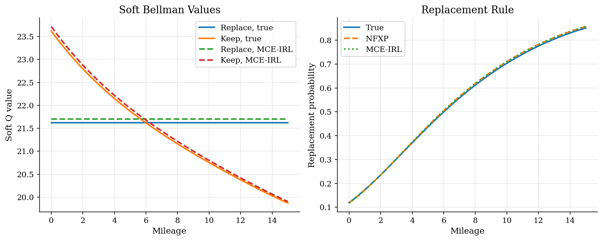
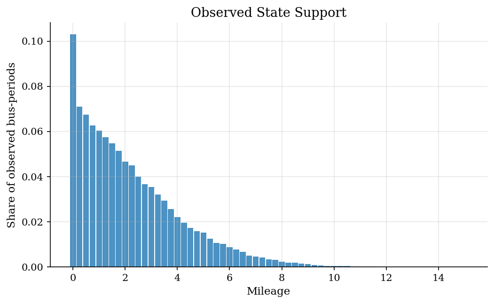
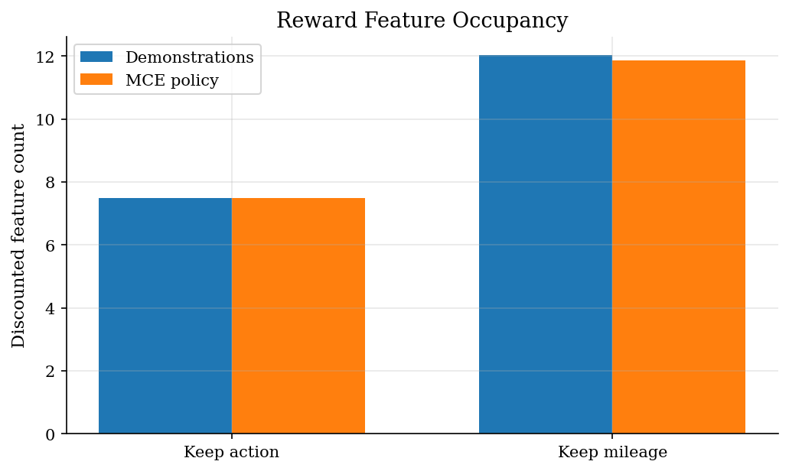

# Inverse Reinforcement Learning for the Rust Bus Problem

## Overview

Rust estimates payoffs from replacement choices by solving a dynamic discrete choice model. Maximum causal entropy inverse reinforcement learning estimates a reward from demonstrations. In this finite-state logit setting, the two routes meet at the same object: a soft Bellman policy likelihood.

The example uses the same bus engine replacement environment as the dynamic choice tutorial. Mileage is the state. The action is to replace the engine or keep it for another period. The data are simulated from known payoffs, so the exercise is an equivalence check rather than an identification claim about all inverse reinforcement learning estimators.

## Equations

Let $x_t \in X$ denote mileage. The action $a_t=0$ replaces the engine and
$a_t=1$ keeps it. Replacement flow utility is normalized to zero:

$$r_\theta(x,\text{replace})=0.$$

The keep reward is linear in action-dependent features:

$$r_\theta(x,\text{keep})=\theta_0+\theta_1 x,\qquad \theta_1<0.$$

Write a demonstrated history as

$$\tau_i=(x_{i0},a_{i0},x_{i1},a_{i1},\ldots).$$

The reward features are action dependent. Replacement has feature vector
$f(x,\text{replace})=(0,0)$, while keeping has $f(x,\text{keep})=(1,x)$, so
$r_\theta(x,a)=\theta^\top f(x,a)$.

Maximum causal entropy IRL asks for a policy that earns reward while remaining
as random as possible, conditional on the observed state history:

$$\max_\pi\ E_\pi\left[\sum_{t\geq 0}\beta^t r_\theta(x_t,a_t)\right]+H_c(\pi),$$

where the causal entropy term is

$$H_c(\pi)=E_\pi\left[-\sum_{t\geq 0}\beta^t\log\pi(a_t\mid x_t)\right].$$

The inverse problem chooses reward weights so demonstrated and policy-implied
discounted features match, where $N$ is the number of observed bus trajectories:

$$\widehat\mu_D=\frac{1}{N}\sum_{i=1}^N\sum_{t\geq 0}\beta^t f(x_{it},a_{it})
=E_{\pi_\theta}\left[\sum_{t\geq 0}\beta^t f(x_t,a_t)\right].$$

A compact Lagrangian view puts the feature-matching multipliers in the reward:

$$\mathcal L(\pi,\theta)=H_c(\pi)+\theta^\top\left(E_\pi\left[\sum_{t\geq 0}\beta^t f(x_t,a_t)\right]-\widehat\mu_D\right).$$

For a fixed $\theta$, the policy problem has the causal logit solution. Define

$$Q_\theta(x,a)=r_\theta(x,a)+\beta\sum_{x'}F_a(x'\mid x)\left[\log\sum_{b\in\{0,1\}}\exp Q_\theta(x',b)+\gamma\right].$$

Here $F_a(x'\mid x)$ is the transition probability from mileage state $x$ to $x'$ under
action $a$, and $\gamma\approx 0.5772$ is the Euler-Mascheroni constant linking the
log-sum-exp expression to the expected maximum of i.i.d. Type I extreme-value shocks.

Then

$$\pi_\theta(a\mid x)=\frac{\exp Q_\theta(x,a)}{\sum_{b\in\{0,1\}}\exp Q_\theta(x,b)}.$$

Rust-style NFXP solves the Bellman equation inside the likelihood and maximizes

$$\ell(\theta)=\sum_{i,t}\log\pi_\theta(a_{it}\mid x_{it}).$$

The implementation estimates $\theta$ by this conditional demonstration
likelihood. The MCE view interprets the same first-order condition as
reward-feature matching. With the reward normalization, transitions, discount
factor, and logit scale fixed, the MCE-IRL policy and Rust logit DDC likelihood
are the same object in this example. Sanghvi et al. (2021) formalize this
connection by showing that MCE-IRL and NFXP share the same objective form,
causal-logit policy, and feature-count gradient in this class of models.

## Model Setup

| Parameter | Value | Description |
|-----------|-------|-------------|
| $\beta$ | 0.9 | Discount factor |
| $\theta_0$ | 2.00 | Keep-engine reward intercept |
| $\theta_1$ | -0.15 | Mileage reward slope |
| Mileage states | 61 | Grid for $x \in [0,15]$ |
| Actions | 2 | Replace or keep |
| Transition law | Exponential increments | Replacement resets to the low-mileage transition |
| Buses | 1500 | Simulated panel units |
| Periods | 35 | Observations per bus |
| Ground truth | Known | Data are simulated from $\theta=(2.00,-0.15)$ |

## Solution Method

Both estimators call the same soft Bellman solver. The only difference is the interpretation of the outer objective. NFXP calls it a dynamic discrete choice likelihood. MCE-IRL calls it the likelihood of demonstrated actions under the maximum-causal-entropy policy.

```text
Algorithm: NFXP and MCE-IRL equivalence check
Input: mileage grid X, transitions F_replace and F_keep, beta, demonstrations
Build reward features f(x, replace) = (0, 0) and f(x, keep) = (1, x)
for each candidate theta proposed by the optimizer:
    set r_theta(x, a) = f(x, a)' theta
    solve the soft Bellman fixed point for Q_theta(x, a)
    form pi_theta(a | x) from the softmax of Q_theta
    evaluate sum log pi_theta(a_it | x_it)
choose theta that maximizes the demonstration likelihood
compare NFXP and MCE-IRL estimates, likelihoods, and policies
```

The comparison is deliberately narrow. The reward normalization is fixed, the transition law is known, and the data come from the same Rust-style model. Under those conditions, reward recovery and structural dynamic choice estimation solve the same numerical problem.

## Results

The learned MCE-IRL values line up with the Rust dynamic choice values after using the same reward normalization. The policy panel is the main check: NFXP and MCE-IRL choose the same mileage-specific replacement rule.



Most likelihood weight comes from low and middle mileage states. High mileage states still discipline the slope, but they are rare because replacement resets the engine.



The IRL view is a reward-feature view of the same choices. The demonstrated feature occupancies are close to the occupancies implied by the recovered maximum-causal-entropy policy.



Both methods recover the same reward weights. The finite-sample estimates are close to the known simulation truth.

**Reward parameter estimates**

| Parameter   |   True |      NFXP |   NFXP error |   MCE-IRL |   MCE-IRL error |   NFXP minus MCE-IRL |
|:------------|-------:|----------:|-------------:|----------:|----------------:|---------------------:|
| theta_0     |   2    |  2.01811  |     0.018112 |  2.01811  |        0.018111 |                1e-06 |
| theta_1     |  -0.15 | -0.153462 |    -0.003462 | -0.153462 |       -0.003462 |               -0     |

The likelihood and policy gaps are numerical, not economic. They confirm that the two labels describe the same optimization problem here.

**Equivalence diagnostics**

| Diagnostic                         |            Value |
|:-----------------------------------|-----------------:|
| NFXP success                       |      1           |
| MCE-IRL success                    |      1           |
| NFXP log likelihood                | -27591           |
| MCE-IRL log likelihood             | -27591           |
| Absolute log likelihood difference |      2.14277e-09 |
| Max replacement-policy difference  |      1.31266e-07 |
| Repair rate                        |      0.253181    |
| Average mileage                    |      2.21011     |
| Bellman iterations at truth        |    228           |
| Bellman error at MCE-IRL estimate  |      9.18767e-11 |

These moments compare demonstrated reward features with the features predicted by the MCE policy at the observed mileage states.

**Conditional reward-feature moments**

| Feature      |   Demonstrations |   MCE policy |      Gap |
|:-------------|-----------------:|-------------:|---------:|
| Keep action  |         0.746819 |     0.746829 | -1e-05   |
| Keep mileage |         1.40249  |     1.40251  | -1.8e-05 |

The finite-horizon occupancy calculation starts from the same initial state distribution as the simulated bus panel.

**Discounted reward-feature occupancy**

| Feature      |   Demonstrations |   MCE policy |      Gap |
|:-------------|-----------------:|-------------:|---------:|
| Keep action  |          7.50164 |      7.48356 | 0.018079 |
| Keep mileage |         12.0238  |     11.8539  | 0.169905 |

## Takeaway

In this controlled Rust-style replacement model, NFXP and MCE-IRL are not two different estimators of different objects. They solve the same soft Bellman likelihood with a different vocabulary. NFXP emphasizes structural payoffs and continuation values. MCE-IRL emphasizes reward features and demonstrations. The equivalence depends on the finite-state logit model, known transitions, and the replacement reward normalization.

## References

- [Rust, J. (1987). Optimal Replacement of GMC Bus Engines: An Empirical Model of Harold Zurcher. *Econometrica*, 55(5), 999-1033.](https://doi.org/10.2307/1911259)
- [Ziebart, B. D., Bagnell, J. A., and Dey, A. K. (2010). Modeling Interaction via the Principle of Maximum Causal Entropy. *ICML*.](https://arxiv.org/abs/1004.1628)
- [Sanghvi, N., Usami, S., Sharma, M., Groeger, J., and Kitani, K. (2021). Inverse Reinforcement Learning with Explicit Policy Estimates. *AAAI*.](https://arxiv.org/abs/2103.02863)
- [EconIRL documentation: inverse reinforcement learning estimators for economics.](https://econirl.readthedocs.io/en/latest/)
