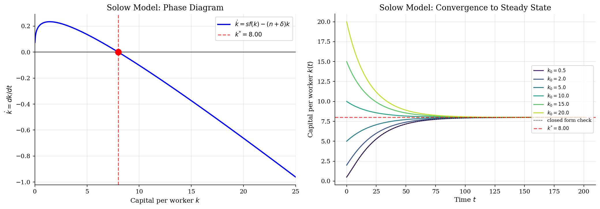
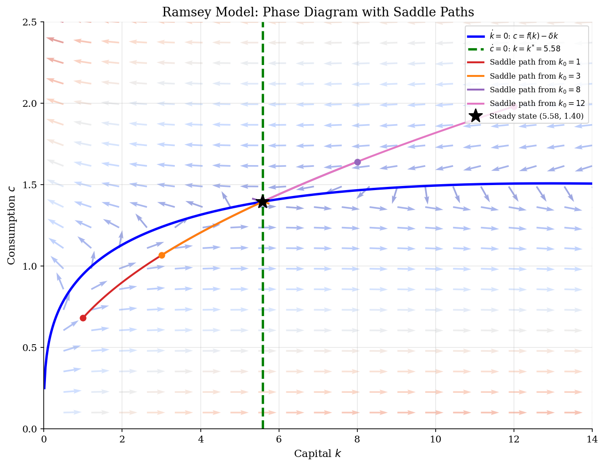
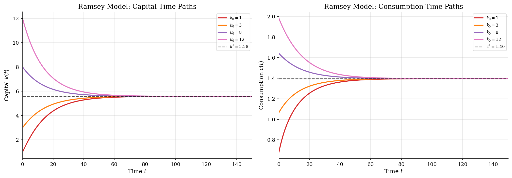

# Continuous-Time Growth and Phase Diagrams

> Reading convergence, saddle paths, and cycles from differential equations.

## Overview

Continuous-time growth models are mainly about transition paths. Given an initial capital stock, does the economy move toward a steady state, away from it, or around it? Ordinary differential equations are the language for those motions.

The tutorial uses three small systems. The Solow model has one predetermined state, so the sign of $\dot{k}$ is enough to read convergence. Ramsey growth adds forward-looking consumption, which turns the steady state into a saddle: only one initial $c_0$ is consistent with optimal behavior from a given $k_0$. Lotka-Volterra is included as a clean nonlinear contrast. It is not a growth model, but it shows why a phase diagram is more than a plotting device: a two-state ODE can converge, diverge, or cycle depending on the economic law of motion.

## Equations

Let $t$ denote continuous time and let a dot denote a time derivative. Output is
$f(k)=k^\alpha$ in the two growth examples.

**Solow growth.** Capital per worker follows
$$
\dot{k}(t)=s f(k(t))-(n+\delta)k(t),
$$
where $s$ is the constant saving rate, $n$ is population growth, and $\delta$ is
depreciation. The steady state solves $s f(k_S^{*})=(n+\delta)k_S^{*}$. With
Cobb-Douglas production,
$$
k_S^{*}=\left(\frac{s}{n+\delta}\right)^{1/(1-\alpha)}.
$$
For the numerical check, transform $z(t)=k(t)^{1-\alpha}$. Then
$$
z(t)=z^{*}+(z_0-z^{*})\exp[-(1-\alpha)(n+\delta)t],
\qquad z^{*}=(k_S^{*})^{1-\alpha}.
$$

**Ramsey optimal growth.** A representative household chooses consumption, so
capital accumulation is paired with the Euler equation:
$$
\dot{k}(t)=f(k(t))-\delta k(t)-c(t),
\qquad
\dot{c}(t)=\frac{1}{\sigma}\left[f'(k(t))-\delta-\rho\right]c(t).
$$
Here $\rho$ is the continuous-time discount rate and $\sigma$ is CRRA risk
aversion. The interior steady state satisfies
$$
f'(k_R^{*})=\delta+\rho,
\qquad
c_R^{*}=f(k_R^{*})-\delta k_R^{*}.
$$

**Lotka-Volterra cycles.** Let $x$ be prey and $y$ be predators:
$$
\dot{x}(t)=a x(t)-b x(t)y(t),
\qquad
\dot{y}(t)=d x(t)y(t)-g y(t).
$$
The interior steady state is $(x^{*},y^{*})=(g/d,a/b)$. The conserved quantity
$$
H(x,y)=d x-g\log x+b y-a\log y
$$
is constant along the exact orbit, which gives a useful diagnostic for the
integrated path.

## Model Setup

The growth examples use the same Cobb-Douglas technology so the difference between Solow and Ramsey comes from behavior, not from production. Solow fixes the saving rate at $s$; Ramsey lets consumption jump to satisfy the Euler equation and the transversality condition.

| Object | Value | Role |
|---|---:|---|
| $\alpha$ | 0.3 | Capital share in $f(k)=k^\alpha$ |
| $\delta$ | 0.05 | Depreciation rate |
| $s$ | 0.3 | Exogenous Solow saving rate |
| $n$ | 0.02 | Solow population growth rate |
| $\rho$ | 0.04 | Ramsey discount rate |
| $\sigma$ | 2.0 | Ramsey CRRA coefficient |
| Solow horizon | 200 | Years of forward integration |
| Ramsey horizon | 300 | Terminal horizon for shooting |
| ODE solver | `RK45` | Adaptive Runge-Kutta through `solve_ivp` |

## Solution Method

The numerical work is simple on purpose. The main economic object is the law of motion, and the solver is only the way we trace it. `solve_ivp` uses adaptive RK45 with `rtol=1e-10` and `atol=1e-12`. For Solow, the integrated path is checked against the closed-form transformation above; the largest absolute difference on the plotted grid is `2.26e-09`.

For Ramsey, the issue is not local integration. It is choosing the initial jump variable. Starting from a given $k_0$, too much $c_0$ runs capital down; too little $c_0$ over-accumulates capital. Bisection turns that economic ordering into a shooting algorithm.

```text
Inputs: k0, bounds [c_low, c_high], horizon T, steady state (k_R^{*}, c_R^{*})
repeat until the terminal path is close to (k_R^{*}, c_R^{*}):
    set c0 = (c_low + c_high) / 2
    integrate (k_dot, c_dot) forward from (k0, c0) to T
    if terminal capital is above k_R^{*}: raise consumption, so c_low = c0
    if terminal capital is below k_R^{*}: lower consumption, so c_high = c0
return c0 and the implied saddle path
```

The Lotka-Volterra example uses the same forward integration idea but has a different qualitative object: a closed orbit around the interior steady state. The conserved quantity $H(x,y)$ drifts by only `1.34e-10` over the simulated path, which is a compact check that the numerical orbit is not spuriously damping out.

## Results

In Solow, the phase diagram is already the economic argument. Below $k_S^{*}$, investment exceeds break-even investment and $\dot{k}>0$; above it, depreciation and dilution dominate and $\dot{k}<0$. The time paths on the right simply trace that sign logic forward. The dotted closed-form benchmark lies on top of the numerical path for the lowest initial capital stock, which is a direct check on the ODE integration rather than a separate calibration result.



Ramsey growth changes the problem because consumption is a jump variable. The blue curve is the $\dot{k}=0$ locus and the green line is the $\dot{c}=0$ locus. Their intersection is not globally attracting. For each plotted $k_0$, the shooting routine picks the one $c_0$ that puts the economy on the stable arm; nearby initial consumption choices would leave the phase plane in the wrong direction.



The third system is here to keep the reader honest about phase diagrams. A two-equation ODE does not imply convergence. Here the state moves around the interior steady state because prey abundance raises predator growth, predators then reduce prey, and the cycle repeats. The conserved-quantity drift reported above is small, so the closed orbit is a property of the model rather than a plotting artifact.


The Ramsey time paths make the phase diagram easier to read. Low-capital economies have high marginal products and accumulate quickly, but consumption cannot be chosen independently period by period. It moves smoothly according to the Euler equation, with the initial level pinned down by the saddle-path condition.



The steady-state table is mostly a normalization check. Solow and Ramsey share the production technology but settle at different capital stocks because the saving rule is different. Ramsey capital is pinned down by the modified golden-rule condition $f'(k_R^{*})=\delta+\rho$, while Solow capital is pinned down by exogenous saving.

**Steady-State Values for Each Model**

| Model                 | Variable      |   Value | Formula                           |
|:----------------------|:--------------|--------:|:----------------------------------|
| Solow Growth          | k*            |  7.9963 | (s/(n+delta))^(1/(1-alpha))       |
| Solow Growth          | y*            |  1.8658 | f(k*) = k*^alpha                  |
| Solow Growth          | c*            |  1.3061 | (1-s)*y*                          |
| Ramsey Optimal Growth | k*            |  5.5843 | (alpha/(delta+rho))^(1/(1-alpha)) |
| Ramsey Optimal Growth | y*            |  1.6753 | f(k*) = k*^alpha                  |
| Ramsey Optimal Growth | c*            |  1.3961 | f(k*) - delta*k*                  |
| Lotka-Volterra        | x* (prey)     |  4      | g/d                               |
| Lotka-Volterra        | y* (predator) |  2.75   | a/b                               |

## Takeaway

The useful lesson is not that continuous-time models require a special solver. It is that the law of motion already contains most of the economics. In Solow, one state and one sign condition give global convergence. In Ramsey, the same production side becomes a saddle-path problem once consumption is forward looking. In the nonlinear population system, the same phase-plane tools reveal cycles instead of convergence. A good ODE computation therefore starts by asking what motion the model implies, then uses numerical integration and diagnostics to trace that motion accurately.

## References

- Acemoglu, D. (2009). *Introduction to Modern Economic Growth*. Princeton University Press, Ch. 2, 7-8.
- Barro, R. and Sala-i-Martin, X. (2004). *Economic Growth*. MIT Press, 2nd edition, Ch. 1-2.
- Strogatz, S. (2015). *Nonlinear Dynamics and Chaos*. Westview Press, 2nd edition.
- Judd, K. (1998). *Numerical Methods in Economics*. MIT Press, Ch. 10.
