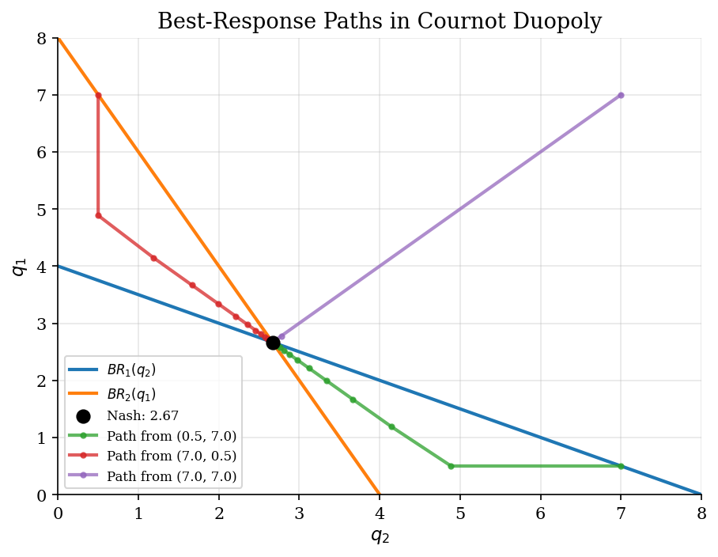
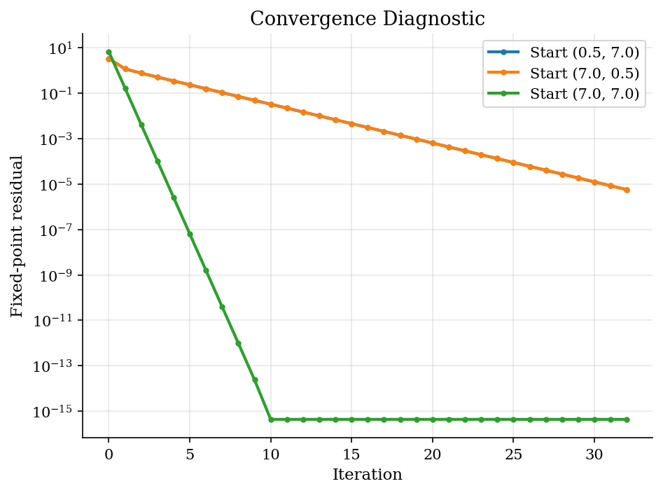

# Cournot Best-Response Dynamics

> Solving a Cournot game by iterating best responses.

## Overview

Best-response dynamics solve a game by repeatedly asking each player: given what the other player is doing now, what is my optimal action? When the best-response map is a contraction, this iteration converges to a Nash equilibrium. When it is not, the same idea may cycle or require damping.

## Equations

Two firms choose quantities $q_1$ and $q_2$. Inverse demand is
$$
P(Q) = a - bQ, \qquad Q = q_1 + q_2,
$$
and each firm has constant marginal cost $c$. Firm $i$ solves
$$
\max_{q_i \geq 0} (a - b(q_i + q_j) - c)q_i.
$$

The best response is
$$
BR_i(q_j) = \max\bigl[0, \frac{a-c-bq_j}{2b}\bigr].
$$

The symmetric Nash equilibrium solves $q^{*} = BR(q^{*})$:
$$
q^{*} = \frac{a-c}{3b}.
$$

## Model Setup

| Parameter | Value | Description |
|-----------|-------|-------------|
| $a$ | 10.0 | Demand intercept |
| $b$ | 1.0 | Demand slope |
| $c$ | 2.0 | Marginal cost |
| Damping | 0.65 | Weight on the new best response |
| Iterations | 32 | Number of best-response updates |

## Solution Method

Start from several initial quantity pairs. At each iteration, compute both firms' best responses to the previous quantities and update with damping:

$$q^{t+1} = (1-\lambda)q^t + \lambda BR(q^t).$$

The diagnostic is the fixed-point residual $\max_i |q_i - BR_i(q_{-i})|$.

## Results

Each path starts from a different output pair and moves by damped simultaneous best responses. The intersection of best-response curves is the Nash equilibrium.


*Best-response iteration converges to the Cournot Nash equilibrium*

The residual measures the largest profitable correction implied by the best-response map. A Nash equilibrium has residual zero.


*Best-response residual falls toward zero*

**Convergence Summary**

| Initial q   |   Final q1 |   Final q2 |   Residual |
|:------------|-----------:|-----------:|-----------:|
| (0.5, 7.0)  |     2.6667 |     2.6667 |   5.6e-06  |
| (7.0, 0.5)  |     2.6667 |     2.6667 |   5.6e-06  |
| (7.0, 7.0)  |     2.6667 |     2.6667 |   4.44e-16 |
| Closed form |     2.6667 |     2.6667 |   4.44e-16 |

**Cournot Equilibrium Outcomes**

|     q1 |     q2 |   Price |   Profit per firm |
|-------:|-------:|--------:|------------------:|
| 2.6667 | 2.6667 |  4.6667 |            7.1111 |

## Takeaway

Best-response iteration turns a Nash equilibrium problem into a fixed-point problem. For this Cournot game the map is well behaved, so low-code iteration is enough. The important habit is to report a residual: convergence of the plotted path is not the same thing as verifying that no player still wants to deviate.

## Reproduce

```bash
python run.py
```

## References

- [Cournot, A. A. (1838/1897). *Researches into the Mathematical Principles of the Theory of Wealth*. English translation.](https://openlibrary.org/books/OL5428468M/Researches_into_the_mathematical_principles_of_the_theory_of_wealth_1838.)
- [Fudenberg, D. and Levine, D. K. (1998). *The Theory of Learning in Games*. MIT Press.](https://mitpress.mit.edu/9780262061940/the-theory-of-learning-in-games/)
- [Fudenberg, D. and Tirole, J. (1991). *Game Theory*. MIT Press.](https://mitpress.mit.edu/9780262061414/game-theory/)
- [Vives, X. (1999). *Oligopoly Pricing: Old Ideas and New Tools*. MIT Press.](https://mitpress.mit.edu/9780262720403/oligopoly-pricing/)
