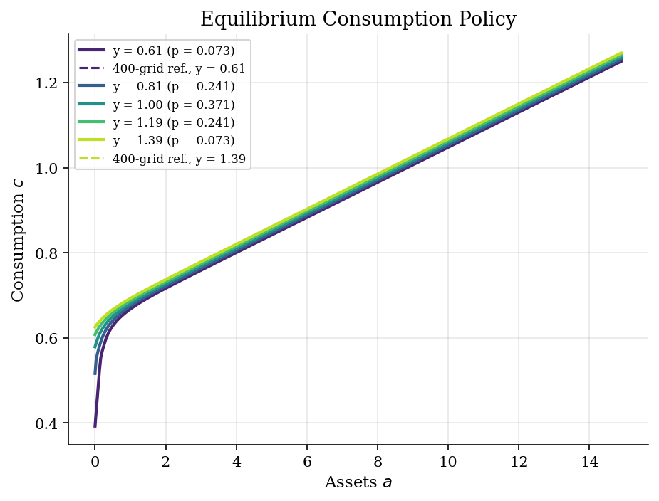
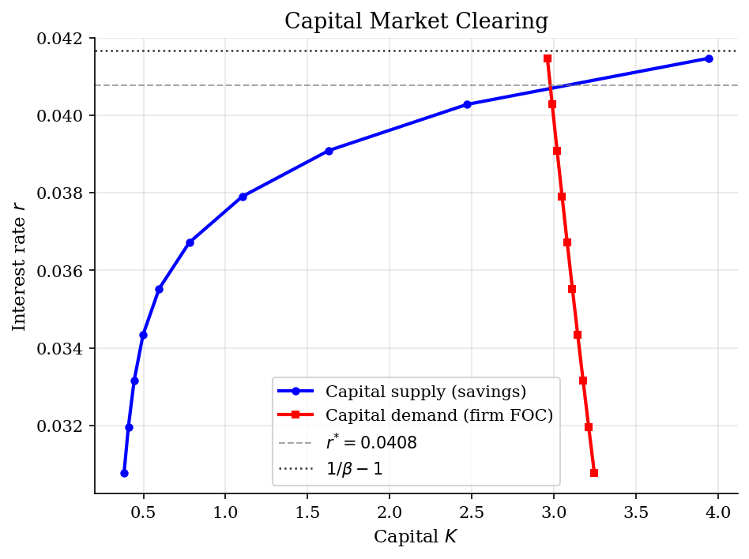

# Aiyagari Equilibrium with Endogenous Grid Points

> Capital-market clearing in an incomplete-markets economy with an EGP household block.

## Overview

Aiyagari (1994) turns the buffer-stock household problem into a general equilibrium model. A continuum of households faces uninsurable labor-income risk, saves in capital, and rents that capital to a competitive firm. The interest rate is no longer a primitive. It is the price that makes aggregate household saving equal the firm's desired capital stock.

Relative to the preceding [EGP household tutorial](../endogenous-grid-points/), the economic change is market clearing. Relative to the [VFI Aiyagari tutorial](../../dynamic-programming/aiyagari/), the computation changes inside the household block. Endogenous Grid Points keep the Euler equation solution fast enough that we can solve the household problem many times while searching for the equilibrium capital-labor ratio.

## Equations

Households begin the period with assets $a\geq \underline a=0$ and labor
efficiency $e_j$. Income is IID with probabilities $\pi_j$. For prices
$(r,w)$ and gross return $R=1+r$,

$$
V(a,e_j)=
\max_{a'\geq 0}
\Bigl[
u(Ra+w e_j-a')
+\beta \sum_{\ell=1}^{n_y}\pi_{\ell}V(a',e_{\ell})
\Bigr],
$$

with budget identity

$$
c(a,e_j)=Ra+w e_j-g(a,e_j),
\qquad
u(c)=\frac{c^{1-\gamma}-1}{1-\gamma}.
$$

For an interior choice, the Euler equation is

$$
u'(c(a,e_j))
=
\beta R
\sum_{\ell=1}^{n_y}
\pi_{\ell}u'\!\left(c(g(a,e_j),e_{\ell})\right).
$$

EGP inverts this equation at candidate next assets $a'_i$:

$$
c_i =
\left[
\beta R
\sum_{\ell=1}^{n_y}
\pi_{\ell}u'\!\left(c(a'_i,e_{\ell})\right)
\right]^{-1/\gamma},
\qquad
a^{endo}_{ij}=\frac{c_i+a'_i-w e_j}{R}.
$$

If the current exogenous asset grid lies below the first endogenous point, the
borrowing constraint binds and $g(a,e_j)=0$.

The firm has Cobb-Douglas technology

$$
Y=K^\alpha L^{1-\alpha},
\qquad
r(k)=\alpha k^{\alpha-1}-\delta,
\qquad
w(k)=(1-\alpha)k^\alpha,
$$

where $k=K/L$. Given the invariant household distribution $\mu_k$, capital
market clearing requires

$$
K^s(k)
=
\int g(a,e_j)\,d\mu_k(a,e_j)
=
kL.
$$

## Model Setup

The exercise uses IID income risk to keep the income process from becoming the main object. The raw income states are a five-point normal approximation. For each candidate capital-labor ratio $k$, the code rescales efficiency units so aggregate output is normalized near one; this normalization changes units, not the market-clearing logic.

| Primitive | Value | Role |
|---|---:|---|
| $\beta$ | 0.96 | Discount factor |
| $\gamma$ | 2 | CRRA risk aversion |
| $\alpha$ | 0.36 | Capital share |
| $\delta$ | 0.08 | Depreciation rate |
| $\mu_y$ | 1.0 | Mean raw labor income |
| $\sigma_y$ | 0.2 | Raw income standard deviation |
| $n_y$ | 5 | IID income states |
| $\underline a$ | 0.0 | Borrowing limit |
| $\bar a$ | 50.0 | Upper asset-grid bound |
| Main asset grid | 100 points | Exponential spacing near $\underline a$ |
| Reference asset grid | 400 points | Policy check at final prices |
| Simulation | 50,000 households, 300 periods | Terminal cross section for $\mu_k$ |

## Solution Method

There are two fixed points. For a candidate $k=K/L$, prices determine a household saving rule. That rule induces a stationary distribution and hence aggregate capital supply. General equilibrium is the $k$ for which this supply equals the firm's implied capital demand.

```text
Input: asset grid A, income states e_j with probabilities pi_j,
       primitives beta, gamma, alpha, delta, borrowing limit a_min
Initialize a capital-labor ratio k_0
For m = 0, 1, 2, ...:
    Compute prices r_m = alpha k_m^(alpha-1) - delta and w_m = (1-alpha) k_m^alpha
    Solve the household problem by EGP:
        Initialize c_0(a,e_j)
        For n = 0, 1, 2, ...:
            For each candidate next asset a_i' in A:
                M_i = sum_j pi_j u'(c_n(a_i',e_j))
                c_i = (beta (1+r_m) M_i)^(-1/gamma)
            For each current income e_j:
                a_ij^endo = (c_i + a_i' - w_m e_j) / (1+r_m)
                Interpolate (a_ij^endo, a_i') back to the exogenous grid A
                Use a' = a_min below the first endogenous point
                Recover c_{n+1}(a,e_j) from the budget constraint
            Stop when max_{a,j} |c_{n+1}(a,e_j)-c_n(a,e_j)| < epsilon
    Simulate households forward under the saving rule to approximate mu_m
    Set K_m^s = mean terminal assets and L_m = mean labor efficiency
    Update k_{m+1} = (1-lambda) k_m + lambda K_m^s/L_m
    Stop when |K_m^s/L_m / k_m - 1| < tolerance
Output: equilibrium prices, policy functions, and simulated wealth distribution
```

The run converged to the displayed equilibrium in **49** damped market-clearing iterations. At the final prices, the main EGP solve took **11** iterations. A 400-point asset-grid check at those same prices gives a maximum consumption-policy gap of **6.80e-04** over $a\leq 15$.

## Results

The equilibrium policy is still a buffer-stock rule. Low-income households consume less at a given asset level because a bad draw both lowers current resources and raises the value of keeping assets for self-insurance. The dashed reference curves solve the same household problem on a finer asset grid; over $a\leq 15$ the largest consumption gap is 6.80e-04.



The crossing is the equilibrium price of capital. Household capital supply rises with the return, while firm demand falls with the marginal product of capital. The dotted line marks the no-risk Euler benchmark $1/\beta-1$; the incomplete-markets equilibrium lies below it because households want a precautionary buffer.



The terminal simulated cross section approximates the invariant wealth distribution under the equilibrium policy. The mass near low assets is the borrowing constraint and bad income draws at work; the right tail comes from households with long favorable income histories. This IID calibration keeps the tail modest relative to persistent-income Aiyagari models.


The Lorenz curve summarizes the same distribution in inequality terms. A Gini around this level should be read as the inequality generated by borrowing limits plus IID income risk, not as a full empirical wealth model. Persistent earnings risk, lifecycle structure, and heterogeneous returns would all move this object.


The table puts the economic objects and numerical checks together. The interest-rate gap is the main Aiyagari mechanism in this calibration. The fine-grid gaps are fixed-price household-policy diagnostics, so they check the EGP approximation rather than re-solving the full equilibrium.

**Equilibrium and Accuracy Checks**

| Statistic                           |     Value |
|:------------------------------------|----------:|
| Interest rate r                     |  0.040776 |
| No-risk Euler rate 1/beta - 1       |  0.041667 |
| Gap: 1/beta - 1 - r                 |  0.000891 |
| Wage w                              |  1.183    |
| Aggregate capital K                 |  2.9758   |
| Output Y                            |  0.9984   |
| Capital-output ratio K/Y            |  2.9807   |
| Wealth Gini                         |  0.6006   |
| Mean MPC (windfall)                 |  0.0587   |
| Fraction constrained                |  0.0018   |
| 10th percentile wealth              |  0.4678   |
| 50th percentile wealth              |  1.3835   |
| 90th percentile wealth              |  7.845    |
| 99th percentile wealth              | 24.3085   |
| GE iterations                       | 49        |
| Final EGP iterations                | 11        |
| Reference-grid c gap, a <= 15       |  0.00068  |
| Reference-grid savings gap, a <= 15 |  0.00068  |

## Takeaway

The economic lesson is the Aiyagari interest-rate result: uninsurable income risk creates aggregate precautionary saving, so the clearing return on capital is 0.0408, below the no-risk Euler benchmark 0.0417. The same policy generates a right-skewed wealth distribution and heterogeneous MPCs, with a mean windfall MPC of 0.059 in the simulated cross section.

The computational lesson is narrower but important. EGP does not change the equilibrium concept. It changes the cost of the household block by replacing a search over next assets with Euler-equation inversion and interpolation. That is why this version is the natural bridge from partial-equilibrium buffer-stock saving to repeated general-equilibrium market clearing.

## References

- Aiyagari, S. R. (1994). "Uninsured Idiosyncratic Risk and Aggregate Saving." *Quarterly Journal of Economics*, 109(3), 659-684.
- Carroll, C. D. (2006). "The Method of Endogenous Gridpoints for Solving Dynamic Stochastic Optimization Problems." *Economics Letters*, 91(3), 312-320.
- Kaplan, G. (2017). Lecture notes on heterogeneous agent macroeconomics.
