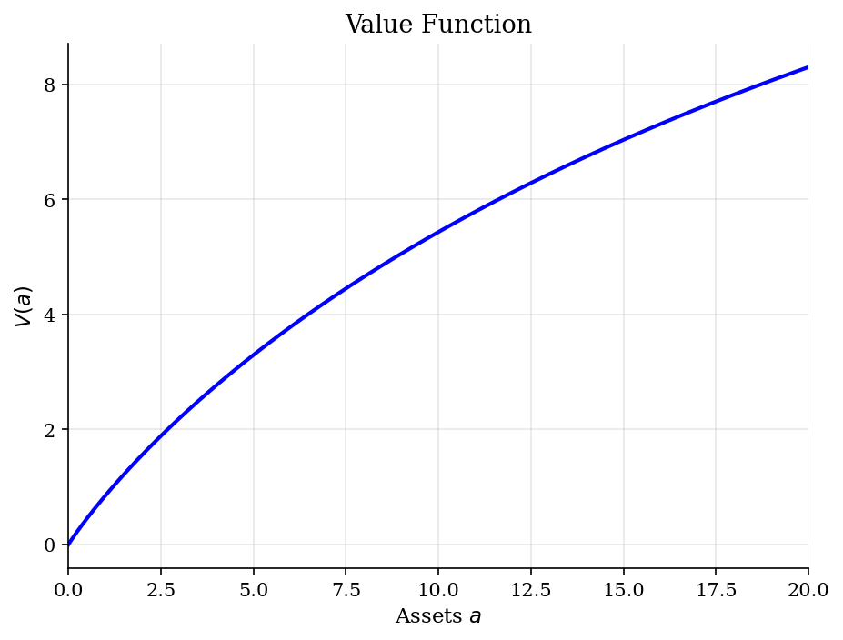
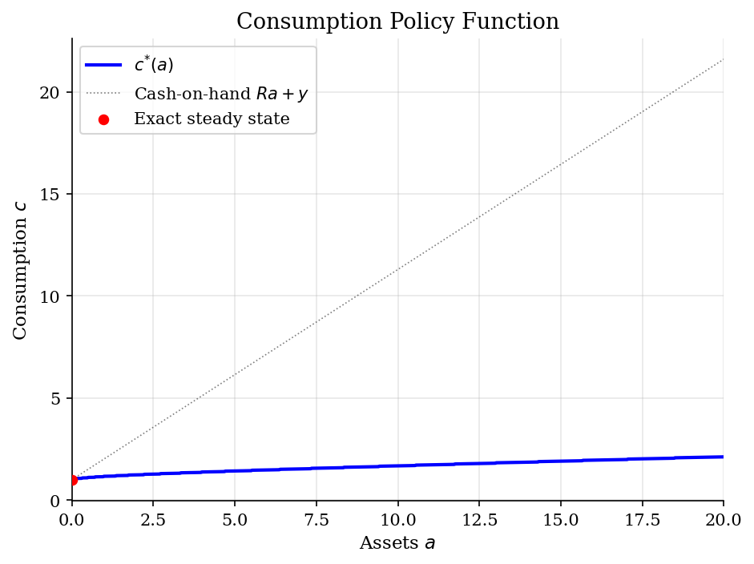
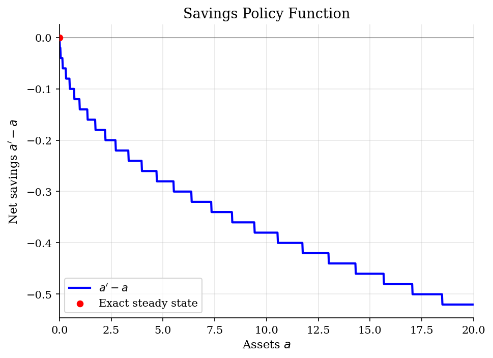
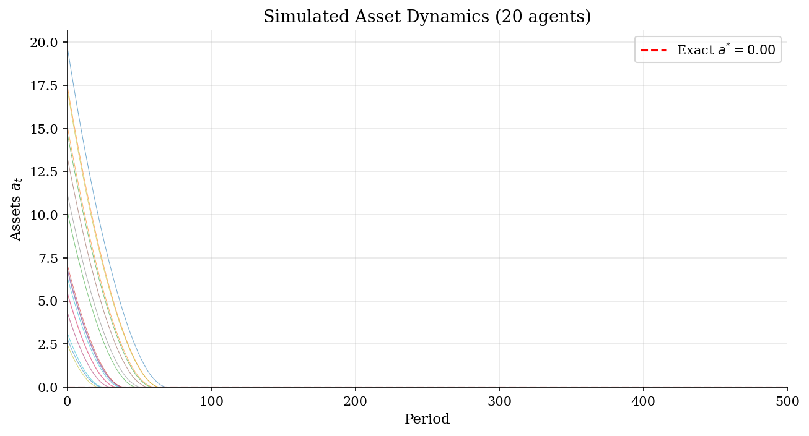

# Deterministic Saving with a Borrowing Constraint

> A no-risk household savings problem solved by value function iteration on an asset grid.

## Overview

This tutorial strips the household side of a heterogeneous-agent model down to one state, one asset, and no income risk. The household receives the same income $y$ every period, saves in a risk-free asset with gross return $R=1+r$, and cannot borrow below $\underline a=0$.

That benchmark is useful precisely because it does not produce a meaningful wealth distribution. With $\beta R<1$, patience is not strong enough to offset the return, so the household eventually runs any initial assets down to the borrowing limit. The next savings tutorials add income risk and faster Euler-equation methods; this one makes clear what is already present before those complications enter.

## Equations

For current assets $a \in [\underline a,\bar a]$, next-period assets $a'$ are chosen
from the same grid subject to positive consumption:

$$
V(a) =
\max_{a' \in [\underline a,\bar a]}
[u(c) + \beta V(a')],
\qquad
c = Ra + y - a' > 0.
$$

The utility function is CRRA,

$$
u(c)=
\begin{cases}
\dfrac{c^{1-\gamma}-1}{1-\gamma}, & \gamma \neq 1,\\[4pt]
\log c, & \gamma = 1.
\end{cases}
$$

Away from the borrowing limit, the Euler equation is

$$
u'(c_t) = \beta R u'(c_{t+1}).
$$

At $a'=\underline a$, the condition becomes an inequality. Since the calibration
has $\beta R<1$, there is no positive interior stationary asset level satisfying
the Euler equation; the exact stationary asset benchmark is $a^{*}=\underline a$.

## Model Setup

| Parameter | Value | Description |
|-----------|-------|-------------|
| $\gamma$  | 2 | CRRA risk aversion |
| $\beta$   | 0.95 | Discount factor |
| $r$       | 0.03 | Interest rate |
| $\beta R$ | 0.9785 | Patience-return product |
| $y$       | 1 | Deterministic income |
| $\underline{a}$ | 0 | Borrowing limit |
| Grid points | 1000 | Linear spacing on $[0, 20]$ |
| Simulated agents | 100 | Forward simulation |
| Simulation periods | 500 | Time horizon |

## Solution Method

The computation uses plain grid VFI. For each current asset grid point, it evaluates every feasible next-asset choice, rules out choices with $Ra+y-a'\le 0$, and keeps the maximizing value and policy. This is slow relative to endogenous-grid methods, but it makes the Bellman problem transparent.

```text
Input: asset grid A, primitives beta, R, y, gamma, tolerance epsilon
Initialize V_0(a) = u(ra + y) / (1 - beta) for each a in A
For n = 0, 1, 2, ...:
    For each current asset a in A:
        For each candidate next asset a' in A:
            If c = R a + y - a' > 0, compute u(c) + beta V_n(a')
            Otherwise mark the choice infeasible
        Set V_{n+1}(a) to the largest feasible value
        Store g(a), the next-asset choice attaining that value
    Stop when max_a |V_{n+1}(a) - V_n(a)| < epsilon
Output: value function V, savings policy g, consumption policy c(a)
```

After solving the Bellman equation, the policy is simulated from many initial asset positions. In this deterministic setting the simulation is not a Monte Carlo approximation to aggregate risk; it is a way to show the transition map implied by the policy.

The VFI loop converged in **70 iterations** with sup-norm error 0.00e+00. The numerical stationary asset is $a^{*}=0.0000$, matching the exact benchmark $\underline a=0.0000$ up to grid error (0.00e+00). Stationary consumption is $c^{*}=1.0000$.

## Results

The calibration is intentionally impatient: $\beta R=0.9785<1$. That one inequality is enough to organize the results. The value function is still smooth and concave on the grid, but the policy points toward asset decumulation rather than long-run wealth accumulation.

The value function rises with assets, but its curvature is the main object: wealth is most valuable close to the borrowing limit. The deterministic environment does not remove curvature from preferences; it removes the risk motive for holding a buffer stock.



The consumption policy is far below cash-on-hand for wealthy households: they do not consume all assets at once, but they do consume enough to reduce assets over time. At the borrowing limit, the household simply consumes current income.



The net-saving policy makes the no-risk benchmark stark. The only fixed point is the borrowing limit, so positive initial assets are gradually spent down. In the later income-risk tutorial, the same kind of policy plot bends upward because risk creates a reason to hold buffer wealth.



The simulated paths start from different asset positions but all converge to the same lower bound. The exercise is therefore a transition experiment, not a claim that deterministic savings can generate cross-sectional wealth inequality.



The table reports low-asset grid points explicitly because the action near the borrowing limit is easy to miss on a wide plot. Once assets are positive, the policy keeps $g(a)<a$ and moves the household back toward $a^{*}=0$.

**Selected Policy Values**

|   Assets a |   Consumption c(a) |   Next assets g(a) |   Net saving g(a)-a |    V(a) |
|-----------:|-------------------:|-------------------:|--------------------:|--------:|
|     0      |             1      |             0      |              0      | -0      |
|     0.02   |             1.0206 |             0      |             -0.02   |  0.0202 |
|     0.04   |             1.0212 |             0.02   |             -0.02   |  0.04   |
|     0.1001 |             1.043  |             0.0601 |             -0.04   |  0.0977 |
|     0.2002 |             1.0661 |             0.1401 |             -0.0601 |  0.1904 |
|     0.5005 |             1.1151 |             0.4004 |             -0.1001 |  0.4519 |
|     1.001  |             1.1702 |             0.8609 |             -0.1401 |  0.8515 |
|     2.002  |             1.2402 |             1.8218 |             -0.1802 |  1.5643 |
|     5.005  |             1.4304 |             4.7247 |             -0.2803 |  3.2975 |
|    10.01   |             1.6807 |             9.6296 |             -0.3804 |  5.4369 |
|    20      |             2.1205 |            19.4795 |             -0.5205 |  8.2999 |

## Takeaway

The deterministic model is the baseline to subtract from richer household problems. Here the borrowing constraint matters, but it does not create a wealth distribution: with $\beta R<1$, every positive asset position is temporary and the exact stationary asset level is $a^{*}=0$.

This is why the neighboring [IID income-risk VFI tutorial](../vfi-iid-income/) is not just the same code with an extra shock. Once income is risky, assets become self-insurance and the stationary distribution is an economic object. The later [endogenous-grid tutorial](../endogenous-grid-points/) keeps that economic problem but changes the solver.

## References

- Ljungqvist, L. and Sargent, T. (2018). *Recursive Macroeconomic Theory*. MIT Press, 4th edition, Ch. 16.
- Kaplan, G. (2017). *Heterogeneous Agent Models: Codes*. Lecture notes.
- Deaton, A. (1991). Saving and Liquidity Constraints. *Econometrica*, 59(5), 1221-1248.
