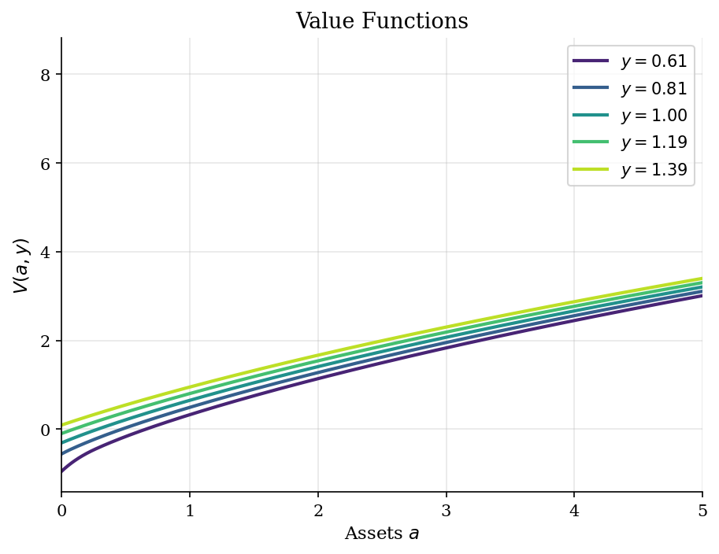
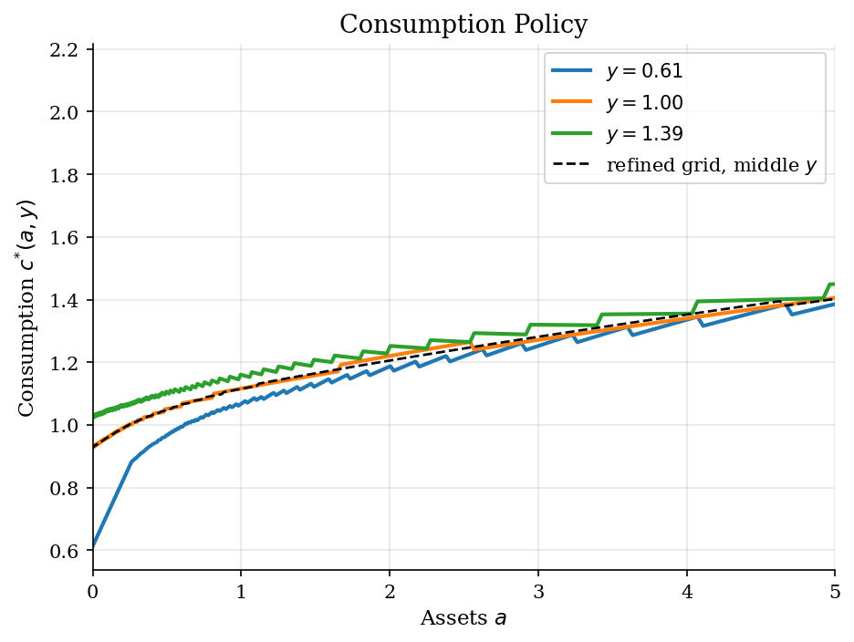
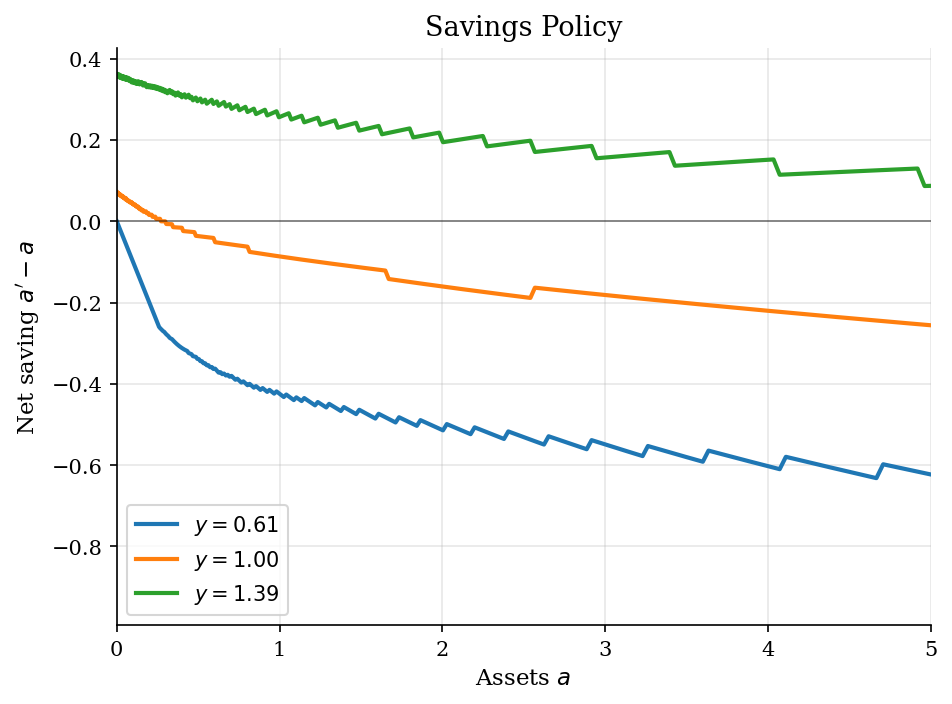
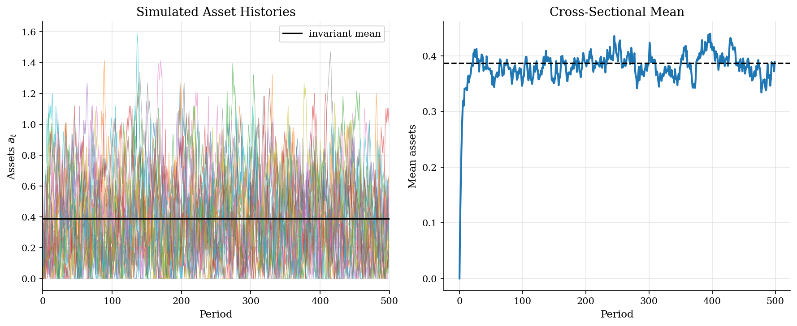

# IID Income Risk and Buffer-Stock Saving

> A partial-equilibrium household savings problem with uninsurable IID income shocks.

## Overview

The deterministic savings problem has no reason to hold a buffer stock when $\beta R<1$: assets are eventually spent down to the borrowing limit. This tutorial changes only one economic object. Labor income is now random, uninsurable, and independent over time.

That small change is enough to make assets useful. A household with low wealth is exposed to bad income draws because it cannot borrow below $\underline a=0$. Saving is therefore not about financing retirement or aggregate capital accumulation here; it is self-insurance against the next income draw. The IID assumption keeps the expectation simple, so the tutorial isolates the buffer-stock motive before the later [endogenous-grid method](../endogenous-grid-points/) changes the solver and the persistent-income tutorial in [Dynamic Programming](../../dynamic-programming/consumption-savings/) changes the shock process.

## Equations

At the beginning of a period the household has assets $a \in A$ and receives
income $y_j$ from a finite IID distribution with probabilities $\pi_j$. It
chooses next-period assets $a' \in A$:

$$
V(a,y_j) =
\max_{a' \in A}
\{u(Ra+y_j-a') + \beta \sum_{\ell=1}^{n_y} \pi_{\ell} V(a',y_{\ell})\}.
$$

The budget identity and borrowing constraint are

$$
c = Ra + y_j - a',
\qquad
c>0,
\qquad
a' \geq \underline a.
$$

Preferences are CRRA,

$$
u(c)=
\begin{cases}
\dfrac{c^{1-\gamma}-1}{1-\gamma}, & \gamma \neq 1,\\[4pt]
\log c, & \gamma = 1.
\end{cases}
$$

Current income affects cash on hand. Because income is IID, it does not affect
beliefs about next period's income: the same probability vector $\pi$ is used
from every current income state.

## Model Setup

| Parameter | Value | Role |
|---|---:|---|
| $\gamma$ | 2.0 | CRRA risk aversion |
| $\beta$ | 0.95 | Discount factor |
| $r$ | 0.03 | Net risk-free return |
| $\beta R$ | 0.9785 | Patience-return product |
| $\mu_y$ | 1.0 | Mean income |
| $\sigma_y$ | 0.2 | Income standard deviation |
| $n_y$ | 5 | IID income states |
| $\underline a$ | 0.0 | Borrowing limit |
| $\bar a$ | 20.0 | Upper asset-grid bound |
| Asset grid | 550 points | Exponential spacing near the constraint |
| Refined grid | 1300 points | Policy-function accuracy check |

## Solution Method

The code uses direct grid VFI. For each state $(a,y_j)$ it evaluates the lifetime value of every feasible next-asset choice. The only shortcut is an economic one: IID income means the continuation value depends on $a'$ but not on current income once the expectation over $y'$ has been taken.

```text
Input: asset grid A, income states y_j with probabilities pi_j, primitives beta, R, gamma
Initialize V_0(a,y_j), for example from consuming interest income plus current y_j
For n = 0, 1, 2, ...:
    Compute EV_n(a') = sum_j pi_j V_n(a', y_j) for each candidate a'
    For each current asset a in A and current income y_j:
        For each candidate next asset a' in A:
            Set c = R a + y_j - a'
            If c <= 0, mark the choice infeasible
            Otherwise compute u(c) + beta EV_n(a')
        Store the maximizing next asset g(a,y_j) and value V_{n+1}(a,y_j)
    Stop when max_{a,j} |V_{n+1}(a,y_j) - V_n(a,y_j)| < epsilon
Output: value function V, savings policy g, consumption policy c(a,y_j)
```

After solving the policy, the stationary distribution is computed from the finite-state transition matrix implied by $g(a,y_j)$ and the IID income probabilities. The simulated paths are only used to visualize household-level asset histories.

The main grid converged in **204 iterations** with sup-norm error 9.77e-07. A refined 1300-point grid gives a median-income consumption policy within 1.737e-02 over $a\leq 5$; the corresponding next-asset gap is 1.737e-02.

## Results

The value functions are ordered by current income because high income raises current resources. The more interesting feature is that the gaps shrink with wealth: once assets are high, the current income draw is a smaller part of lifetime resources.



The consumption policy shows the buffer-stock mechanism directly. Low-wealth households consume a large share of cash on hand but do not behave as in the deterministic benchmark: even around the borrowing limit, a middle-income household saves a little because tomorrow's income may be bad. The dashed line is the refined-grid reference for the middle income state and nearly overlays the main-grid policy on the plotted range.



Net saving makes the insurance role of assets clearer than consumption alone. After a low income draw, the household runs down wealth. After a high draw, it rebuilds the buffer. The zero line is not a common steady state for all income states; with IID shocks the policy is state contingent even though the shock has no persistence.



The path simulation starts all households at the borrowing limit. Individual histories move with income draws, while the cross-sectional mean settles near the invariant mean computed from the policy. The point is not aggregate risk; it is the stationary cross section produced by idiosyncratic self-insurance.



The selected grid points emphasize the economically active region near the borrowing constraint. At $a=0$, the low-income household is constrained, but the middle- and high-income households still choose positive next-period assets because the next draw may be worse.

**Selected Policy Values**

|   Assets a |   c^{*}(a, low y) |   c^{*}(a, middle y) |   c^{*}(a, high y) |   g(a, low y) |   g(a, middle y) |   g(a, high y) |
|-----------:|------------------:|---------------------:|-------------------:|--------------:|-----------------:|---------------:|
|      0     |            0.6133 |               0.9284 |             1.0258 |        0      |           0.0716 |         0.3609 |
|      0.1   |            0.7167 |               0.9594 |             1.0487 |        0      |           0.144  |         0.4414 |
|      0.248 |            0.8683 |               1.0015 |             1.0686 |        0      |           0.2535 |         0.5731 |
|      0.504 |            0.9675 |               1.0518 |             1.1032 |        0.1653 |           0.4677 |         0.8031 |
|      0.996 |            1.0663 |               1.1161 |             1.1607 |        0.5731 |           0.9101 |         1.2522 |
|      2.004 |            1.1877 |               1.2207 |             1.2523 |        1.4899 |           1.8436 |         2.1988 |
|      5.007 |            1.3868 |               1.4062 |             1.4496 |        4.3833 |           4.7506 |         5.0939 |

The distribution is right-skewed, but it is not the persistent-income wealth distribution from an Aiyagari model. With IID risk the buffer is modest: many households remain close to the constraint, and high assets are rare. The statistics below use the exact invariant distribution of the discrete policy, not terminal-period Monte Carlo noise.

**Invariant Asset Distribution**

| Statistic                        | Value   |
|:---------------------------------|:--------|
| Mean assets / mean income        | 0.388   |
| Fraction at borrowing constraint | 5.7%    |
| 10th percentile                  | 0.068   |
| 50th percentile                  | 0.349   |
| 90th percentile                  | 0.754   |
| 99th percentile                  | 1.150   |
| Distribution iteration error     | 9.7e-14 |

## Takeaway

IID income risk is the cleanest way to see the buffer-stock motive. The deterministic model says an impatient household should move back to the asset floor. Adding uninsurable income shocks overturns that conclusion: assets now pay an insurance return by protecting consumption after bad draws.

The IID assumption also matters. Current income changes cash on hand and hence today's policy, but it does not change tomorrow's income distribution. Persistent income risk makes the state richer and the distribution more dispersed; the economic object here is the simpler benchmark that separates risk from persistence.

## References

- Deaton, A. (1991). Saving and Liquidity Constraints. *Econometrica*, 59(5), 1221-1248.
- Carroll, C. (1997). Buffer-Stock Saving and the Life Cycle/Permanent Income Hypothesis. *Quarterly Journal of Economics*, 112(1), 1-55.
- Aiyagari, S. R. (1994). Uninsured Idiosyncratic Risk and Aggregate Saving. *Quarterly Journal of Economics*, 109(3), 659-684.
- Kaplan, G. (2017). *Heterogeneous Agent Models: Codes*. Lecture notes.
