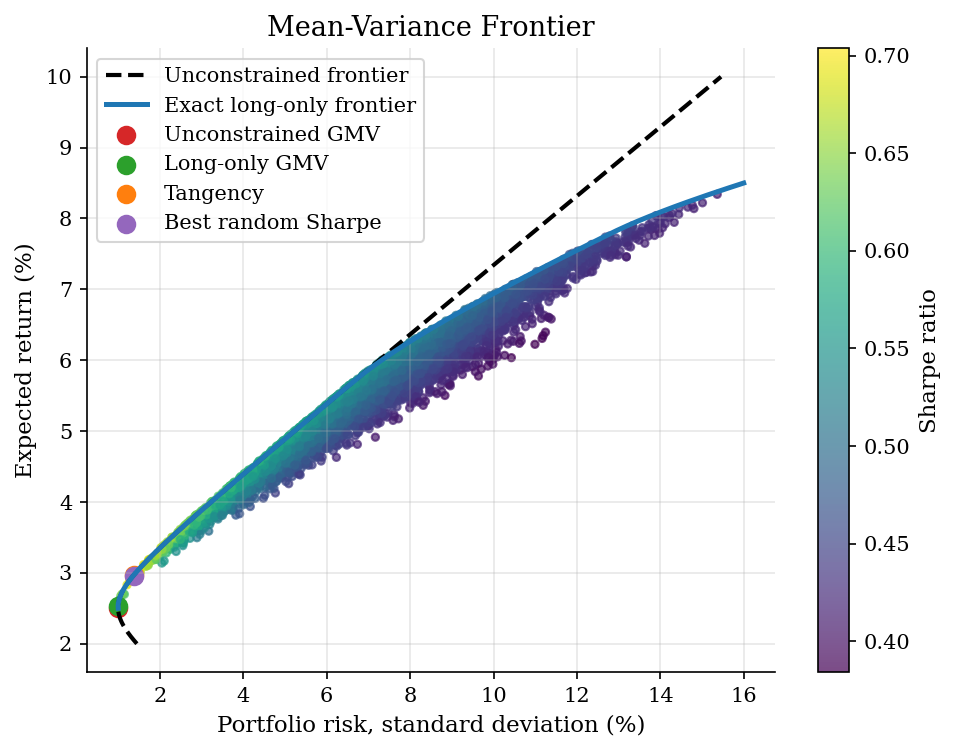
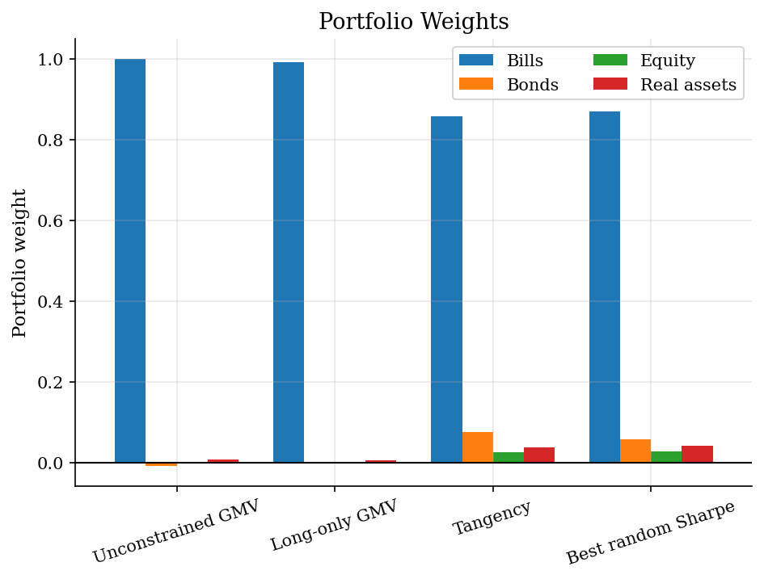

# Mean-Variance Portfolio Frontier

> How covariance and short-sale constraints shape the portfolio frontier.

## Overview

The Markowitz problem is a compact way to ask what diversification actually buys. A portfolio's mean return is linear in the weights, but its risk is not: covariance decides whether combining assets smooths payoffs or simply repackages the same aggregate risk.

The example uses four stylized annual asset classes. Random long-only portfolios make the feasible set visible, but they are only a simulation. The tutorial also computes the exact long-only frontier and the unconstrained analytic frontier, so the reader can see which features are economic restrictions and which are sampling noise from drawing many portfolios. The usual empirical warning still applies: a frontier is only as credible as the expected returns and covariance matrix fed into it.

## Equations

Let $i=1,\ldots,N$ index risky assets. A portfolio is a vector of weights
$w=(w_1,\ldots,w_N)^\top$ with budget constraint $\mathbf{1}^\top w=1$. Let
$\mu$ collect expected risky-asset returns and let $\Sigma$ be the positive
definite covariance matrix of returns. The portfolio mean and variance are

$$
\mu_p(w)=w^\top \mu,
\qquad
\sigma_p^2(w)=w^\top \Sigma w.
$$

For a target mean return $m$, the unconstrained Markowitz frontier solves

$$
\min_w w^\top \Sigma w
\quad \text{subject to} \quad
w^\top \mu=m,\quad \mathbf{1}^\top w=1.
$$

With

$$
A=\mathbf{1}^\top\Sigma^{-1}\mathbf{1},\quad
B=\mathbf{1}^\top\Sigma^{-1}\mu,\quad
C=\mu^\top\Sigma^{-1}\mu,\quad
D=AC-B^2,
$$

the minimum variance at target $m$ is

$$
\sigma^2(m)=\frac{A m^2-2 B m+C}{D}.
$$

Adding no-short-sale constraints gives the long-only problem:

$$
\min_w w^\top\Sigma w
\quad\text{subject to}\quad
w^\top\mu=m,\quad \mathbf{1}^\top w=1,\quad w_i\geq 0.
$$

The tangency portfolio for risk-free rate $r_f$ maximizes the Sharpe ratio,

$$
\max_w \frac{w^\top\mu-r_f}{\sqrt{w^\top\Sigma w}},
$$

and, without short-sale constraints, has weights proportional to
$\Sigma^{-1}(\mu-r_f\mathbf{1})$ and normalized to sum to one.

## Model Setup

| Object | Value | Role |
|--------|-------|------|
| Bills | mean 2.5%, volatility 1.0% | risky asset class |
| Bonds | mean 4.5%, volatility 6.0% | risky asset class |
| Equity | mean 8.5%, volatility 16.0% | risky asset class |
| Real assets | mean 6.5%, volatility 12.0% | risky asset class |
| Risk-free rate $r_f$ | 2.0% | Sharpe-ratio benchmark |
| Correlations | fixed $4\times4$ matrix | determines diversification value |
| Random portfolios | 5,000 Dirichlet draws | visual approximation to the long-only set |
| Exact long-only frontier | active-set enumeration | benchmark for the random cloud |

## Solution Method

The numerical work separates three objects that are often conflated. Random Dirichlet weights give a picture of the long-only feasible set. The unconstrained frontier comes from the Lagrange-multiplier formula above. The exact long-only frontier is computed by enumerating active asset sets; for each candidate set, the same two-constraint Markowitz problem is solved on that face of the simplex and discarded if any weight is negative.

```text
Algorithm: Markowitz frontier with a long-only benchmark
Input: expected returns mu, covariance matrix Sigma, risk-free rate r_f, target grid M
Output: random portfolios, unconstrained frontier, exact long-only frontier, selected weights
Draw many long-only portfolios w from a symmetric Dirichlet distribution
For each draw, compute mu_p(w), sigma_p(w), and the Sharpe ratio
For each target return m in M:
    compute the unconstrained frontier variance from A, B, C, and D
    initialize the long-only variance at infinity
    for each nonempty active asset set S:
        solve the Markowitz problem using only assets in S
        if all restricted weights are nonnegative:
            keep the candidate if it has the lowest variance so far
Compute the global minimum-variance and tangency portfolios
Compare the best random long-only Sharpe portfolio with the exact frontier
```

Because there are only four assets, active-set enumeration is cleaner than adding a quadratic-programming dependency. It also makes the economic constraint explicit. The long-only frontier is the lower envelope of feasible faces of the portfolio simplex.

## Results

The random cloud is a Monte Carlo picture of the long-only simplex. Its lower-left edge is close to, but not identical to, the exact long-only frontier. The dashed unconstrained frontier extends beyond that curve because it can use short positions or leverage. That distinction is substantive; allowing negative weights changes the choice set, not just the algorithm.



The weight plot shows why the frontier comparison matters. The unconstrained global minimum-variance portfolio uses a small short position, while the long-only version moves to the nearest feasible allocation. In this calibration the tangency portfolio is already long-only, so the best random Sharpe draw lands close to the analytic tangency weights.



The table reports annualized moments. The tiny difference between the analytic tangency portfolio and the best random long-only portfolio is simulation error, not a different economic optimum.

**Selected portfolio summaries**

| Portfolio                           | Return   | Risk   |   Sharpe | Bills   | Bonds   | Equity   | Real assets   |
|:------------------------------------|:---------|:-------|---------:|:--------|:--------|:---------|:--------------|
| Unconstrained global min variance   | 2.51%    | 1.00%  |     0.51 | 100.1%  | -0.7%   | -0.1%    | 0.8%          |
| Exact long-only global min variance | 2.53%    | 1.00%  |     0.53 | 99.3%   | 0.0%    | 0.0%     | 0.7%          |
| Tangency portfolio                  | 2.97%    | 1.37%  |     0.71 | 85.8%   | 7.7%    | 2.6%     | 3.9%          |
| Best random long-only Sharpe        | 2.96%    | 1.37%  |     0.7  | 87.0%   | 5.9%    | 2.9%     | 4.2%          |

## Takeaway

The mean-variance frontier makes covariance and constraints visible in the same object. It is also fragile. Small changes in expected returns or covariances can move the tangency portfolio sharply, so the computation should be read as a disciplined mapping from inputs to portfolio tradeoffs, not as a standalone investment rule.

## References

- [Markowitz, H. (1952). Portfolio Selection. Journal of Finance, 7(1), 77-91.](https://doi.org/10.2307/2975974)
