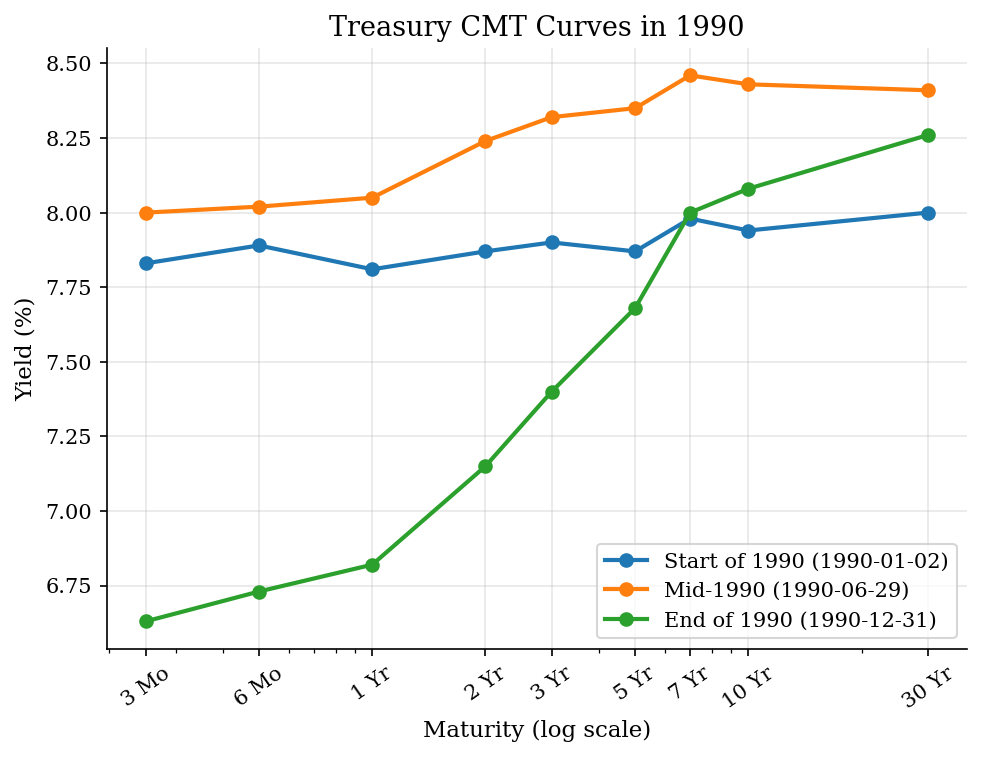
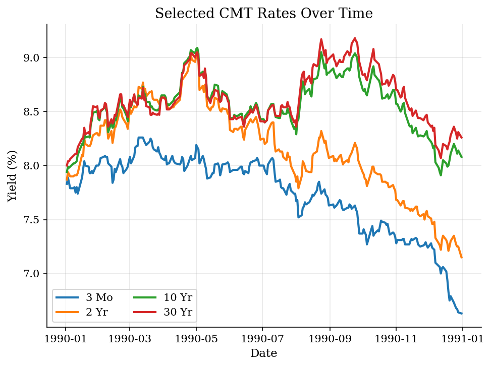
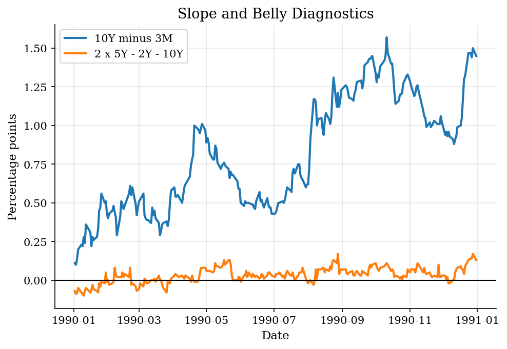

# Treasury Yield Curves and Term-Structure Shape

> CMT curve snapshots, level-slope-curvature summaries, and static interpretation.

## Overview

The term structure is a price system viewed across maturities. On one date, short, intermediate, and long Treasury rates summarize how markets price dollars delivered at different horizons. The first economic question is therefore not which plot to draw, but what part of the curve is moving: the common level, the long-minus-short slope, or the middle-maturity belly.

This tutorial uses an offline 1990 panel of Treasury constant-maturity rates. The observations are CMT par-yield-curve rates constructed from market quotes and Treasury interpolation. They are not zero-coupon spot rates, and they are not raw transaction yields on one traded bond. The previous [bond-pricing tutorial](../bond-yield-to-maturity/) works with a single promised cash-flow claim. The later [Fama-Bliss-style regression](../fama-bliss-forward-regression/) uses term-structure spreads for predictability.

## Equations

Let $t=1,\ldots,T$ index dates and let $\tau_j$ denote a maturity in years, with

$$
\tau_j \in \{0.25,0.5,1,2,3,5,7,10,30\}.
$$

The daily CMT curve is the vector

$$
\boldsymbol{y}_t =
(y_t(\tau_1),\ldots,y_t(\tau_J)),
$$

where $y_t(\tau_j)$ is the annualized par yield in percent at maturity $\tau_j$.
The tutorial reduces this cross-section to a few transparent diagnostics:

$$
L_t = y_t(10),
$$

$$
S_t = y_t(10)-y_t(0.25),
$$

and

$$
B_t = 2y_t(5)-y_t(2)-y_t(10).
$$

Here $L_t$ is a level proxy, $S_t$ is the ten-year minus three-month slope, and
$B_t$ is a simple belly measure: positive values put the five-year rate above
the average of the two-year and ten-year rates. These are descriptive
statistics in percentage points. They do not identify expected future short
rates, term premia, or arbitrage-free discount factors without additional
structure.

## Model Setup

| Object | Value |
|--------|-------|
| Data | Static 1990 Treasury CMT panel |
| Date range | 1990-01-02 to 1990-12-31 |
| Observations | 250 daily rows |
| Maturities | 3 Mo, 6 Mo, 1 Yr, 2 Yr, 3 Yr, 5 Yr, 7 Yr, 10 Yr, 30 Yr |
| Unit | Annual percentage yield |
| Measurement | Constant-maturity par-yield rates, not zero-coupon spot rates |

## Solution Method

The computation is deliberately descriptive. Each row is a cross-section of maturity-specific rates, and the code asks how much of the movement is level, slope, or curvature. A denser maturity grid would mostly interpolate the published CMT nodes; it would not produce a ground-truth zero-coupon curve unless a separate term-structure model were added.

```text
Algorithm: CMT curve-shape summaries
Input: daily table of dates t and CMT yields y_t(tau_j)
Output: selected yield curves, time-series plots, and summary moments
Sort the table by date
For each date t:
    form the maturity vector y_t = (y_t(tau_1), ..., y_t(tau_J))
    compute L_t = y_t(10)
    compute S_t = y_t(10) - y_t(0.25)
    compute B_t = 2 y_t(5) - y_t(2) - y_t(10)
Select start, middle, and end-of-sample rows for cross-sectional plots
Plot selected maturity rates over calendar time
Report means, minima, maxima, and standard deviations for L_t, S_t, and B_t
```

This is the right level of machinery for a snapshot tutorial. Forecasting, expectations-hypothesis tests, and term-premium decompositions require stronger objects than the static CMT panel used here.

## Results

The three selected dates make the cross-sectional object concrete. The curve was nearly flat at the start of the sample, with a ten-year minus three-month slope of 0.11 percentage points. It was still only 0.43 points in late June. By year end the slope had widened to 1.45 points. That steepening came mainly from the front end: the three-month rate fell by 1.20 points over the year, while the ten-year rate changed by 0.14 points.



The time-series view separates calendar movement from curve shape. A maturity series can fall over the year even when the cross-section remains upward sloping on most dates. Statements about a yield curve are always indexed by both date and maturity.



The diagnostic series compress each daily curve into economically interpretable numbers. The slope carries most of the visible late-year movement. The belly measure is smaller, so in this sample the main fact is not a hump in middle maturities; it is the widening gap between short and long yields.



The selected rows keep the raw CMT rates visible. They serve as an audit trail for the plotted curves and for the slope numbers quoted above.

**Selected curve snapshots**

| Snapshot      | Date       |   3 Mo |   6 Mo |   1 Yr |   2 Yr |   3 Yr |   5 Yr |   7 Yr |   10 Yr |   30 Yr |
|:--------------|:-----------|-------:|-------:|-------:|-------:|-------:|-------:|-------:|--------:|--------:|
| Start of 1990 | 1990-01-02 |   7.83 |   7.89 |   7.81 |   7.87 |   7.9  |   7.87 |   7.98 |    7.94 |    8    |
| Mid-1990      | 1990-06-29 |   8    |   8.02 |   8.05 |   8.24 |   8.32 |   8.35 |   8.46 |    8.43 |    8.41 |
| End of 1990   | 1990-12-31 |   6.63 |   6.73 |   6.82 |   7.15 |   7.4  |   7.68 |   8    |    8.08 |    8.26 |

The summary statistics are descriptive moments of the 1990 panel. They should be read as facts about this static sample, not as estimates of a structural term-premium model.

**Curve-shape summary statistics**

| Metric                |   Mean |   Min |   Max |   Std. dev. |
|:----------------------|-------:|------:|------:|------------:|
| Level 10Y             |   8.55 |  7.91 |  9.09 |        0.27 |
| Slope 10Y-3M          |   0.81 |  0.1  |  1.57 |        0.37 |
| Curvature 2x5Y-2Y-10Y |   0.03 | -0.1  |  0.17 |        0.05 |
| Long-end 30Y-10Y      |   0.06 | -0.08 |  0.19 |        0.08 |

## Takeaway

A Treasury CMT curve is a maturity cross-section, not a single interest rate. Level, slope, and curvature discipline what we mean by curve movements before imposing a richer model. The limitation matters: static CMT summaries describe the term structure, but expectations, risk premia, and arbitrage-free discount factors require additional assumptions and usually different data objects.

## References

- [U.S. Treasury. Treasury Yield Curve Methodology.](https://home.treasury.gov/policy-issues/financing-the-government/interest-rate-statistics/treasury-yield-curve-methodology)
- [U.S. Treasury. Daily Treasury Rates.](https://home.treasury.gov/resource-center/data-chart-center/interest-rates/TextView?type=daily_treasury_yield_curve)
