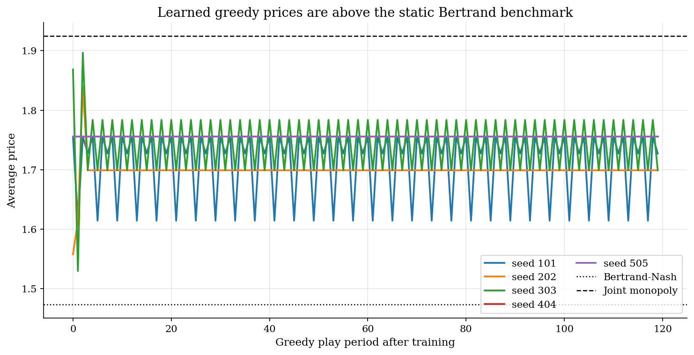
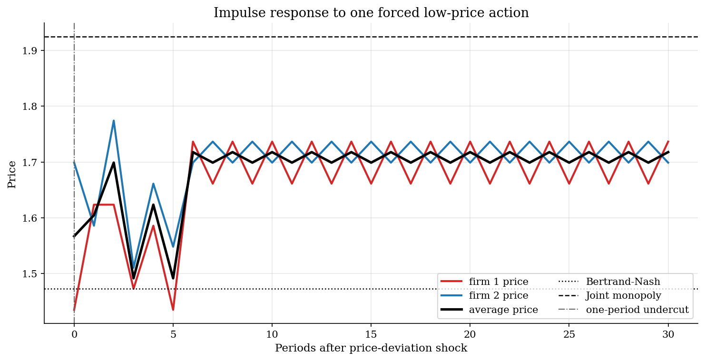
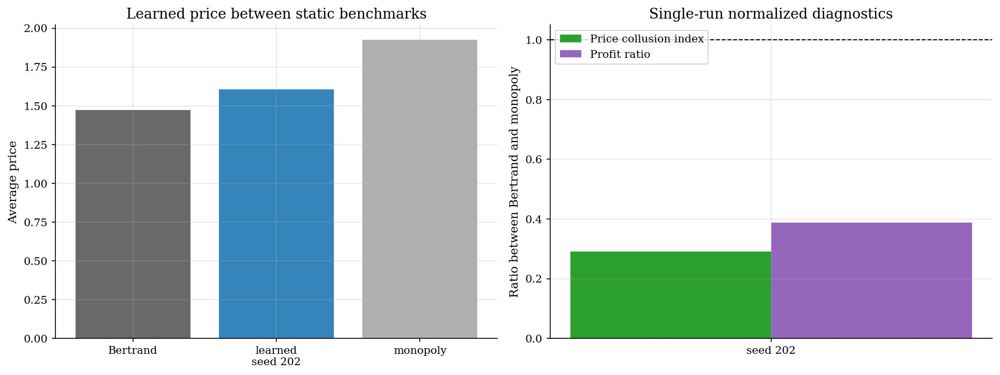

# Algorithmic Collusion by Q-Learning

## Overview

Algorithmic pricing turns a repeated oligopoly problem into a learning problem. Two firms choose prices again and again. They do not solve the dynamic game. They only observe the profit from the price they chose and update a table of action values.

The economic question is whether this feedback can move prices above the static Bertrand-Nash benchmark. In a one-shot differentiated-products Bertrand game, each firm sets a price that is a best response to the rival's price. Joint monopoly gives the upper benchmark because one owner would internalize substitution between the two products.

This tutorial is deliberately smaller than the Calvano, Calzolari, Denicolo, and Pastorello experiment and the Courthoud replication code. It keeps the same model class and moves the main hyperparameters toward the Courthoud replication defaults: logit demand, a finite price grid, Courthoud's exponential exploration rule, and independent tabular Q-learning. The page follows one compact calibrated run with seed 202. It is not a robustness exercise.

## Equations

There are two firms, indexed by $i = 1,2$. Firm $i$ chooses price $p_i$ and has
constant marginal cost $c$. Product quality is $a$, the outside-option value is
$a_0$, and $\mu$ controls product differentiation. The inside utility index is

$$u_i = \frac{\{a - p_i\}}{\{\mu\}}, \qquad u_0 = \frac{\{a_0\}}{\{\mu\}}.$$

The braces mark the numerator and denominator of each utility index. A lower
price raises $u_i$; a larger $\mu$ makes a given price difference matter less.
Logit demand is

$$s_i(p) = \frac{\exp(u_i)}{\exp(u_0) + \sum_{j=1}^2 \exp(u_j)}.$$

The numerator is product $i$'s exponentiated utility. The denominator is the
outside-good term plus the exponentiated utilities of the two inside goods.

Current profit is

$$\pi_i(p) = (p_i - c)s_i(p).$$

The own-price derivative of the logit share is

$$\frac{\partial s_i}{\partial p_i} = -\frac{s_i(p)(1-s_i(p))}{\mu}.$$

The static Bertrand-Nash price sets $\partial \pi_i / \partial p_i = 0$:

$$\frac{\partial \pi_i}{\partial p_i} = s_i(p) + (p_i-c)\frac{\partial s_i}{\partial p_i} = s_i(p)[1 - \frac{(p_i-c)(1-s_i(p))}{\mu}] = 0.$$

Since $s_i(p)>0$, the Bertrand first-order condition is

$$1 - \frac{(p_i - c)(1 - s_i(p))}{\mu} = 0.$$

The joint monopolist maximizes $\Pi(p)=\pi_1(p)+\pi_2(p)$. Its condition for
product $i$ keeps the Bertrand own-profit term and adds the cross-product term:

$$1 - \frac{(p_i - c)(1 - s_i(p))}{\mu} + \frac{(p_j - c)s_j(p)}{\mu} = 0,\quad j \ne i.$$

The price grid uses the static benchmarks. Let $p_B$ be the Bertrand price,
$p_M$ be the monopoly price, and $\Delta$ be the grid step. The action set is

$$\mathcal{P} = \{p_B-\Delta\} \cup \{p_B, p_B+\Delta,\dots,p_M\} \cup \{p_M+\Delta\}.$$

The Q-learning state is the previous-period price-index pair
$s_t = (a_{1,t-1}, a_{2,t-1})$ (here $s_t$ is the Q-learning state pair, distinct from the demand share $s_i(p)$ defined above). Firm $i$'s action is its current price-grid
index $a_{i,t}$ (where $a_{i,t}$ is a price-grid index, not the product quality parameter $a$ defined above). After observing current profit and next state $s_{t+1}$,
the tabular update is

$$Q_i(s_t, a_{i,t}) \leftarrow (1-\alpha) Q_i(s_t, a_{i,t}) + \alpha [\pi_i(p_t) + \delta \max_a Q_i(s_{t+1}, a)].$$

The reported collusion index is

$$\mathrm{CI} = \frac{\bar p_{\mathrm{learned}} - p_{\mathrm{Bertrand}}}{p_{\mathrm{Monopoly}} - p_{\mathrm{Bertrand}}}.$$

## Model Setup

The grid is centered on the static economic benchmarks. First solve the Bertrand-Nash and joint-monopoly first-order conditions. Then form 13 evenly spaced prices spanning from the Bertrand to the monopoly benchmark with both endpoints included, and add one padding point below and above. The padding point below Bertrand is the one-period undercut in the impulse-response diagnostic.

| Object | Value | Role |
|---|---:|---|
| Firms $n$ | 2 | Symmetric sellers |
| Product value $a$ | 2.00 | Inside-good quality |
| Outside value $a_0$ | 0.00 | Outside option utility |
| Differentiation $\mu$ | 0.25 | Smaller values make products closer substitutes |
| Marginal cost $c$ | 1.00 | Constant production cost |
| Bertrand price | 1.473 | Static competitive benchmark |
| Monopoly price | 1.925 | Joint-profit benchmark |
| Price grid size | 15 | Discrete action count per firm |
| Training seed | 202 | Fixed calibrated run |
| Training steps | 250,000 | Q-learning updates |
| Discount factor $\delta$ | 0.95 | Value of future profit |
| Learning rate $\alpha$ | 0.15 | Q-table update weight |
| Exploration decay $\beta$ | 4e-06 | $\Pr(\text{explore at }t)=\exp(-\beta t)$ |

These are replication-style hyperparameters, but the computational budget is intentionally compact. The page reports one fixed run rather than a multi-seed robustness table.

## Solution Method

The algorithm is independent Q-learning. Each firm treats the rival and the market state as part of the environment. There is no explicit collusion constraint and no direct communication.

```text
Algorithm: independent Q-learning in a repeated pricing game
Input: price grid A={0,...,k-1}, profit table pi_i(a_1,a_2),
       alpha, beta, delta, training length T
Output: greedy pricing rules for both firms

1. Set the initial state to the lowest price-grid point for both firms.
2. Initialize Q_i(previous prices, own price) with optimistic
   discounted average one-period profits.
3. For t = 0 to T-1:
   3a. Set epsilon_t = exp(-beta t).
   3b. Each firm observes the previous price-index pair s_t.
   3c. For each firm i:
       with probability epsilon_t, draw a_{i,t} = Uniform({0,...,k-1});
       otherwise set a_{i,t} to the first argmax_a Q_i(s_t,a).
   3d. Current prices are the grid values indexed by (a_{1,t}, a_{2,t}).
   3e. Current profits are pi_i(a_{1,t},a_{2,t}).
   3f. Set s_{t+1} = (a_{1,t}, a_{2,t}).
   3g. For each firm i, update
       Q_i(s_t,a_{i,t}) <- (1-alpha) Q_i(s_t,a_{i,t})
       + alpha [ pi_i(a_{1,t},a_{2,t})
       + delta max_a Q_i(s_{t+1},a) ].
4. Freeze Q and roll out greedy play to measure learned prices.
5. For the impulse response, start from the learned greedy state,
   set a_{1,0} to the low-grid action once, let firm 2 choose greedily,
   then roll out greedy actions from s_1 = (a_{1,0}, a_{2,0}).
```

The impulse response is intentionally mechanical. It asks what the frozen policy does after a single undercut. The figure is a diagnostic for this one learned policy, not proof of robust punishment.

## Results

Greedy play after training is above the Bertrand price in the fixed seed 202 run. The learned path does not reach the monopoly benchmark. It sits in the middle of the benchmark interval, which is enough for the teaching point: independent profit feedback can support supra-Bertrand prices in a repeated pricing environment.



In the fixed seed 202 run, the learned average price is 1.708. The collusion index is 0.52, so the greedy policy sits about halfway between the Bertrand and monopoly benchmarks. After the one-period price-deviation shock, the lowest post-shock average price is 1.492; the path returns to 95 percent of its pre-shock level after 2 periods. Read this as an impulse response to a price-deviation shock. The single run shows how the frozen policy reacts after one forced undercut, but it does not establish robust price-war discipline.



The diagnostics put the price and profit results on the same scale. Zero is the Bertrand benchmark and one is the joint-monopoly benchmark. The price index is positive in this run, while the profit ratio is a little higher because moderate price increases raise margins in this small logit market.



The Bertrand and monopoly prices are solved from the continuous-price first-order conditions before the finite action grid is built.

**Static benchmark summary**

|   Bertrand price |   Monopoly price |   Competitive profit |   Monopoly profit |   Grid size |   Training steps |
|-----------------:|-----------------:|---------------------:|------------------:|------------:|-----------------:|
|          1.47293 |          1.92498 |             0.222927 |           0.33749 |          15 |           250000 |

A recovery horizon of -1 means the average price did not return to 95 percent of the pre-shock price within the plotted impulse-response window.

**Single-run Q-learning outcomes**

|   Seed |   Learned average price |   Learned profit |   Collusion index |   Pre-shock average price |   Minimum post-shock average price |   Recovery horizon |
|-------:|------------------------:|-----------------:|------------------:|--------------------------:|-----------------------------------:|-------------------:|
|    202 |                 1.70837 |         0.305172 |          0.520833 |                   1.70837 |                            1.49176 |                  2 |

## Takeaway

The small experiment delivers the main teaching result: Q-learning pricing agents can learn prices above the static Bertrand benchmark without solving the repeated game. The impulse response is more qualified. It shows the reaction of one frozen learned policy to one forced undercut. That distinction matters: supra-Bertrand learning appears clearly here; robust collusive discipline would require a larger and more careful replication.

## References

- [Calvano, E., Calzolari, G., Denicolo, V., and Pastorello, S. (2020). Artificial Intelligence, Algorithmic Pricing, and Collusion. *American Economic Review*, 110(10), 3267-3297.](https://www.aeaweb.org/articles?id=10.1257/aer.20190623)
- [Matteo Courthoud. Algorithmic Collusion Replication. GitHub repository.](https://github.com/matteocourthoud/Algorithmic-Collusion-Replication)
