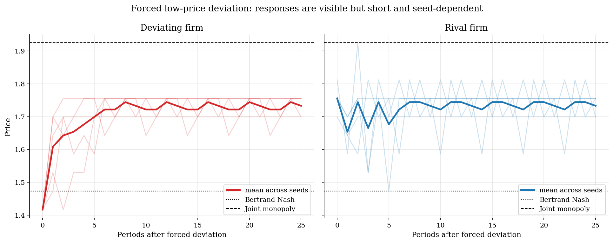

# Algorithmic Collusion by Q-Learning

## Overview

Algorithmic pricing turns a repeated oligopoly problem into a learning problem. Two firms choose prices again and again. They do not solve the dynamic game. They only observe the profit from the price they chose and update a table of action values.

The economic question is whether this feedback can move prices above the static Bertrand-Nash benchmark. In a one-shot differentiated-products Bertrand game, each firm sets a price that is a best response to the rival's price. Joint monopoly gives the upper benchmark because one owner would internalize substitution between the two products.

This tutorial is deliberately smaller than the Calvano, Calzolari, Denicolo, and Pastorello experiment and the Courthoud replication code. It keeps the same model class: logit demand, a finite price grid, and independent tabular Q-learning. With a short run and five seeds, the clearest result is supra-Bertrand pricing. The deviation experiment is more mixed, so the text treats price-war discipline as weak and seed-dependent rather than as a guaranteed finding.

## Equations

There are two firms, indexed by $i = 1,2$. Firm $i$ chooses price $p_i$ and has
constant marginal cost $c$. Product quality is $a$, the outside-option value is
$a_0$, and $\mu$ controls product differentiation. Logit demand is

$$s_i(p) = \frac{\exp((a - p_i) / \mu)}{\exp(a_0 / \mu) + \sum_{j=1}^2 \exp((a - p_j) / \mu)}.$$

Current profit is

$$\pi_i(p) = (p_i - c)s_i(p).$$

The static Bertrand-Nash price solves each firm's first-order condition,

$$1 - \frac{(p_i - c)(1 - s_i(p))}{\mu} = 0.$$

The joint-monopoly price solves the two-product owner's first-order condition,

$$1 - \frac{(p_i - c)(1 - s_i(p))}{\mu} + \frac{(p_j - c)s_j(p)}{\mu} = 0,\quad j \ne i.$$

The Q-learning state is the previous-period price-index pair
$s_t = (a_{1,t-1}, a_{2,t-1})$. Firm $i$'s action is its current price-grid
index $a_{i,t}$. After observing current profit and next state $s_{t+1}$,
the tabular update is

$$Q_i(s_t, a_{i,t}) \leftarrow (1-\eta) Q_i(s_t, a_{i,t}) + \eta \left[\pi_i(p_t) + \delta \max_a Q_i(s_{t+1}, a)\right].$$

The reported collusion index is

$$\mathrm{CI} = \frac{\bar p_{\mathrm{learned}} - p_{\mathrm{Bertrand}}}{p_{\mathrm{Monopoly}} - p_{\mathrm{Bertrand}}}.$$

## Model Setup

The grid is centered on the static economic benchmarks. First solve the Bertrand-Nash and joint-monopoly first-order conditions. Then form 9 evenly spaced prices between those two prices and add one padding point below and above. The padding point below Bertrand is used for the forced undercut in the deviation diagnostic.

| Object | Value | Role |
|---|---:|---|
| Product value $a$ | 2.00 | Inside-good quality |
| Outside value $a_0$ | 0.00 | Outside option utility |
| Differentiation $\mu$ | 0.25 | Smaller values make products closer substitutes |
| Marginal cost $c$ | 1.00 | Constant production cost |
| Bertrand price | 1.473 | Static competitive benchmark |
| Monopoly price | 1.925 | Joint-profit benchmark |
| Price grid size | 11 | Discrete action count per firm |
| Training steps per seed | 80,000 | Q-learning updates |
| Discount factor $\delta$ | 0.95 | Value of future profit |
| Learning rate $\eta$ | 0.12 | Q-table update weight |
| Exploration floor | 0.02 | Late random-action probability |

The five seeds are fixed so the generated page is reproducible. The small sample is a teaching experiment, not a full replication exercise.

## Solution Method

The algorithm is independent Q-learning. Each firm treats the rival and the market state as part of the environment. There is no explicit collusion constraint and no direct communication.

```text
Algorithm: independent Q-learning in a repeated pricing game
Input: price grid A, profit table pi_i(a_1, a_2), discount delta
Output: greedy pricing rules for both firms

1. Set the initial state to the Bertrand grid point for both firms.
2. Initialize Q_i(previous prices, own price) with optimistic
   discounted average one-period profits.
3. For t = 1 to T:
   3a. Each firm observes the previous price-index pair s_t.
   3b. With probability epsilon_t, choose a random price index.
       Otherwise choose an own price with the highest Q_i(s_t, a_i).
   3c. The two actions form current prices and current profits.
   3d. The next state is the current action pair.
   3e. Update each firm's Q table using realized profit plus the
       discounted best continuation value at the next state.
4. Freeze exploration and roll out greedy play to measure learned prices.
5. Force firm 1 to choose the low padding price once, then return both
   firms to greedy play and record the post-deviation path.
```

The deviation diagnostic is intentionally mechanical. It asks whether the learned policy reacts to an undercut by lowering prices and later recovering. A sharp fall and recovery would look like punishment. A small or brief response is weaker evidence.

## Results

Greedy play after training is above the Bertrand price in every seed. The paths do not reach the monopoly benchmark. They sit in the middle of the benchmark interval, which is enough to show how independent profit feedback can support supra-Bertrand prices in a repeated pricing environment.


Across the five fixed seeds, the mean collusion index is 0.58; the range is 0.50 to 0.63. The lowest post-deviation average price is 1.529. Recovery horizons after the forced undercut are 1, 2, 2, 1, 1 periods. The forced undercut does trigger lower prices in several seeds, but the response is brief and not uniform. In this reduced tutorial, supra-Bertrand learning is more robust than price-war-style discipline.



The seed diagnostics put the price and profit results on the same scale. Zero is the Bertrand benchmark and one is the joint-monopoly benchmark. The price index is consistently positive, while the profit ratio is a little higher because even moderate price increases raise margins in this small logit market.


The Bertrand and monopoly prices are solved from the continuous-price first-order conditions before the finite action grid is built.

**Static benchmark summary**

|   Bertrand price |   Monopoly price |   Competitive profit |   Monopoly profit |   Grid size |   Training steps |
|-----------------:|-----------------:|---------------------:|------------------:|------------:|-----------------:|
|          1.47293 |          1.92498 |             0.222927 |           0.33749 |          11 |            80000 |

A recovery horizon of -1 means the average price did not return to 95 percent of the pre-deviation price within the plotted diagnostic window.

**Seed-level Q-learning outcomes**

|   Seed |   Learned average price |   Learned profit |   Collusion index |   Minimum post-deviation price |   Recovery horizon |
|-------:|------------------------:|-----------------:|------------------:|-------------------------------:|-------------------:|
|    101 |                 1.71308 |         0.304575 |           0.53125 |                        1.61419 |                  1 |
|    202 |                 1.69895 |         0.303901 |           0.5     |                        1.55769 |                  2 |
|    303 |                 1.74133 |         0.31333  |           0.59375 |                        1.52943 |                  2 |
|    404 |                 1.75546 |         0.317954 |           0.625   |                        1.52943 |                  1 |
|    505 |                 1.75546 |         0.317954 |           0.625   |                        1.69895 |                  1 |

## Takeaway

The small experiment delivers the main teaching result: Q-learning pricing agents can learn prices above the static Bertrand benchmark without solving the repeated game. The price-war diagnostic is more qualified. Some seeds show a short price decline after an undercut, but the response is not a stable punishment regime in this reduced setup. That distinction matters: supra-Bertrand learning appears clearly here; robust collusive discipline would require a larger and more careful replication.

## References

- [Calvano, E., Calzolari, G., Denicolo, V., and Pastorello, S. (2020). Artificial Intelligence, Algorithmic Pricing, and Collusion. *American Economic Review*, 110(10), 3267-3297.](https://www.aeaweb.org/articles?id=10.1257/aer.20190623)
- [Matteo Courthoud. Algorithmic Collusion Replication. GitHub repository.](https://github.com/matteocourthoud/Algorithmic-Collusion-Replication)
