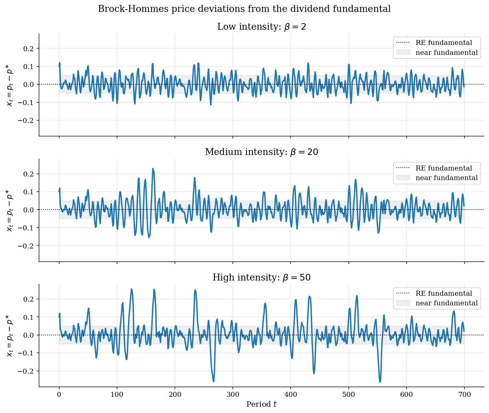
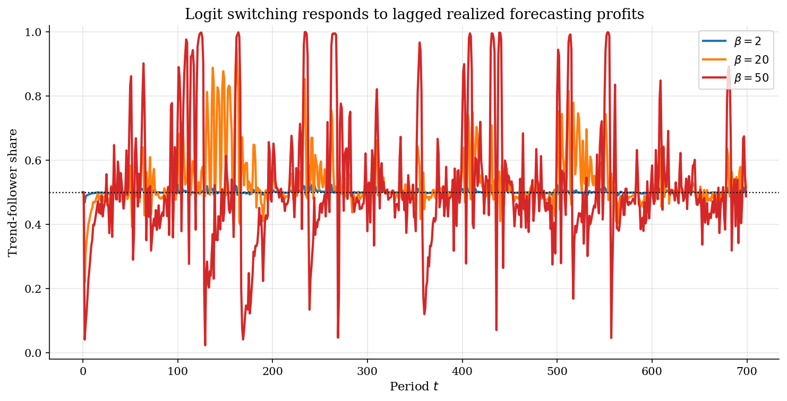
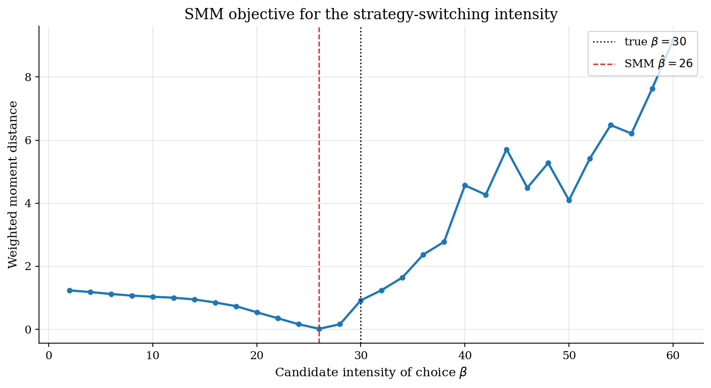

# Brock-Hommes Asset Pricing with Strategy Switching

## Overview

Forward-looking asset prices depend on beliefs about future prices. In the Brock-Hommes model, traders do not all hold the same belief. Some expect prices to return to the dividend fundamental. Others extrapolate recent price movements.

Extrapolative beliefs can move prices away from fundamentals because forecasting rules gain followers after they make money. When trend followers earn high recent profits, logit choice shifts more traders toward the trend rule. The shift can amplify the original movement and make volatility persistent.

The simulation compares low, medium, and high intensity of choice. A small SMM exercise then estimates the switching intensity from simulated return moments.

## Equations

The risky asset pays a constant dividend $d$. The gross risk-free return is
$R = 1+r$. If dividends are constant and all traders expect the same future
price, the no-arbitrage price is also constant. It equals the present value of
the dividend stream:

$$p^{\ast} = \frac{d}{R-1}.$$

The model studies deviations from that benchmark. Let
$x_t = p_t - p^{\ast}$. A positive $x_t$ means the asset is priced above the
dividend fundamental. A negative $x_t$ means it is priced below it.

Fundamentalists forecast that the deviation will disappear:

$$f_{F,t} = 0,$$

Trend followers forecast that recent price movements will continue:

$$\tilde f_{T,t} = x_{t-1} + g(x_{t-1} - x_{t-2}),$$

$$f_{T,t} = \bar x \tanh(\tilde f_{T,t} / \bar x).$$

The hyperbolic tangent bounds the trend forecast by $\bar x$. This keeps the
experiment focused on bounded bubbles rather than numerical explosion.

Market clearing sets today's deviation equal to a weighted average of beliefs,
scaled by the risk-free return, plus noise-trader supply:

$$x_t = \frac{n_{F,t-1} f_{F,t} + n_{T,t-1} f_{T,t}}{R} + \epsilon_t.$$

The realized excess return in deviation form is $e_t = x_t - R x_{t-1}$.
Rule $h$ forecasted excess return $f_{h,t} - R x_{t-1}$. A rule earns a
high profit score when its forecasted position has the same sign as the
realized excess return:

$$\pi_{h,t} =
\frac{e_t (f_{h,t} - R x_{t-1})}{a\sigma^2} - c_h.$$

Scores are smoothed,

$$U_{h,t} = \lambda U_{h,t-1} + (1-\lambda)\pi_{h,t},$$

and next-period rule shares follow logit choice:

$$n_{h,t} =
\frac{\exp(\beta U_{h,t})}{\exp(\beta U_{F,t}) + \exp(\beta U_{T,t})}.$$

The parameter $\beta$ is the intensity of choice. As $\beta \to 0$, shares stay
near one half. As $\beta$ rises, small score gaps produce large reallocations
across forecasting rules.

## Model Setup

The calibration is intentionally small. The point is to make strategy switching visible, not to match a particular stock market.

| Object | Symbol | Value | Role |
|---|---:|---:|---|
| Gross risk-free return | $R$ | 1.01 | Discounting benchmark |
| Dividend | $d$ | 0.20 | Constant cash flow |
| Fundamental price | $p^{\ast}$ | 20.00 | RE steady state |
| Trend gain | $g$ | 1.40 | Extrapolation strength |
| Forecast bound | $\bar x$ | 0.35 | Finite trend forecast |
| Shock scale | $\sigma_\epsilon$ | 0.02 | Noise-trader supply shock |
| Score memory | $\lambda$ | 0.80 | Profit-score persistence |
| Trend cost | $c_T$ | 0.001 | Small information or trading cost |
| Simulation horizon | $T$ | 700 | Price periods |
| Burn-in | $T_0$ | 100 | Moments discard early periods |

The plotted intensity values are $\beta = 2$, $\beta = 20$, and $\beta = 50$. The SMM exercise sets the true value to $\beta_0 = 30$ and searches over even candidates from 2 to 60.

## Solution Method

The solution is simulation plus a moment-matching outer loop. There is no representative-agent Euler equation after beliefs become endogenous, because today's shares are state variables created by past forecast profits.

```text
Algorithm: Brock-Hommes simulation and SMM
Input: R, d, g, xbar, lambda, beta, shocks epsilon_t
Output: price deviations x_t, strategy shares n_ht, return moments

1. Set p* = d / (R - 1) and initialize x_0, x_1, U_F = U_T = 0.
2. For t = 2 to T:
   2a. Build forecasts f_F,t = 0 and bounded trend forecast f_T,t.
   2b. Clear the asset market for x_t using last period's shares.
   2c. Compute realized excess return e_t = x_t - R x_{t-1}.
   2d. Score each rule by realized profit from its forecasted position.
   2e. Smooth scores and update shares with logit intensity beta.
3. For SMM, compute volatility, autocorrelation of absolute returns,
   and excess kurtosis after burn-in.
4. Choose beta to minimize the weighted distance between simulated and
   target moments.
```

The pseudo-data moments come from one deterministic shock bank. The candidate simulations use a separate deterministic shock bank. Within the grid, every candidate intensity sees the same candidate shocks, so the objective mostly reflects strategy switching rather than Monte Carlo noise.

## Results

With low intensity, deviations are short-lived and remain close to zero. At medium intensity, trend followers gain share after profitable runs, so deviations last longer. At high intensity, the rule that just earned profits can briefly dominate the market, creating bubble-like departures before reversal profits pull agents back toward fundamentalists.



The share plot shows the channel behind the price paths. Low intensity keeps the trend-follower share near one half. High intensity turns small score gaps into near-corner allocations, so the same shock process generates much larger price movements.



The SMM block treats a simulated high-switching economy as pseudo-data. It matches volatility, autocorrelation of absolute returns, and excess kurtosis of price-deviation returns. The fit is approximate because the pseudo-data moments and candidate moments use separate shock banks.



The pseudo-data are generated at the true switching intensity. The SMM grid uses a separate common-random-number bank, so the selected intensity matches the target moments only approximately.

**SMM estimate of the intensity parameter and matched moments**

| quantity                   |     target |        fit |   difference |
|:---------------------------|-----------:|-----------:|-------------:|
| intensity beta             | 30         | 26         |   -4         |
| volatility                 |  0.0295065 |  0.0309639 |    0.0014574 |
| abs return autocorrelation |  0.206317  |  0.219292  |    0.0129753 |
| excess kurtosis            |  0.445446  |  0.398431  |   -0.0470151 |

## Takeaway

Brock-Hommes makes a simple point with useful reach: logit choice is not only a static demand formula. Once agents use it to chase profitable forecasting rules, the rational-expectations fundamental can become a locally fragile benchmark. Low intensity leaves the market close to $p^{\ast}$; high intensity turns recent forecast profits into endogenous bubbles, reversals, and clustered volatility.

## References

- [Brock, W. A., and Hommes, C. H. (1998). Heterogeneous beliefs and routes to chaos in a simple asset pricing model. *Journal of Economic Dynamics and Control*, 22(8-9), 1235-1274.](https://doi.org/10.1016/S0165-1889(98)00011-6)
- [Hommes, C. H. (2006). Heterogeneous agent models in economics and finance. *Handbook of Computational Economics*, 2, 1109-1186.](https://doi.org/10.1016/S1574-0021(05)02023-X)
- [Brock, W. A., and Hommes, C. H. (1997). A rational route to randomness. *Econometrica*, 65(5), 1059-1095.](https://doi.org/10.2307/2171879)
