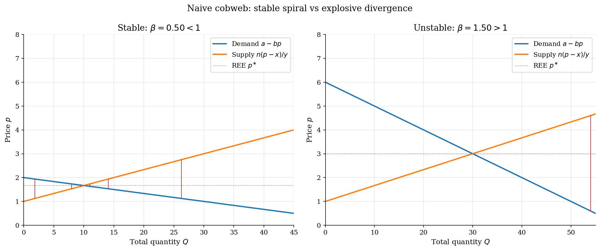
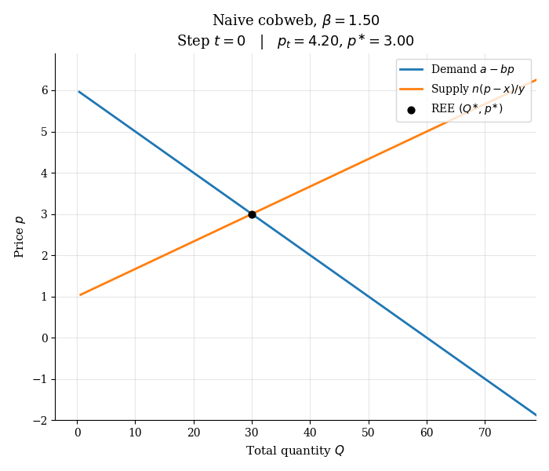
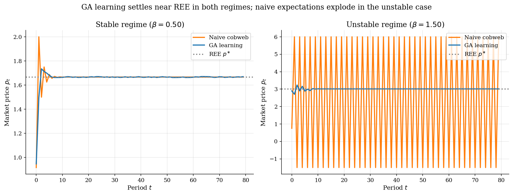
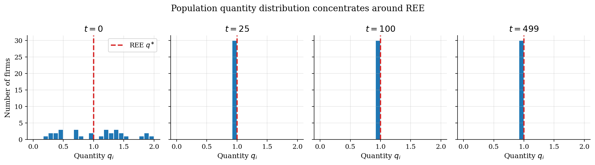
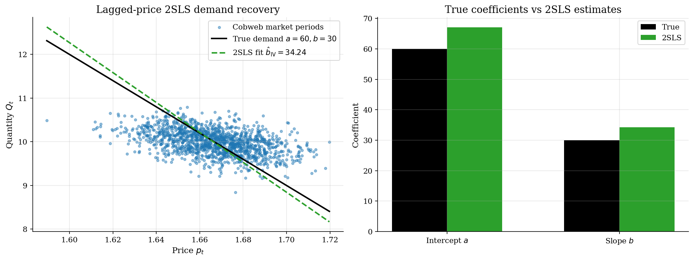

# Cobweb Markets and Arifovic Genetic-Algorithm Learning

## Overview

Strawberries take a season to grow. Farmers must decide how much to plant before the price is known, and many of them have to make that choice at the same time. The classical cobweb model puts a linear demand on top of a linear supply curve and assumes farmers expect the next price to equal the last one.

When supply is more elastic than demand, this naive feedback loop is unstable. Each year overshoots the rational-expectations price by a larger amount and the market explodes. Arifovic (1994) asked whether a population of boundedly rational farmers, learning by genetic operators on binary production rules, could nevertheless settle on the rational price.

This tutorial reproduces the headline result. We solve for the REE in closed form, simulate naive cobweb dynamics in a stable and an unstable regime, run Arifovic's GA on the same parameters, and finally take a noisy cobweb price series and recover the true demand curve via lagged-price IV.

## Equations

**Notation.**

| Symbol | What it means |
|---|---|
| $t$ | Period index. One season of strawberries. |
| $i$ | Firm index, running from $1$ to $n$. |
| $p_t$ | Market price in period $t$, the same for every buyer and every firm. |
| $q_{i,t}$ | Quantity firm $i$ chooses to plant for period $t$, decided before $p_t$ is known. |
| $Q_t$ | Total market quantity, $Q_t = \sum_{i=1}^{n} q_{i,t}$. |
| $\pi_{i,t}$ | Firm $i$'s realized profit in period $t$ once the market clears. |
| $\sigma(i)$ | Index of the tournament-selected parent placed at slot $i$ of the next generation. |
| $a$ | Demand intercept. The price at which buyers stop buying ("choke price"). |
| $b$ | Demand slope. How many extra units buyers absorb per one-unit price cut. |
| $\varepsilon_t$ | Random demand shock in period $t$, mean zero, i.i.d. across periods. Stands in for weather, taste shifts, or news. |
| $x$ | Marginal-cost intercept. Cost of the very first unit a firm produces. |
| $y$ | Marginal-cost slope. How fast marginal cost rises as a firm produces more. |
| $n$ | Number of firms in the market. |
| $L$ | Length in bits of each firm's chromosome. |
| $N$ | GA population size. Equal to $n$ here, since one chromosome per firm. |
| $T$ | Number of GA generations the simulation runs. |
| $p_c$ | Per-pair crossover probability. |
| $p_m$ | Per-bit mutation probability. |

Per-firm cost is quadratic in own quantity: $C(q) = x q + \tfrac{y}{2} q^{2}$.

**Inverse demand with shock.** Market clearing gives

$$p_t = \frac{1}{b}\Big(\underbrace{a}_{\text{choke price}} + \underbrace{\varepsilon_t}_{\text{i.i.d. demand shock}} - \underbrace{Q_t}_{\text{aggregate quantity}}\Big).$$

**Firm supply.** Firm $i$ forms a price expectation $p_{i,t}^{e}$ before
producing, then sets $q_{i,t}$ to maximize expected profit. The first-order
condition gives the price-taking supply rule

$$q_{i,t} = \frac{p_{i,t}^{e} - x}{y}.$$

**Naive cobweb law of motion.** Plugging $p_{i,t}^{e} = p_{t-1}$ into the
supply rule for every firm and substituting into inverse demand gives a
one-step recursion in price:

$$p_t = \underbrace{\alpha}_{\text{intercept}} - \underbrace{\beta}_{\text{slope ratio}} \cdot p_{t-1}, \qquad \alpha = \frac{a y + n x}{b y}, \quad \beta = \frac{n}{b y}.$$

The fixed point of this recursion is the rational-expectations equilibrium

$$p^{\ast} = \frac{a y + n x}{b y + n}, \qquad q^{\ast} = \frac{p^{\ast} - x}{y}.$$

The naive cobweb converges to $p^{\ast}$ when $\beta < 1$ and explodes when
$\beta > 1$.

**Genetic-algorithm representation.** Each firm carries a length-$L$ binary
string $b_i \in \{0,1\}^{L}$ that decodes deterministically to a quantity in
the bracket $[q_{\min}, q_{\max}]$. The population size equals the number of
firms in the market, $N = n$, so each chromosome is one firm's production
plan in the current period.

**Fitness function.** The realized profit at the cleared price $p_t$ is

$$\pi_{i,t} = \underbrace{p_t \cdot q_{i,t}}_{\text{revenue}} - \underbrace{x \cdot q_{i,t}}_{\text{linear cost}} - \underbrace{\tfrac{y}{2} q_{i,t}^{2}}_{\text{convex cost}}.$$

**Abstract GA loop.** Let $\mathbf{B}_t = (b_{1,t}, \ldots, b_{n,t})$ be the
population of chromosomes at the start of period $t$. One generation
executes:

$$
\begin{aligned}
\text{(1) Decode} \quad & q_{i,t} = \mathrm{decode}(b_{i,t}). \\
\text{(2) Clear} \quad & Q_t = \sum_{i=1}^{n} q_{i,t}, \qquad p_t = \tfrac{a + \varepsilon_t - Q_t}{b}. \\
\text{(3) Score} \quad & \pi_{i,t} = p_t \cdot q_{i,t} - x \cdot q_{i,t} - \tfrac{y}{2} q_{i,t}^{2}. \\
\text{(4) Select} \quad & \text{tournament on } \{\pi_{i,t}\}_{i=1}^{n} \text{ produces parent indices.} \\
\text{(5) Recombine} \quad & \text{crossover with prob.\ } p_c, \text{ then bit-flip mutation with per-bit prob.\ } p_m. \\
\text{(6) Elect} \quad & \text{keep child } b_i' \text{ iff } \pi(\mathrm{decode}(b_i'), p_t) \geq \pi_{\sigma(i),t}; \text{ else keep parent.} \\
\text{(7) Update} \quad & \mathbf{B}_{t+1} \leftarrow \text{surviving population.}
\end{aligned}
$$

The simulation runs for $T$ generations.
Here $b_{i,t}$ is firm $i$'s chromosome at the start of period $t$, and $b_i'$ is the candidate child produced by crossover and mutation at steps (4)-(5) before the election filter at step (6).

The election threshold $\pi_{\sigma(i),t}$ in step (6) is the realized profit of the *tournament-selected parent* placed at slot $i$, not of the original firm $i$. Tournament selection at step (4) writes a parent index $\sigma(i)$ into each slot $i$ of the new population, and the child at slot $i$ is built from that parent. The election filter then compares the child against its own parent, $\pi_{\sigma(i),t}$, which is the standard Arifovic (1994) election operator. Because $\sigma(i)$ is a tournament winner, $\pi_{\sigma(i),t}$ weakly exceeds the profit of a randomly drawn firm, so the filter is conservative: it accepts offspring only when they beat a parent that already survived selection.

## Model Setup

Two regimes share the same demand intercept and per-firm cost, but differ in the demand slope $b$. The stable regime has $\beta < 1$; the unstable regime has $\beta > 1$ and naive expectations diverge.

| Object | Stable | Unstable | Role |
|---|---:|---:|---|
| Demand intercept $a$ | 60 | 60 | Choke price |
| Demand slope $b$ | 30 | 10 | Sensitivity of consumers to price |
| Cost intercept $x$ | 1 | 1 | Marginal cost at zero output |
| Cost curvature $y$ | 2 | 2 | Supply slope per firm |
| Number of firms $n$ | 30 | 30 | Population size |
| Naive slope $\beta$ | 0.50 | 1.50 | Cobweb stability |
| REE price $p^{\ast}$ | 1.67 | 3.00 | Fixed point |
| REE per-firm quantity $q^{\ast}$ | 0.33 | 1.00 | Steady-state output |

GA hyperparameters follow Arifovic's specification: chromosome length $L = 8$ giving $256$ encoded quantity levels in $[0, 2]$, one chromosome per firm so the population size equals $N = n = 30$, crossover probability $p_c = 0.6$, mutation probability per bit $p_m = 0.02$, and $T = 500$ generations. The election operator is always on in the headline runs.

## Solution Method

There is no closed-form solution for the GA dynamics. The model is solved by direct simulation. Each generation is one market period.

```text
Algorithm: Arifovic GA cobweb learning
Input: market parameters (a, b, x, y, n), GA parameters (L, N, p_c, p_m, T)
Output: price path p_1, ..., p_T and per-period population quantities

1. Initialize N random binary chromosomes of length L.
2. For t = 1 to T:
   2a. Decode each chromosome into a quantity q_i in [q_min, q_max].
   2b. Aggregate Q = sum_i q_i; clear the market at p_t = (a + e_t - Q) / b.
   2c. Compute realized profit pi_i = p_t q_i - x q_i - (y/2) q_i^2.
   2d. Tournament-select N parents using 3-way tournaments on realized profit.
   2e. Pair parents and apply single-point crossover with prob p_c.
   2f. Bit-flip mutate each child with prob p_m per bit.
   2g. ELECTION: keep each child only if its profit at p_t exceeds its parent's profit.
   2h. Replace the population with the survivors of step 2g.
```

The election step is the difference-maker. Without it, lucky offspring from a crossover that happened to land in a low-supply period propagate on inflated profits even though their implied quantity is far from the equilibrium. The election filter scores each child at the just-realized price and keeps it only if it beats its parent there.

**Where this fits in evolutionary computation.** The genetic algorithm sits inside a wider family of evolutionary search methods. Holland (1975) introduced it as a population-based heuristic on fixed-length bit strings. Koza (1992) generalized to genetic programming, where the candidates are variable-length expressions or programs. Evolution strategies, CMA-ES, and neuroevolution swap the bit string for continuous parameters under Gaussian perturbations. Arifovic's contribution is the election operator. The operator filters each candidate child against a counterfactual profit at the just-realized market price. This filter is what stabilizes the otherwise unstable cobweb. It mirrors the policy-improvement step in Q-learning (see [`q-learning-growth`](../../dynamic-programming/q-learning-growth/)). In both, a learner accepts a candidate update only if it would have been an improvement under the most recently observed state.

## Results

The cobweb diagram makes the stability story visible. In the stable regime, the staircase spirals inward to the supply-demand crossing. In the unstable regime, the same construction spirals outward and prices would explode if firms truly used last period's price as their forecast.



Watching the unstable cobweb draw itself one period at a time makes the divergence visceral. Each frame adds one supply-then-demand step to the spiral, and the price walks farther from $p^{\ast}$ on every iteration.



Replacing naive expectations with the GA changes the picture. In the stable regime both rules behave similarly; the GA has a slightly noisier approach to REE because mutation never fully shuts off. In the unstable regime naive expectations diverge within a few periods while the GA settles into a tight band around the REE price.



Looking inside the GA population shows what convergence means in this model. The initial chromosome distribution is uniform over the encoded quantity grid. Within a few dozen generations the bulk of firms are producing close to the REE quantity, and by generation 500 the population is concentrated in a narrow band around $q^{\ast}$.



The estimation block uses a naive-cobweb price series with i.i.d. demand-intercept shocks $\varepsilon_t$ as test data. The GA itself tracks REE so closely under the election operator that the resulting price barely moves. The naive cobweb provides the AR(1)-style persistence that makes the IV exercise interesting.

**Structural demand equation.** The data are the realized pairs $\{(p_t, Q_t)\}_{t=1}^{T}$. The demand we want to recover is

$$Q_t = a - b \cdot p_t + \varepsilon_t.$$

**Why naive OLS is biased.** Market clearing forces the realized price to absorb the demand shock,

$$p_t = \frac{a + \varepsilon_t - Q_t}{b} \quad \Longrightarrow \quad \mathrm{Cov}(p_t,\, \varepsilon_t) = \frac{\mathrm{Var}(\varepsilon_t)}{b} > 0.$$

An OLS regression of $Q_t$ on $p_t$ therefore underestimates the demand slope; the same simultaneity that drives prices in real markets drives them here.

**Lagged-price IV.** The lagged price $p_{t-1}$ is correlated with $p_t$ through firms' naive supply rule but uncorrelated with the current shock under i.i.d. $\varepsilon_t$,

$$\mathrm{Cov}(p_{t-1},\, p_t) \neq 0, \qquad \mathbb{E}[\,p_{t-1} \cdot \varepsilon_t\,] = 0.$$

Two-stage least squares with $p_{t-1}$ as instrument is consistent. The first stage projects $p_t$ onto $(1, p_{t-1})$; the second stage regresses $Q_t$ on the fitted prices.



Naive cobweb stability is a knife-edge in $\beta$. The GA tracks REE in both regimes; the absolute deviation of the last-100-period mean price from $p^{\ast}$ stays small even when the naive rule diverges.

**Regime grid and GA convergence summary**

| Regime   |   Demand slope $b$ |   Supply slope $y$ |   Firms $n$ |   Naive slope $\beta$ |   REE price $p^{\ast}$ |   REE quantity $q^{\ast}$ | Naive diverges   |   GA mean $p_t$ (last 100) |   Distance to $p^{\ast}$ |
|:---------|-------------------:|-------------------:|------------:|----------------------:|-----------------------:|--------------------------:|:-----------------|---------------------------:|-------------------------:|
| Stable   |                 30 |                  2 |          30 |                   0.5 |                1.66667 |                  0.333333 | False            |                    1.66655 |              0.000112418 |
| Unstable |                 10 |                  2 |          30 |                   1.5 |                3       |                  1        | True             |                    3.01176 |              0.0117647   |

Coefficients with HC0 standard errors. Naive OLS underestimates the demand slope because $\varepsilon_t$ enters $p_t$ through market clearing. 2SLS with lagged price as instrument is consistent.

**Demand-curve recovery: true vs naive OLS vs 2SLS**

| Parameter     |   True value |   Naive OLS |   OLS SE |    2SLS |   2SLS SE |
|:--------------|-------------:|------------:|---------:|--------:|----------:|
| Intercept $a$ |           60 |     20.9452 | 0.562537 | 67.059  |   3.08055 |
| Slope $b$     |           30 |      6.5707 | 0.337715 | 34.2436 |   1.84817 |

## Takeaway

Cobweb instability under naive expectations is a property of the aggregator, not of the agents. The same parameter grid that explodes under last-price forecasts converges under a population of binary learners, because the election operator filters out the lucky-price offspring whose decisions would not have been profitable in the current market.

On the econometric side, the simulated cobweb price series sits in the same simultaneity geometry as a real market: demand shocks feed into the realized price through clearing, so a same-period regression cannot identify the demand curve. Lagged price is the textbook instrument and recovers the demand structure here, underlining that the identification logic depends on the timing of shocks more than on whether the supply side is strictly rational.

## References

- [Arifovic, J. (1994). Genetic algorithm learning and the cobweb model. *Journal of Economic Dynamics and Control*, 18(1), 3-28.](https://doi.org/10.1016/0165-1889(94)90067-1)
- [Ezekiel, M. (1938). The cobweb theorem. *Quarterly Journal of Economics*, 52(2), 255-280.](https://doi.org/10.2307/1881734)
- [Holland, J. H. (1975). *Adaptation in Natural and Artificial Systems*. University of Michigan Press.]
- [Koza, J. R. (1992). *Genetic Programming: On the Programming of Computers by Means of Natural Selection*. MIT Press.]
- [Hansen, N. and Ostermeier, A. (2001). Completely derandomized self-adaptation in evolution strategies. *Evolutionary Computation*, 9(2), 159-195.](https://doi.org/10.1162/106365601750190398)
