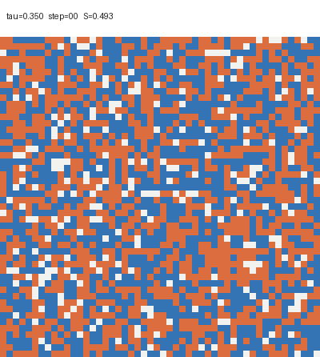
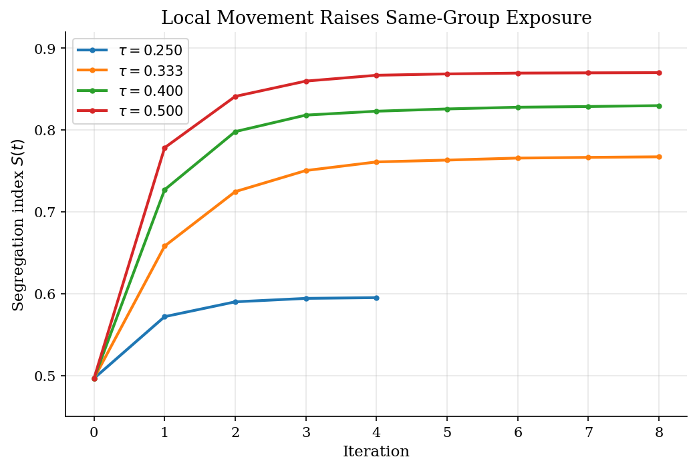
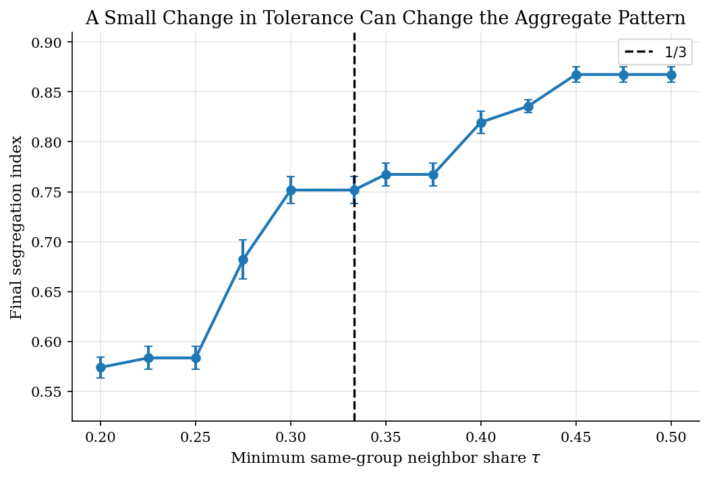
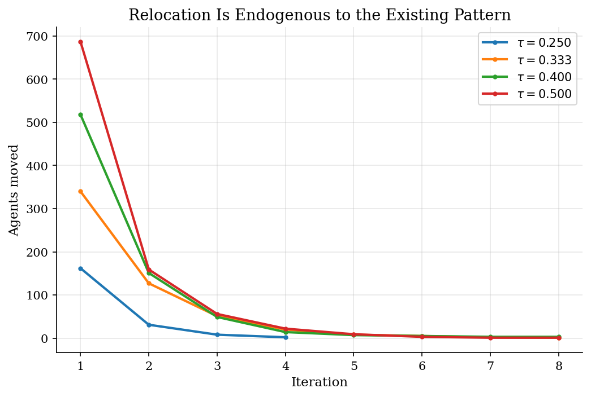
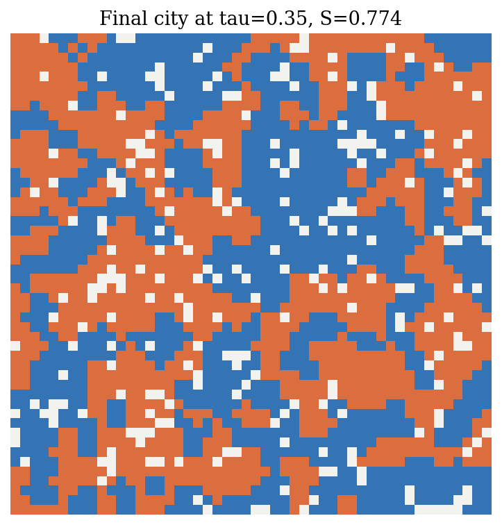

# Schelling Segregation on a Checkerboard

## Overview

Schelling starts with a simple city. Two groups fill a checkerboard. Some cells stay empty. Each person checks nearby neighbors. A person moves when too few neighbors belong to the same group.

Agents do not choose segregation as a social outcome. They choose acceptable local neighborhoods. Their moves change the choices that other agents face next.

This tutorial keeps the classic model. We simulate a 50 x 50 city. We sweep the minimum same-group neighbor share $\tau$. We track the segregation index $S(t)$ until the city stops moving.

## Equations

Use $G$ for the city grid. Track the whole checkerboard as the state. Do not
collapse the city to one aggregate stock. Write cell $i$ at iteration $t$ as
$X_t(i)$. Empty cells have $X_t(i)=0$. Occupied cells have group
$g_i(t)=X_t(i)$ with $g_i(t)\in\lbrace A,B\rbrace$.

For each occupied cell, $N_i$ gives the local Moore neighborhood. It includes
horizontal, vertical, and diagonal cells. It has at most eight cells. Empty
cells can receive movers. Empty cells do not enter the local group composition.
Count occupied neighbors as

$$
O_i(t)=\sum_{j\in N_i} \mathbf{1}[X_t(j)\neq 0].
$$

Count same-group neighbors as

$$
m_i(t)=\sum_{j\in N_i} \mathbf{1}[X_t(j)=g_i(t)].
$$

When $O_i(t)>0$, define the local same-group share as

$$
s_i(t)=\frac{m_i(t)}{O_i(t)}.
$$

When an occupied cell has no occupied neighbors, set $s_i(t)=1$. This convention
treats isolation as acceptable. The threshold $\tau$ gives the minimum
acceptable same-group share. An agent stays content when

$$
s_i(t)\geq \tau.
$$

If $s_i(t)<\tau$, the agent becomes dissatisfied. Let $E_t$ collect the vacant
cells. The agent can move only to a vacant cell that satisfies the same
threshold for that agent's group. Agents do not choose a global segregation
target. They search for an acceptable local neighborhood.

Measure aggregate segregation by average local exposure:

$$
S(t)=\frac{1}{M}\sum_{i:X_t(i)\neq 0} s_i(t),
$$

where $M$ counts occupied cells. Moves keep $M$ fixed because each move swaps
one occupied cell with one vacancy. A random initial city with equal group sizes
puts $S(t)$ near one half. Large values of $S(t)$ mean that the typical person
mostly sees same-group neighbors. Each decision still uses only the local rule
above.

## Model Setup

The calibration keeps Schelling's checkerboard simple. These numbers are not estimates. They make the mechanism easy to see.

| Symbol | Value | Role |
|---|---|---|
| $G$ | 50 x 50 cells | City grid |
| $E_t$ | 10% of cells initially vacant | Empty cells that permit movement |
| $g_i$ | $A$ or $B$ | Occupant group in cell $i$ |
| $N_i$ | Moore neighborhood, up to 8 cells | Local reference group |
| $O_i(t)$ | occupied neighbors in $N_i$ | Denominator for local exposure |
| $s_i(t)$ | between 0 and 1 | Same-group neighbor share for cell $i$ |
| $\tau$ | 0.20 to 0.50 | Local tolerance threshold |
| $S(t)$ | average of $s_i(t)$ | Aggregate segregation index |
| $T$ | 100 iterations | Stop rule cap |
| Replications | 5 per threshold | Simulation noise check |

## Solution Method

We simulate agents directly. We do not solve for a representative agent. We do not optimize a global objective. The state is the whole checkerboard.

```text
Algorithm: Schelling checkerboard dynamics
Input: initial grid X_0, vacancy set E_0, threshold tau, horizon T
Output: city states X_t, segregation path S(t), move counts

For t = 0, 1, ..., T - 1:
  1. For every occupied cell i, compute O_i(t), m_i(t), and s_i(t).
  2. Let D_t be occupied cells with s_i(t) < tau.
  3. If D_t is empty, stop with a locally stable city.
  4. Visit cells in D_t in random order.
  5. For each still-dissatisfied i, form candidate vacant cells C_i(t):
       vacant cells e in E_t where group g_i would have exposure at least tau.
  6. If C_i(t) is nonempty, draw e from C_i(t), move g_i from i to e,
       and update X_t and E_t before visiting the next agent.
  7. Record X_{t+1}, S(t+1), and the number of moves.
  8. Stop if no one moves or if t + 1 = T.
```

A random visit order matters. One move changes nearby neighborhoods. That dependence drives the model. Small local moves change the incentives that other agents face. The city can then tip toward a much more sorted pattern.

## Results

The animation follows one run at $\tau=0.35$. Blue cells mark one group. Orange cells mark the other group. Light cells mark empty locations. Each frame saves the city after one wave of relocation decisions. The city starts close to a random mix. Dissatisfied agents move into acceptable locations. Same-group clusters then reinforce themselves.



The path plot tracks $S(t)$ for four thresholds. The key parameter is $\tau$. It sets the local tolerance threshold. At low thresholds, the city settles with little sorting. Near the one-third region, the same rule raises same-group exposure sharply. Small neighborhoods make this region important. One extra same-group neighbor can move an agent across the threshold. The plateaus come from integer neighbor counts on a finite checkerboard.



The threshold sweep makes the nonlinearity clear. Schelling emphasized a simple comparison. A one-third demand produced much less segregation than a one-half demand in his checkerboard examples. This run gives the same lesson. Final segregation rises quickly when the local demand leaves the low-tolerance range.



Most movement happens early. Enough relocation can stabilize many neighborhoods. The final city still looks much more sorted than the initial draw.



The final city at $\tau=0.35$ shows same-group clusters. Each agent still used only local neighbor composition.



This table gives the simulation detail behind the phase-transition figure. Each row averages over 5 random initial cities.

**Threshold sweep summary**

|   Threshold tau |   Mean final segregation S |   SD final segregation S |   Mean iterations |   Mean moves |   Converged runs |   Replications |
|----------------:|---------------------------:|-------------------------:|------------------:|-------------:|-----------------:|---------------:|
|           0.2   |                      0.574 |                    0.011 |               3.6 |          154 |                5 |              5 |
|           0.225 |                      0.583 |                    0.012 |               3.6 |          178 |                5 |              5 |
|           0.25  |                      0.583 |                    0.012 |               3.6 |          178 |                5 |              5 |
|           0.275 |                      0.682 |                    0.019 |               7   |          389 |                5 |              5 |
|           0.3   |                      0.752 |                    0.014 |               7.8 |          531 |                5 |              5 |
|           0.333 |                      0.752 |                    0.014 |               7.8 |          531 |                5 |              5 |
|           0.35  |                      0.767 |                    0.011 |               6.8 |          581 |                5 |              5 |
|           0.375 |                      0.767 |                    0.011 |               6.8 |          581 |                5 |              5 |
|           0.4   |                      0.82  |                    0.011 |               7.2 |          743 |                5 |              5 |
|           0.425 |                      0.836 |                    0.006 |               8.6 |          807 |                5 |              5 |
|           0.45  |                      0.867 |                    0.008 |               9.2 |          968 |                5 |              5 |
|           0.475 |                      0.867 |                    0.008 |               9.2 |          968 |                5 |              5 |
|           0.5   |                      0.867 |                    0.008 |               9.2 |          968 |                5 |              5 |

## Takeaway

The Schelling model warns us about aggregation. Modest local tolerance rules may not preserve a mixed city. Movement changes the local environment that other agents face. Individual relocation decisions can then create segregated aggregate patterns. Those patterns can look much stronger than the rule each agent follows.

## References

- [Schelling, T. C. (1971). Dynamic Models of Segregation. *The Journal of Mathematical Sociology*, 1(2), 143-186.](https://doi.org/10.1080/0022250X.1971.9989794)
- [Schelling, T. C. (1978). *Micromotives and Macrobehavior*. W. W. Norton.]
