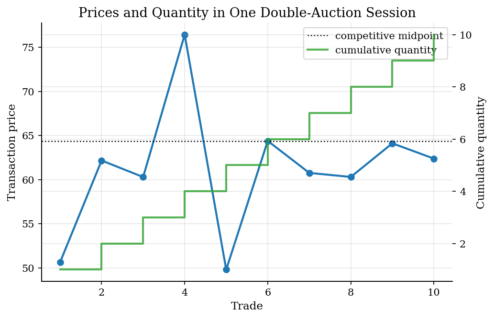
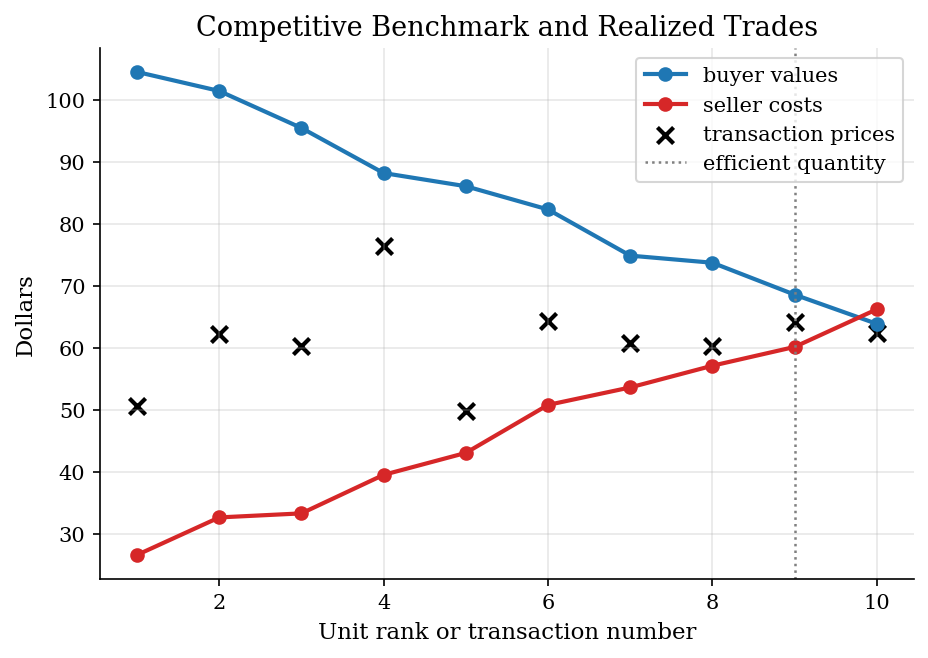
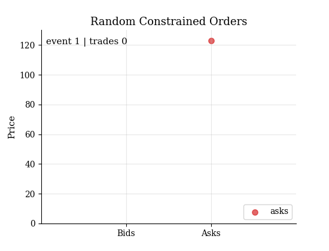
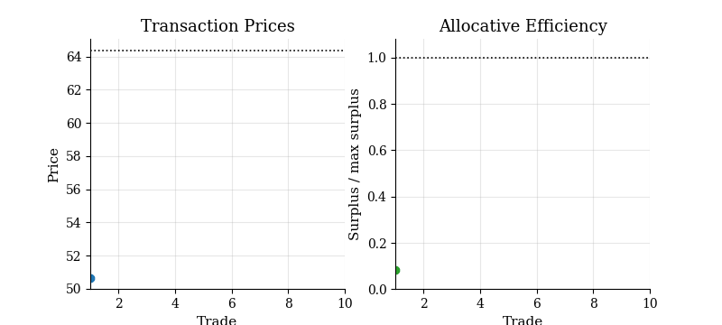
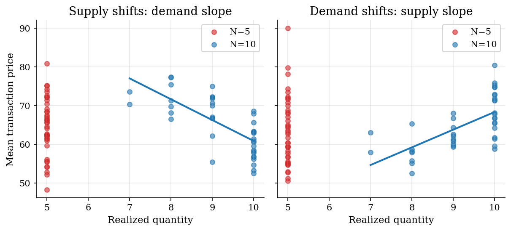

# Zero-Intelligence Traders in a Double Auction

> Random constrained orders, competitive surplus, and thin-market slope recovery.

## Overview

A double auction lets buyers and sellers post prices while the market is open. Buyers know private values. Sellers know private costs. A trade clears when the best bid is at least as high as the best ask.

This tutorial strips behavior down to zero intelligence. Buyers draw random bids that never exceed value. Sellers draw random asks that never fall below cost. The agents do not optimize, forecast, or learn.

The economic question is how much work the market institution does. The simulation compares random constrained trading with the competitive surplus benchmark, then asks what can be recovered from price-quantity data alone.

## Equations

Buyer $i$ has value $v_i$ for one unit.
Seller $j$ has cost $c_j$ for one unit.
A zero-intelligence constrained buyer draws a bid $b_i$ satisfying

$$
0 \leq b_i \leq v_i.
$$

A zero-intelligence constrained seller draws an ask $a_j$ satisfying

$$
c_j \leq a_j \leq \bar p.
$$

The double auction clears when the best bid crosses the best ask:

$$
\max_i b_i \geq \min_j a_j.
$$

The transaction price is the midpoint between the accepted bid and ask.
The realized surplus from a trade between buyer $i$ and seller $j$ is

$$
s_{ij}=v_i-c_j.
$$

The competitive benchmark sorts buyer values from high to low and seller costs
from low to high. With sorted values $v_{(q)}$ and sorted costs $c_{(q)}$, the
efficient quantity is

$$
Q^{\ast}=\max \{q: v_{(q)}-c_{(q)} > 0\}.
$$

Maximum surplus is

$$
S^{\ast}=\sum_{q=1}^{Q^{\ast}} [v_{(q)}-c_{(q)}].
$$

Allocative efficiency is

$$
\mathrm{AE}=\frac{\sum_{\mathrm{trades}} s_{ij}}{S^{\ast}}.
$$

For the slope exercise, each market session produces a realized quantity $Q_m$
and an average transaction price $P_m$. OLS fits

$$
P_m=\alpha+\beta Q_m+\epsilon_m.
$$

Supply-shift panels trace out the demand slope. Demand-shift panels trace out
the supply slope.

## Model Setup

| Object | Value | Role |
|---|---:|---|
| Buyers | 10 | One-unit demand with private values |
| Sellers | 10 | One-unit supply with private costs |
| Value schedule | intercept 108, slope -4.5 | Noisy downward demand |
| Cost schedule | intercept 22, slope 4.5 | Noisy upward supply |
| Random order cap | 130 | Maximum ask support |
| Quote events | up to 1,200 | Repeated random bids and asks |
| Transaction price | midpoint | Accepted bid and ask split the spread |
| OLS panels | 40 sessions per shift design | Uses only realized price and quantity |

## Solution Method

The simulation has three steps: simulate the institution, solve the competitive benchmark, and estimate slopes from price-quantity panels.

```text
Algorithm: zero-intelligence constrained double auction
Inputs: buyer values v_i, seller costs c_j, price cap pbar
Outputs: transaction log, realized surplus, competitive benchmark

1. Mark every buyer and seller as active.
2. Draw a random active trader.
3. If the trader is a buyer, draw b_i uniformly from [0, v_i].
4. If the trader is a seller, draw a_j uniformly from [c_j, pbar].
5. If the highest live bid crosses the lowest live ask, clear one trade.
6. Remove the matched buyer and seller and record price, quantity, and surplus.
7. Repeat until no active side remains or the quote-event limit is reached.
```

The competitive benchmark is analytical. Sort values from high to low, sort costs from low to high, and keep the positive value-cost gaps. That benchmark is the denominator for allocative efficiency.

The OLS exercise uses repeated market sessions. To recover the demand slope, the code shifts costs and observes how transaction prices and quantities move along demand. To recover the supply slope, it shifts values and moves along supply. The estimator does not see private values or costs.

## Results

The baseline market clears 10 trades with 10 buyers and 10 sellers. The competitive benchmark has quantity 9. Realized surplus is 376.25 against a maximum of 378.59, so allocative efficiency is 99.38%. The agents are random, but the budget constraints and the double-auction clearing rule keep most high-value buyers matched with low-cost sellers.



The sorted values and costs give the competitive surplus benchmark. The realized transaction prices sit inside the value-cost range. A few matches can be out of rank order, but the surplus loss is small in this session.



The order-book animation shows how little intelligence the agents have. Quotes arrive randomly. Trades clear only because the institution keeps the best bid and best ask visible.



The convergence animation accumulates realized surplus trade by trade. The benchmark line is the maximum surplus from the sorted competitive allocation.



**Baseline Market Summary**

| Object                 | Value   | Role                                             |
|:-----------------------|:--------|:-------------------------------------------------|
| Buyers                 | 10      | Random private values                            |
| Sellers                | 10      | Random private costs                             |
| Realized trades        | 10      | Trades cleared by the double-auction institution |
| Competitive quantity   | 9       | Sorted value-cost pairs with positive surplus    |
| Allocative efficiency  | 99.38%  | Realized surplus divided by maximum surplus      |
| Mean transaction price | 61.14   | Average midpoint price across realized trades    |

The transaction-price standard deviation is 7.04. The table records the hidden values and costs only for audit; the slope estimator below uses price and quantity outcomes.

**Baseline Transaction Log**

|   trade |   event |   buyer value |   seller cost |   accepted bid |   accepted ask |   price |   surplus |
|--------:|--------:|--------------:|--------------:|---------------:|---------------:|--------:|----------:|
|       1 |       9 |        74.889 |        43.054 |         51.171 |         50.144 |  50.658 |    31.835 |
|       2 |      12 |       104.537 |        39.511 |         67.502 |         56.85  |  62.176 |    65.025 |
|       3 |      14 |       101.465 |        26.585 |         64.87  |         55.736 |  60.303 |    74.88  |
|       4 |      16 |        86.091 |        66.228 |         77.027 |         75.828 |  76.427 |    19.862 |
|       5 |      23 |        73.743 |        32.64  |         50.982 |         48.657 |  49.819 |    41.103 |
|       6 |      30 |        88.216 |        33.291 |         76.512 |         52.274 |  64.393 |    54.925 |
|       7 |      45 |        82.339 |        50.797 |         64.643 |         56.902 |  60.773 |    31.543 |
|       8 |      71 |        95.491 |        53.619 |         61.259 |         59.364 |  60.311 |    41.872 |
|       9 |     269 |        68.594 |        60.154 |         65.578 |         62.663 |  64.121 |     8.439 |
|      10 |     508 |        63.882 |        57.123 |         63.475 |         61.308 |  62.392 |     6.76  |

The OLS panels use only session-level transaction price and quantity. With 10 buyers and 10 sellers, the supply-shift panel recovers a downward demand slope and the demand-shift panel recovers an upward supply slope. With 5 buyers and 5 sellers, there are too few quantity points and too much transaction-price noise. The reduced-form estimates move away from the structural slopes.



**OLS Slope Recovery**

|   N | Panel   |   True slope |   OLS slope |   Slope error |   Abs. error |
|----:|:--------|-------------:|------------:|--------------:|-------------:|
|  10 | demand  |         -4.5 |      -5.389 |        -0.889 |        0.889 |
|  10 | supply  |          4.5 |       4.571 |         0.071 |        0.071 |
|   5 | demand  |         -4.5 |      12.43  |        16.93  |       16.93  |
|   5 | supply  |          4.5 |      12.248 |         7.748 |        7.748 |

## Takeaway

Zero-intelligence constrained traders show how much allocation can come from the institution rather than from sophisticated strategy. In the baseline run, random constrained orders still reach about 99% allocative efficiency.

The estimation lesson is different. Price-quantity regressions can look reasonable when the market is thick and the variation is well staged, but they break quickly when only a few traders generate the time series. That is the point where a structural model of values, costs, and the trading institution becomes useful.

## References

- [Gode, D. K. and Sunder, S. (1993). Allocative Efficiency of Markets with Zero-Intelligence Traders: Market as a Partial Substitute for Individual Rationality. *Journal of Political Economy*, 101(1), 119-137.](https://doi.org/10.1086/261868)
- [Smith, V. L. (1962). An Experimental Study of Competitive Market Behavior. *Journal of Political Economy*, 70(2), 111-137.](https://doi.org/10.1086/258609)
- [Cliff, D. and Bruten, J. (1997). Minimal-intelligence agents for bargaining behaviors in market-based environments. Technical report, Hewlett-Packard Laboratories.](https://www.hpl.hp.com/techreports/97/HPL-97-91.html)
