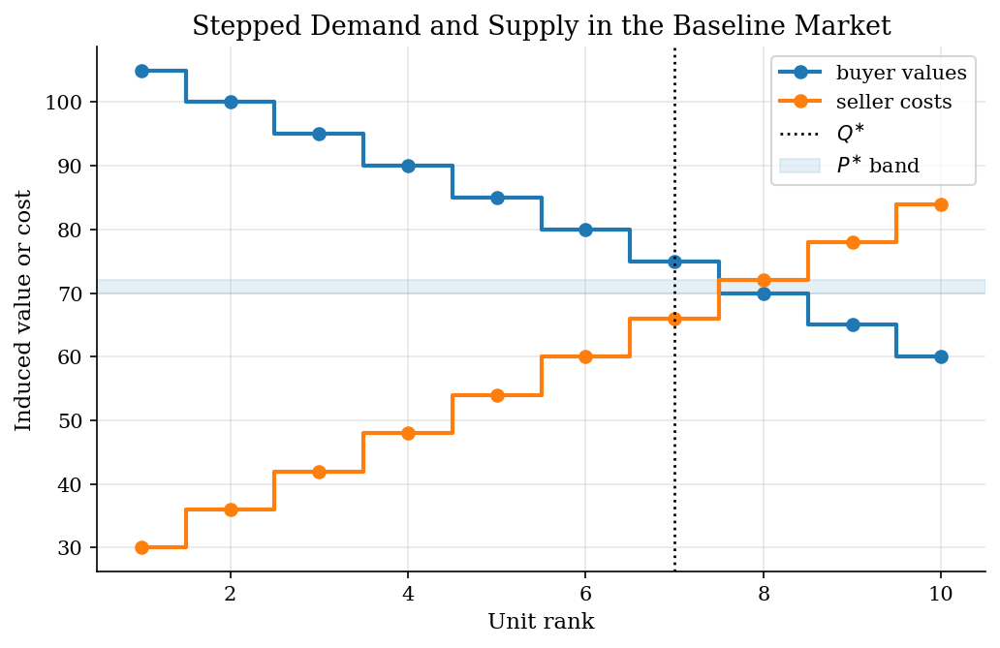
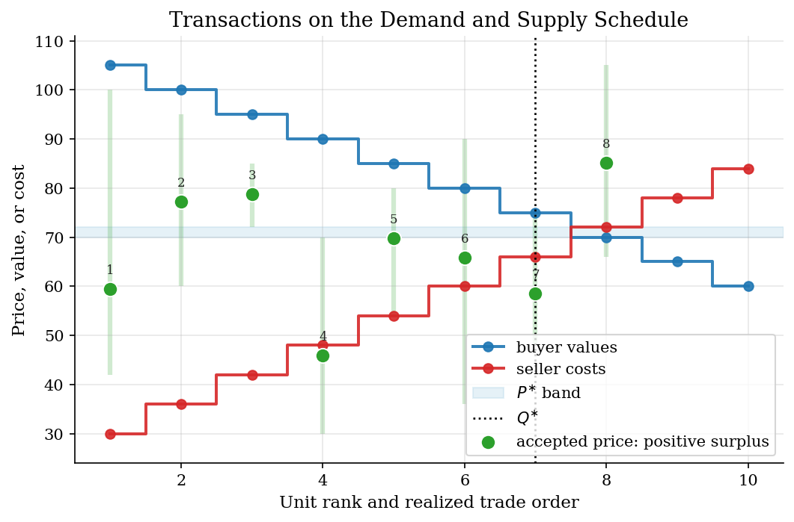
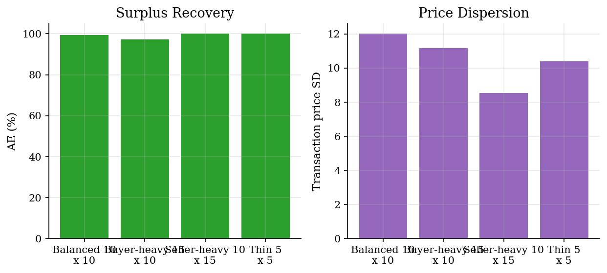
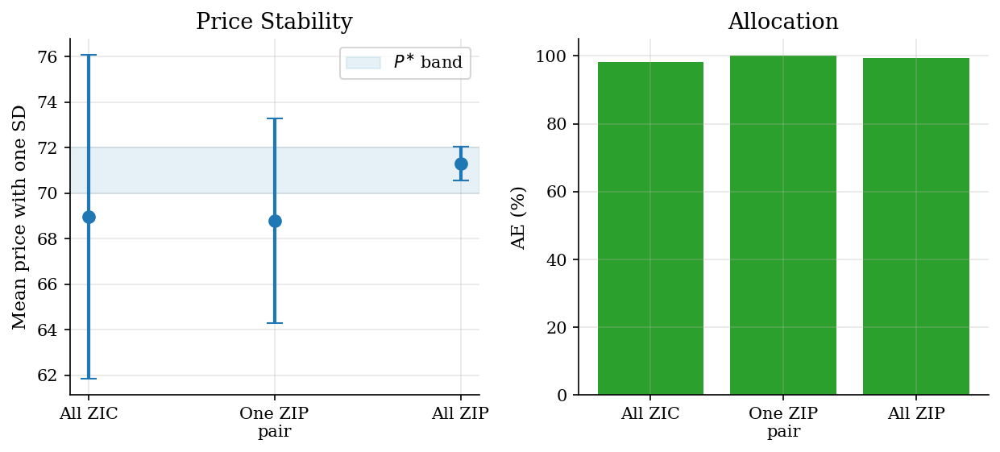

# Zero-Intelligence Traders in a Double Auction

## Overview

A double auction lets buyers and sellers post prices while the market is open. Buyers know private values. Sellers know private costs. A trade clears when the best bid is at least as high as the best ask.

The Gode-Sunder result is that the institution can do much of the work. Here, zero-intelligence constrained traders draw random quotes, but buyers never bid above value and sellers never ask below cost. That simple budget discipline is enough to recover most of the competitive surplus.

The tutorial then adds a small ZIP-style adaptive rule. Adaptation pulls quotes toward recent transaction prices while preserving the same no-loss constraints. The comparison shows the margin on which intelligence helps: prices become less dispersed, while efficiency rises only a little because ZIC already allocates well.

## Equations

Buyer $i$ has value $v_i$ for one unit. Seller $j$ has cost $c_j$ for one unit.
At event $t$, the active bid book and ask book are

$$
B_t=\lbrace b_i(t): i\in \mathcal{B}_t\rbrace
\qquad\text{and}\qquad
A_t=\lbrace a_j(t): j\in \mathcal{A}_t\rbrace.
$$

ZIC buyers and sellers draw feasible quotes:

$$
b_i(t)\sim U[0,v_i],
\qquad
a_j(t)\sim U[c_j,\bar p].
$$

A trade clears when the best bid crosses the best ask:

$$
\max B_t \geq \min A_t.
$$

The transaction price splits the spread:

$$
p_t=\frac{1}{2}\left(\max B_t+\min A_t\right).
$$

The surplus from matching buyer $i$ with seller $j$ is

$$
\Delta S_t=v_i-c_j.
$$

Sort values from high to low and costs from low to high. The efficient quantity
and maximum surplus are

$$
Q^{\ast}=\sum_q \mathbf{1}[v_{(q)}-c_{(q)}>0],
\qquad
S^{\ast}=\sum_{q=1}^{Q^{\ast}}\left(v_{(q)}-c_{(q)}\right).
$$

The competitive price band is

$$
P^{\ast}=
\left[
\max\lbrace c_{(Q^{\ast})},v_{(Q^{\ast}+1)}\rbrace,
\min\lbrace v_{(Q^{\ast})},c_{(Q^{\ast}+1)}\rbrace
\right],
$$

with the next-unit term omitted when that side has no next unit. Allocative
efficiency and price dispersion are

$$
\mathrm{AE}=\frac{\sum_t \Delta S_t}{S^{\ast}},
\qquad
\sigma_p=\sqrt{\frac{1}{T_p}\sum_{t:p_t\ \mathrm{exists}}(p_t-\bar p_T)^2}.
$$

Here $T_p$ is the number of realized transactions and $\bar p_T$ is the mean transaction price (distinct from $\bar p$, the maximum ask support defined above).

ZIP-style buyers and sellers maintain feasible quote targets $z_i^B(t)$ and
$z_j^S(t)$. After an accepted price $p_t$, active adaptive agents update by

$$
z_i^B(t+1)=(1-\lambda)z_i^B(t)+\lambda \min\lbrace v_i,p_t+\kappa\rbrace,
$$

and

$$
z_j^S(t+1)=(1-\lambda)z_j^S(t)+\lambda \max\lbrace c_j,p_t-\kappa\rbrace.
$$

Quotes are noisy draws around these targets, clipped so buyers still satisfy
$b_i(t)\leq v_i$ and sellers still satisfy $a_j(t)\geq c_j$.

## Model Setup

| Symbol | Value | Role |
|---|---:|---|
| $N_B$ | 10 | Baseline buyers |
| $N_S$ | 10 | Baseline sellers |
| $v_i$ | 105, 100, ..., 60 | Stepped buyer values |
| $c_j$ | 30, 36, ..., 84 | Stepped seller costs |
| $b_i(t)$ | $[0,v_i]$ | Feasible buyer bid |
| $a_j(t)$ | $[c_j,125]$ | Feasible seller ask |
| $\bar p$ | 125 | Maximum ask support |
| $Q^{\ast}$ | 7 | Efficient quantity |
| $S^{\ast}$ | 294.00 | Maximum competitive surplus |
| $P^{\ast}$ | [70.00, 72.00] | Competitive price band |
| $\mathrm{AE}$ | 99.3% | Realized surplus share in the baseline ZIC run |
| $\sigma_p$ | 12.01 | Baseline transaction-price dispersion |
| $\lambda$ | 0.35 | ZIP target learning rate |
| $\kappa$ | 1.25 | ZIP target spread around the last accepted price |
| ZIP quote noise | 0.90 | Small feasible perturbation around the adaptive target |

## Solution Method

The computation is a direct simulation plus an analytical benchmark. The benchmark sorts values and costs; the market simulation only sees quotes and the no-loss constraints.

```text
Algorithm 1: ZIC continuous double auction
Inputs: values v_i, costs c_j, price cap pbar, event limit T
Outputs: transaction log, realized surplus, price path

Initialize active buyers B_0 and active sellers A_0.
For event t = 1, 2, ..., T:
  1. Stop if B_{t-1} or A_{t-1} is empty.
  2. Draw one active side with probability proportional to active traders.
  3. If buyer i arrives, draw b_i(t) from U[0, v_i].
  4. If seller j arrives, draw a_j(t) from U[c_j, pbar].
  5. Keep the highest live bid and lowest live ask in the books.
  6. If max B_t >= min A_t, trade at their midpoint.
  7. Record v_i - c_j, remove the matched buyer and seller,
     and delete their stale quotes.

Algorithm 2: competitive benchmark
Inputs: values v_i, costs c_j
Outputs: Q*, S*, P*, AE denominator

Sort v_i from high to low and c_j from low to high.
Set Q* to the number of positive sorted gaps v_(q) - c_(q).
Set S* to the sum of those positive gaps.
Set P* from the last included unit and the first excluded unit.

Algorithm 3: market-type sweep
For each market m in {10 x 10, 15 x 10, 10 x 15, 5 x 5}:
  1. Use deterministic stepped values and costs for m.
  2. Run Algorithm 1 with ZIC traders.
  3. Report trades, mean price, sigma_p, P*, and AE.

Algorithm 4: ZIP-style adaptive comparison
For each mix in {all ZIC, one ZIP pair, all ZIP}:
  1. Initialize adaptive targets near the competitive band.
  2. Draw ZIP quotes around z_i^B(t) or z_j^S(t), clipped to be feasible.
  3. After each trade, update active ZIP targets toward p_t +/- kappa.
  4. Report mean price, sigma_p, AE, and the share of prices inside P*.
```

## Results

The baseline induced-value schedule has $Q^{\ast}=7$ and $S^{\ast}=294.00$. The competitive price band is [70.00, 72.00]. This is the object the random market is trying to approximate without optimization or forecasting.



In the baseline ZIC run, random constrained orders clear 8 trades. Realized allocative efficiency is 99.3%, with mean price 67.58 and price dispersion 12.01. The transaction overlay shows how random constrained trades land near the surplus-relevant region even without strategy.



**Baseline Transaction Log**

|   Trade |   Event |   Buyer value |   Seller cost |   Accepted bid |   Accepted ask |   Price |   Surplus |
|--------:|--------:|--------------:|--------------:|---------------:|---------------:|--------:|----------:|
|       1 |      12 |           100 |            42 |         66.284 |         52.687 |  59.486 |        58 |
|       2 |      18 |            95 |            60 |         86.083 |         68.435 |  77.259 |        35 |
|       3 |      20 |            85 |            72 |         84.697 |         72.894 |  78.796 |        13 |
|       4 |      28 |            70 |            30 |         59.212 |         32.56  |  45.886 |        40 |
|       5 |      44 |            80 |            54 |         75.28  |         64.225 |  69.753 |        26 |
|       6 |      50 |            90 |            36 |         66.763 |         64.907 |  65.835 |        54 |
|       7 |      51 |            75 |            48 |         58.971 |         58.061 |  58.516 |        27 |
|       8 |     137 |           105 |            66 |         93.376 |         76.865 |  85.121 |        39 |

Changing market thickness and imbalance mostly changes price paths, not the basic surplus result. The thin market has fewer opportunities and more volatile prices. Buyer-heavy and seller-heavy markets move the price level because one side has more quoting pressure. Allocative efficiency remains high because every accepted trade still obeys the buyer value and seller cost constraints.



**Market-Type Summary**

| Market type          |   Buyers |   Sellers |   Efficient quantity |   Competitive price low |   Competitive price high |   Trades |   Mean price |   Price SD | Allocative efficiency   |
|:---------------------|---------:|----------:|---------------------:|------------------------:|-------------------------:|---------:|-------------:|-----------:|:------------------------|
| Balanced 10 x 10     |       10 |        10 |                    7 |                      70 |                       72 |        8 |        67.58 |      12.01 | 99.3%                   |
| Buyer-heavy 15 x 10  |       15 |        10 |                    8 |                      73 |                       78 |        9 |        74.08 |      11.16 | 97.2%                   |
| Seller-heavy 10 x 15 |       10 |        15 |                    8 |                      66 |                       70 |        8 |        68.52 |       8.54 | 100.0%                  |
| Thin 5 x 5           |        5 |         5 |                    4 |                      68 |                       72 |        4 |        68.13 |      10.4  | 100.0%                  |

The ZIP-style comparison changes the quote rule, not the budget rule. With one adaptive buyer and one adaptive seller, most of the market is still random. With all ZIP-style traders, quotes are pulled toward recent accepted prices. The visible effect is tighter prices and more mass inside the competitive band. The efficiency gain is small because the all-ZIC market already captures almost all available surplus.



**Agent-Mix Summary**

| Strategy mix                     |   ZIP buyers |   ZIP sellers |   Trades |   Mean price |   Price SD | Allocative efficiency   | Price inside competitive band   |
|:---------------------------------|-------------:|--------------:|---------:|-------------:|-----------:|:------------------------|:--------------------------------|
| All ZIC                          |            0 |             0 |        7 |        68.95 |       7.11 | 98.3%                   | 28.6%                           |
| One ZIP buyer and one ZIP seller |            1 |             1 |        7 |        68.79 |       4.49 | 100.0%                  | 0.0%                            |
| All ZIP                          |           10 |            10 |        8 |        71.3  |       0.74 | 99.3%                   | 62.5%                           |

## Takeaway

The market institution does most of the allocative work. ZIC traders are not smart, but they are budget disciplined: buyers never overbid value and sellers never undercut cost. That is enough for the double auction to recover high surplus in this stepped induced-value market.

Adaptivity helps on a different margin. ZIP-style quote targets reduce price dispersion and pull transaction prices toward the competitive band. They do not transform the allocation, because constrained random trading was already close to efficient.

## References

- [Gode, D. K. and Sunder, S. (1993). Allocative Efficiency of Markets with Zero-Intelligence Traders: Market as a Partial Substitute for Individual Rationality. *Journal of Political Economy*, 101(1), 119-137.](https://doi.org/10.1086/261868)
- [Smith, V. L. (1962). An Experimental Study of Competitive Market Behavior. *Journal of Political Economy*, 70(2), 111-137.](https://doi.org/10.1086/258609)
- [Cliff, D. and Bruten, J. (1997). Minimal-intelligence agents for bargaining behaviors in market-based environments. Technical report, Hewlett-Packard Laboratories.](https://www.hpl.hp.com/techreports/97/HPL-97-91.html)
