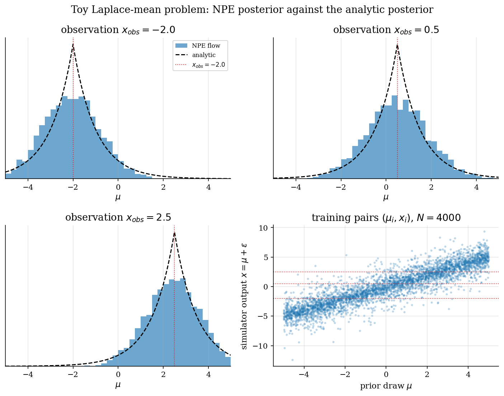
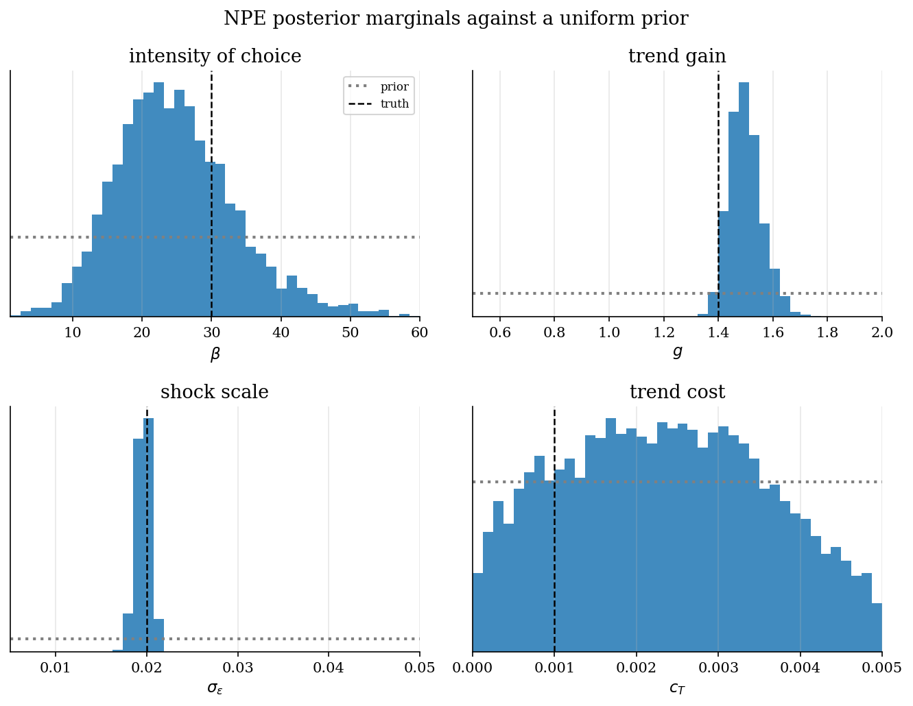
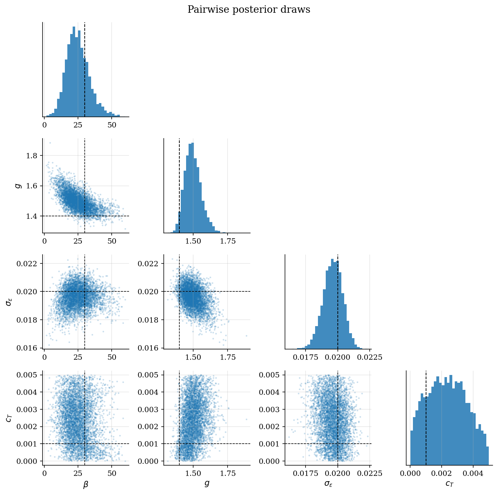
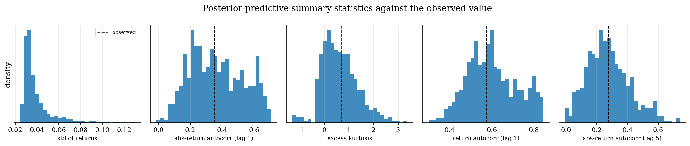
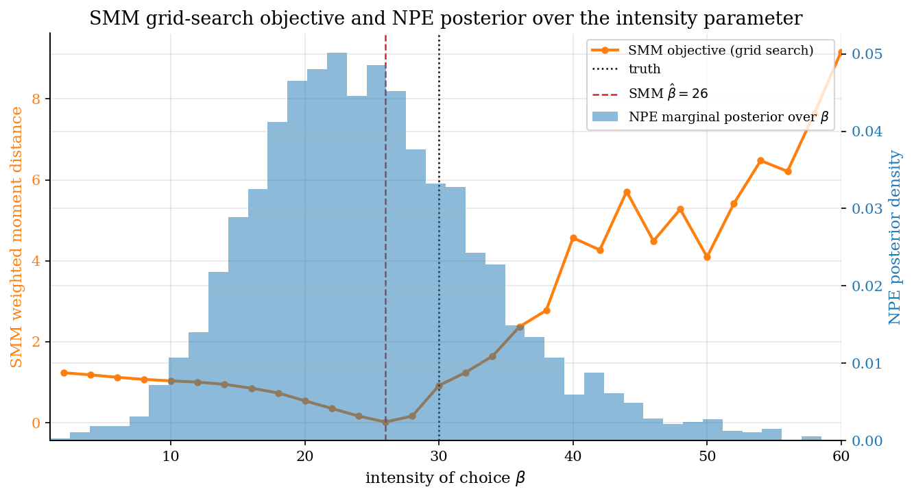

# Neural Posterior Estimation of the Brock-Hommes Asset Pricing ABM

## Overview

The Brock-Hommes asset-pricing ABM lives in [`brock-hommes-asset-pricing`](../../agent-based-models/brock-hommes-asset-pricing/). There it is estimated by simulated method of moments on a single parameter, the intensity of choice. This tutorial re-estimates the same model as a Bayesian posterior over four parameters at once.

The estimator is neural posterior estimation. The analyst draws parameter vectors from a prior, runs the structural simulator on each draw, and trains a normalizing flow on the resulting pairs. After training, the flow evaluates the posterior at the observed summary statistics. There is no likelihood. There is no Markov chain. The same trained flow can also be evaluated at any other observation, which is what amortized inference buys.

This is the Bayesian neural counterpart of the frequentist adversarial estimator in [`adversarial-estimation`](../../structural-econometrics/adversarial-estimation/) and the amortized cousin of the ABC-SMC sampler in [`simulation-based-estimation`](../../computational-methods/simulation-based-estimation/). Where ABC accepts or rejects against a fixed tolerance schedule, neural posterior estimation learns the conditional density directly.

## Equations

The model is the same as in
[`brock-hommes-asset-pricing`](../../agent-based-models/brock-hommes-asset-pricing/).
Briefly: let $p_t$ be the risky-asset price, $d$ the constant per-period
dividend, and $R$ the gross risk-free return. The constant-dividend
fundamental is $p^{\ast} = d / (R - 1)$ and the model state is the price
deviation $x_t = p_t - p^{\ast}$. Traders use one of two forecasting rules,
indexed by $h \in \lbrace F, T \rbrace$ for fundamentalist and trend
follower. Rule $h$ has share $n_{h,t}$ in the market and a realized-profit
score $\rho_{h,t}$ that records how well its last forecast paid. Scores
are smoothed with memory $\lambda \in (0, 1)$:

$$
U_{h,t} = \lambda U_{h,t-1} + (1-\lambda) \rho_{h,t},
\qquad
n_{h,t} = \frac{\exp(\beta U_{h,t})}{\sum_{j \in \lbrace F, T \rbrace} \exp(\beta U_{j,t})}.
$$

The summation index $j$ runs over the same rule set $\lbrace F, T \rbrace$
as $h$. The free parameters are
$\theta = (\beta, g, \sigma_{\epsilon}, c_T)$:
$\beta$ the intensity of choice (logit sharpness),
$g$ the trend gain (extrapolation strength in the trend-follower forecast),
$\sigma_{\epsilon}$ the shock scale (standard deviation of noise-trader
supply), and $c_T$ the trend-following cost. All four enter the simulator
nonlinearly through the logit-choice loop. The data-generating density
$p(y \mid \theta)$ over the simulator output $y$ would be needed for
standard Bayes; it is intractable here, since $y$ is the endpoint of 700
successive logit draws and forecast updates. The strategy of this tutorial
is to replace that density with samples.

### Normalizing flows

A normalizing flow is a parameterized bijection $f_{\phi}$ between two
spaces of equal dimension, with parameters $\phi$. Push a standard base
sample $z \sim p_{0}$ (usually $p_{0} = \mathcal{N}(0, I)$, with $I$ the
identity matrix) through $f_{\phi}$ to obtain
$\theta = f_{\phi}(z; y)$, conditioned on simulator output $y$. From here
on $y$ denotes simulator output, distinct from the model state $x_t$ above.
The change of variables theorem gives the implied density on $\theta$:

$$
q_{\phi}(\theta \mid y)
=
p_{0}\left(f_{\phi}^{-1}(\theta; y)\right)
\cdot
\underbrace{\left| \det J_{f_{\phi}^{-1}}(\theta; y) \right|}_{\substack{\text{Jacobian determinant of the} \\ \text{inverse map at } (\theta; y)}}.
$$

Two properties make the flow useful: every $\theta$ has a tractable density
$q_{\phi}(\theta \mid y)$, and drawing samples from it costs one forward
pass through $f_{\phi}$. The flow is a flexible probability density and a
flexible sampler at the same time. The masked autoregressive flow
(Papamakarios, Pavlakou, and Murray 2017) factors the density into a
product of conditional Gaussians and masks the network weights so the
Jacobian is triangular, which makes the determinant cheap to compute.

### Neural posterior estimation

Let $\pi_{\theta}$ denote the prior over the parameter vector $\theta$; this
is a different object from the per-type profit score $\rho_{h,t}$ above.
NPE chooses the flow parameters $\phi$ that minimize the expected negative
log-density of the true parameters under the flow:

$$
\underbrace{\mathcal{L}(\phi)}_{\text{training loss}}
=
\mathbb{E}_{\theta \sim \pi_{\theta}, \, y \sim p(y \mid \theta)}
\left[
\underbrace{- \log q_{\phi}(\theta \mid y)}_{\text{flow log-density}}
\right].
$$

The expectation is over the joint distribution of prior samples and
simulator outputs. The training data are pairs $(\theta_i, y_i)$ with
$\theta_i$ drawn from the prior $\pi_{\theta}$ and $y_i$ obtained by
running the simulator on $\theta_i$. In the population limit the minimizer
of this loss equals the true posterior
$p(\theta \mid y) \propto p(y \mid \theta) \, \pi_{\theta}(\theta)$; the
construction is due to Papamakarios and Murray (2016) and the
simulation-based-inference setting is reviewed in
Cranmer-Brehmer-Louppe (2020). The same trained flow can then be evaluated
at any future observation $y_{obs}$ without rerunning the simulator: this
is the amortization property.

### A worked toy example

Before trusting the loss on the Brock-Hommes simulator, it helps to see it
recover a posterior that is also available in closed form. The toy problem
in this section is one-dimensional with a known Laplace likelihood, so the
analytic posterior is a curve we can plot against the NPE output. Passing
this check is necessary, not sufficient, for the four-parameter BH run
that follows.

Let $\theta = \mu$ be a single mean parameter and let the simulator produce

$$
y = \mu + \varepsilon, \qquad \varepsilon \sim \mathrm{Laplace}(0, 1).
$$

Place a uniform prior $\mu \sim \mathrm{U}(-5, 5)$. The Laplace likelihood
is $p(y \mid \mu) = \tfrac{1}{2} \exp(-\lvert y - \mu \rvert)$, so Bayes'
rule yields the closed-form posterior

$$
p(\mu \mid y_{obs})
\propto
\exp(-\lvert y_{obs} - \mu \rvert)
\cdot
\mathbf{1}\lbrace \mu \in [-5, 5] \rbrace.
$$

Mode at $y_{obs}$, tails decaying at the unit-scale Laplace rate, truncated
to the prior support. Now pretend the likelihood is unknown. Draw
$N = 4000$ prior samples, run the simulator on each, and train a masked
autoregressive flow on the resulting $(\mu_i, y_i)$ pairs. The trained
flow can be sampled at any observation by setting its conditioning input
to the value of interest.

#### Walk-through with concrete numbers

One iteration with concrete numbers makes the loop above easier to read.
A single training pair on this toy simulator looks like:

```text
Step 1.  Draw mu_i ~ U(-5, 5).               example: mu_i  = 1.847
Step 2.  Draw eps_i ~ Laplace(0, 1).          example: eps_i = -0.320
Step 3.  Simulator output y_i = mu_i + eps_i. example: y_i   = 1.527
Step 4.  Append (mu_i, y_i) to the train set.
Repeat 4000 times.
Step 5.  Train MAF by minimizing
         -mean_i log q_phi(mu_i | y_i).
Step 6.  Query at y_obs = 1.0:
         draws ~ q_phi(. | 1.0).
         The histogram should sit near mu = 1.0
         with unit-Laplace spread.
```

A numerical sanity check on Step 6 is also possible by hand. At $y_{obs} = 1.0$ the unnormalized posterior is $\exp(-\lvert 1 - \mu \rvert)$. Integrating over the prior support gives

$$
Z = \int_{-5}^{5} \exp(-\lvert 1 - \mu \rvert) \, d\mu = (1 - e^{-6}) + (1 - e^{-4}) \approx 1.979,
$$

so the normalized posterior densities at three candidate $\mu$ values are $p(\mu = 1 \mid 1.0) \approx 0.505$, $p(\mu = 0 \mid 1.0) \approx 0.186$, $p(\mu = -1 \mid 1.0) \approx 0.068$. Any NPE flow trained on enough simulator pairs must reproduce these three numbers up to flow expressivity and Monte Carlo error. The toy-example figure shows this is the case at two other observations.

#### Figure

The figure below overlays the analytic posterior (dashed) on the NPE
flow samples (histogram) at three different observations
$y_{obs} \in \lbrace -2, 0.5, 2.5 \rbrace$. A single trained flow handles
all three: the same machinery used on Brock-Hommes below. The bottom-right
panel shows the training set: a tilted cloud of $(\mu_i, y_i)$ pairs
running along the $y = \mu$ diagonal with Laplace-thickness perpendicular
to it.



### Back to the structural model

For the Brock-Hommes calibration the parameter vector $\theta$ is
four-dimensional and the raw simulator output is a 700-period price
deviation path $x_{1:T_{sim}}$. Conditioning the flow on the full path
would force a 700-dimensional input. The remedy is to summarize the path
with a short vector of economic moments $y = s(x_{1:T_{sim}}) \in \mathbb{R}^{5}$
before training: the flow conditions on those summaries rather than on the
raw simulator output. The next section lists the five summaries used.

## Model Setup

The prior is a four-dimensional box. Bounds are wide enough to admit behaviorally distinct dynamics: $\beta$ spans from near-uniform switching to near-corner allocations, $g$ spans weak to strong extrapolation, $\sigma_{\epsilon}$ spans quiet to noisy markets, and $c_T$ ranges from no cost to a level that meaningfully penalizes the trend rule.

| Parameter | Symbol | Prior | True value | Role |
|---|---:|:---:|---:|---|
| Intensity of choice | $\beta$ | $\mathrm{U}(1, 60)$ | 30 | Logit sharpness over forecasting rules |
| Trend gain | $g$ | $\mathrm{U}(0.50, 2.00)$ | 1.40 | Strength of extrapolative forecast |
| Shock scale | $\sigma_\epsilon$ | $\mathrm{U}(0.005, 0.050)$ | 0.020 | Std of noise-trader supply shock |
| Trend cost | $c_T$ | $\mathrm{U}(0.000, 0.005)$ | 0.001 | Cost of using the trend rule |

Other primitives stay at the values used in the SMM tutorial: the gross risk-free return $R = 1.01$, dividend $d = 0.20$, forecast bound on the trend rule $\bar x = 0.35$ (caps the extrapolated trend so the simulator stays bounded), score memory $\lambda = 0.80$, combined risk-aversion scale $a\sigma^{2} = 0.04$ (the product of absolute risk aversion and return variance that appears in the profit score), simulation horizon $T_{sim} = 700$, and burn-in $T_{0} = 100$ periods discarded before any moment is computed.

The simulator output is reduced to five summary statistics on the post-burn return series $r_t = \Delta x_t = x_t - x_{t-1}$. The first three are the moments the SMM tutorial already targets; the last two add linear return persistence and a longer-lag volatility-clustering signal.

| Index | Summary statistic |
|:---:|---|
| $s_0$ | standard deviation of $r_t$ |
| $s_1$ | $\mathrm{corr}(\lvert r_t \rvert, \lvert r_{t-1} \rvert)$ |
| $s_2$ | excess kurtosis of $r_t$ |
| $s_3$ | $\mathrm{corr}(r_t, r_{t-1})$ |
| $s_4$ | $\mathrm{corr}(\lvert r_t \rvert, \lvert r_{t-5} \rvert)$ |

The observation $y_{obs}$ is the average of $s(\cdot)$ over 4 independent simulations at the true parameter vector. Averaging trims simulator variance the same way the SMM tutorial does with its eight-bank common random numbers.

## Solution Method

The training loop is short. Draw parameter samples from the prior, simulate the model, train one density estimator on the pairs.

```text
Algorithm: NPE-MAF for Brock-Hommes
Input: prior pi, simulator s o BH, training size N = 10000
Output: posterior density q_phi(theta | x_obs)

1. For i = 1..N:
   1a. theta_i ~ pi  (uniform on the 4-d box)
   1b. x_i = s(BH(theta_i, eps_i))  with eps_i ~ N(0, sigma_eps^2 I)
2. Train masked autoregressive flow q_phi on {(theta_i, x_i)}
   by minimizing  - mean_i log q_phi(theta_i | x_i).
3. Evaluate q_phi at x_obs:
   3a. Draw posterior samples theta^(k) ~ q_phi(. | x_obs).
   3b. Posterior summaries: marginals, pairs, predictive checks.
```

The flow architecture is the sbi default masked autoregressive flow (Papamakarios et al. 2017). Training uses Adam with early stopping on a held-out validation split. After training, the flow is amortized: evaluating at any other observation $x'$ produces a posterior without any new simulator calls.

## Results

Posterior marginals cover the truth for all four parameters but with very different widths. Shock scale $\sigma_\epsilon$ is the best-identified parameter and concentrates inside a narrow band around the truth, because the noise-trader supply shock enters the market-clearing equation additively and is the dominant driver of return volatility in the simulator (Brock and Hommes 1998). Trend gain $g$ is the next tightest, since the return autocorrelation and absolute-return clustering moments respond strongly to it. Intensity of choice $\beta$ is identified but with substantial posterior uncertainty, which is the same pattern the SMM grid sees as a flat objective near the minimum. The trend cost $c_T$ is barely informed by the chosen summary statistics; its posterior tracks the prior across most of the box. That uneven identification is itself a finding: it tells the analyst which moments to add if a tighter posterior on $c_T$ is needed.



The pairwise scatter shows where identification leans on joint structure. Shock scale $\sigma_\epsilon$ separates cleanly from the other three because it is the one parameter that moves return volatility one-to-one. Trend gain $g$ and intensity of choice $\beta$ share a band of equivalent moment fits, so the posterior in the $(\beta, g)$ panel is a tilted cloud rather than two independent peaks. The $c_T$ rows and columns spread across the full prior range, consistent with the marginal.



Posterior-predictive checks resimulate the model at posterior draws and recompute the five summary statistics. Observed values sit comfortably inside the predictive distributions for all five moments, which is the lightweight goodness-of-fit test for an ABM with no closed-form likelihood.



The final comparison panel lines the new posterior up against the SMM grid search from [`brock-hommes-asset-pricing`](../../agent-based-models/brock-hommes-asset-pricing/). The SMM objective is U-shaped over $\beta$ with a minimum at $\hat\beta = 26$. The NPE marginal over the same $\beta$ has posterior mean near 25 and a 95% credible interval that contains both the SMM point estimate and the true value 30. Two estimators that share three of the five summary statistics land in the same neighborhood. The NPE posterior adds the joint uncertainty across all four parameters that the SMM grid never tried to compute.



Posterior mean, standard deviation, and a 95% equal-tailed credible interval. All four intervals cover the truth and lie strictly inside the prior support.

**Posterior summary statistics for the four estimated parameters**

| parameter   |   truth |   posterior mean |   posterior sd |      ci 2.5% |    ci 97.5% |
|:------------|--------:|-----------------:|---------------:|-------------:|------------:|
| beta        |  30     |      24.8788     |    8.64522     | 10.2062      | 44.521      |
| g           |   1.4   |       1.49919    |    0.0599712   |  1.39726     |  1.63212    |
| sigma_eps   |   0.02  |       0.0196212  |    0.000770872 |  0.0180503   |  0.0210576  |
| c_T         |   0.001 |       0.00233961 |    0.0012435   |  0.000217827 |  0.00467639 |

Predictive means hug the observed values and the predictive standard deviations report the simulator-plus-parameter uncertainty the moment-matching SMM exercise leaves implicit.

**Observed versus posterior-predictive summary statistics**

| summary statistic           |   observed |   posterior-predictive mean |   posterior-predictive sd |
|:----------------------------|-----------:|----------------------------:|--------------------------:|
| std of returns              |  0.0334434 |                   0.0392432 |                 0.0148263 |
| abs-return autocorr (lag 1) |  0.350266  |                   0.364819  |                 0.165574  |
| excess kurtosis             |  0.67058   |                   0.639452  |                 0.722488  |
| return autocorr (lag 1)     |  0.573126  |                   0.60167   |                 0.117623  |
| abs-return autocorr (lag 5) |  0.276652  |                   0.276546  |                 0.138619  |

## Takeaway

Neural posterior estimation handles a four-parameter Brock-Hommes calibration at roughly the same simulation budget the SMM tutorial uses for a single parameter. The masked autoregressive flow replaces both the grid search and the ABC accept-reject loop with a single trained density estimator. The same estimator is amortized over the summary-statistic space, so a new return series would only require a forward evaluation, not another training run.

## References

- [Brock, W. A., and Hommes, C. H. (1998). Heterogeneous beliefs and routes to chaos in a simple asset pricing model. *Journal of Economic Dynamics and Control*, 22(8-9), 1235-1274.](https://doi.org/10.1016/S0165-1889(98)00011-6)
- [Cranmer, K., Brehmer, J., and Louppe, G. (2020). The frontier of simulation-based inference. *PNAS*, 117(48), 30055-30062.](https://doi.org/10.1073/pnas.1912789117)
- [Papamakarios, G., and Murray, I. (2016). Fast epsilon-free inference of simulation models with Bayesian conditional density estimation. *NeurIPS*, 29.](https://papers.nips.cc/paper/2016/hash/6aca97005c68f1206823815f66102863-Abstract.html)
- [Papamakarios, G., Pavlakou, T., and Murray, I. (2017). Masked autoregressive flow for density estimation. *NeurIPS*, 30.](https://papers.nips.cc/paper/2017/hash/6c1da886822c67822bcf3679d04369fa-Abstract.html)
- [Tejero-Cantero, A., Boelts, J., Deistler, M., Lueckmann, J.-M., Durkan, C., Gonçalves, P. J., Greenberg, D. S., and Macke, J. H. (2020). sbi: A toolkit for simulation-based inference. *Journal of Open Source Software*, 5(52), 2505.](https://doi.org/10.21105/joss.02505)
