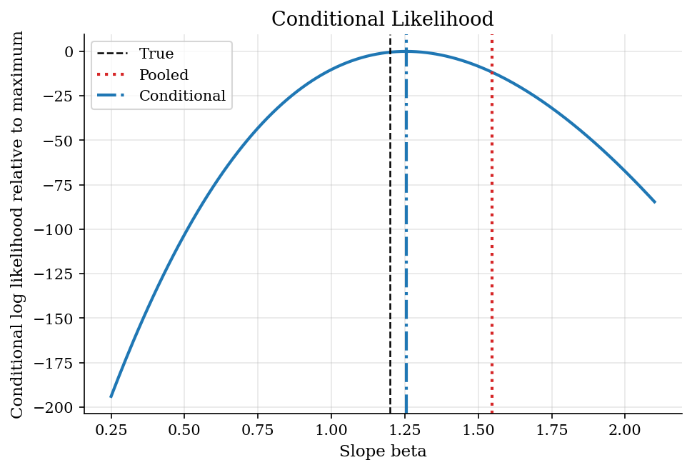
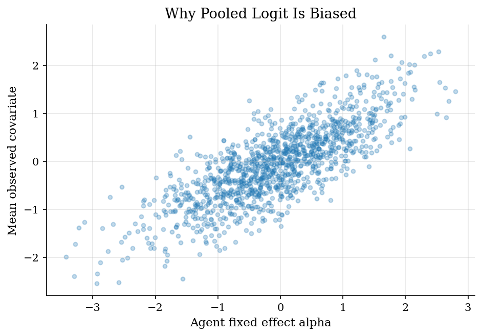
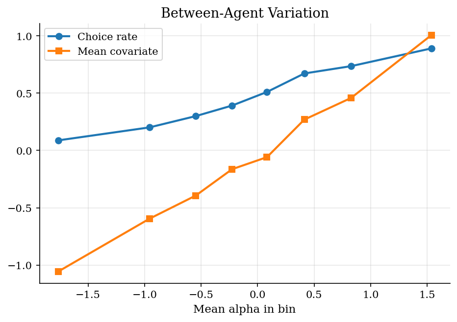

# Conditional Logit for Fixed Effects Panels

> Condition out agent heterogeneity in a short binary-choice panel.

## Overview

Short panels often contain persistent unobserved heterogeneity. In this example, some agents have a high baseline taste for the inside option, and those same agents also tend to face higher values of the observed covariate. A pooled logit confuses that permanent heterogeneity with the causal slope on the covariate.

The computational method is the conditional likelihood for fixed-effects logit. Instead of estimating one intercept per agent, the likelihood conditions on each agent's total number of successes. That sufficient statistic removes the fixed effect, so the slope is identified from within-agent changes in the covariate.

## Equations

Agent $i$ is observed for $T$ periods. The binary choice model is

$$
\Pr(y_{it}=1\mid x_{it},\alpha_i)
= \frac{\exp(\alpha_i+\beta x_{it})}{1+\exp(\alpha_i+\beta x_{it})}.
$$

The fixed effect $\alpha_i$ is unrestricted and may be correlated with the
observed covariate. Conditional on $s_i=\sum_t y_{it}$, the probability of the
observed choice sequence no longer contains $\alpha_i$:

$$
\Pr(y_i\mid s_i,x_i;\beta)
=
\frac{\exp\{\beta\sum_t y_{it}x_{it}\}}
{\sum_{A:|A|=s_i}\exp\{\beta\sum_{t\in A}x_{it}\}}.
$$

The conditional log likelihood is the sum of these terms over agents with
$0<s_i<T$. Agents who always choose zero or always choose one identify their
own intercepts but contribute no within-agent slope information.

## Model Setup

| Object | Value | Role |
|--------|-------|------|
| Agents | 1200 | Short panel units with unobserved heterogeneity |
| Periods | 5 | Repeated binary choices per agent |
| True slope $\beta$ | 1.20 | Effect of the observed covariate |
| Fixed effect | $\alpha_i\sim N(0,1)$ | Permanent agent taste for choosing one |
| Covariate correlation | positive | Agent means in $x$ move with $\alpha_i$ |
| Switchers | 846 | Agents used by the conditional likelihood |
| Non-switchers | 354 | Agents conditioned out of slope estimation |

## Solution Method

The denominator is small here because each agent has five observations. The code enumerates all subsets with the observed number of successes and evaluates the conditional likelihood directly.

```text
Algorithm: fixed-effects conditional logit
Input: panel choices y_it and covariates x_it
For each agent i:
  Compute s_i = sum_t y_it
  If s_i is 0 or T, drop agent from the conditional likelihood
  Enumerate all subsets A of periods with cardinality s_i
  Add beta sum_t y_it x_it minus log sum_A exp(beta sum_{t in A} x_it)
Choose beta that maximizes the summed conditional likelihood
Compare against pooled logit and known truth
```

For larger $T$, the denominator can be computed by dynamic programming instead of literal enumeration. The economic idea is unchanged: use within-agent variation and avoid estimating thousands of nuisance intercepts.

## Results

The conditional likelihood peaks near the true slope. The pooled logit slope is **1.546**, while the conditional estimate is **1.254** against the true value **1.200**. The gap is the omitted fixed-effect problem made visible.

The likelihood is normalized by subtracting its maximum so the curvature is visible.



The simulation deliberately correlates the agent effect with the mean covariate. That is the setting where treating every observation as independent logit data is not innocuous.

Agents with higher permanent taste also tend to face higher covariate values.



Between-agent comparisons are contaminated by permanent tastes. Conditional logit throws away that between-agent intercept information and uses only switchers for the slope.

The binned pattern shows why between-agent variation cannot be read as the structural slope.



The pooled and conditional likelihoods condition on different information, so their levels are not directly comparable.

**Pooled versus conditional logit estimates**

| Estimator                       |   Slope estimate |   Slope error |   Log likelihood | Success   |   Iterations or evaluations |
|:--------------------------------|-----------------:|--------------:|-----------------:|:----------|----------------------------:|
| Pooled logit                    |          1.5463  |       0.3463  |         -3045.27 | True      |                          10 |
| Conditional fixed-effects logit |          1.25395 |       0.05395 |         -1335.53 | True      |                          14 |

The bin table summarizes the source of pooled-logit bias in the simulated panel.

**Agent-effect bin diagnostics**

|   Alpha bin |   Mean alpha |   Mean covariate |   Choice rate |   Agents |
|------------:|-------------:|-----------------:|--------------:|---------:|
|           1 |     -1.76519 |         -1.05708 |       0.088   |      150 |
|           2 |     -0.9571  |         -0.59571 |       0.20133 |      150 |
|           3 |     -0.54737 |         -0.39354 |       0.3     |      150 |
|           4 |     -0.22614 |         -0.16351 |       0.392   |      150 |
|           5 |      0.08246 |         -0.05831 |       0.51067 |      150 |
|           6 |      0.41282 |          0.26929 |       0.672   |      150 |
|           7 |      0.8269  |          0.4585  |       0.736   |      150 |
|           8 |      1.53648 |          1.00611 |       0.89067 |      150 |

The conditional estimator's identifying sample is the switcher group.

**Panel and identification diagnostics**

| Diagnostic                   |     Value |
|:-----------------------------|----------:|
| Choice rate                  | 0.473833  |
| Switcher share               | 0.705     |
| Correlation alpha and mean x | 0.788262  |
| Pooled beta error            | 0.346299  |
| Conditional beta error       | 0.0539538 |

## Takeaway

Conditional logit is a computational way to remove fixed effects rather than estimate them. Conditioning on each agent's total number of successes eliminates the nuisance intercept and makes the slope come from within-agent comparisons. The cost is also clear: agents with no choice variation do not identify the slope.

## References

- [Chamberlain, G. (1980). Analysis of Covariance with Qualitative Data. *Review of Economic Studies*, 47(1), 225-238.](https://doi.org/10.2307/2297110)
- [Andersen, E. B. (1970). Asymptotic Properties of Conditional Maximum-Likelihood Estimators. *Journal of the Royal Statistical Society: Series B*, 32(2), 283-301.](https://doi.org/10.1111/j.2517-6161.1970.tb00840.x)
