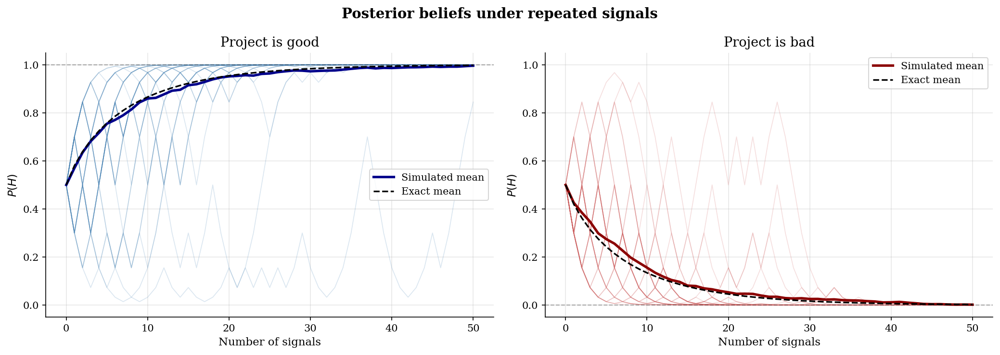
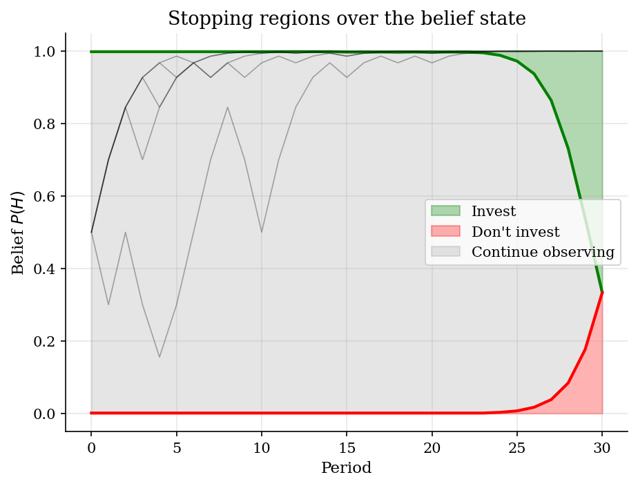

# Sequential Investment Under Bayesian Learning

## Overview

Suppose a firm can invest in a project, but project quality is hidden. Each signal is red or blue. A red signal raises the chance that the project is good. A blue signal lowers it.

The object is the posterior belief $p_t=\Pr(H \mid s_1,\ldots,s_t)$. It summarizes the signal history for both learning and investment timing. Extreme beliefs lead to investment or rejection. Middle beliefs can justify waiting.

The computation updates $p_t$ with Bayes' rule and solves a finite-horizon Bellman problem. Backward induction maps each belief into invest, reject, or continue regions.

## Equations

Let $\theta\in\{H,L\}$ denote the unknown state and let $s_t\in\{R,B\}$ denote
the period-$t$ signal. The maintained signal probabilities are

$$\Pr(R\mid H)=p_H,\qquad \Pr(R\mid L)=p_L,\qquad p_H>p_L.$$

The posterior after observing $s_{t+1}$ is

$$p_{t+1}
=\frac{f_H(s_{t+1})p_t}
{f_H(s_{t+1})p_t+f_L(s_{t+1})(1-p_t)},$$

where $f_\theta(s)=\Pr(s\mid \theta)$.

Equivalently, posterior odds evolve additively in log likelihood ratios:

$$\log\frac{p_{t+1}}{1-p_{t+1}}
=\log\frac{p_t}{1-p_t}
+\log\frac{f_H(s_{t+1})}{f_L(s_{t+1})}.$$

After $T$ signals, if $k_T$ of them are red, the sufficient statistic is

$$\Lambda_T
=k_T\log\frac{p_H}{p_L}
+(T-k_T)\log\frac{1-p_H}{1-p_L}.$$

For the stopping problem, investing gives payoff $\pi_H$ in state $H$ and
$\pi_L$ in state $L$; rejecting gives zero. At belief $p$, the current action
value is

$$A(p)=\max[p\pi_H+(1-p)\pi_L,\ 0].$$

With one more signal available, the continuation value is

$$C_t(p)=\Pr(R\mid p)V_{t+1}(p_R')+\Pr(B\mid p)V_{t+1}(p_B'),$$

where $\Pr(R\mid p)=p\,p_H+(1-p) p_L$ is the predictive probability of a red signal at belief $p$, $\Pr(B\mid p)=1-\Pr(R\mid p)$, and $p_R'$ and $p_B'$ are the Bayes-updated beliefs after a red or blue signal. The finite-horizon recursion is

$$V_t(p)=\max[A(p),\ C_t(p)].$$

## Model Setup

The signal process is symmetric around an uninformative prior. A red signal is evidence for $H$. A blue signal is evidence for $L$.

| Object | Value | Role |
|-----------|-------|-------------|
| $p_H$ | 0.7 | Probability of a red signal in state $H$ |
| $p_L$ | 0.3 | Probability of a red signal in state $L$ |
| Prior $p_0$ | 0.5 | Initial belief $\Pr(H)$ |
| Signal horizon | 50 | Draws used for belief paths |
| Stopping horizon | 30 | Periods used for the backward-induction boundary |
| Simulated paths | 200 per state | Monte Carlo paths shown against exact means |
| Investment payoff in $H$ | 1.0 | Payoff if the project is good |
| Investment payoff in $L$ | -0.5 | Payoff if the project is bad |
| Reject payoff | 0.0 | Outside option after stopping |

## Solution Method

Bayesian filtering maps the signal history into one posterior belief. Backward induction compares immediate action payoffs with the value of one more signal. The comparison is made on a grid of beliefs.

```text
Algorithm: Bayesian filtering and finite-horizon stopping
Input: prior p_0, likelihoods f_H and f_L, payoffs pi_H and pi_L, horizon T
Output: posterior path p_t and stopping regions over beliefs

Filtering:
    for each incoming signal s_{t+1}:
        multiply prior odds p_t / (1-p_t) by f_H(s_{t+1}) / f_L(s_{t+1})
        convert odds back to p_{t+1}

Stopping:
    set terminal value V_T(p) = max[p*pi_H + (1-p)*pi_L, 0]
    for t = T-1, ..., 0:
        for each belief grid point p_i:
            compute posteriors after red and blue signals
            interpolate V_{t+1} at those two posteriors
            compare action value A(p_i) with continuation value C_t(p_i)
        record the reject, continue, and invest regions
```

## Results

Light traces are individual histories. The solid curve is the mean across 200 simulated paths. The dashed curve integrates the posterior over the exact binomial signal law. Good projects push beliefs toward one. Bad projects push beliefs toward zero. Early dispersion is the information problem.



The stopping boundary turns posterior beliefs into actions. High beliefs make investment attractive. Low beliefs make rejection attractive. Middle beliefs preserve the value of another signal. The continuation region shrinks as the deadline approaches.



## Takeaway

Bayesian learning reduces a long signal history to the posterior belief relevant for choice. That belief sets the stopping boundary and prices the value of one more signal.

The investment rule is simple once the belief state is known. Act at extreme beliefs, wait in the middle, and stop waiting as the deadline approaches.

## References

- DeGroot, M. (1970). *Optimal Statistical Decisions*. McGraw-Hill.
- Chamley, C. (2003). *Rational Herds: Economic Models of Social Learning*. Cambridge University Press.
