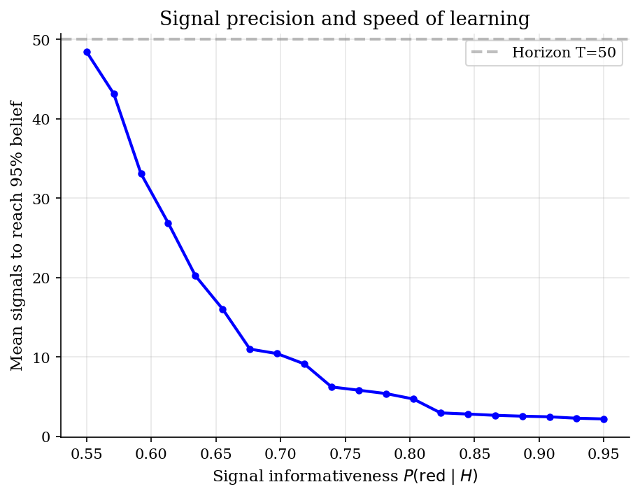
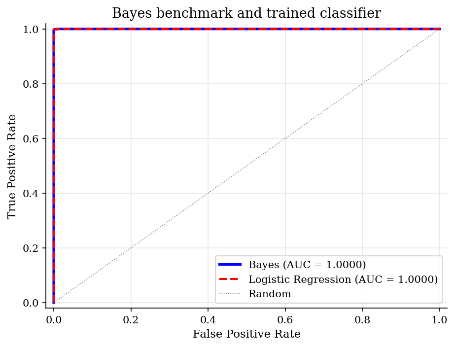

# Bayesian Learning and Sequential Investment

> Posterior beliefs, sufficient statistics, and the option value of waiting before investment.

## Overview

A firm is deciding whether to invest in a project whose quality is not directly observed. Each signal is noisy, so no single draw settles the question. What matters for choice is the posterior probability that the project is good, not the full signal history.

The tutorial uses the two-state urn model because it makes that compression exact. Nature chooses state $H$ or $L$, signals arrive sequentially, and the agent updates $p_t=\Pr(H \mid s_1,\ldots,s_t)$. The posterior is then fed into a finite-horizon stopping problem: invest when confidence is high, reject when confidence is low, and continue sampling when information still has option value.

Within the choice section, this is a belief-state example rather than a demand model. It complements [plain logit demand](../logit-discrete-choice/) because both rely on log odds, but here the probability is a posterior about an unknown state rather than a market share.

## Equations

Let $\theta\in\{H,L\}$ denote the unknown state and let $s_t\in\{R,B\}$ denote
the period-$t$ signal. The maintained signal probabilities are

$$\Pr(R\mid H)=p_H,\qquad \Pr(R\mid L)=p_L,\qquad p_H>p_L.$$

The posterior after observing $s_{t+1}$ is

$$p_{t+1}
=\frac{f_H(s_{t+1})p_t}
{f_H(s_{t+1})p_t+f_L(s_{t+1})(1-p_t)},$$

where $f_\theta(s)=\Pr(s\mid \theta)$.

Equivalently, posterior odds evolve additively in log likelihood ratios:

$$\log\frac{p_{t+1}}{1-p_{t+1}}
=\log\frac{p_t}{1-p_t}
+\log\frac{f_H(s_{t+1})}{f_L(s_{t+1})}.$$

After $T$ signals, if $k_T$ of them are red, the sufficient statistic is

$$\Lambda_T
=k_T\log\frac{p_H}{p_L}
+(T-k_T)\log\frac{1-p_H}{1-p_L}.$$

For the stopping problem, investing gives payoff $\pi_H$ in state $H$ and
$\pi_L$ in state $L$; rejecting gives zero. At belief $p$, the current action
value is

$$A(p)=\max[p\pi_H+(1-p)\pi_L,\ 0].$$

With one more signal available, the continuation value is

$$C_t(p)=\Pr(R\mid p)V_{t+1}(p_R')+\Pr(B\mid p)V_{t+1}(p_B'),$$

where $p_R'$ and $p_B'$ are the Bayes-updated beliefs after a red or blue
signal. The finite-horizon recursion is

$$V_t(p)=\max[A(p),\ C_t(p)].$$

## Model Setup

The calibration is symmetric around an uninformative prior. A red signal is evidence for $H$; a blue signal is evidence for $L$. The classifier comparison uses synthetic data from the same signal structure, so the Bayesian rule is the known benchmark rather than an estimated model.

| Object | Value | Role |
|-----------|-------|-------------|
| $p_H$ | 0.7 | Probability of a red signal in state $H$ |
| $p_L$ | 0.3 | Probability of a red signal in state $L$ |
| Prior $p_0$ | 0.5 | Initial belief $\Pr(H)$ |
| Signal horizon | 50 | Draws used for belief paths and classification |
| Simulated paths | 200 per state | Monte Carlo paths shown against exact means |
| Classifier training sample | 5000 | Histories used to train logistic regression |
| Classifier test sample | 2000 | Histories used for finite-sample accuracy |
| Investment payoff in $H$ | 1.0 | Payoff if the project is good |
| Investment payoff in $L$ | -0.5 | Payoff if the project is bad |
| Reject payoff | 0.0 | Outside option after stopping |

## Solution Method

There are two computational objects. The first is the filtering recursion that maps a signal history into one posterior belief. The second is a stopping boundary on that belief state. The logistic-regression exercise is only a comparison: it asks how close a flexible statistical classifier gets when the true likelihoods are already known to the Bayesian agent.

```text
Algorithm: Bayesian filtering and finite-horizon stopping
Input: prior p_0, likelihoods f_H and f_L, payoffs pi_H and pi_L, horizon T
Output: posterior path p_t and stopping regions over beliefs

Filtering:
    for each incoming signal s_{t+1}:
        multiply prior odds p_t / (1-p_t) by f_H(s_{t+1}) / f_L(s_{t+1})
        convert odds back to p_{t+1}

Stopping:
    set terminal value V_T(p) = max[p*pi_H + (1-p)*pi_L, 0]
    for t = T-1, ..., 0:
        for each belief grid point p_i:
            compute posteriors after red and blue signals
            interpolate V_{t+1} at those two posteriors
            compare action value A(p_i) with continuation value C_t(p_i)
        record the reject, continue, and invest regions
```

The sufficient statistic for classification is the red-signal count $k_T$. For the figures and table below, the code uses the exact binomial distribution of $k_T$ to benchmark the finite Monte Carlo paths and the trained classifier.

## Results

The first figure separates pathwise uncertainty from the law of large numbers. Light traces are individual histories, the solid curve is the mean across the 200 simulated paths, and the dashed curve integrates the posterior exactly over the binomial signal distribution. With a good project, evidence drifts toward one; with a bad project, it drifts toward zero. The early dispersion is not numerical error. It is the information problem.


The next figure varies signal quality while holding the prior fixed. As $p_H$ moves away from one half, each draw carries a larger likelihood-ratio increment. Learning is therefore highly nonlinear in signal precision: weak signals can leave the firm undecided for most of the horizon, while precise signals settle the investment case quickly.



The classifier comparison is intentionally favorable to Bayes: the likelihoods used by the Bayesian rule are the true likelihoods. Logistic regression sees simulated histories and learns a very similar monotone rule in the red-signal count. The near overlap is the point. In this experiment, machine learning recovers the same sufficient statistic rather than discovering a different economic object.



The stopping boundary turns posterior beliefs into actions. High beliefs make investment attractive, low beliefs make rejection attractive, and intermediate beliefs preserve the option value of another signal. The continuation region shrinks as the deadline approaches because there are fewer future opportunities to use the information.


The table separates the population benchmark from finite-sample evaluation. The exact Bayes column integrates over the binomial distribution of signal counts. The test-sample columns use the same simulated histories as the logistic classifier, so small sign changes in the final column are Monte Carlo and training variation, not evidence that the learned classifier has beaten the Bayes rule.

**Classification Accuracy Against the Exact Bayes Benchmark**

|   Signals observed |   Exact Bayes accuracy |   Bayes on test sample |   Logistic accuracy |   Logistic minus exact |
|-------------------:|-----------------------:|-----------------------:|--------------------:|-----------------------:|
|                  5 |                 0.8369 |                 0.838  |              0.838  |                 0.0011 |
|                 10 |                 0.9012 |                 0.899  |              0.9045 |                 0.0033 |
|                 20 |                 0.9674 |                 0.97   |              0.9705 |                 0.0031 |
|                 30 |                 0.9883 |                 0.9905 |              0.9865 |                -0.0018 |
|                 50 |                 0.9983 |                 0.9985 |              0.9985 |                 0.0002 |

## Takeaway

Bayesian learning is useful here because it reduces a long signal history to the posterior belief that is relevant for choice. The same object classifies the state, sets the stopping boundary, and prices the value of one more signal.

The important comparison is not Bayes versus machine learning as slogans. In this controlled experiment the likelihood is known, so Bayes is the population benchmark. A trained classifier can learn the same likelihood-ratio rule from data, but the economic state variable remains the posterior belief. Once that state is in hand, the investment decision is a standard dynamic choice problem: act at extreme beliefs, wait in the middle, and recognize that the waiting region collapses as the deadline approaches.

## References

- DeGroot, M. (1970). *Optimal Statistical Decisions*. McGraw-Hill.
- Chamley, C. (2004). *Rational Herds: Economic Models of Social Learning*. Cambridge University Press.
- El-Gamal, M. and Grether, D. (1995). Are People Bayesian? Uncovering Behavioral Strategies. *Journal of the American Statistical Association*, 90(432), 1137-1145.
- Berger, J. (1985). *Statistical Decision Theory and Bayesian Analysis*. Springer, 2nd edition.
