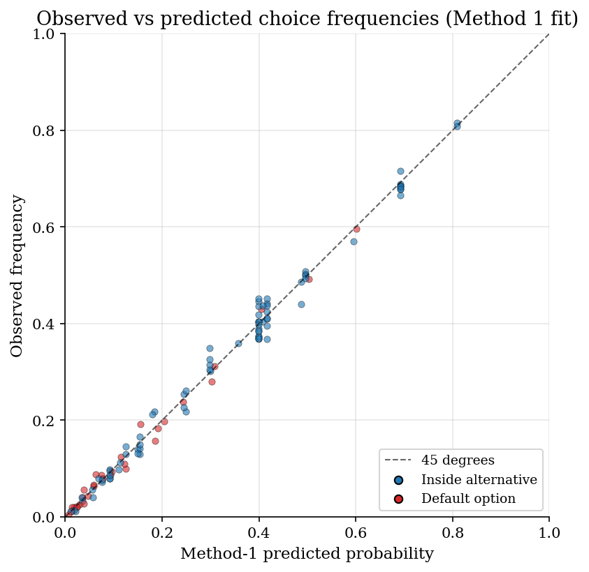
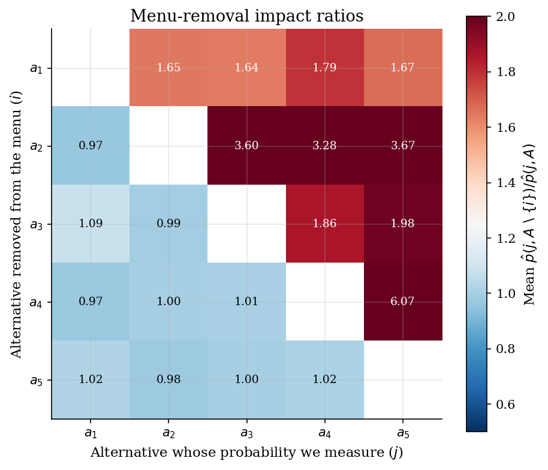
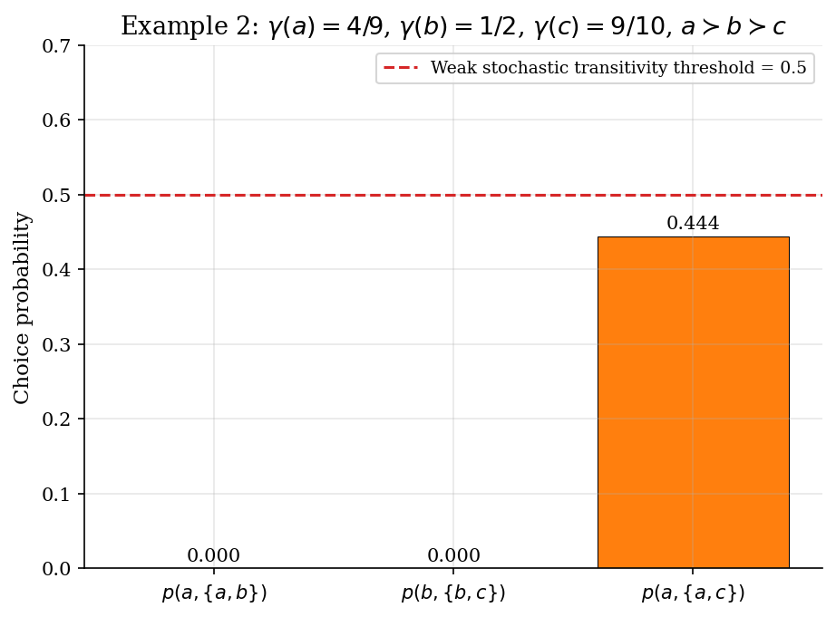
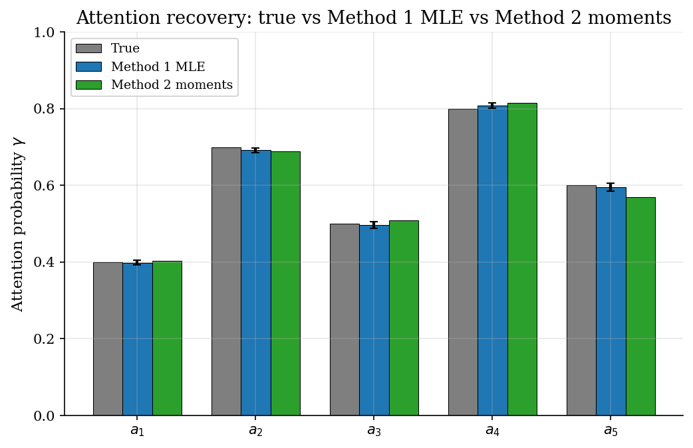

# Stochastic Choice and Random Consideration Sets

## Overview

A consumer faces a menu of products and picks one (or walks away). If the consumer paid attention to every product on the shelf, the best-ranked product would always win. In practice the consumer pays attention to each product only with some probability and picks the best of those that crossed her attention threshold.

Manzini and Mariotti (2014) show that this two-stage random consideration set rule has a closed-form choice probability and that both the underlying preference ranking and the per-alternative attention probabilities are uniquely identified from how choice frequencies vary across menus. The empirical signature is asymmetric: removing a product the consumer ranks above the chosen one raises the chosen one's probability, while removing a product ranked below has no effect.

The tutorial reconstructs both estimation strategies the paper implies. Method 1 is joint maximum likelihood with brute-force enumeration of the $J!$ candidate rankings; the attention MLE has a closed form given the ranking, so the inner step is one division per alternative. Method 2 is a two-step revealed-preference procedure: attention is recovered from singleton menus that include the default, and the ranking is recovered from the asymmetric impact pattern. A Luce / multinomial-logit benchmark on the same data shows where IIA-respecting models break.

## Equations

The general problem is to recover a strict preference ranking and a vector of attention probabilities from stochastic choice data on multiple menus.

### The random consideration set rule

Let $X = \lbrace 1, \ldots, J\rbrace$ be a finite set of alternatives and let $a^{\ast}$ be a default option (walking away, abstaining).
The agent has a strict total order $\succ$ on $X$ and an attention map $\gamma : X \to (0, 1)$.
Faced with a menu $A \subseteq X$, each alternative $b \in A$ enters the random consideration set $C(A) \subseteq A$ independently with probability $\gamma(b)$.
The agent picks the $\succ$-best alternative in $C(A)$; if $C(A) = \varnothing$ she picks $a^{\ast}$.

The induced choice probability (Manzini-Mariotti Definition 2) is closed form:

$$p_{\succ, \gamma}(a, A) = \gamma(a) \prod_{b \in A : b \succ a} (1 - \gamma(b)),
\qquad
p_{\succ, \gamma}(a^{\ast}, A) = \prod_{b \in A} (1 - \gamma(b)).$$

The product is over alternatives in $A$ ranked strictly above $a$.
There is no explicit sum over $2^{|A|}$ consideration sets; the independence of attention draws collapses the sum analytically.

### Identification

Two facts pin down the primitives from observed choice frequencies (Manzini-Mariotti Section 3 and Theorem 1).

The attention probability is recovered from singleton menus that include the default.

$$\gamma(a) = 1 - p(a^{\ast}, \lbrace a\rbrace).$$

The preference ranking is recovered from the asymmetric impact of menu removals.
Removing an alternative ranked above the chosen one raises the chosen one's probability; removing an alternative ranked below has no effect.

$$a \succ b \iff p(a, A) = p(a, A \setminus \lbrace b\rbrace) \text{ for every } A \ni a, b.$$

Equivalently, $a \succ b$ iff $p(b, A) > p(b, A \setminus \lbrace a\rbrace)$ for some menu $A$ containing both.

### Method 1: Joint maximum likelihood with brute-force ranking enumeration

The likelihood factorises across alternatives once the ranking is fixed.
Let $N_c(j)$ count observations in which alternative $j$ was chosen, and let $N_b(j; \succ)$ count observations in which $j$ was in the menu and was ranked above the chosen alternative or above the default.
The conditional MLE of $\gamma(j)$ is then a single ratio:

$$\hat\gamma(j) \mid \succ = \frac{N_c(j)}{N_c(j) + N_b(j; \succ)}.$$

The outer step enumerates the $J!$ candidate rankings and evaluates the resulting log-likelihood; the inner step is closed form.

### Method 2: Two-step revealed-preference identification

Method 2 inverts the identification result directly.
Step 1 estimates attention from singleton menus: $\hat\gamma(a) = 1 - \hat p(a^{\ast}, \lbrace a\rbrace)$, where $\hat p$ is the empirical frequency.
Step 2 estimates the ranking by scoring each alternative on the asymmetric impact pattern.
For each ordered pair $(i, j)$, compute the average change $\hat p(j, A \setminus \lbrace i\rbrace) - \hat p(j, A)$ over menus $A$ containing both.
A higher score for "removing $i$ raises $j$" than for "removing $j$ raises $i$" reveals $i \succ j$.

### Benchmark: Luce / multinomial logit on the same data

A Luce model assigns each alternative a positive utility and predicts

$$p_L(a, A) = \frac{u(a)}{u(a^{\ast}) + \sum_{b \in A} u(b)}.$$

Luce satisfies IIA: removing any alternative raises every other alternative's probability by the same proportional factor.
The Manzini-Mariotti rule predicts a strictly asymmetric pattern and therefore lies outside the Luce class whenever the attention parameters do not co-move with the ranking.

## Model Setup

The simulation uses $J = 5$ alternatives plus a default option, with all $2^{5} - 1 = 31$ non-empty menus presented to each of $N = 500$ subjects. Attention is deliberately not co-monotone with the ranking so the preference order cannot be read off from raw aggregate choice frequencies.

| Symbol | Value | Role |
|--------|-------|------|
| Alternatives | 5 | Plus default $a^{\ast}$ |
| Menus | 31 | Every non-empty subset |
| Subjects | 500 | Independent draws per menu |
| True ranking | $a_1 \succ a_2 \succ a_3 \succ a_4 \succ a_5$ | Strict total order |
| True attention $\gamma$ | $(0.40,  0.70,  0.50,  0.80,  0.60)$ | Per-alternative attention probabilities |
| Bootstrap reps | 80 | Subject-cluster bootstrap for SE |
| Method-1 ranking space | 120 | $J!$ candidate orderings |

## Solution Method

Two estimators recover the same primitives from the same simulated data. They differ in which moment of the data they treat as fundamental.

### Method 1: Joint MLE with brute-force ranking

Method 1 evaluates the closed-form log-likelihood at every one of the $J!$ rankings. For a fixed ranking the attention MLE is a closed-form ratio per alternative because the log-likelihood factorises. The brute-force outer loop is $J!$ evaluations; for $J = 5$ that is $120$ rankings, which finishes in milliseconds. For $J \le 7$ the search is still feasible at $7! = 5040$ rankings; beyond that one needs a heuristic over rankings.

```text
Algorithm: Joint MLE with brute-force ranking
Input : choice counts c[m, j] per (menu, alternative-or-default)
Output: ranking_hat, gamma_hat
  best_ll <- -infinity
  for each permutation rho of (1, ..., J):
    for each j in 1..J:
      N_c[j]      <- sum_m c[m, j]
      N_b[j; rho] <- sum_{m, k != j with j in menu and rho(j) above k} c[m, k]
                   + sum_{m with j in menu} c[m, default]
      gamma[j]    <- N_c[j] / (N_c[j] + N_b[j; rho])
    ll <- sum over (m, j) of c[m, j] * log p_{rho, gamma}(j, A_m)
    if ll > best_ll:
      best_ll <- ll; ranking_hat <- rho; gamma_hat <- gamma
```

Method 1 fails when the dataset has no informative menu variation, for example when only singleton menus are observed. It also fails when two distinct rankings produce essentially indistinguishable likelihoods because the data are too sparse to separate them; this happens at very small $N$ or when one alternative receives zero attention.

### Method 2: Two-step revealed-preference identification

Method 2 inverts the identification result directly without ever evaluating a likelihood. Step 1 reads attention off singleton menus: $\hat\gamma(j) = 1 - \hat p(a^{\ast}, \lbrace j\rbrace)$. Step 2 ranks alternatives by their asymmetric menu-removal score: for each pair $(i, j)$, the empirical change $\hat p(j, A \setminus \lbrace i\rbrace) - \hat p(j, A)$ is averaged over menus containing both, and the alternative whose removal raises others by more is ranked higher. The output is identification at population truth in finite samples up to noise in the empirical frequencies.

```text
Algorithm: Revealed-preference identification
Input : choice frequencies p_hat[m, j]
Output: ranking_hat, gamma_hat
  for each j in 1..J:
    gamma_hat[j] <- 1 - p_hat(default, {j})
  for each ordered pair (i, j) with i != j:
    impact[i, j] <- mean over menus A containing both of
                    p_hat(j, A \ {i}) - p_hat(j, A)
  for each j:
    score[j] <- sum_i impact[j, i] - sum_i impact[i, j]
  ranking_hat <- argsort(-score)   # high score first = best to worst
```

Method 2 needs both singleton menus (or binary menus with default) and at least pairs of menus that differ by one alternative. On dense menu coverage it is robust; on sparse coverage the impact averages are noisy and the ranking score can flip adjacent pairs.

## Results

The Method-1 maximum-likelihood fit aligns observed frequencies with predicted probabilities across all 31 menus. Inside-alternative cells (blue) and default-option cells (red) both lie close to the 45-degree line. The recovered ranking matches the true ranking in 100% of bootstrap replications at $N = 500$ subjects per menu, and the recovered attention parameters lie within one bootstrap standard error of the truth on 3 of 5 alternatives.



The menu-removal heat map is the empirical signature of the random consideration set rule. Cell $(i, j)$ is the average ratio of $j$'s choice probability after removing $i$ to its probability when $i$ is present. Below the diagonal (where $a_i$ is ranked above $a_j$) the ratio is strictly above one: removing a higher-ranked alternative releases attention probability mass and raises the chosen one. Above the diagonal (where $a_i$ is ranked below $a_j$) the ratio is essentially one: removing a lower-ranked alternative does nothing because the higher-ranked alternative would have won the consideration set anyway. Luce / multinomial logit cannot generate this asymmetry; under IIA every off-diagonal cell would equal a single common factor.



The intransitivity replication reproduces Example 2 of Manzini and Mariotti exactly. At the calibration $\gamma(a) = 4/9$, $\gamma(b) = 1/2$, $\gamma(c) = 9/10$ with $a \succ b \succ c$, the closed-form probabilities are $p(a, \{a, b\}) = 0.444$, $p(b, \{b, c\}) = 0.500$, and $p(a, \{a, c\}) = 0.444$. Both $p(a, \{a, b\})$ and $p(a, \{a, c\})$ fall below the weak-stochastic-transitivity threshold of $0.5$, while $p(b, \{b, c\})$ meets it. The Luce rule must satisfy weak stochastic transitivity (since it satisfies the much stronger condition of strong stochastic transitivity) and so cannot rationalise this pattern. The random consideration set rule does, with $a$ as the strictly preferred alternative throughout.



Both methods recover the attention parameters across all five alternatives. Method 1 attention bars carry bootstrap standard errors that bracket the true values. Method 2 attention is read directly off singleton-with-default frequencies and matches Method 1 within sampling noise. The headline performance metric is ranking accuracy: Method 1 recovers the true ranking exactly in 100% of bootstrap replications, while Method 2 recovers it in 31%.



The ranking-recovery table summarises the J(J-1)/2 = 10 pairwise rankings each method gets right on the point estimate, plus the bootstrap exact-ranking accuracy across $N = 500$ subjects per menu. Method 1 recovers the full ranking on the point estimate; Method 2 gets 9 of 10 pairs right and swaps one adjacent pair. Method 1 is more robust to bootstrap noise because it integrates the entire menu structure into the likelihood; Method 2 trades robustness for speed and avoids the $J!$ enumeration.

**Pairwise ranking recovery on the point estimate and across bootstrap replications**

| Method           | Estimated ranking (best to worst)   | Correct pairs   | Bootstrap exact-ranking rate   |
|:-----------------|:------------------------------------|:----------------|:-------------------------------|
| Method 1 MLE     | a_1 > a_2 > a_3 > a_4 > a_5         | 10 / 10         | 100%                           |
| Method 2 moments | a_1 > a_2 > a_3 > a_5 > a_4         | 9 / 10          | 31%                            |

The method-comparison table puts the two random-consideration-set fits next to a Luce / multinomial-logit benchmark, alongside the log-likelihood evaluated at the true primitives. Method 1 lands within 2 log-likelihood units of the true-DGP value (slightly above it, since the maximum-likelihood fit tracks sampling noise in this particular draw) and reaches a Kullback-Leibler divergence of 0.0042, close to zero. Method 2 trails further: its log-likelihood is 771 units below the true-DGP value and its KL divergence is 1.4908, about 351 times Method 1's. The moment estimator loses information relative to the full likelihood, and the gap shows it. Luce sits below both on log-likelihood and well above both on KL because IIA cannot match the asymmetric menu-removal pattern. The size of the Luce log-likelihood gap rises with $J$ and with the spread of the attention vector; on data with attention probabilities close to 1 across the board the gap shrinks because the model collapses onto something close to deterministic best choice.

**Log-likelihood and Kullback-Leibler divergence on the simulated data**

| Method               |   Log-likelihood |   KL divergence to true | Captures asymmetric impact   |
|:---------------------|-----------------:|------------------------:|:-----------------------------|
| True DGP             |         -15075.5 |                  0      | yes                          |
| Method 1 MLE         |         -15073.4 |                  0.0042 | yes                          |
| Method 2 moments     |         -15847   |                  1.4908 | yes                          |
| Luce / MNL benchmark |         -16234   |                  2.2885 | no                           |

## Takeaway

The Manzini-Mariotti random consideration set rule is the cleanest structural model of consideration in the stochastic-choice literature. Both the preference ranking and the attention probabilities are uniquely identified from menu-varying choice frequencies, the choice probability is closed form, and the empirical signature is a strictly asymmetric menu-removal pattern.

Two estimators are useful in different regimes. Method 1 is the right default when $J$ is small enough to enumerate rankings (up to $J = 7$ comfortably) and when interior-MLE robustness matters. Method 2 is the right default when $J$ is large or when only summary statistics are available; the cost is a moment-based estimator that wastes information relative to the full likelihood.

The model is strictly more permissive than any model satisfying weak stochastic transitivity, which is why it can rationalise the Example 2 intransitivity pattern that defeats Luce. When the data exhibit large asymmetric menu effects or stochastic intransitivities, the random consideration set rule should be the first model an analyst tries before reaching for richer extensions such as menu-dependent attention (which Manzini and Mariotti show is vacuous without further structure) or random-coefficient logit.

## References

- Manzini, P., & Mariotti, M. (2014). *Stochastic Choice and Consideration Sets*. Econometrica 82(3), 1153-1176. DOI 10.3982/ECTA10575.
- Masatlioglu, Y., Nakajima, D., & Ozbay, E. Y. (2012). *Revealed Attention*. American Economic Review 102(5), 2183-2205.
- Goeree, M. S. (2008). *Limited Information and Advertising in the U.S. Personal Computer Industry*. Econometrica 76(5), 1017-1074.
- Abaluck, J., & Adams-Prassl, A. (2021). *What Do Consumers Consider Before They Choose? Identification from Asymmetric Demand Responses*. Quarterly Journal of Economics 136(3), 1611-1663.
- Crawford, G. S., Griffith, R., & Iaria, A. (2021). *A Survey of Preference Estimation with Unobserved Choice Set Heterogeneity*. Journal of Econometrics 222(1), 4-43.
