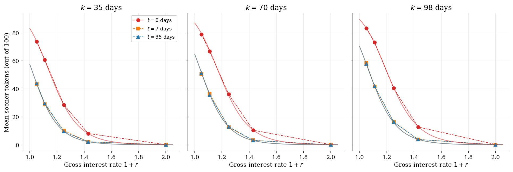
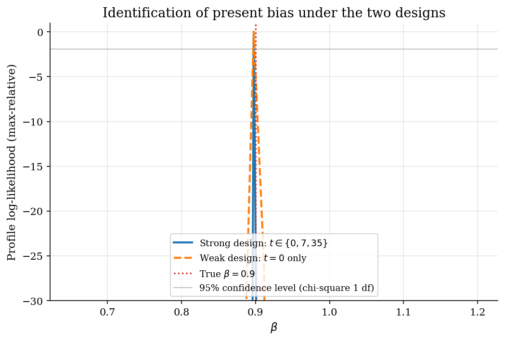
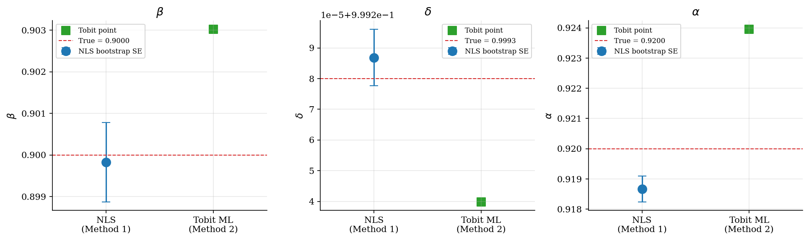

# Estimating Present Bias from Convex Time Budgets

## Overview

Subjects in a Convex Time Budget (CTB) experiment allocate a fixed token budget between a sooner payment at date $t$ and a later payment at date $t + k$. The relative price between sooner and later tokens is the experimental gross interest rate $1 + r$. Each interior allocation is the solution to a standard intertemporal optimisation under a quasi-hyperbolic discount function.

Andreoni and Sprenger (2012) introduced this design to recover three structural parameters jointly: the present-bias factor $\beta$, the per-day discount factor $\delta$, and the CRRA curvature exponent $\alpha$. The tutorial reconstructs both estimation methods from the paper. The first is nonlinear least squares on the closed-form demand function. The second is two-limit Tobit maximum likelihood on a log-tangency linearisation that handles corner allocations explicitly.

The pedagogical hook is that varying the front-end delay $t$ is what separates $\beta$ from $\delta$ in identification. A weak design that uses only $t = 0$ cells leaves $\beta$ and $\delta^k$ entangled. A strong design that includes $t > 0$ cells breaks the entanglement by adding a regressor that is non-zero only at $t = 0$. Andreoni and Sprenger themselves found $\hat\beta \approx 1.004$ in their UCSD sample, which is an empirical surprise about monetary-payment present bias rather than a failure of the method.

## Equations

The general problem is to recover three structural parameters from interior allocations on a one-period intertemporal budget.

### The CTB problem

A subject faces the future-value budget constraint

$$(1 + r)\, c_t + c_{t+k} = m,$$

where $c_t$ is the sooner payment, $c_{t+k}$ is the later payment, $1 + r$ is the gross interest rate over the delay $k$, and $m$ is the dollar value of the token budget at the later token rate.

Preferences are quasi-hyperbolic over CRRA period utility (Andreoni-Sprenger eq 3, with the Stone-Geary minima set to zero):

$$U(c_t, c_{t+k}) = \frac{1}{\alpha}\, c_t^{\alpha}
+ \beta\, \delta^{k} \cdot \frac{1}{\alpha}\, c_{t+k}^{\alpha}.$$

Here $\alpha < 1$ is the CRRA exponent (relative risk aversion equals $1 - \alpha$), $\delta$ is the per-day discount factor, and $\beta$ is the present-bias parameter.
The factor $\beta$ multiplies the later utility only when the sooner date is today.
With a front-end delay $t > 0$ both payments are in the future and $\beta$ drops out.

Maximising $U$ subject to the budget gives the interior tangency condition (Andreoni-Sprenger eq 4):

$$\frac{c_t}{c_{t+k}} = \begin{cases}
(\beta\, \delta^{k}\, (1 + r))^{1/(\alpha - 1)}, & t = 0, \\
(\delta^{k}\, (1 + r))^{1/(\alpha - 1)}, & t > 0.
\end{cases}$$

Combining the tangency with the budget gives the closed-form sooner demand (Andreoni-Sprenger eq 5):

$$c_t(\beta, \delta, \alpha;\, r, k, t, m)
= \frac{\xi(\beta, \delta, \alpha;\, r, k, t)}
       {1 + (1 + r)\, \xi(\beta, \delta, \alpha;\, r, k, t)}\, m,$$

with $\xi = (\beta_{\mathrm{eff}}\, \delta^{k}\, (1 + r))^{1/(\alpha - 1)}$ and $\beta_{\mathrm{eff}} = \beta$ when $t = 0$, $\beta_{\mathrm{eff}} = 1$ otherwise.

### Identification via the front-end delay

Taking logs of the tangency condition gives a relation that is linear in observables (Andreoni-Sprenger eq 6):

$$\ln\left(\frac{c_t}{c_{t+k}}\right)
= \frac{\ln \beta}{\alpha - 1}\, \mathbf{1}_{t = 0}
+ \frac{\ln \delta}{\alpha - 1}\, k
+ \frac{1}{\alpha - 1}\, \ln(1 + r).$$

The three regression coefficients map back to $(\beta, \delta, \alpha)$ by inversion.
The slope on $\ln(1 + r)$ identifies $\alpha$.
The slope on $k$ identifies $\delta$ given $\alpha$.
The dummy $\mathbf{1}_{t = 0}$ identifies $\beta$ given $\alpha$.

If the design uses only $t = 0$ cells, the $\mathbf{1}_{t = 0}$ regressor drops out.
What remains is the constant term $\ln(\beta\, \delta^{k_0})$ for each fixed $k_0$, which mixes $\beta$ and $\delta^{k_0}$ in a single number.
Front-end delay variation is what unlocks $\beta$.

### Method 1: NLS on the demand function

Method 1 estimates $(\beta, \delta, \alpha)$ by nonlinear least squares on the closed-form demand:

$$\hat\theta^{\mathrm{NLS}} = \arg\min_{\theta = (\beta, \delta, \alpha)}
\sum_{i, j} (c_{t,\, ij} - c_t(\theta;\, r_j, k_j, t_j, m_j))^2.$$

The sum runs over subjects $i$ and choice cells $j$.
NLS does not need an interior assumption and the residual is in dollar units, but corner choices contribute zero residual rather than a censoring term.

### Method 2: Two-limit Tobit MLE on the log tangency

Method 2 takes the linear regression form of the log tangency and assumes a Gaussian error.
Let $y_{ij} = \ln(c_{t,\, ij} / c_{t + k,\, ij})$ and $X_{ij} = (\mathbf{1}_{t_j = 0},\, k_j,\, \ln(1 + r_j))^\top$ with linear coefficients $(a, b, c)$.
The model is $y_{ij} = X_{ij}^\top (a, b, c) + \varepsilon_{ij}$ with $\varepsilon \sim \mathcal N(0, \sigma^2)$.
Lower and upper corner allocations censor $y$ and contribute log-CDF or log-survival terms.
The likelihood is the standard two-limit Tobit form:

$$\ell(a, b, c, \sigma) = \sum_{ij \in \mathrm{int}} \log \phi_\sigma(y_{ij} - X_{ij}^\top (a, b, c)) + \sum_{ij \in \mathrm{lower}} \log \Phi_\sigma(L - X_{ij}^\top (a, b, c)) + \sum_{ij \in \mathrm{upper}} \log [1 - \Phi_\sigma(U - X_{ij}^\top (a, b, c))].$$

Estimates of $(\beta, \delta, \alpha)$ recover by inversion:
$\hat\alpha = 1 + 1 / \hat c$, $\hat\delta = \exp(\hat b / \hat c)$, $\hat\beta = \exp(\hat a / \hat c)$.

## Model Setup

The simulation uses the Andreoni-Sprenger 3x3 design (their Section I.A) with $t \in \{0, 7, 35\}$ days and $k \in \{35, 70, 98\}$ days. Each $(t, k)$ cell contains five gross-interest-rate cells. A fixed token budget of 100 is allocated each decision. The later token rate is $a_{t + k} = \$0.20$ and the sooner rate $a_t$ is implied by $a_t = a_{t + k} / (1 + r)$.

| Symbol | Value | Role |
|--------|-------|------|
| Subjects | 100 | Independent allocators in the simulation |
| $(t, k)$ cells | 9 | All combinations of $t \in \{0, 7, 35\}$ and $k \in \{35, 70, 98\}$ |
| Interest rates per cell | 5 | $1 + r \in \{1.05, 1.11, 1.25, 1.43, 2.00\}$ |
| Token budget | 100 | Per decision |
| $a_{t + k}$ | 0.20 | Later token rate (dollars) |
| True $\beta$ | 0.9 | Present-bias parameter ($\beta = 1$ is no bias) |
| True $\delta$ | 0.99928 | Daily discount factor (annual rate $\approx$ 30.1%) |
| True $\alpha$ | 0.92 | CRRA exponent in $u(c) = c^{\alpha} / \alpha$ |
| Noise $\sigma_{\varepsilon}$ | 0.3 | Std of Gaussian shock to log tangency |
| Bootstrap reps | 200 | Subject-cluster resamples for SEs |

## Solution Method

Both methods recover the same three structural parameters from the same simulated data. They differ in what they treat as the dependent variable and in how they handle corner choices.

### Method 1: Nonlinear least squares on the demand function

NLS treats the dollar-value sooner payment $c_t$ as the dependent variable and minimises the sum of squared residuals against the closed-form demand. The economic intuition is direct: choose $(\beta, \delta, \alpha)$ to make the predicted sooner allocation match the observed sooner allocation across all $(t, k, r)$ cells. The optimisation is a smooth nonlinear program in three parameters with bound constraints to keep $\beta, \delta, \alpha$ in admissible ranges.

```text
Algorithm: NLS on the demand function
Input : observations (c_t, t, k, 1+r, m)_{ij}; bounds on (beta, delta, alpha)
Output: theta_hat = (beta_hat, delta_hat, alpha_hat)
  for each candidate theta proposed by the optimizer:
    1. compute xi = (beta_eff(theta, t) * delta^k * (1+r))^(1/(alpha-1)) per cell
    2. compute predicted c_t = m * xi / (1 + (1+r) * xi)
    3. accumulate residual sum (c_t observed minus c_t predicted)^2
  call scipy.optimize.least_squares with trust-region reflective
```

NLS does not need any interior assumption because the demand function is well-defined at corners. The weakness is that a corner observation contributes the same residual as any other point, so censoring is implicitly ignored. When many subjects pile at corners the NLS estimates of curvature are biased toward linearity.

### Method 2: Two-limit Tobit MLE on the log tangency

Method 2 takes logs of the tangency condition to obtain a regression that is linear in observables. The log ratio of sooner to later earnings is the dependent variable. An indicator for $t = 0$, the delay length $k$, and $\ln(1 + r)$ are the regressors. The disturbance is assumed Gaussian with unknown standard deviation $\sigma$. Censoring at the lower and upper corners is handled by replacing the density with the appropriate CDF or survival contribution. After estimating the linear coefficients $(a, b, c)$ and $\sigma$, the structural parameters recover by inversion: $\alpha = 1 + 1/c$, $\delta = \exp(b/c)$, $\beta = \exp(a/c)$.

```text
Algorithm: Two-limit Tobit MLE on the log tangency
Input : (log_ratio, t, k, 1+r, censor_flags)_{ij}; bounds on (a, b, c, sigma)
Output: (beta_hat, delta_hat, alpha_hat, sigma_hat)
  for each candidate (a, b, c, sigma):
    1. mu_{ij} = a * 1{t = 0} + b * k + c * log(1+r)
    2. interior obs contribute log normal density at (y - mu) / sigma
    3. lower corner obs contribute log Phi((y - mu) / sigma)
    4. upper corner obs contribute log (1 - Phi((y - mu) / sigma))
  call scipy.optimize.minimize with L-BFGS-B and bound constraints
  recover alpha = 1 + 1/c, delta = exp(b/c), beta = exp(a/c)
```

Tobit handles corner censoring directly, which is its main advantage when subjects bunch at allocation extremes. Two costs come with this. The Stone-Geary minima have to be assumed known (the tutorial sets them to zero, matching column 3 of Andreoni-Sprenger Table 2). The log transform is undefined at exact corners, so the implementation tags those observations with the censoring indicator and skips the log of the raw ratio.

## Results

Mean sooner allocations decline as the gross interest rate rises and as the delay length $k$ grows. The three lines per panel correspond to the three front-end delays $t \in \{0, 7, 35\}$. The downward slope on $1 + r$ identifies CRRA curvature $\alpha$. The downward shift across $k$ panels at any fixed $1 + r$ identifies $\delta$. The vertical gap between the $t = 0$ line and the $t > 0$ lines at the same $(k, 1 + r)$ is what identifies $\beta$. Solid curves overlay the NLS-fitted demand function from Method 1.



The profile log-likelihood for $\beta$ is sharp under the strong design that includes $t > 0$ cells. It is nearly flat under the weak design that uses only $t = 0$ cells. Without front-end delay variation the data cannot distinguish present bias from a more patient discount factor. At true $\beta = 0.9$ the strong-design 95 percent confidence region is bounded; the weak-design region extends across most of the plotted $\beta$ range.



Both methods recover present bias close to the truth $\beta = 0.9$ on the strong design. NLS gives $\hat\beta = 0.900$ with bootstrap SE 0.001. Tobit gives $\hat\beta = 0.903$. The daily discount factor and the curvature exponent are similarly close. The Tobit estimator differs from NLS only on cells where corner allocations are common; in this calibration the censoring rate is modest and the two methods agree.



The recovery table reports point estimates and bootstrap standard errors. Subject-cluster bootstrap is used because allocations within a subject are correlated across the 45 cells. For comparison, Andreoni and Sprenger (2012, Table 2 column 1) report aggregate $\hat\beta = 1.004$ (SE 0.002), $\hat\alpha = 0.920$ (SE 0.006), and an annual discount rate of 0.300 (SE 0.064).

**Parameter recovery on the strong design**

| Parameter                   |    True |   NLS estimate |   NLS bootstrap SE |   Tobit estimate |
|:----------------------------|--------:|---------------:|-------------------:|-----------------:|
| Present bias beta           | 0.9     |        0.8998  |             0.001  |          0.903   |
| Daily discount factor delta | 0.99928 |        0.99929 |             1e-05  |          0.99924 |
| CRRA exponent alpha         | 0.92    |        0.9187  |             0.0004 |          0.924   |

The design comparison contrasts NLS estimates from the strong and weak designs on the same subjects and the same noise. Both designs recover $\beta$ close to the truth, with the weak-design standard error roughly twice the strong-design one. NLS on the closed-form demand exploits structural curvature in $(\beta\, \delta^{k}\, (1 + r))^{1/(\alpha - 1)}$ across $k$ and $1 + r$, which gives some traction even when the front-end delay is fixed at zero. The log-tangency linearisation that Method 2 uses does not have this advantage: under the weak design the $\mathbf{1}_{t = 0}$ regressor is degenerate, the profile log-likelihood for $\beta$ goes flat, and Tobit-style identification of $\beta$ collapses. The profile-likelihood figure above shows that flatness directly.

**Strong vs weak design on the same simulation**

| Design                 |   Cells per subject |   NLS beta estimate |   NLS beta bootstrap SE |   NLS delta estimate |   NLS alpha estimate |
|:-----------------------|--------------------:|--------------------:|------------------------:|---------------------:|---------------------:|
| Strong (t in 0, 7, 35) |                  45 |              0.8998 |                   0.001 |              0.99929 |               0.9187 |
| Weak (t = 0 only)      |                  15 |              0.8996 |                   0.002 |              0.99929 |               0.9183 |

## Takeaway

The CTB design turns intertemporal preference estimation into a nonlinear regression on continuous allocations. Each subject's choice in each $(t, k, 1 + r)$ cell is the interior solution to a one-period optimisation, and the closed-form demand or its log-tangency linearisation gives the moment used for estimation.

Front-end delay variation is what makes $\beta$ separately identifiable. Without $t > 0$ cells the data tell the analyst about the product $\beta\, \delta^{k}$ but not about its factors. Adding even a single $t > 0$ cell sharpens the profile likelihood for $\beta$ dramatically.

The two estimation methods are complements rather than substitutes. NLS on the demand function works at corners and lets the Stone-Geary minima be jointly estimated. Tobit on the log tangency is the right choice when corner choices are common and the analyst is willing to fix the Stone-Geary minima a priori. Andreoni and Sprenger report both methods in their Table 2 for exactly this reason.

The empirical headline of the original paper is that $\hat\beta \approx 1$ in their UCSD sample, contradicting the prior literature that found substantial present bias from binary Multiple Price List elicitations. This is a substantive finding about monetary-payment present bias, not a defect of the CTB methodology. The methodology itself is what makes that conclusion interpretable in the first place.

## References

- Andreoni, J., & Sprenger, C. (2012). *Estimating Time Preferences from Convex Budgets*. American Economic Review 102(7), 3333-3356. DOI 10.1257/aer.102.7.3333.
- Andreoni, J., & Sprenger, C. (2012). *Risk Preferences Are Not Time Preferences*. American Economic Review 102(7), 3357-3376.
- Cohen, J., Ericson, K. M., Laibson, D., & White, J. M. (2020). *Measuring Time Preferences*. Journal of Economic Literature 58(2), 299-347.
- Halevy, Y. (2015). *Time Consistency: Stationarity and Time Invariance*. Econometrica 83(1), 335-352.
- Laibson, D. (1997). *Golden Eggs and Hyperbolic Discounting*. Quarterly Journal of Economics 112(2), 443-477.
