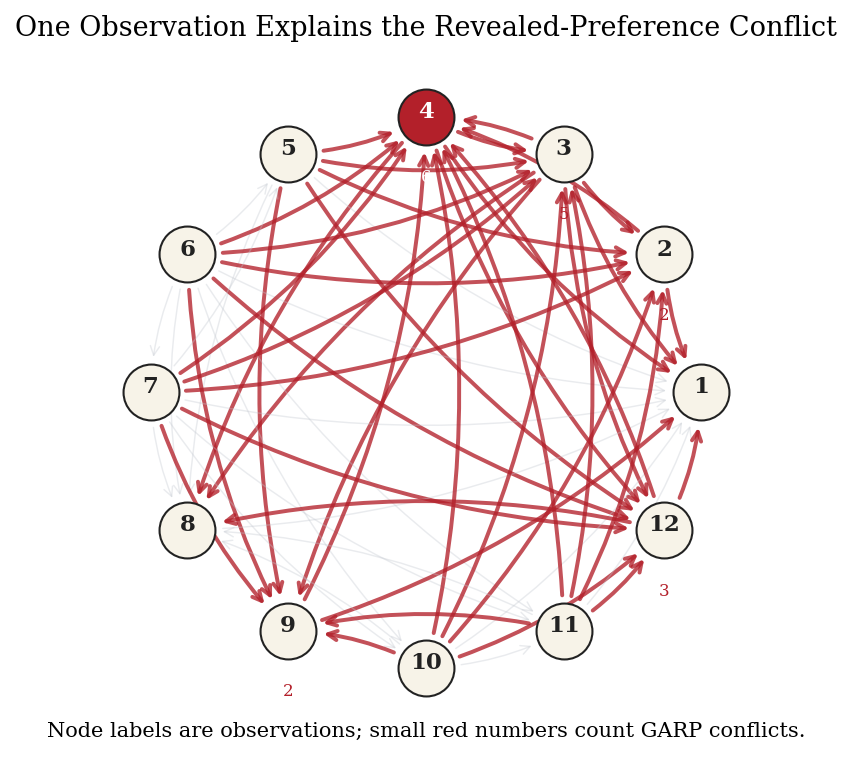
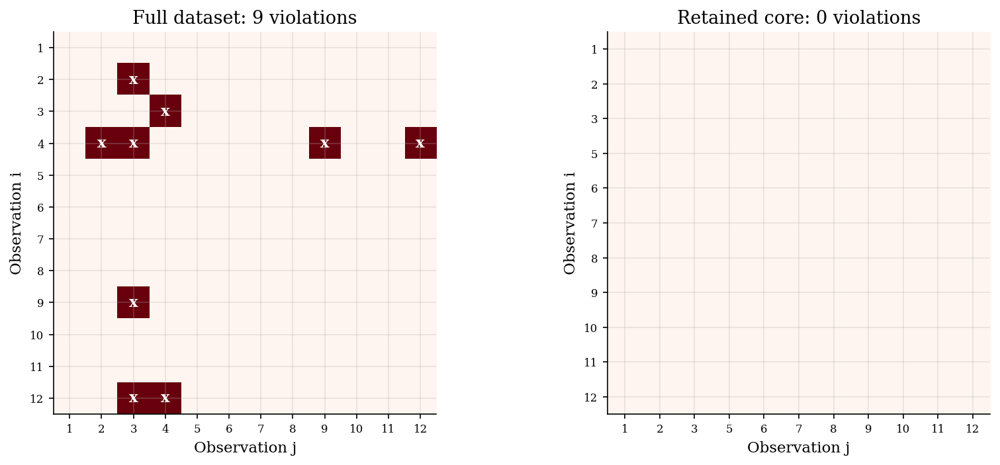

# Rationalizable Choice Cores with Houtman-Maks

> Measuring how much of a finite choice dataset can still come from one stable utility ordering.

## Overview

Revealed-preference data can fail GARP even when most observations fit stable preferences. The failure says the full dataset is not rationalizable.

The Houtman-Maks index is the largest number of observations that can be kept while satisfying GARP. It measures the rationalizable core of the dataset.

Finding the core requires search over subsets of observations. This tutorial builds the revealed-preference graph, checks GARP on candidate subsets, and compares exact search with a greedy graph rule.

## Equations

There are $T$ observations. Observation $t$ has prices $p_t \in \mathbb{R}_{+}^{J}$ and chosen bundle $x_t \in \mathbb{R}_{+}^{J}$. Expenditure is $m_t=p_t \cdot x_t$.

Choice $t$ directly weakly reveals $x_t$ preferred to $x_s$ when $x_s$ was affordable at prices $p_t$:

$$x_t R^D x_s \quad \Longleftrightarrow \quad p_t \cdot x_t \geq p_t \cdot x_s.$$

The direct relation is strict when the inequality is strict. Let $R$ be the transitive closure of $R^D$. GARP holds on a subset $S$ if there is no pair $t,s \in S$ such that

$$x_t R x_s \quad \text{and} \quad p_s \cdot x_s > p_s \cdot x_t.$$

Let $\mathrm{GARP}(S)=1$ when these restrictions hold after keeping only observations in $S$. The Houtman-Maks index is

$$HM = \max_{S \subseteq \{1,\ldots,T\}} |S| \quad \text{s.t.} \quad \mathrm{GARP}(S)=1.$$

The minimum number of observations needed to restore GARP is

$$T - HM.$$

## Model Setup

| Object | Value | Interpretation |
|---|---:|---|
| Observations $T$ | 12 | Shopping trips with prices and chosen bundles |
| Goods $J$ | 3 | Small multi-good demand environment |
| Data-generating preferences | Cobb-Douglas shares $(0.45,0.35,0.20)$ | Choices before the swap |
| Synthetic corruption | bundles in rows 3 and 4 swapped | Known source of the GARP failure |
| Full-sample GARP violations | 9 | Contradictions after taking transitive closure |
| Exact Houtman-Maks index | 11 | Largest rationalizable subset size |
| Greedy deletion | observation 4 | Same deletion selected by the heuristic |

## Solution Method

The exact routine treats the dataset as a finite search problem. It builds the revealed-preference graph for each candidate subset. It then checks whether any strict budget cycle remains.

```text
Algorithm: exact Houtman-Maks core
Inputs: observations {(p_t, x_t)}_{t=1}^T
Output: largest subset S* satisfying GARP

for k = T, T-1, ..., 1:
    for each subset S with |S| = k:
        build R^D on S using p_t dot x_t >= p_t dot x_s
        compute the transitive closure R of R^D
        if no strict budget cycle remains:
            return S* = S and HM = k
```

Enumeration is exact, but the number of subsets grows quickly. The greedy rule uses the same graph to choose deletions. It removes observations from violating strongly connected components.

```text
Algorithm: SCC greedy Houtman-Maks diagnosis
Inputs: observations {(p_t, x_t)}_{t=1}^T
Output: a GARP-consistent retained set S

initialize S = {1, ..., T}
while GARP(S) fails:
    compute weak arcs, strict arcs, and violating pairs on S
    find strongly connected components of the weak graph
    restrict attention to components containing a strict internal arc
    remove the observation with the most violation participation
return S
```

In this run, the greedy rule removes observation 4, the same receipt removed by exact search. The retained set keeps 11 of 12 observations.

## Results

The table reports how each receipt enters the GARP rejection. Observation 4 has the most conflict participation. Exact search and the greedy rule remove the same receipt.

**Which Receipts Carry the Rejection**

|   Observation |   Violation participation | Synthetic swap row   | Exact HM action   | Greedy action   |
|--------------:|--------------------------:|:---------------------|:------------------|:----------------|
|             1 |                         0 | no                   | keep              | keep            |
|             2 |                         2 | no                   | keep              | keep            |
|             3 |                         5 | yes                  | keep              | keep            |
|             4 |                         6 | yes                  | remove            | remove          |
|             5 |                         0 | no                   | keep              | keep            |
|             6 |                         0 | no                   | keep              | keep            |
|             7 |                         0 | no                   | keep              | keep            |
|             8 |                         0 | no                   | keep              | keep            |
|             9 |                         2 | no                   | keep              | keep            |
|            10 |                         0 | no                   | keep              | keep            |
|            11 |                         0 | no                   | keep              | keep            |
|            12 |                         3 | no                   | keep              | keep            |

The conflict graph shows why one deletion restores consistency. Red fill marks the exact deletion. The black x marks the greedy deletion. Gold rings mark the two swapped receipts.



The heat maps show GARP violations before and after the deletion. The retained core has no strict budget-cycle contradictions.



## Takeaway

Houtman-Maks turns a GARP rejection into the size of the rationalizable core. In this example, one deletion keeps 11 of 12 observations. The index locates a minimal repair, not every bad receipt.

## References

- Houtman, M., & Maks, J. A. H. (1985). Determining all maximal data subsets consistent with revealed preference. Kwantitatieve Methoden, 19, 89-104.
- Heufer, J., & Hjertstrand, P. (2015). Consistent subsets: Computationally feasible methods to compute the Houtman-Maks-index. Economics Letters, 128, 87-89.
- Varian, H. R. (1982). The nonparametric approach to demand analysis. Econometrica, 50(4), 945-973.
