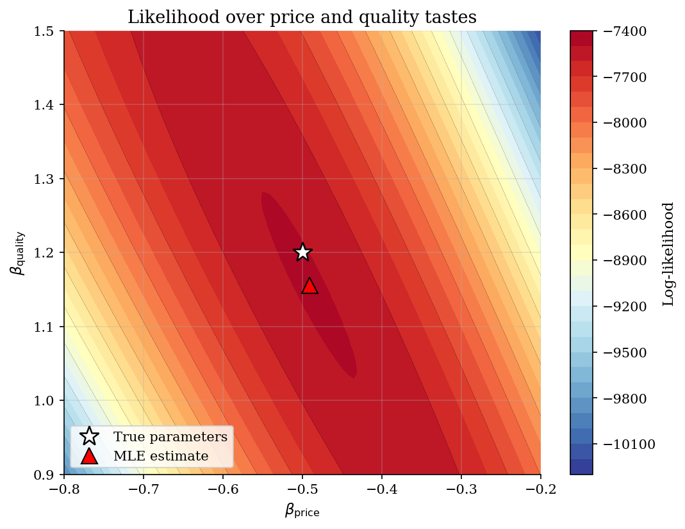
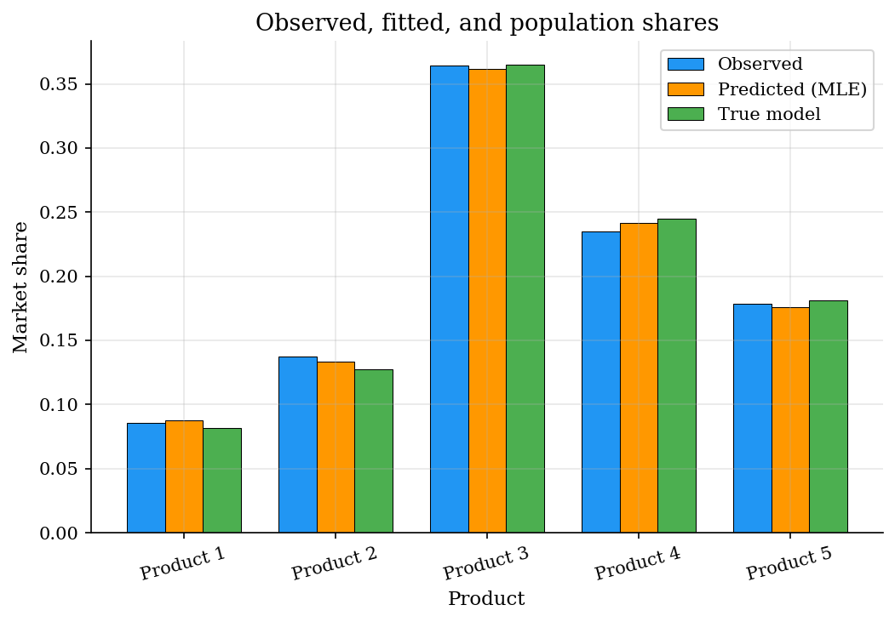
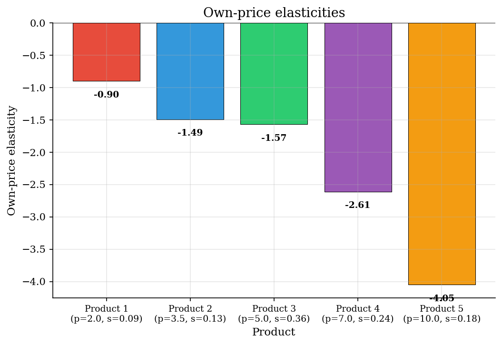
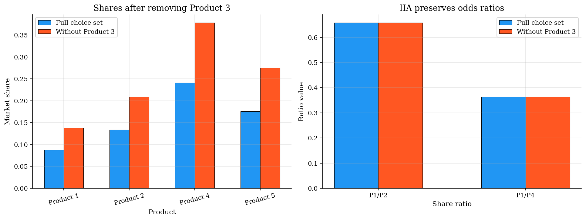

# Product Demand with Plain Logit and IIA

## Overview

Five products sit on one shelf. Each product has a price and a quality level, and each buyer chooses one product.

The object is product demand in this market. We want price and quality tastes, fitted shares, and buyer reallocation after removal.

The computational task is maximum likelihood. Each trial coefficient vector gives logit probabilities, and the observed choices select the best-fitting vector.

## Equations

Consumers $i=1,\ldots,N$ choose one product $j\in\{1,\ldots,J\}$.
Product $j$ has price $p_j$ and quality $q_j$. The deterministic part of
utility is common across consumers in this simple market.

**Utility:**
$$U_{ij}=V_j+\varepsilon_{ij}, \qquad
V_j=\beta_p p_j+\beta_q q_j,$$

with $\varepsilon_{ij}$ i.i.d. Type I extreme value. The expected sign is
$\beta_p<0$ and $\beta_q>0$.

**Choice probability:**
$$P_j(\beta)=\Pr(y_i=j\mid p,q;\beta)
=\frac{\exp(V_j)}{\sum_{k=1}^J \exp(V_k)}.$$

If $d_{ij}=1\{y_i=j\}$ records the observed purchase, the sample
log-likelihood is
$$\ell(\beta)=\sum_{i=1}^N\sum_{j=1}^J d_{ij}\log P_j(\beta).$$

Because this one-market example has no individual covariates, fitted market
shares are $s_j=P_j(\hat\beta)$, where $\hat\beta$ denotes the MLE of $\beta$. The implied price elasticities are
$$\eta_{jj}=\beta_p p_j(1-s_j), \qquad
\eta_{jk}=-\beta_p p_k s_k \quad (j\neq k).$$

IIA follows from the odds ratio
$$\frac{P_j}{P_k}=\exp(V_j-V_k),$$
which does not depend on any third product in the choice set.

## Model Setup

The market is small enough to see each estimate. Five products trade off price against quality. The sample is synthetic, so true coefficients and population shares are available after estimation.

| Object | Value | Role |
|-----------|-------|-------------|
| Consumers | 5000 | Independent choice draws |
| Products | 5 | Fixed alternatives in one market |
| Prices | 2.0, 3.5, 5.0, 7.0, 10.0 | Utility shifter with negative coefficient |
| Quality | 1.0, 2.0, 3.5, 4.0, 5.0 | Utility shifter with positive coefficient |
| True $\beta_p$ | -0.5 | Price coefficient used to simulate choices |
| True $\beta_q$ | 1.2 | Quality coefficient used to simulate choices |

## Solution Method

The likelihood turns the demand model into a two-parameter optimization problem. Each candidate $\beta=(\beta_p,\beta_q)$ implies utilities. Those utilities imply probabilities, and the observed choices score the candidate through the log-likelihood:

$$\hat\beta=\arg\max_\beta \ell(\beta).$$

```text
Inputs: prices p_j, qualities q_j, choices y_i, starting value beta^(0)
For each trial beta proposed by the optimizer:
    1. Form V_j(beta) = beta_p p_j + beta_q q_j for every product j.
    2. Convert V into logit probabilities P_j(beta).
    3. Evaluate ell(beta) = sum_i log P_{y_i}(beta).
Choose beta_hat that maximizes ell(beta).
At beta_hat: compute fitted shares, elasticities, and IIA share ratios.
```

## Results

The contour plot shows the two-parameter likelihood. The MLE sits near the true coefficients used to generate the choices.



Observed shares are sample purchase frequencies. Fitted shares are close to both the sample and population shares.



The own-price elasticities combine the estimated price coefficient with each product's price and fitted share. Higher prices make demand more elastic in absolute value here.



Removing Product 3 raises every remaining share. The pairwise odds ratios stay fixed, which is the IIA restriction.



The estimated signs match the simulation: consumers dislike price and value quality. The estimates are close to the true coefficients.

**MLE estimates and true coefficients**

| Parameter   |   True |   Estimate |   Std. error |   t-stat | p-value   |
|:------------|-------:|-----------:|-------------:|---------:|:----------|
| beta_p      |   -0.5 |    -0.4913 |       0.0174 |   -28.21 | <0.001    |
| beta_q      |    1.2 |     1.1559 |       0.0362 |    31.94 | <0.001    |

Rows are products whose shares change. Columns are products whose prices change. Off-diagonal entries repeat within each column because substitution is proportional to rival shares.

**Price elasticity matrix**

| Product   |   Product 1 |   Product 2 |   Product 3 |   Product 4 |   Product 5 |
|:----------|------------:|------------:|------------:|------------:|------------:|
| Product 1 |      -0.896 |        0.23 |       0.889 |       0.83  |       0.863 |
| Product 2 |       0.086 |       -1.49 |       0.889 |       0.83  |       0.863 |
| Product 3 |       0.086 |        0.23 |      -1.568 |       0.83  |       0.863 |
| Product 4 |       0.086 |        0.23 |       0.889 |      -2.609 |       0.863 |
| Product 5 |       0.086 |        0.23 |       0.889 |       0.83  |      -4.051 |

## Takeaway

Plain logit turns utility coefficients into shares, elasticities, and removal counterfactuals. That simplicity imposes IIA. After one product disappears, remaining buyers are reassigned by existing shares, not measured product closeness.

## References

- McFadden, D. (1974). Conditional Logit Analysis of Qualitative Choice Behavior. In P. Zarembka (Ed.), *Frontiers in Econometrics*. Academic Press.
- Train, K. (2009). *Discrete Choice Methods with Simulation*. Cambridge University Press, 2nd edition.
