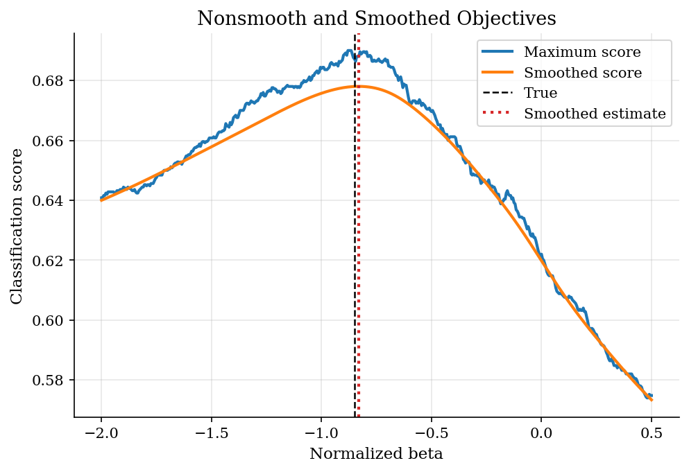
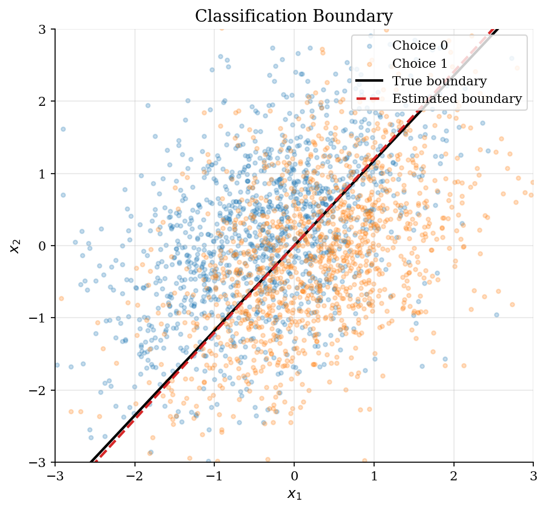
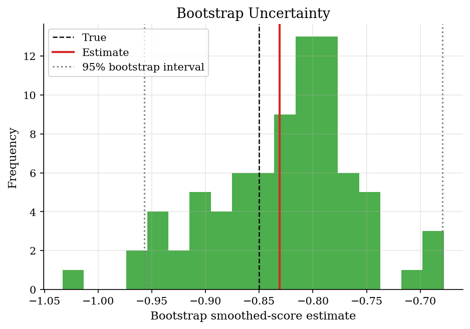

# Maximum Score Binary Choice

> Estimate a binary-choice index with a nonsmooth classification criterion.

## Overview

Logit and probit estimate a full distributional model for binary choices. Maximum score asks for less. It assumes that the conditional median of the latent error is zero and estimates the sign of the index that best classifies choices.

The method is useful because it makes scale normalization, nonsmooth objectives, and semiparametric robustness concrete. The data here are generated with heteroskedastic logistic errors, so a simple homoskedastic logit is misspecified. Maximum score still targets the normalized index direction.

## Equations

The latent choice model is

$$
y_i = 1\{x_{i1}+\beta x_{i2}+\varepsilon_i \geq 0\}.
$$

Only the direction of the index is identified, so the coefficient on $x_{i1}$
is normalized to one. Manski's maximum-score estimator solves

$$
\hat\beta
= \arg\max_b \frac{1}{n}\sum_i
\left[y_i 1\{x_{i1}+b x_{i2}\geq 0\} + (1-y_i)1\{x_{i1}+b x_{i2}<0\}\right].
$$

The smoothed version replaces the hard indicator with a normal CDF:

$$
S_h(b)=\frac{1}{n}\sum_i
\left[y_i \Phi((x_{i1}+b x_{i2})/h)
+(1-y_i)\{1-\Phi((x_{i1}+b x_{i2})/h)\}\right].
$$

## Model Setup

| Object | Value | Role |
|--------|-------|------|
| Observations | 2,500 | Simulated binary choices |
| Normalized coefficient | 1 | Scale normalization on $x_1$ |
| True $\beta$ | -0.85 | Index weight on $x_2$ |
| Error distribution | heteroskedastic logistic | Median zero but not homoskedastic logit |
| Grid points | 501 | Direct search over nonsmooth objective |
| Smoothing bandwidth | 0.25 | Smooth score approximation |
| Bootstrap draws | 80 | Nonparametric uncertainty check |

## Solution Method

The nonsmooth objective is easy to evaluate and hard to optimize with derivative methods. The tutorial therefore shows both a grid search over the original score and a smoothed objective that can be optimized continuously.

```text
Algorithm: maximum score binary choice
Input: choices y_i and covariates x_i1, x_i2
Normalize the coefficient on x_i1 to one
Grid maximum score:
  For each b on a grid, compute the share correctly classified by sign(x_i1+b x_i2)
  Choose the grid value with the largest score
Smoothed maximum score:
  Replace indicators with Phi((x_i1+b x_i2)/h)
  Optimize the smooth score over b
Bootstrap:
  Resample observations and re-estimate the smoothed score
Report classification score, normalized beta, and bootstrap interval
```

The scale normalization is not a detail. Multiplying every coefficient by a positive constant leaves the sign of the index unchanged, so maximum score identifies a direction rather than an absolute utility scale.

## Results

The raw maximum-score objective is a step function. Many nearby values can classify the same observations, so the surface is flat over intervals. The smoothed score peaks at **-0.831**, close to the true normalized slope **-0.850**.

Smoothing turns the classification objective into a differentiable approximation without changing the target index direction.



Maximum score is literally fitting a separating hyperplane, but not under a hard separability assumption. The best boundary still misclassifies observations because latent errors move choices across the median index.

The estimated boundary is close to the true median-choice boundary even though the errors are heteroskedastic.



The nonparametric bootstrap interval is **[-0.957, -0.679]**. This is a diagnostic rather than a full asymptotic theory lesson; the point is that inference is less routine when the criterion is nonsmooth.

The bootstrap distribution summarizes finite-sample uncertainty for the smoothed estimator.



The logit coefficient vector is normalized by the coefficient on x1 so it can be compared with maximum score.

**Estimator comparison**

| Estimator                |   Normalized beta |    Error |   Classification score |
|:-------------------------|------------------:|---------:|-----------------------:|
| True index               |          -0.85    |  0       |                 0.6872 |
| Grid maximum score       |          -0.88    | -0.03    |                 0.69   |
| Smoothed maximum score   |          -0.83084 |  0.01916 |                 0.6884 |
| Misspecified logit ratio |          -0.66013 |  0.18987 |                 0.6816 |

The raw score is the share of observations classified by the sign of the normalized index.

**Score and bootstrap diagnostics**

| Diagnostic                     |      Value |
|:-------------------------------|-----------:|
| Choice-one share               |  0.4908    |
| Grid maximum score             |  0.69      |
| Smoothed score                 |  0.678026  |
| Smoothed optimizer success     |  1         |
| Smoothed optimizer evaluations | 22         |
| Bootstrap mean                 | -0.826309  |
| Bootstrap standard deviation   |  0.0683461 |
| Bootstrap lower 95             | -0.95708   |
| Bootstrap upper 95             | -0.679272  |

## Takeaway

Maximum score is a different computational object from logit MLE. It maximizes a classification score under a median restriction and needs a scale normalization. That robustness comes with a nonsmooth criterion and less automatic inference. Smoothing and bootstrapping make the estimator easier to compute and diagnose, while keeping the core semiparametric idea visible.

## References

- [Manski, C. F. (1975). Maximum Score Estimation of the Stochastic Utility Model of Choice. *Journal of Econometrics*, 3(3), 205-228.](https://doi.org/10.1016/0304-4076(75)90032-9)
- [Horowitz, J. L. (1992). A Smoothed Maximum Score Estimator for the Binary Response Model. *Econometrica*, 60(3), 505-531.](https://doi.org/10.2307/2951573)
