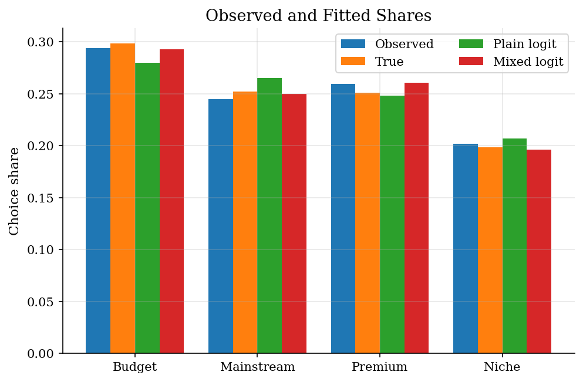
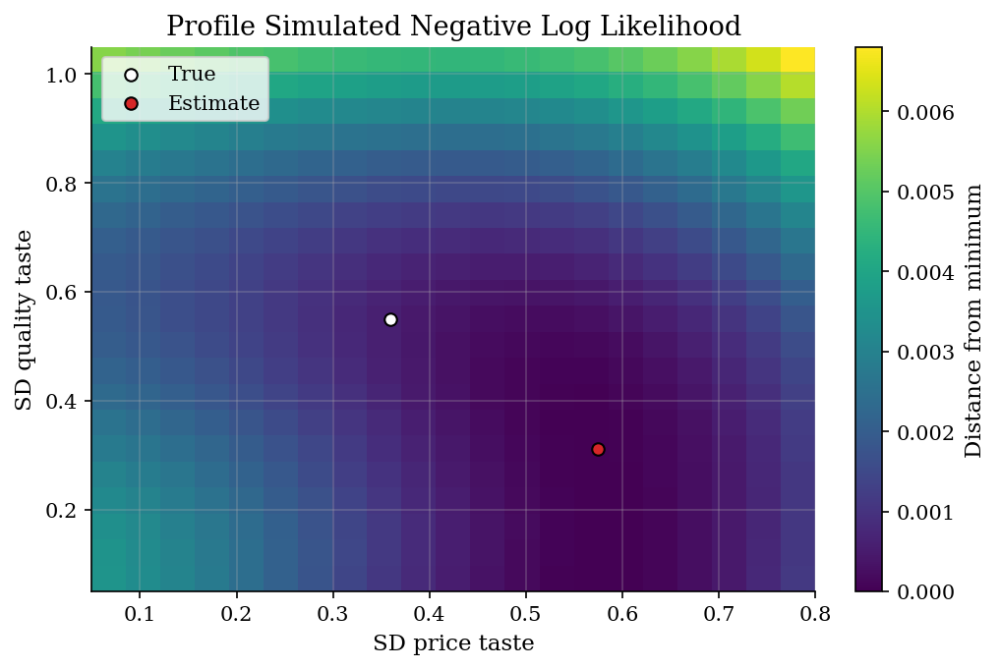
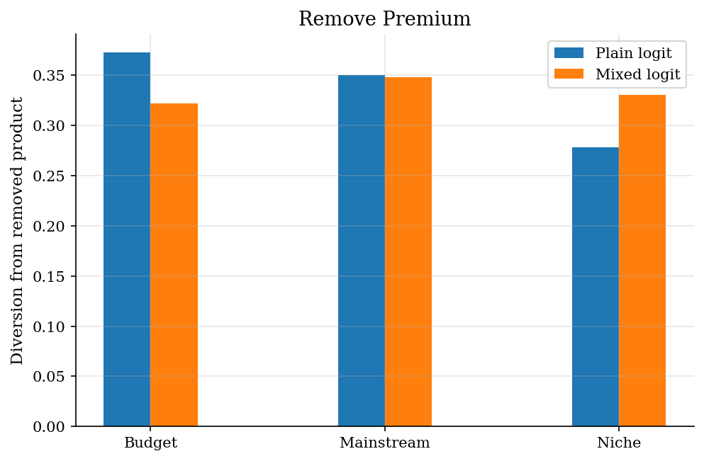
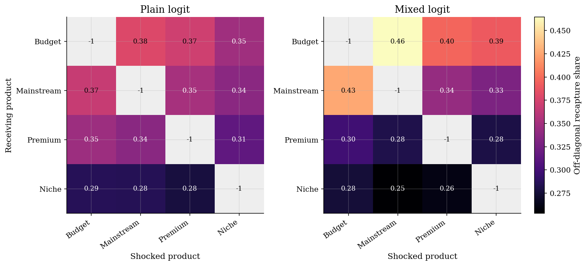

# Mixed Logit Demand with Simulated Likelihood

## Overview

Consumers choose among differentiated products. The econometrician observes prices, qualities, and choices, but not each consumer's price sensitivity or quality taste.

Plain logit compresses everyone into one representative taste vector. Mixed logit lets those coefficients vary across consumers. The price of that extra flexibility is numerical integration: each candidate parameter vector requires simulated choice probabilities.

The key economic issue is substitution. A plain logit can match average shares and still say that all products are equally close substitutes after conditioning on their shares. Mixed logit keeps the logit formula for a simulated consumer with fixed tastes, then averages across consumers with different tastes.

## Equations

Consumer $i$ chooses product $j$ with utility

$$
u_{ij} =
\alpha_i p_{ij} + \beta_i q_{ij} + \varepsilon_{ij},
\qquad
\varepsilon_{ij}\sim\text{Type I EV}.
$$

Random coefficients are

$$
\alpha_i = \bar\alpha + \sigma_\alpha \nu_{i\alpha},
\qquad
\beta_i = \bar\beta + \sigma_\beta \nu_{i\beta},
\qquad
\nu_i\sim N(0,I).
$$

Conditional on a draw $\nu_r$, the logit probability is

$$
\begin{aligned}
P_{ij}(\theta,\nu_r)
&=
\frac{\exp(\alpha_r p_{ij}+\beta_r q_{ij})}
{\sum_{k=1}^J \exp(\alpha_r p_{ik}+\beta_r q_{ik})}.
\end{aligned}
$$

Here $\alpha_r = \bar\alpha + \sigma_\alpha\nu_{r\alpha}$ and $\beta_r = \bar\beta + \sigma_\beta\nu_{r\beta}$ are the draw-specific taste coefficients.

The mixed-logit probability integrates over random tastes. The code approximates
that integral with fixed simulation draws. Here $\phi$ is the $N(0,I)$ density. The exact integral
$\int P_{ij}(\theta,\nu)\phi(\nu)d\nu$ has no closed form here because the
logit probability is nonlinear in the random coefficients. The code draws
$\nu_1,\ldots,\nu_R$ once and replaces the integral with the same finite
average at every candidate $\theta$:

$$
\begin{aligned}
\widehat P_{ij}(\theta)
&=
\frac{1}{R}\sum_{r=1}^R P_{ij}(\theta,\nu_r).
\end{aligned}
$$

Simulated maximum likelihood picks the parameter vector that assigns high
probability to the observed choices $y_i$ after averaging over simulated taste
heterogeneity:

$$
\begin{aligned}
\hat\theta
&=
\arg\max_\theta
\sum_{i=1}^N \log \widehat P_{i y_i}(\theta).
\end{aligned}
$$

## Model Setup

| Object | Value | Role |
|--------|-------|------|
| Products | 4 | Differentiated alternatives in each choice set |
| Choice occasions | 1,500 | Synthetic individual-level choices |
| Simulation draws | 120 | Fixed normal draws for simulated likelihood |
| True $\bar\alpha$ | -1.00 | Mean price taste |
| True $\bar\beta$ | 1.10 | Mean quality taste |
| True $\sigma_\alpha$ | 0.36 | Heterogeneity in price sensitivity |
| True $\sigma_\beta$ | 0.55 | Heterogeneity in quality taste |

**Numerical settings**

| Setting | Value | Role |
|---------|-------|------|
| Mixed-logit optimizer | L-BFGS-B | Handles simple bounds on mean tastes and log standard deviations |
| Mixed-logit start | (-0.75, 0.85, log 0.25, log 0.35) | Initial mean tastes and heterogeneity |
| Price-taste bound | [-3.00, -0.05] | Keeps price sensitivity negative |
| Quality-taste bound | [0.05, 2.50] | Keeps quality taste positive |
| SD bounds | [0.03, 1.30] | Effective sigma range; the bound is enforced on log-sigma for both random coefficients |
| Probability floor | 1e-14 | Prevents log zero during likelihood evaluation |
| Max iterations | 220 | L-BFGS-B iteration cap |
| Profile grid | 21 x 21 | Grid over $\sigma_\alpha$ and $\sigma_\beta$ for the likelihood surface |

## Solution Method

The estimator uses common random numbers. Draws are made once and then held fixed while the optimizer moves $\theta$. This turns the population integral into the same finite average at every trial parameter vector. Without common draws, fresh simulation noise would move the likelihood surface while the optimizer is trying to climb it.

The standard deviations are optimized in logs. The optimizer can move freely over log standard deviations, while the model sees positive values after exponentiation. The bounds are not an economic restriction in this example. They keep the teaching likelihood away from numerically irrelevant regions.

### Algorithm 1. Simulated likelihood at a trial $\theta$

**Inputs.** Observed choices and characteristics $\{y_i,p_{ij},q_{ij}\}_{i=1,j=1}^{N,J}$, fixed draws $\nu_r=(\nu_{r\alpha},\nu_{r\beta})$ for $r=1,\ldots,R$, a trial parameter vector $\theta=(\bar\alpha,\bar\beta,\ell_\alpha,\ell_\beta)$, and probability floor $\eta>0$.

**Output.** The simulated objective $Q_R(\theta)$.

1. Convert log standard deviations into positive standard deviations:

$$
\sigma_\alpha=\exp(\ell_\alpha),
\qquad
\sigma_\beta=\exp(\ell_\beta).
$$

2. For each draw $r$, construct simulated tastes:

$$
\alpha_r=\bar\alpha+\sigma_\alpha\nu_{r\alpha},
\qquad
\beta_r=\bar\beta+\sigma_\beta\nu_{r\beta}.
$$

3. For each consumer-product pair $(i,j)$, compute the draw-specific logit probability:

$$
P_{ij}(\theta,\nu_r)=
\frac{\exp(\alpha_r p_{ij}+\beta_r q_{ij})}
{\sum_{k=1}^J \exp(\alpha_r p_{ik}+\beta_r q_{ik})}.
$$

4. Average those probabilities over the fixed simulation draws:

$$
\widehat P_{ij}(\theta)=\frac{1}{R}\sum_{r=1}^R P_{ij}(\theta,\nu_r).
$$

5. Score the observed choice $y_i$ with the simulated probability $\widehat P_{i y_i}(\theta)$.

6. Return the simulated log likelihood and the minimized objective:

$$
\ell_R(\theta)=
\sum_{i=1}^N \log \max\{\widehat P_{i y_i}(\theta),\eta\},
\qquad
Q_R(\theta)=-\ell_R(\theta)/N.
$$

### Algorithm 2. Optimization and price substitution

**Inputs.** Starting value $\theta_0$, bounds $B$, common draws $\{\nu_r\}_{r=1}^R$, data $\{y_i,p_{ij},q_{ij}\}$, and price step $\Delta p$.

**Outputs.** Estimate $\hat\theta$, fitted shares $\hat s_j$, and substitution matrix $D$.

1. Start L-BFGS-B at $\theta_0$ within bounds $B$.

2. At each candidate $\theta^m\in B$, evaluate $Q_R(\theta^m)$ using Algorithm 1.

3. Continue until the optimizer stops and set

$$
\hat\theta=\arg\min_{\theta\in B} Q_R(\theta),
$$

which is the same as maximizing $\ell_R(\theta)$.

4. Compute fitted shares from the estimated simulated probabilities:

$$
\hat s_j=\frac{1}{N}\sum_{i=1}^N \widehat P_{ij}(\hat\theta).
$$

5. For each shocked product $k$, raise $p_{ik}$ by $\Delta p$ for every consumer.

6. Recompute shares $\hat s_j^{+k}$ using the same $\hat\theta$ and the same draws $\nu_r$.

7. Fill column $k$ of the substitution matrix:

$$
D_{jk}=
\frac{\hat s_j^{+k}-\hat s_j}{\hat s_k-\hat s_k^{+k}}
\quad\text{for }j\neq k,
\qquad
D_{kk}=-1.
$$

8. Repeat steps 5-7 for every shocked product $k=1,\ldots,J$.

The homogeneous logit is estimated on the same data. Its likelihood is easier because it does not integrate over tastes. The comparison is useful because the homogeneous model can fit mean shares while still forcing diversion to follow existing market shares.

## Results

The mixed-logit fit tracks the product shares closely. The homogeneous logit also fits average shares reasonably well, so share fit alone is not enough to show why heterogeneity matters.

The profiled likelihood is lowest near positive taste dispersion. Setting the standard deviations close to zero collapses the model toward plain logit and loses the substitution patterns generated by heterogeneous consumers.

When Premium is removed, the two models make different recapture predictions. Plain logit reallocates the lost demand according to average shares. Mixed logit moves more demand toward products that appeal to similar simulated consumers.

The price-substitution matrix asks where demand goes when one product becomes 0.10 price units more expensive. Each column is the product whose price is raised. Each off-diagonal entry is the share gain for the receiving product divided by the shocked product's lost share.

Read each heatmap column as the product whose price is shocked and each row as the product receiving lost demand. The off-diagonal cells are recapture shares. The diagonal is labeled -1 because the shocked product is the losing product.

**Plain and mixed logit price substitution matrix**

| Model       | Receiving product   |   Price up: Budget |   Price up: Mainstream |   Price up: Premium |   Price up: Niche |
|:------------|:--------------------|-------------------:|-----------------------:|--------------------:|------------------:|
| Plain logit | Budget              |            -1      |                 0.3788 |              0.3716 |            0.3481 |
| Plain logit | Mainstream          |             0.368  |                -1      |              0.3508 |            0.337  |
| Plain logit | Premium             |             0.3461 |                 0.3364 |             -1      |            0.3149 |
| Plain logit | Niche               |             0.2859 |                 0.2848 |              0.2776 |           -1      |
| Mixed logit | Budget              |            -1      |                 0.4646 |              0.3964 |            0.391  |
| Mixed logit | Mainstream          |             0.426  |                -1      |              0.3425 |            0.3293 |
| Mixed logit | Premium             |             0.2985 |                 0.2821 |             -1      |            0.2798 |
| Mixed logit | Niche               |             0.2755 |                 0.2532 |              0.2611 |           -1      |

The parameter and fit tables separate two diagnostics. The parameter table checks known-truth recovery. The share table checks whether the fitted model matches observed product choices.

**Known-truth parameter recovery**

| Parameter          |   True | Plain logit   |   Mixed logit |   Mixed error |
|:-------------------|-------:|:--------------|--------------:|--------------:|
| Mean price taste   |  -1    | -1.0847       |       -1.0798 |       -0.0798 |
| Mean quality taste |   1.1  | 1.1963        |        1.2668 |        0.1668 |
| SD price taste     |   0.36 | not estimated |        0.5746 |        0.2146 |
| SD quality taste   |   0.55 | not estimated |        0.3119 |       -0.2381 |

**Observed and fitted product shares**

| Product    |   Observed share |   True probability |   Plain logit |   Mixed logit |   Mixed error |
|:-----------|-----------------:|-------------------:|--------------:|--------------:|--------------:|
| Budget     |           0.294  |             0.2983 |        0.2801 |        0.2928 |       -0.0012 |
| Mainstream |           0.2447 |             0.2522 |        0.2649 |        0.25   |        0.0053 |
| Premium    |           0.2593 |             0.2512 |        0.2482 |        0.2609 |        0.0016 |
| Niche      |           0.202  |             0.1983 |        0.2068 |        0.1963 |       -0.0057 |

## Takeaway

Mixed logit is a simulation estimator because choice probabilities require an integral over unobserved tastes. Fixed draws turn that integral into a smooth sample average. The payoff is economic: aggregate substitution is no longer forced to satisfy IIA, even though each simulated consumer still has a logit choice rule conditional on tastes.

## References

- [Train, K. (2009). *Discrete Choice Methods with Simulation* (2nd ed.). Cambridge University Press.](https://eml.berkeley.edu/books/choice2.html)
- [McFadden, D., and Train, K. (2000). Mixed MNL Models for Discrete Response. *Journal of Applied Econometrics*, 15(5), 447-470.](https://doi.org/10.1002/1099-1255%28200009/10%2915:5%3C447::AID-JAE570%3E3.0.CO;2-1)
