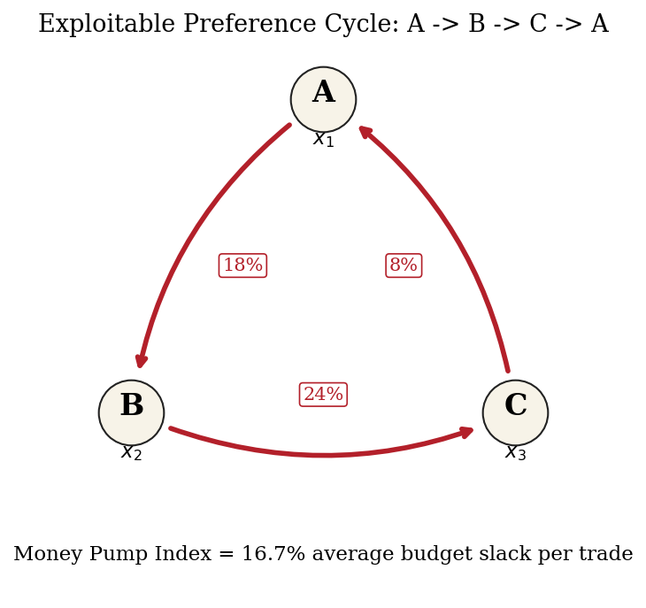
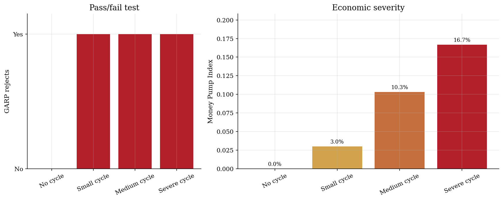

# Revealed-Preference Cycles and the Money Pump Index

> Measuring the expenditure exposed by inconsistent choices.

## Overview

A consumer buys bundle A at one price vector, bundle B at another, and bundle C at a third. These choices can violate GARP because each chosen bundle makes another affordable bundle look strictly better.

The Money Pump Index prices the violation. It measures the average budget slack along the worst revealed-preference cycle.

The task becomes a finite graph problem. Nodes are observations, edges carry budget slack, and Karp's dynamic program finds the maximum mean cycle.

## Equations

There are $T$ observations. Observation $i$ records a price vector
$p_i \in \mathbb{R}^G_+$ and chosen bundle $x_i \in \mathbb{R}^G_+$.
Let

$$E_{ij}=p_i \cdot x_j$$

be the cost of bundle $j$ at observation $i$ prices. Choosing $x_i$ when
$x_j$ was affordable, $E_{ii} \ge E_{ij}$, directly reveals
$x_i \succeq^D x_j$. For strict comparisons, define the relative budget slack
on a direct revealed-preference edge as

$$w_{ij} = \frac{E_{ii} - E_{ij}}{E_{ii}}.$$

The graph keeps edges with $w_{ij}>0$. For a directed cycle
$C=(i_1,\ldots,i_m,i_1)$, average slack is

$$\bar w(C)=\frac{1}{m}\sum_{\ell=1}^{m} w_{i_\ell,i_{\ell+1}}.$$

The Money Pump Index is the largest average slack over all directed cycles in
the revealed-preference graph:

$$\mathrm{MPI} = \max_C \bar w(C).$$

## Model Setup

| Object | Value | Interpretation |
|---|---:|---|
| Observations | 3 | One price vector and one chosen bundle in each row |
| Bundles | 3 | A, B, and C are the only candidate bundles |
| Own expenditure | 1.00 | Each chosen bundle costs one at its own prices |
| Severe-cycle slack | 18%, 24%, 8% | Slack on A over B, B over C, and C over A |
| Severe MPI | 0.167 | Average extractable slack per trade |

## Solution Method

After the budget comparisons, the data are a directed graph. Each observation is a node. An edge $i \to j$ exists when bundle $j$ was strictly cheaper at prices $i$. The edge weight is the saved budget share. Karp's dynamic program computes the maximum mean weight cycle.

```text
Inputs: prices p_i, bundles x_i, tolerance eps
1. Form E_ij = p_i . x_j for all observations i,j.
2. Add arc i -> j when (E_ii - E_ij) / E_ii > eps.
3. Attach weight w_ij = (E_ii - E_ij) / E_ii to each arc.
4. Let D_k(v) be the largest total weight of a k-arc path ending at v.
5. Update D_k(v) = max_{u -> v} D_{k-1}(u) + w_uv for k = 1,...,T.
6. Return max_v min_{0 <= k < T} [D_T(v) - D_k(v)] / (T - k).
Output: MPI, the maximum average budget slack in a cycle.
```

## Results

The table separates a logical rejection from expenditure at stake. All three inconsistent datasets reject GARP. Their MPI values range from 0.030 to 0.167.

**GARP Rejection and Money Pump Severity**

| Dataset      | GARP rejects   | Best cycle       | Designed slack   |   Karp MPI |
|:-------------|:---------------|:-----------------|:-----------------|-----------:|
| No cycle     | no             | none             | none             |      0     |
| Small cycle  | yes            | 1 -> 2 -> 3 -> 1 | 3%, 4%, 2%       |      0.03  |
| Medium cycle | yes            | 1 -> 2 -> 3 -> 1 | 10%, 13%, 8%     |      0.103 |
| Severe cycle | yes            | 1 -> 2 -> 3 -> 1 | 18%, 24%, 8%     |      0.167 |

Each arrow points from an observed choice to a cheaper bundle at the same prices. The red cycle exposes 16.7 percent average budget slack.



The left panel records pass/fail GARP. The right panel keeps the expenditure scale across small, medium, and severe cycles.



## Takeaway

Binary GARP tests say whether choices pass the axioms. The Money Pump Index says how much expenditure the worst cycle exposes. That scale separates small inconsistencies from large money-pump opportunities.

## References

- Echenique, F., Lee, S., & Shum, M. (2011). The money pump as a measure of revealed preference violations. Journal of Political Economy, 119(6), 1201-1223.
- Karp, R. M. (1978). A characterization of the minimum cycle mean in a digraph. Discrete Mathematics, 23(3), 309-311.
- Varian, H. R. (1982). The nonparametric approach to demand analysis. Econometrica, 50(4), 945-973.
