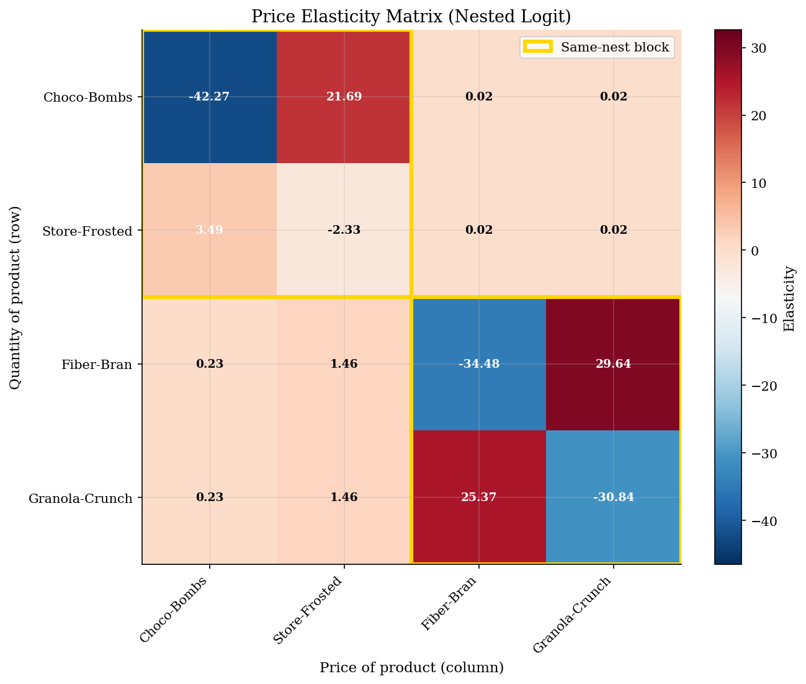
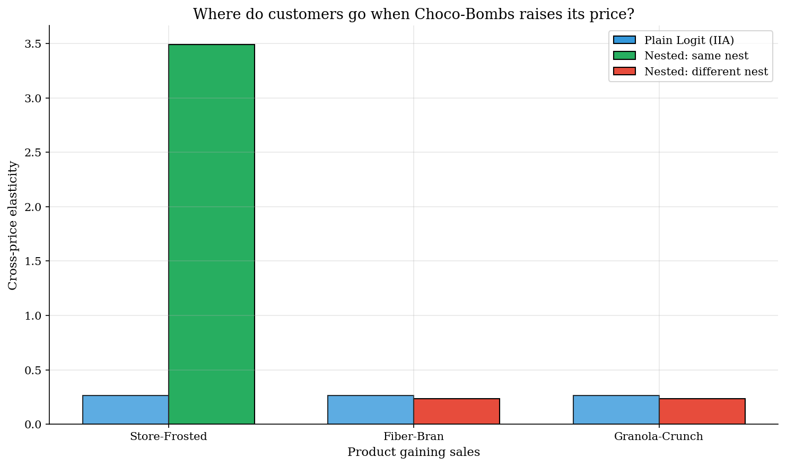
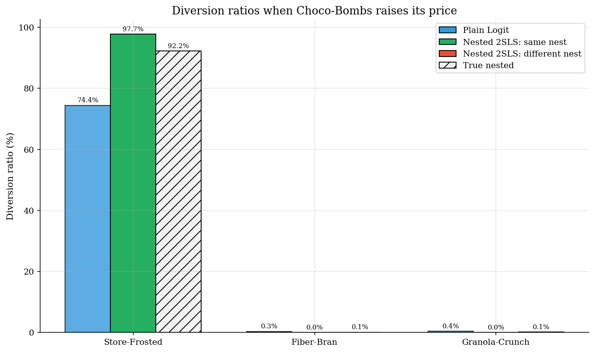

# Nested Logit Demand and Within-Nest Substitution

> Use product groups to turn logit from market-share substitution into economically closer substitution.

## Overview

A demand model has to answer two questions after a price change: how many buyers leave, and where they go. Plain logit answers the second question with market shares. Lost buyers are reallocated toward larger rivals, not toward products that are economically closer. That is the IIA restriction from the [plain-logit tutorial](../logit-discrete-choice/).

Nested logit keeps the closed-form share machinery but lets the researcher declare product groups. In this cereal market, Choco-Bombs and Store-Frosted are sugary cereals; Fiber-Bran and Granola-Crunch are healthy cereals. The nesting parameter $\sigma \in [0,1)$ governs how much extra substitution stays inside a group. At $\sigma=0$ the model is plain logit. As $\sigma$ rises, a price increase for a sugary cereal sends more buyers to the other sugary cereal rather than to the whole market in proportion to shares.

The example is small by design, so the substitution matrix and the IV estimation equation stay transparent before the move to richer random-coefficients demand models such as [BLP](../../industrial-organization/blp-random-coefficients/).

## Equations

Products $j=1,\ldots,J$ appear in markets $t=1,\ldots,T$. Product $j$ belongs
to nest $g(j)$, and $s_{0t}$ is the outside-good share. Mean utility is
$$
\delta_{jt}=\beta_0+\beta_{\text{sugar}}\text{sugar}_j-\alpha p_{jt}+\xi_j,
\qquad \alpha>0 .
$$

For each nest $g$, define the inclusive-value denominator
$$
D_{gt}=\sum_{k:g(k)=g}\exp\left(\frac{\delta_{kt}}{1-\sigma}\right),
\qquad 0\leq \sigma<1 .
$$

Shares factor into a conditional share inside the nest and the nest's total
share:
$$
s_{j|g,t}=
\frac{\exp\left(\delta_{jt}/(1-\sigma)\right)}{D_{g(j)t}},
\qquad
s_{gt}=
\frac{D_{gt}^{1-\sigma}}{1+\sum_h D_{ht}^{1-\sigma}},
\qquad
s_{jt}=s_{j|g,t}s_{g(j)t}.
$$

The Berry inversion becomes
$$
\ln s_{jt}-\ln s_{0t}
=
\beta_0+\beta_{\text{sugar}}\text{sugar}_j-\alpha p_{jt}
+\sigma\ln s_{j|g,t}+\xi_j .
$$
Both $p_{jt}$ and $\ln s_{j|g,t}$ are endogenous in this regression.

Rows in the elasticity matrix are products whose shares change; columns are
products whose prices change. For market $t$,
$$
\eta_{jk,t}=\frac{\partial\ln s_{jt}}{\partial\ln p_{kt}}=
\begin{cases}
-\alpha p_{jt}\left[\dfrac{1}{1-\sigma}
-\dfrac{\sigma}{1-\sigma}s_{j|g,t}-s_{jt}\right],
& j=k,\\[1.0em]
\alpha p_{kt}\left[\dfrac{\sigma}{1-\sigma}s_{k|g,t}+s_{kt}\right],
& j\neq k,\ g(j)=g(k),\\[1.0em]
\alpha p_{kt}s_{kt},
& g(j)\neq g(k).
\end{cases}
$$
The product-level diversion ratio from product $k$ to product $j$ is the
share-derivative ratio
$$
D_{j\leftarrow k}=
-\frac{\partial s_{jt}/\partial p_{kt}}{\partial s_{kt}/\partial p_{kt}}
=
\frac{\eta_{jk,t}s_{jt}}{|\eta_{kk,t}|s_{kt}} .
$$

## Model Setup

The synthetic design keeps the true nested-logit model available as a benchmark. Estimation uses only prices, sugar content, shares, and the instruments below; the true parameters are held out for the comparison figures and table.

| Object | Value | Role |
|---|---:|---|
| Markets $T$ | 50 | Cross-market price and cost variation |
| Inside products $J$ | 4 | Two sugary and two healthy cereals |
| Outside good | Included | Pins down the Berry share ratio |
| True $\alpha$ | 1.5 | Price sensitivity in the data-generating model |
| True $\beta_{\text{sugar}}$ | 0.3 | Taste for sugar content |
| True $\beta_0$ | 1.0 | Common inside-good utility shifter |
| True $\sigma$ | 0.7 | Extra same-nest substitution |
| Nests | Sugary, healthy | Maintained grouping used by nested logit |

## Solution Method

The computation has two parts. First, the nested-logit formulas map mean utilities into market shares and elasticities. Second, the Berry-inverted equation is estimated by 2SLS. The plain logit is estimated on the same data only as a benchmark for the substitution restriction.

```text
Algorithm: nested-logit IV demand
Input: markets t, products j, nests g(j), shares s_jt, outside shares s_0t
Output: IV estimates, elasticity matrix, and diversion ratios

1. For each market, compute within-nest shares s_{j|g,t} from observed shares.
2. Form y_jt = log(s_jt) - log(s_0t) and w_jt = log(s_{j|g,t}).
3. First stage: project price p_jt and w_jt on sugar and instruments Z_jt.
4. Second stage: regress y_jt on sugar, fitted price, and fitted w_jt.
5. Read alpha from the negative price coefficient and sigma from w_jt.
6. Compute eta_jk,t and D_{j<-k}; compare plain logit, fitted nested logit,
   and the true synthetic nested-logit benchmark.
```

The within-nest share is endogenous because the same unobserved product quality $\xi_j$ that raises a product's total share also raises its share inside the nest. The tutorial therefore instruments for both price and $\ln s_{j|g,t}$:

| Instrument | Targets | Rationale |
|---|---|---|
| Cost shifter | Price | Moves marginal cost without entering utility directly |
| Rival sugar, all products | Price | Summarizes rival characteristics in the market |
| Number of products in nest | $\ln s_{j\mid g,t}$ | Changes the local competitive set |
| Same-nest rival sugar | $\ln s_{j\mid g,t}$ | Moves the attractiveness of close substitutes |

## Results

Rows are the products whose shares respond; columns are the prices that move. The gold blocks mark the maintained nests. In the fitted nested model, the Choco-Bombs price column has a much larger effect on Store-Frosted than on the healthy cereals, so substitution follows product similarity rather than only market size.



The blue bars show the plain-logit restriction: the cross response is driven by Choco-Bombs' share and does not know which rival is closest. The green and red bars use the 2SLS nested-logit estimates; the hatched bars show the true synthetic nested-logit benchmark. The estimate overstates the strength of nesting in this small IV design, but it recovers the economic ranking: Store-Frosted is the close substitute.



Diversion ratios convert elasticities back into derivatives of market shares. Plain logit sends lost Choco-Bombs demand toward rivals in proportion to their current shares. Nested logit shifts much more of that product-level diversion to Store-Frosted. Across the three inside rivals, the product diversion shown here sums to 97.8% under the fitted nested model and 92.4% under the true nested model; the remainder goes to the outside good.



Changing $\sigma$ while holding mean utilities fixed isolates the role of the nesting parameter. At $\sigma\approx0$ the model behaves like plain logit. As $\sigma$ approaches one, same-nest elasticities grow rapidly, while cross-nest responses remain governed mostly by aggregate shares.


The table separates model misspecification from finite-sample IV noise. Plain logit has no nesting parameter, so it cannot match the substitution pattern even when the price coefficient is in the right range. The nested-logit estimate recovers the signs and the same-nest ranking, but $\hat\sigma$ is above the true value in this small synthetic panel.

**Parameter estimates: true values vs plain logit vs nested logit**

| Parameter   |   True | Logit   |   Nested Logit |
|:------------|-------:|:--------|---------------:|
| alpha       |    1.5 | 1.649   |          1.455 |
| beta_sugar  |    0.3 | 0.404   |          0.279 |
| beta_const  |    1   | -0.034  |          1.518 |
| sigma       |    0.7 | ---     |          0.913 |

## Takeaway

Nested logit is useful when the researcher can defend a product grouping and wants a substitution matrix richer than plain logit but still easy to estimate. The economic content is the diversion pattern: a price increase for one sugary cereal mainly sends buyers to another sugary cereal. The cost is that the nests are maintained structure. If the relevant notion of closeness is consumer-specific rather than group-specific, the next step is a random-coefficients model rather than more polishing of the same nested specification.

## References

- Berry, S. (1994). Estimating Discrete-Choice Models of Product Differentiation. *RAND Journal of Economics*, 25(2), 242--262.
- McFadden, D. (1978). Modelling the Choice of Residential Location. In A. Karlqvist et al. (Eds.), *Spatial Interaction Theory and Planning Models*. North-Holland.
- Train, K. (2009). *Discrete Choice Methods with Simulation*. Cambridge University Press, 2nd edition, Ch. 4.
