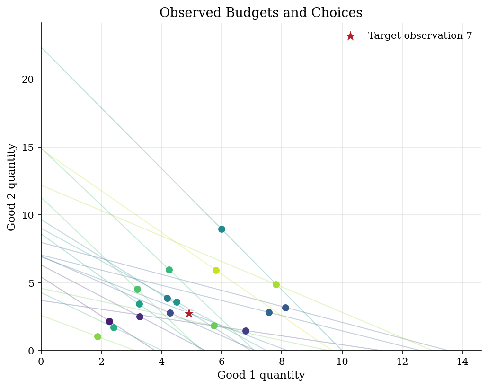
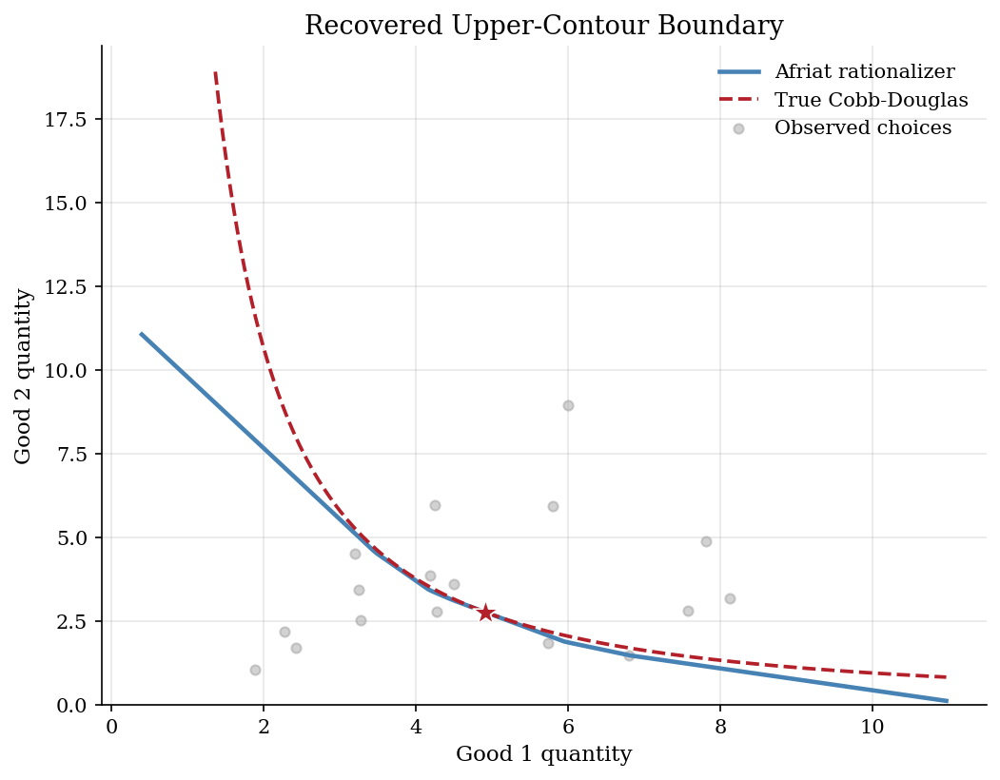
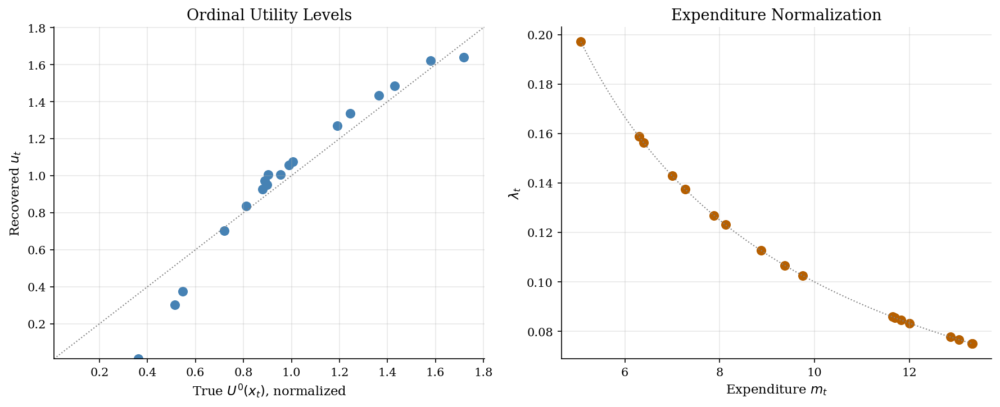

# Recovering Preference Bounds from Budget Choices

> Afriat numbers turn finite budget data into a rationalizing utility contour.

## Overview

Suppose we watch a consumer face several two-good budgets. At each price vector, the consumer buys one bundle and leaves every other affordable bundle unchosen. An economist may want to use those choices to compare welfare across policies or to discipline a later demand model, but finite budget observations cannot reveal the whole utility function.

Revealed preference gives a middle ground. After the observations pass GARP, Afriat's theorem turns the same price-bundle pairs into utility numbers and supporting slopes. The computation solves a linear feasibility problem and then evaluates the lower envelope of supporting planes. In this two-good example, that envelope draws one concave upper-contour boundary through a target bundle. The synthetic choices come from Cobb-Douglas demand, so the true contour is available only to judge what finite data recover.

## Equations

There are two goods and $T$ budget-choice observations. At observation $t$,
prices are $p_t=(p_{1t},p_{2t})\in\mathbb{R}_{++}^{2}$, the chosen bundle is
$x_t=(x_{1t},x_{2t})\in\mathbb{R}_{+}^{2}$, and expenditure is
$m_t=p_t\cdot x_t$.

Afriat recovery asks for ordinal utility scores $u_t$ and positive supporting
slopes $\lambda_t$ such that
$$
u_i-u_j \leq \lambda_j p_j\cdot(x_i-x_j)
\qquad \text{for all } i,j=1,\ldots,T .
$$
When these inequalities are feasible, one rationalizing utility index is
$$
\widehat U(y)=\min_{j=1,\ldots,T}
\left[u_j+\lambda_j p_j\cdot(y-x_j)\right].
$$
This utility is the lower envelope of affine supporting functions. It is
concave, monotone when prices and $\lambda_j$ are positive, and satisfies
$\widehat U(x_t)=u_t$ at the observed choices.

For a target observation $k$, the recovered upper-contour set is
$$
\widehat U(y)\geq u_k .
$$
Writing $y=(y_1,y_2)$, its lower boundary can be computed pointwise:
$$
y_2(y_1)=
\max_{j=1,\ldots,T}
\left[
x_{2j}
+
\frac{
u_k-u_j-\lambda_j p_{1j}(y_1-x_{1j})
}{
\lambda_j p_{2j}
}
\right].
$$
The data-generating benchmark, used only for comparison, is
$$
U^0(x)=x_1^{\alpha}x_2^{1-\alpha},\qquad \alpha=0.60 .
$$

## Model Setup

| Object | Value | Role in the exercise |
|---|---:|---|
| Observations $T$ | 18 | Price-bundle pairs observed by the analyst |
| Goods | 2 | Makes the recovered contour visible |
| True $\alpha$ | 0.60 | Cobb-Douglas benchmark, hidden from recovery |
| Income range | [5.07, 13.33] | Moves budget lines outward or inward |
| Price range | [0.57, 1.96] | Rotates the observed budgets |
| GARP violations | 0 | Screen before utility recovery |
| Max Afriat residual | 1.30e-15 | Feasibility error from the inequalities |
| Target observation | 7 | Bundle whose contour is drawn |

## Solution Method

Afriat recovery uses a linear program because the unknown utility scores enter only through pairwise inequalities. The GARP screen protects the economic interpretation: if a strict revealed-preference cycle exists, no monotone concave utility can rationalize all choices. Once the screen passes, the linear program chooses one ordinal utility score for each observed bundle. The lower envelope then extends those scores to nearby bundles.

```text
Algorithm: Afriat contour recovery
Input: budgets (p_t, x_t) for t=1,...,T and target observation k
Output: recovered utility index U_hat and contour through x_k

1. Mark i R j when bundle x_j was affordable under budget i.
2. Close R transitively and check for a strict revealed-preference reversal.
3. Set lambda_t = 1 / (p_t . x_t) to normalize supporting slopes.
4. Solve for ordinal scores u_t subject to
       u_i - u_j <= lambda_j p_j . (x_i - x_j) for every pair (i,j),
       average_t u_t = 1, and u_t >= 0.
5. Define U_hat(y) = min_j [u_j + lambda_j p_j . (y - x_j)].
6. For a grid of y_1 values, compute the smallest y_2 that satisfies
       U_hat((y_1,y_2)) >= u_k.
```

A more general implementation could let the $\lambda_t$ values vary inside the linear program. The fixed expenditure normalization used here keeps the example focused on the recoverable preference restrictions rather than on equivalent ordinal scalings.

## Results

Each line is an observed budget set, and each dot is the bundle chosen from that set. Price variation rotates budgets, while income variation shifts them outward or inward. The starred bundle is the observation whose upper-contour boundary is recovered below. The computation treats the Cobb-Douglas origin of the choices as unknown.



The blue curve is not a parametric estimate of Cobb-Douglas demand. It is one concave utility contour that passes through the target choice and rationalizes every observed bundle. The dashed curve is the true contour from the simulation and is shown only because this example has a known benchmark. On the plotted overlap, the median recovered-to-true $x_2$ ratio is **0.86**, and the largest absolute contour gap is **9.89** units of good 2.



The Afriat numbers should be read as a finite-data certificate, not as structural parameters. The scores $u_t$ rank observed bundles in a way that respects all budget comparisons, and $\lambda_t$ gives the supporting hyperplane slope in utility units. Since the sample is simulated, we can compare the recovered ordering with the true utility index. The correlation is **0.973**.



The last column checks that the recovered utility evaluates to $u_t$ at each observed bundle. The normalized true utility column is a simulation diagnostic, not an input to the recovery algorithm.

**Afriat numbers and fit diagnostics**

|   Observation |   Expenditure |    u_t |   lambda_t |   True U normalized |   Fit error |
|--------------:|--------------:|-------:|-----------:|--------------------:|------------:|
|             1 |          6.3  | 0.3738 |     0.1587 |              0.5457 |    0        |
|             2 |          9.76 | 0.7013 |     0.1025 |              0.7205 |    0        |
|             3 |          7.27 | 1.0046 |     0.1376 |              0.9025 |    0        |
|             4 |         11.7  | 0.9263 |     0.0855 |              0.8797 |    0        |
|             5 |          9.37 | 1.4329 |     0.1067 |              1.3645 |    0        |
|             6 |         13.33 | 1.3368 |     0.075  |              1.2453 |    0        |
|             7 |         12    | 1.0048 |     0.0833 |              0.9537 |    0        |
|             8 |          8.12 | 1.0568 |     0.1231 |              0.9896 |    0        |
|             9 |         13.32 | 1.6398 |     0.0751 |              1.7191 |    0        |
|            10 |         13.05 | 1.0747 |     0.0766 |              1.0049 |    0        |
|            11 |          8.87 | 0.8358 |     0.1127 |              0.8122 |    0        |
|            12 |          7.88 | 0.3015 |     0.1269 |              0.5145 |    0        |
|            13 |         11.82 | 1.2694 |     0.0846 |              1.1898 |    0        |
|            14 |          6.4  | 0.9517 |     0.1563 |              0.8971 |    0        |
|            15 |          7    | 0.9713 |     0.1429 |              0.8885 |   -1.33e-15 |
|            16 |          5.07 | 0.0113 |     0.1971 |              0.3625 |    0        |
|            17 |         12.87 | 1.6214 |     0.0777 |              1.5794 |    0        |
|            18 |         11.65 | 1.4857 |     0.0858 |              1.4304 |    0        |

## Takeaway

Finite choice data can say more than pass/fail rationalizability, but less than a fully specified utility function. Afriat numbers recover one utility index and one local contour that respect every observed budget comparison. The Cobb-Douglas overlay shows how to read the result: budgets discipline the preference ordering where they create support, and areas with little price variation remain weakly pinned down.

If the data fail GARP, this exercise should stop and the analyst should ask which observations break rationalizability; see the [money pump index](../money-pump-index/) and [Houtman-Maks rational subsets](../houtman-maks-rational-subsets/) tutorials. If the data pass, Afriat recovery gives a nonparametric object that a later parametric demand model has to respect.

## References

- Afriat, S. N. (1967). The Construction of Utility Functions from Expenditure Data. *International Economic Review*, 8(1), 67-77.
- Varian, H. R. (1982). The Nonparametric Approach to Demand Analysis. *Econometrica*, 50(4), 945-973.
- Varian, H. R. (2006). Revealed Preference. In M. Szenberg et al. (Eds.), *Samuelsonian Economics and the Twenty-First Century*. Oxford University Press.
