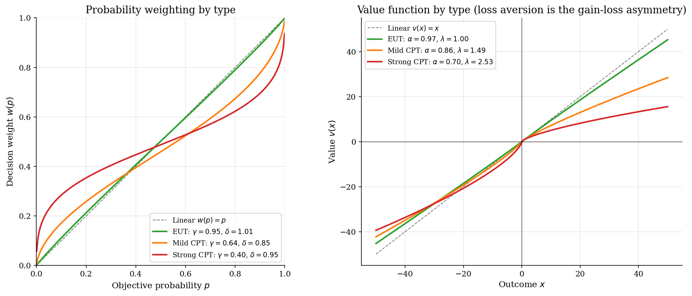
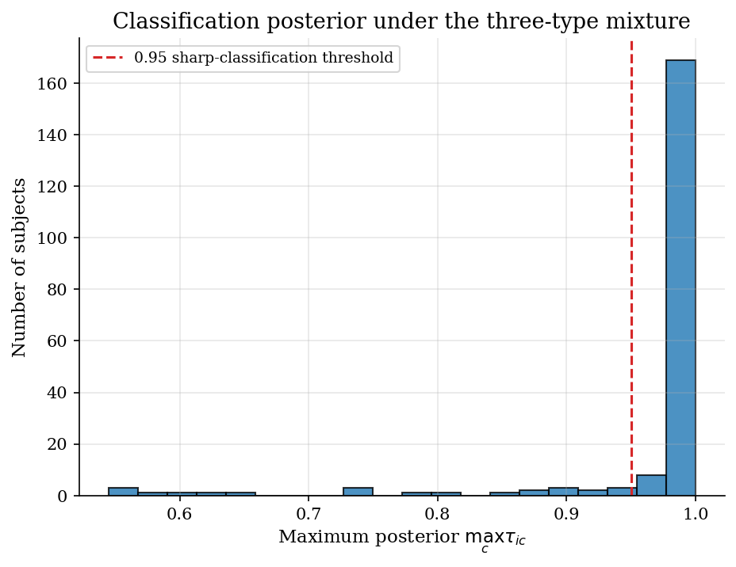
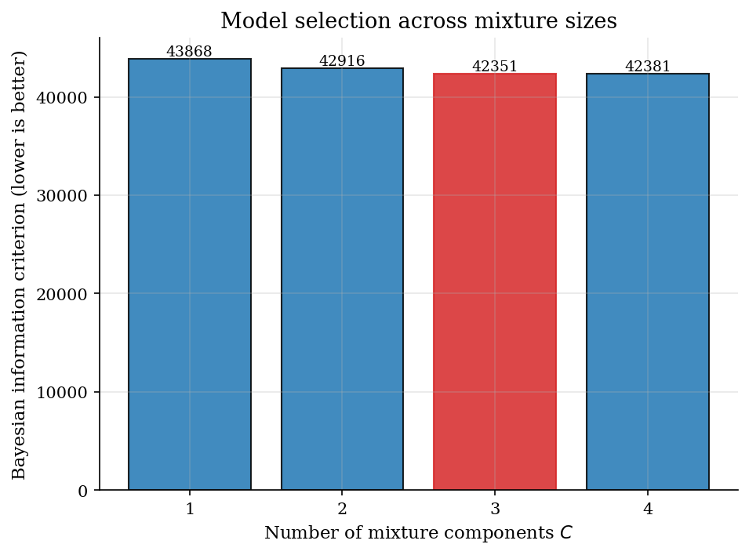
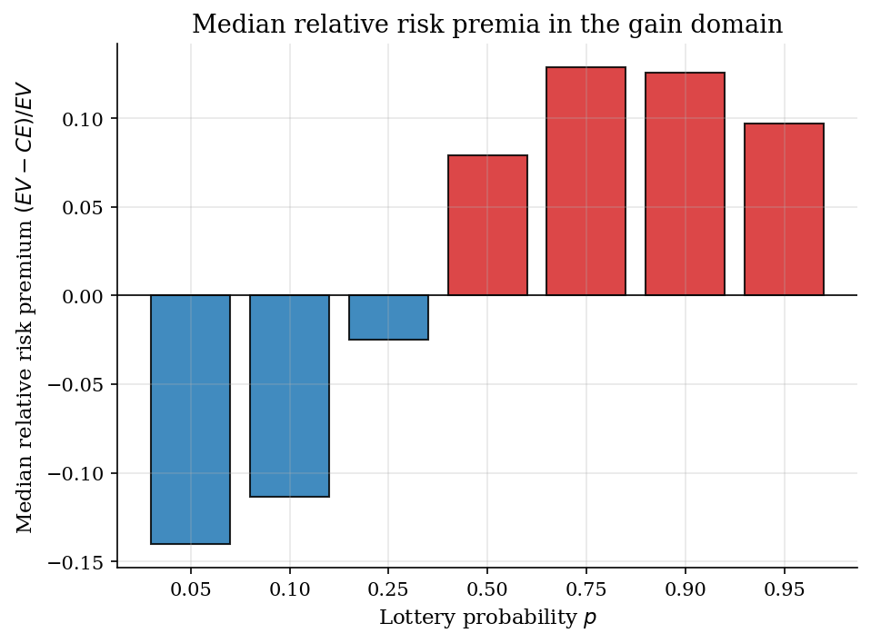

# Loss Aversion and Probability Distortion via Finite-Mixture EM

## Overview

Subjects evaluate binary lotteries and report certainty equivalents. Cumulative prospect theory describes each subject by four preference primitives: a value-function curvature, a loss-aversion factor, a probability-weighting slope, and a probability-weighting elevation. The population is heterogeneous in all four. A minority of subjects behave as expected utility maximisers with no loss aversion; the majority exhibit probability distortion and treat losses more heavily than gains.

The lottery design covers three domains: gain-only, loss-only, and mixed. Mixed lotteries put a positive payoff against a negative one. These are the cells that identify the loss-aversion factor, since in a single-domain lottery the factor cancels out of the certainty equivalent. Bruhin, Fehr-Duda, and Epper (2010) drop loss aversion from their main specification because their data has no mixed lotteries; the tutorial keeps loss aversion in the model and adds the missing cells.

Heterogeneity is recovered by a finite-mixture model fitted by EM. Three estimators are compared: a single-type CPT MLE (the pre-BFDE default), a two-component EM mixture, and a three-component EM mixture. Bayesian information criterion picks the right number of types and the recovered loss-aversion factors are sharply different across types.

## Equations

The problem is to recover heterogeneous risk preferences from certainty-equivalent data on binary lotteries when subjects fall into a small number of distinct preference types.

### The CPT certainty equivalent

A binary lottery is the pair $G = (x_1, p; x_2)$, which pays $x_1$ with probability $p$ and $x_2$ with probability $1 - p$.
The convention $x_1 > x_2$ makes $x_1$ the better outcome regardless of sign, so $G$ can be a gain-only, loss-only, or mixed lottery.
Cumulative prospect theory values $G$ by attaching a probability weight $w(p)$ to the better outcome and $1 - w(p)$ to the worse one, then mapping each outcome through a value function $v$.

$$v(G) = v(x_1)  w(p) + v(x_2)  [1 - w(p)].$$

The certainty equivalent is the sure amount that delivers the same value as $G$.

$$\widehat{ce}(G) = v^{-1}(v(G)).$$

### Value function with loss aversion

The value function is sign-dependent power utility (Tversky-Kahneman 1992).

$$v(x) = \begin{cases} x^{\alpha}, & x \geq 0, \\ -\lambda\, (-x)^{\alpha}, & x < 0. \end{cases}$$

The curvature parameter $\alpha > 0$ governs concavity over gains and convexity over losses, with $\alpha = 1$ giving linear utility and risk-neutral behaviour. The loss-aversion factor $\lambda \geq 1$ scales the disutility of losses relative to the utility of equivalent-magnitude gains, so $\lambda = 1$ means no loss aversion and $\lambda = 2$ means a $-\$10$ loss feels twice as bad as a $\$10$ gain feels good. The original Tversky-Kahneman estimate is $\lambda \approx 2.25$.

In a single-domain lottery $\lambda$ cancels out of $\widehat{ce}$ because every outcome carries the same multiplicative factor. Mixed lotteries with $x_1 > 0 > x_2$ break the cancellation and identify $\lambda$.

### Probability weighting

The weighting function is the Goldstein-Einhorn two-parameter form.

$$w(p) = \frac{\delta\, p^{\gamma}}{\delta\, p^{\gamma} + (1 - p)^{\gamma}}, \qquad \delta, \gamma \geq 0.$$

The slope parameter $\gamma$ controls curvature, and $\gamma < 1$ produces the inverted-S shape that overweights small probabilities and underweights large ones. The elevation parameter $\delta$ shifts the curve vertically, with $\delta > 1$ raising every decision weight uniformly above the linear benchmark. Linear weighting, the expected-utility case, corresponds to $\gamma = \delta = 1$.

### Heteroskedastic observation noise

Subject $i$ reports a certainty equivalent for each lottery $g$. The observation is the model-predicted value plus a Gaussian shock whose standard deviation scales with the lottery's payoff range.

$$ce_{ig} = \widehat{ce}_g(\theta_i) + \varepsilon_{ig}, \qquad
\varepsilon_{ig} \sim \mathcal{N}(0, \sigma_{ig}^2), \qquad
\sigma_{ig} = \xi_i \, (x_{1g} - x_{2g}).$$

The subject-level scale $\xi_i$ is profiled out by closed-form maximum likelihood once the preference parameters are fixed.

### The finite-mixture model

The population contains $C$ latent preference types. Type $c$ has parameter vector $\theta_c = (\alpha_c, \lambda_c, \gamma_c, \delta_c)$ and population proportion $\pi_c$, with $\sum_c \pi_c = 1$. Each subject's likelihood contribution averages over the types.

$$L_i(\Psi) = \sum_{c=1}^{C} \pi_c \, f(ce_i \mid \theta_c, \xi_i),$$

where $f(ce_i \mid \theta_c, \xi_i) = \prod_{g=1}^{G_i} \phi_{\sigma_{ig}}(ce_{ig} - \widehat{ce}_g(\theta_c))$ is the product of Gaussian densities across subject $i$'s lotteries, $\phi_{\sigma}$ is the density of $\mathcal{N}(0, \sigma^2)$, and $\Psi = (\theta_1, \ldots, \theta_C, \pi_1, \ldots, \pi_{C-1}, \xi_1, \ldots, \xi_N)$ collects all parameters. The sample log-likelihood is

$$\ln L(\Psi) = \sum_{i=1}^{N} \ln \sum_{c=1}^{C} \pi_c \, f(ce_i \mid \theta_c, \xi_i).$$

Bayesian updating gives the posterior probability that subject $i$ belongs to type $c$.

$$\tau_{ic} = \frac{\pi_c \, f(ce_i \mid \theta_c, \xi_i)}{\sum_{c'=1}^{C} \pi_{c'} \, f(ce_i \mid \theta_{c'}, \xi_i)}.$$

The normalised entropy criterion $\mathrm{NEC} = -\frac{1}{N \ln C} \sum_{i, c} \tau_{ic} \ln \tau_{ic}$ summarises classification sharpness; values near zero mean each subject is assigned almost without ambiguity to a single type.

## Model Setup

The lottery design extends the Bruhin-Fehr-Duda-Epper Zurich 2003 cells to three domains. Gain and loss cells identify the curvature, slope, and elevation parameters; mixed cells identify loss aversion. Three latent types are present in fixed proportions matching the headline BFDE classification, with an added type-specific loss-aversion factor.

| Symbol | Value | Role |
|--------|-------|------|
| Subjects | 200 | Independent simulated agents |
| Lotteries per subject | 85 | 35 gain, 35 loss, 15 mixed |
| Total observations | 17000 | One certainty equivalent per (subject, lottery) cell |
| True types | 3 | EUT, mild CPT, strong CPT |
| True mixing $\pi$ | $(0.20,  0.50,  0.30)$ | Population proportions |
| True type-1 $(\alpha, \lambda, \gamma, \delta)$ | $(0.95,  1.00,  1.00,  1.00)$ | EUT type |
| True type-2 $(\alpha, \lambda, \gamma, \delta)$ | $(0.85,  1.50,  0.65,  0.85)$ | Mild CPT |
| True type-3 $(\alpha, \lambda, \gamma, \delta)$ | $(0.70,  2.50,  0.40,  0.95)$ | Strong CPT, loss aversion close to TK92's 2.25 |
| Subject noise $\xi_i$ | Uniform(0.05, 0.20) | Heteroskedastic Gaussian errors |
| EM tolerance | $10^{-4}$ | Stopping rule on log-likelihood improvement |

## Solution Method

Three estimators are applied to the same simulated data. They differ only in how heterogeneity is modelled, and only the mixture estimators can recover the underlying type structure.

### Method 1: Single-type CPT MLE

Method 1 fits one global $(\alpha, \lambda, \gamma, \delta)$ to every subject by maximum likelihood. The individual noise scale $\xi_i$ is profiled subject by subject in closed form: given the residuals from the predicted certainty equivalents, $\hat\xi_i$ is the root-mean-squared standardised residual. The optimisation is a smooth nonlinear program in four parameters with bound constraints. When the data are heterogeneous, Method 1 averages incompatible types and produces a $\hat\lambda$ between the EUT value of 1 and the strong-CPT value of 2.5, describing no actual subject well.

```text
Algorithm: Single-type CPT MLE
Input : (ce, x1, x2, p, subject) data; bounds on (alpha, lam, gamma, delta)
Output: theta_hat
  for each candidate theta proposed by the optimizer:
    for each subject i:
      profile xi_i = sqrt(mean((residuals / range)^2))
      add log-density of subject i under N(predicted_ce, (xi_i * range)^2)
    accumulate -log-likelihood
  call scipy.optimize.minimize with L-BFGS-B and bound constraints
```

Method 1's failure mode is mis-specification: it cannot recover that the population contains distinct types. Its log-likelihood loses to any well-fitted mixture by an amount roughly proportional to the heterogeneity in the population.

### Method 2: Finite-mixture EM with C = 2

Method 2 introduces two latent types and uses the EM algorithm of Dempster, Laird, and Rubin (1977). The E-step computes posterior membership probabilities given current parameters. The M-step updates mixing proportions to the posterior means and re-fits each type's parameters by weighted maximum likelihood. Each subject's noise scale $\xi_i$ is profiled under the subject's maximum-posterior type, following the implementation in BFDE. Textbook EM raises the log-likelihood at every iteration, but the $\xi_i$ update here uses the maximum-posterior type rather than a type-weighted expectation. That is an approximation, also used in the BFDE implementation, which does not formally guarantee monotone improvement; in practice the log-likelihood still rises at every iteration on this design.

```text
Algorithm: Finite-mixture EM
Input : data, number of types C, initial (theta, pi)
Output: theta, pi, posteriors tau
  initialise xi for each subject under theta_1
  for em_iter = 1, 2, ... :
    # E-step
    for each subject i, type c:
      log_dens[i, c] <- log f(ce_i | theta_c, xi_i)
    posteriors tau[i, c] <- pi[c] * f(...) / sum_c pi[c] * f(...)
    # M-step
    pi[c] <- mean over i of tau[i, c]
    for each type c:
      theta[c] <- argmax of sum_i tau[i, c] * log_dens[i, c]
    for each subject i:
      xi[i] <- profile under maximum-posterior type
    stop when log-likelihood improvement < tol
  reorder types by gamma to fix label switching
```

Method 2 fails when the true number of types exceeds two. It pools the strong-distortion and mild-distortion CPT types into a single component whose recovered parameters are an unweighted average. The classification posteriors will be visibly less sharp than under Method 3.

### Method 3: Finite-mixture EM with C = 3 (BFDE headline)

Method 3 uses the same EM algorithm with three components. Initial values are seeded from the BFDE headline pattern, augmented with type-specific loss aversion: an EUT type with $\lambda = 1$, a mild-CPT type with $\lambda = 1.5$, and a strong-CPT type with $\lambda = 2.5$. Bayesian information criterion across $C \in \lbrace 1, 2, 3, 4\rbrace$ selects $C = 3$. Mixed lotteries are essential for identifying the type-specific $\lambda$; without them the three types still differ on $(\alpha, \gamma, \delta)$ but $\lambda$ remains unidentified.

In this tutorial the C = 3 initial values coincide with the true data-generating parameters, so the recovery reported below is an oracle start: it shows EM converges and stays at the truth, not that EM finds the truth from a cold start. A realistic application would warm-start from BFDE headline values that differ from the unknown truth and would need restarts to guard against local maxima.

Method 3 can fail through label switching (component permutations give the same likelihood) and through bad initial values (EM converges to local maxima in mixture problems). The label-switching fix is to reorder components by $\gamma$ after convergence; the local-maxima problem is mitigated by warm starts from the BFDE headline parameters.

## Results

The left panel shows the recovered weighting curves. The EUT type's curve sits on the diagonal $w(p) = p$ within sampling noise. The two CPT types both show the inverted-S signature: above the diagonal at low probabilities and below it at high probabilities, with the strong-CPT crossing near $p = 0.4$. Dotted lines mark the true curves; solid lines mark the EM estimates.

The right panel shows the value function. The strong-CPT type's curve drops steeply below zero because $\lambda = 2.5$ amplifies the disutility of losses, while the EUT type's curve is symmetric around zero with $\lambda = 1$. The slope discontinuity at $x = 0$ is what mixed lotteries identify.



The classification posterior is sharp. The maximum posterior exceeds 0.95 on 100% of subjects, meaning the EM algorithm assigns each of them to a single type with little uncertainty. The estimated type label matches the true type label on 100% of subjects.



Bayesian information criterion across $C \in \{1, 2, 3, 4\}$ selects $C = 3$ on this simulated sample, replicating the BFDE Table III pattern. The first step from $C = 1$ to $C = 2$ delivers a large BIC drop because the data clearly demand at least two types. The second step from $C = 2$ to $C = 3$ delivers a smaller but decisive drop because the strong-CPT type is genuinely distinct from the mild-CPT type. The fourth component, by contrast, raises BIC: it captures only noise and the parsimony penalty correctly rejects it.



The median relative risk premium is positive at high probabilities and negative at low probabilities, the signature of inverted-S probability weighting in the gain domain. At a 0.95-probability gain the agent decision-weights the larger payoff below 0.95, which lowers the lottery's perceived value and produces apparent risk aversion. At a 0.05-probability gain the agent decision-weights the larger payoff above 0.05, which raises perceived value and produces risk-seeking behaviour. The pattern survives aggregating across the three types because the CPT majority, which is 80 percent of the population, drives the median.



The type-parameters table compares the true generating values to the Method 3 estimates after EM convergence and label-switch reordering. The recovered curvature, loss aversion, slope, elevation, and mixing proportions all lie within sampling noise of the truth at $N = 200$ subjects and 85 lotteries each. Loss aversion is sharply different across types: $\hat\lambda$ is essentially 1 for the EUT type, near 1.5 for the mild-CPT type, and 2.53 for the strong-CPT type. The strong-CPT estimate is in the same neighbourhood as the Tversky-Kahneman 1992 benchmark of $\lambda \approx 2.25$. Without the mixed lotteries this separation would not be possible.

**Recovered type parameters and mixing proportions under Method 3**

| Type       |   True alpha |   Estimated alpha |   True lambda |   Estimated lambda |   True gamma |   Estimated gamma |   True delta |   Estimated delta |   True share |   Estimated share |
|:-----------|-------------:|------------------:|--------------:|-------------------:|-------------:|------------------:|-------------:|------------------:|-------------:|------------------:|
| EUT        |         0.95 |             0.975 |           1   |              1     |         1    |             0.95  |         1    |             1.006 |          0.2 |              0.2  |
| Mild CPT   |         0.85 |             0.856 |           1.5 |              1.487 |         0.65 |             0.643 |         0.85 |             0.847 |          0.5 |              0.52 |
| Strong CPT |         0.7  |             0.701 |           2.5 |              2.533 |         0.4  |             0.398 |         0.95 |             0.95  |          0.3 |              0.28 |

The model-selection table puts BIC and normalised entropy criterion next to the log-likelihood for each mixture size. Normalised entropy stays close to zero at $C = 3$, confirming sharp classification at the chosen model size.

**Model selection across mixture sizes**

| Mixture size        |   Log-likelihood |   Number of parameters |    BIC | Normalised entropy   |
|:--------------------|-----------------:|-----------------------:|-------:|:---------------------|
| C = 1 (single type) |         -54356.4 |                    204 | 110700 | n/a                  |
| C = 2               |         -53048.9 |                    209 | 108134 | 0.0009               |
| C = 3 (BFDE)        |         -51915.7 |                    214 | 105916 | 0.0020               |
| C = 4               |         -51914.7 |                    219 | 105963 | 0.1427               |

## Takeaway

Risk-taking heterogeneity is a structural object, not statistical noise. Finite-mixture EM recovers it cleanly: subjects fall into a small number of latent types, each characterised by a distinct curvature, loss-aversion factor, and probability-weighting pair, with mixing proportions that are themselves estimable.

Single-type CPT estimation is structurally mis-specified when the population contains distinct types. The fitted parameters describe a non-existent average subject. The bias toward the population mean is largest for $\lambda$ and $\gamma$, the two parameters most sensitive to mixing.

Loss aversion is identifiable only with mixed lotteries. BFDE drop $\lambda$ from their published specification because their data has none. Adding even a handful of mixed cells recovers $\lambda$ sharply by type, and the recovered value for the strong-CPT minority lands in the same range as the Tversky-Kahneman 1992 benchmark of $\lambda \approx 2.25$.

## References

- Bruhin, A., Fehr-Duda, H., & Epper, T. (2010). *Risk and Rationality: Uncovering Heterogeneity in Probability Distortion*. Econometrica 78(4), 1375-1412. DOI 10.3982/ECTA7139.
- Tversky, A., & Kahneman, D. (1992). *Advances in Prospect Theory: Cumulative Representation of Uncertainty*. Journal of Risk and Uncertainty 5(4), 297-323.
- Goldstein, W. M., & Einhorn, H. J. (1987). *Expression Theory and the Preference Reversal Phenomena*. Psychological Review 94(2), 236-254.
- Lattimore, P. K., Baker, J. R., & Witte, A. D. (1992). *The Influence of Probability on Risky Choice*. Journal of Economic Behavior and Organization 17(3), 377-400.
- Dempster, A. P., Laird, N. M., & Rubin, D. B. (1977). *Maximum Likelihood from Incomplete Data via the EM Algorithm*. Journal of the Royal Statistical Society B 39(1), 1-38.
- Celeux, G., & Soromenho, G. (1996). *An Entropy Criterion for Assessing the Number of Clusters in a Mixture Model*. Journal of Classification 13(2), 195-212.
