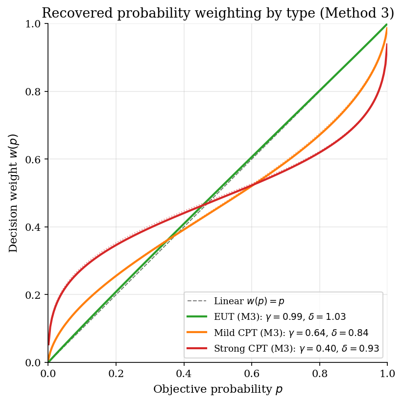

# Heterogeneous Probability Distortion via Finite-Mixture EM

## Overview

Subjects evaluate binary lotteries and report certainty equivalents. Cumulative prospect theory rationalises the data with three primitives per subject: a CRRA value-function exponent, a probability-weighting slope, and a probability-weighting elevation. The population is genuinely heterogeneous in these primitives. A minority of subjects behave as expected utility maximisers (linear probability weighting, near-linear value), and the majority exhibit substantial probability distortion of varying strength.

Bruhin, Fehr-Duda, and Epper (2010) recover this latent heterogeneity by a finite-mixture model fitted by the EM algorithm. The mixture endogenously classifies subjects into types and reports type-specific parameters together with mixing proportions. Their headline empirical finding across three samples is a robust three-type split: about 20 percent EUT types, 50 percent mild-distortion CPT types, and 30 percent strong-distortion CPT types.

The tutorial reconstructs the BFDE specification on simulated data and compares three estimators. Method 1 fits a single CPT model to everyone, the standard pre-BFDE practice. Method 2 fits a two-component EM mixture, demonstrating the iteration mechanics. Method 3 fits a three-component EM mixture, recovering the BFDE headline parameters and showing how Bayesian information criterion selects the right number of types. Across the comparison, the single-type fit averages incompatible subjects and produces parameters that describe none of them well; the three-type mixture recovers the true parameters and the true mixing proportions to within sampling noise.

## Equations

The general problem is to recover heterogeneous risk preferences from certainty-equivalent data on binary lotteries when subjects fall into a small number of distinct preference types.

### The CPT specification

Each subject evaluates a binary lottery $G = (x_1, p; x_2)$ with $|x_1| > |x_2| \geq 0$ in the gain domain.
Cumulative prospect theory assigns a value to the lottery using a value function $v$ over outcomes and a probability-weighting function $w$ over the larger outcome's probability.

$$v(G) = v(x_1)\, w(p) + v(x_2)\, [1 - w(p)].$$

The certainty equivalent is the inverse of this value:

$$\widehat{ce}(G) = v^{-1}(v(G)).$$

### Functional forms

The value function is sign-dependent power restricted to gains.

$$v(x) = x^{\alpha}, \qquad \alpha > 0.$$

The probability-weighting function is the two-parameter Goldstein-Einhorn / Lattimore-Baker-Witte form (Bruhin-Fehr-Duda-Epper Section 3, equation following Stott 2006).

$$w(p) = \frac{\delta\, p^{\gamma}}{\delta\, p^{\gamma} + (1 - p)^{\gamma}}, \qquad \delta \geq 0,\, \gamma \geq 0.$$

The slope parameter $\gamma$ controls curvature: $\gamma < 1$ gives the inverted-S shape characteristic of probability distortion.
The elevation parameter $\delta$ controls vertical position: $\delta > 1$ raises every weight, making the agent more optimistic about every probability.
Linear weighting (consistent with expected utility) corresponds to $\gamma = \delta = 1$.

Loss aversion $\lambda$ is not identifiable from single-domain data because it cancels out of the certainty equivalent (Bruhin-Fehr-Duda-Epper Section 3, footnote on page 1382).
The tutorial restricts to gains and follows the paper in dropping $\lambda$.

### Heteroskedastic observation noise

For lottery $g$ presented to subject $i$, the observed certainty equivalent is the predicted value plus a Gaussian shock whose standard deviation scales with the lottery's payoff range.

$$ce_{ig} = \widehat{ce}_g(\theta_i) + \varepsilon_{ig}, \qquad
\varepsilon_{ig} \sim \mathcal N(0, \sigma_{ig}^2), \qquad
\sigma_{ig} = \xi_i \, |x_{1g} - x_{2g}|.$$

The individual scale parameter $\xi_i$ is profiled out by closed-form maximum likelihood given $\theta_i$.

### The finite-mixture model

The population contains $C$ latent types.
Each type $c$ has a parameter vector $\theta_c = (\alpha_c, \gamma_c, \delta_c)$ and an unknown population proportion $\pi_c$ with $\sum_c \pi_c = 1$.
The likelihood contribution of subject $i$ is a weighted sum over types.

$$L_i(\Psi) = \sum_{c=1}^{C} \pi_c \, f(ce_i \mid \theta_c, \xi_i),$$

where $f(ce_i \mid \theta_c, \xi_i) = \prod_{g=1}^{G_i} \phi_{\sigma_{ig}}(ce_{ig} - \widehat{ce}_g(\theta_c))$ is the product of Gaussian densities across subject $i$'s lotteries and $\Psi = (\theta_1, \ldots, \theta_C, \pi_1, \ldots, \pi_{C-1}, \xi_1, \ldots, \xi_N)$ collects all parameters.

The total log-likelihood is

$$\ln L(\Psi) = \sum_{i=1}^{N} \ln \sum_{c=1}^{C} \pi_c \, f(ce_i \mid \theta_c, \xi_i).$$

### Identification through type posteriors

Bayesian updating gives the posterior probability that subject $i$ belongs to type $c$.

$$\tau_{ic} = \frac{\pi_c \, f(ce_i \mid \theta_c, \xi_i)}{\sum_{c'=1}^{C} \pi_{c'} \, f(ce_i \mid \theta_{c'}, \xi_i)}.$$

Sharp classification corresponds to $\tau_{ic}$ close to 0 or 1 for almost every subject.
The normalised entropy criterion (Celeux-Soromenho 1996) summarises the sharpness as $-\frac{1}{N \ln C} \sum_{i, c} \tau_{ic} \ln \tau_{ic}$, which is 0 under perfect classification and 1 under uniform uncertainty.

### Method 1: Single-type MLE

The naive baseline fits one global $\theta = (\alpha, \gamma, \delta)$ to all subjects by maximising the log-likelihood.
The individual noise scale $\xi_i$ is profiled subject by subject.
Identification depends on a wide enough probability and stakes design; the tutorial uses the BFDE Zurich-2003 lotteries.

### Method 2: Mixture EM at C = 2

The expectation-maximisation algorithm (Dempster, Laird, Rubin 1977) iterates until the log-likelihood improvement is below tolerance.
The E-step computes posteriors $\tau_{ic}$ given current parameters.
The M-step updates mixing proportions to the posterior means and re-fits each $\theta_c$ by weighted maximum likelihood with weights $\tau_{ic}$.

### Method 3: Mixture EM at C = 3

The headline BFDE specification recovers an EUT-leaning type, a mild-distortion CPT type, and a strong-distortion CPT type.
Bayesian information criterion selects $C = 3$ over $C \in \lbrace 1, 2, 4\rbrace$ on the simulated data, matching the paper's finding across all three of their experimental samples.

## Model Setup

The simulation uses the Bruhin-Fehr-Duda-Epper Zurich 2003 lottery design in the gain domain only. Three latent types are present in fixed proportions matching the headline BFDE classification. Each subject faces 35 lotteries varying in $p$ and $(x_1, x_2)$.

| Symbol | Value | Role |
|--------|-------|------|
| Subjects | 200 | Independent simulated agents |
| Lotteries per subject | 35 | Gain-domain $p \in \{0.05, 0.10, 0.25, 0.50, 0.75, 0.90, 0.95\}$ |
| Total observations | 7000 | One certainty equivalent per (subject, lottery) cell |
| True types | 3 | EUT, mild CPT, strong CPT |
| True $\pi$ | $(0.20,\, 0.50,\, 0.30)$ | Mixing proportions |
| True type-1 $(\alpha, \gamma, \delta)$ | $(0.95,\, 1.00,\, 1.00)$ | EUT type |
| True type-2 $(\alpha, \gamma, \delta)$ | $(0.85,\, 0.65,\, 0.85)$ | Mild CPT |
| True type-3 $(\alpha, \gamma, \delta)$ | $(0.70,\, 0.40,\, 0.95)$ | Strong CPT |
| Subject noise $\xi_i$ | Uniform(0.05, 0.20) | Heteroskedastic Gaussian errors |
| EM tolerance | $10^{-4}$ | Stopping rule on log-likelihood improvement |

## Solution Method

Three estimators recover (or attempt to recover) the same underlying preference parameters from the same simulated data. They differ only in how heterogeneity is modelled.

### Method 1: Single-type CPT MLE

Method 1 fits one global $(\alpha, \gamma, \delta)$ to every subject by maximum likelihood. The individual noise scale $\xi_i$ is profiled subject by subject in closed form: given the residuals from the predicted certainty equivalents, $\hat\xi_i$ is the root-mean-squared standardised residual. The optimisation is a smooth nonlinear program in three parameters with bound constraints. When the data are heterogeneous, Method 1 averages incompatible types and produces a $\hat\gamma$ between the EUT value of 1 and the strong-distortion value of 0.4, describing no actual subject well.

```text
Algorithm: Single-type CPT MLE
Input : (ce, x1, x2, p, subject) data; bounds on (alpha, gamma, delta)
Output: theta_hat
  for each candidate theta proposed by the optimizer:
    for each subject i:
      profile xi_i = sqrt(mean((residuals / range)^2))
      add log-density of subject i under N(predicted_ce, (xi_i * range)^2)
    accumulate -log-likelihood
  call scipy.optimize.minimize with L-BFGS-B and bound constraints
```

Method 1's failure mode is mis-specification: it does not have a way to recover that the population contains distinct types. Its log-likelihood will lose to any well-fitted mixture by an amount roughly proportional to the heterogeneity in the population.

### Method 2: Finite-mixture EM with C = 2

Method 2 introduces two latent types and uses the EM algorithm of Dempster, Laird, and Rubin (1977). The E-step computes posterior membership probabilities given current parameters. The M-step updates mixing proportions to the posterior means and re-fits each type's parameters by weighted maximum likelihood. Each subject's noise scale is profiled by maximum-posterior-type as in BFDE's implementation. EM is monotone in log-likelihood by construction.

```text
Algorithm: Finite-mixture EM
Input : data, number of types C, initial (theta, pi)
Output: theta, pi, posteriors tau
  initialise xi for each subject under theta_1
  for em_iter = 1, 2, ... :
    # E-step
    for each subject i, type c:
      log_dens[i, c] <- log f(ce_i | theta_c, xi_i)
    posteriors tau[i, c] <- pi[c] * f(...) / sum_c pi[c] * f(...)
    # M-step
    pi[c] <- mean over i of tau[i, c]
    for each type c:
      theta[c] <- argmax of sum_i tau[i, c] * log_dens[i, c]
    for each subject i:
      xi[i] <- profile under maximum-posterior type
    stop when log-likelihood improvement < tol
  reorder types by gamma to fix label switching
```

Method 2 fails when the true number of types exceeds two. It pools the strong-distortion and mild-distortion CPT types into a single component whose recovered parameters are an unweighted average. The classification posteriors will be visibly less sharp than under Method 3.

### Method 3: Finite-mixture EM with C = 3 (BFDE headline)

Method 3 uses the same EM algorithm with three components. Initial values for the three types are seeded from the BFDE headline pattern: an EUT type at $(\alpha, \gamma, \delta) = (0.95, 1.00, 1.00)$, a mild-CPT type at $(0.85, 0.65, 0.85)$, and a strong-CPT type at $(0.70, 0.40, 0.95)$. Bayesian information criterion across $C \in \lbrace 1, 2, 3, 4\rbrace$ selects $C = 3$, matching BFDE Table III. The classification posteriors are sharp (most subjects have $\tau_{ic} > 0.95$ on one type) and the recovered parameters lie within sampling noise of the true generating values.

Method 3 can fail through label switching (component permutations give the same likelihood) and through bad initial values (EM converges to local maxima in mixture problems). The label-switching fix is to reorder components by $\gamma$ after convergence; the local-maxima problem is mitigated by warm starts from the BFDE headline parameters.

## Results

The three recovered weighting curves track their true counterparts. The EUT type's curve sits on the diagonal $w(p) = p$ within sampling noise. The mild-CPT type's curve is moderately inverted-S, overweighting low probabilities and underweighting middle-to-high ones. The strong-CPT type's curve has a very pronounced inverted-S, with the crossover near $p = 0.4$ that BFDE document for their headline classification. Dotted lines mark the true weighting function; solid lines mark the EM-recovered curves.



The classification posterior is sharp at the BFDE headline. On 88% of subjects the maximum posterior exceeds 0.95, meaning the EM algorithm assigns them unambiguously to one type. The recovered type label matches the true type label on 96% of subjects. Where it does not match, the subject's true parameters are very close to the boundary between two types.


Bayesian information criterion across $C \in \{1, 2, 3, 4\}$ selects $C = 3$ on this simulated sample, replicating the BFDE Table III pattern. Going from $C = 1$ to $C = 2$ delivers a large BIC drop because the data clearly demand at least two types. Going from $C = 2$ to $C = 3$ delivers a smaller but still decisive drop because the strong-CPT type is genuinely distinct from the mild-CPT type. Going from $C = 3$ to $C = 4$ delivers an increase, signalling over-fitting: the fourth component captures only noise.


The median relative risk premium is positive at high probabilities and negative at low probabilities, the signature of inverted-S probability weighting in the gain domain. Subjects are risk averse for high-probability gains because they underweight the larger payoff. Subjects are risk seeking for low-probability gains because they overweight the larger payoff. This reproduces BFDE Figure 2 in the simulated sample. The pattern survives mixing the three types together because the CPT majority (80 percent of the population) drives the median.


The type-parameters table compares the true generating values to the Method 3 estimates after EM convergence and label-switch reordering. The recovered alphas, gammas, deltas, and mixing proportions all lie within sampling noise of the truth at $N = 200$ subjects and 35 lotteries each. For comparison, Bruhin, Fehr-Duda, and Epper report (Table V column 1, Zurich 2003 gain domain) EUT type at gamma close to 1 with proportion 0.18, mild-CPT type at gamma 0.65 with proportion 0.49, and strong-CPT type at gamma 0.36 with proportion 0.33.

**Recovered type parameters and mixing proportions under Method 3**

| Type       |   True alpha |   Estimated alpha (M3) |   True gamma |   Estimated gamma (M3) |   True delta |   Estimated delta (M3) |   True share |   Estimated share (M3) |
|:-----------|-------------:|-----------------------:|-------------:|-----------------------:|-------------:|-----------------------:|-------------:|-----------------------:|
| EUT        |         0.95 |                  0.951 |         1    |                  0.985 |         1    |                  1.033 |          0.2 |                   0.19 |
| Mild CPT   |         0.85 |                  0.872 |         0.65 |                  0.643 |         0.85 |                  0.837 |          0.5 |                   0.52 |
| Strong CPT |         0.7  |                  0.72  |         0.4  |                  0.405 |         0.95 |                  0.929 |          0.3 |                   0.29 |

The model-selection table puts BIC and normalised entropy criterion next to the log-likelihood for each mixture size. BIC selects $C = 3$ with the lowest value of 42351. Normalised entropy is close to zero at $C = 3$, confirming sharp classification: most subjects have a posterior near 1 on a single type. The pattern across rows mirrors BFDE Table III: a large BIC drop from $C = 1$ to $C = 2$, a smaller but decisive drop to $C = 3$, and an increase at $C = 4$.

**Model selection across mixture sizes**

| Mixture size        |   Log-likelihood |   Number of parameters |   BIC | Normalised entropy   |
|:--------------------|-----------------:|-----------------------:|------:|:---------------------|
| C = 1 (single type) |         -21035.2 |                    203 | 43868 | n/a                  |
| C = 2               |         -20541.5 |                    207 | 42916 | 0.0309               |
| C = 3 (BFDE)        |         -20241.6 |                    211 | 42351 | 0.0656               |
| C = 4               |         -20238.8 |                    215 | 42381 | 0.1572               |

## Takeaway

Risk-taking heterogeneity is a structural object, not statistical noise. The Bruhin-Fehr-Duda-Epper finite-mixture EM procedure recovers it cleanly: subjects fall into a small number of latent types, each characterised by a distinct value-function and probability-weighting pair, with mixing proportions that are themselves estimable parameters.

Single-type CPT estimation (the standard pre-BFDE practice) is structurally mis-specified when the population contains distinct types. It does not just produce noisier estimates of the type parameters; it produces estimates that describe a non-existent average subject. The pull-toward-the-middle bias is largest for the probability-weighting slope $\gamma$, the parameter most sensitive to mixing.

The number of types is itself an empirical question. Bayesian information criterion across $C \in \{1, 2, 3, 4\}$ selects $C = 3$ on simulated data drawn from a three-type DGP, replicating the BFDE finding across all three of their experimental samples (Zurich 2003, Zurich 2006, Beijing 2005). Sharp posterior classification (most subjects have $\tau_{ic}$ above 0.95 on one type) is what makes the recovered types interpretable as behavioural types rather than estimation artifacts.

The methodology is a template for any heterogeneous-preferences problem with a small number of subject-level parameters and many observations per subject. The same EM machinery has since been applied to social preferences (altruism vs spite mixtures), to time preferences (present-biased vs exponential), and to attention-based choice (Manzini-Mariotti consideration set rules can be folded into a similar mixture structure).

## References

- Bruhin, A., Fehr-Duda, H., & Epper, T. (2010). *Risk and Rationality: Uncovering Heterogeneity in Probability Distortion*. Econometrica 78(4), 1375-1412. DOI 10.3982/ECTA7139.
- Tversky, A., & Kahneman, D. (1992). *Advances in Prospect Theory: Cumulative Representation of Uncertainty*. Journal of Risk and Uncertainty 5(4), 297-323.
- Goldstein, W. M., & Einhorn, H. J. (1987). *Expression Theory and the Preference Reversal Phenomena*. Psychological Review 94(2), 236-254.
- Lattimore, P. K., Baker, J. R., & Witte, A. D. (1992). *The Influence of Probability on Risky Choice*. Journal of Economic Behavior and Organization 17(3), 377-400.
- Dempster, A. P., Laird, N. M., & Rubin, D. B. (1977). *Maximum Likelihood from Incomplete Data via the EM Algorithm*. Journal of the Royal Statistical Society B 39(1), 1-38.
- Celeux, G., & Soromenho, G. (1996). *An Entropy Criterion for Assessing the Number of Clusters in a Mixture Model*. Journal of Classification 13(2), 195-212.
