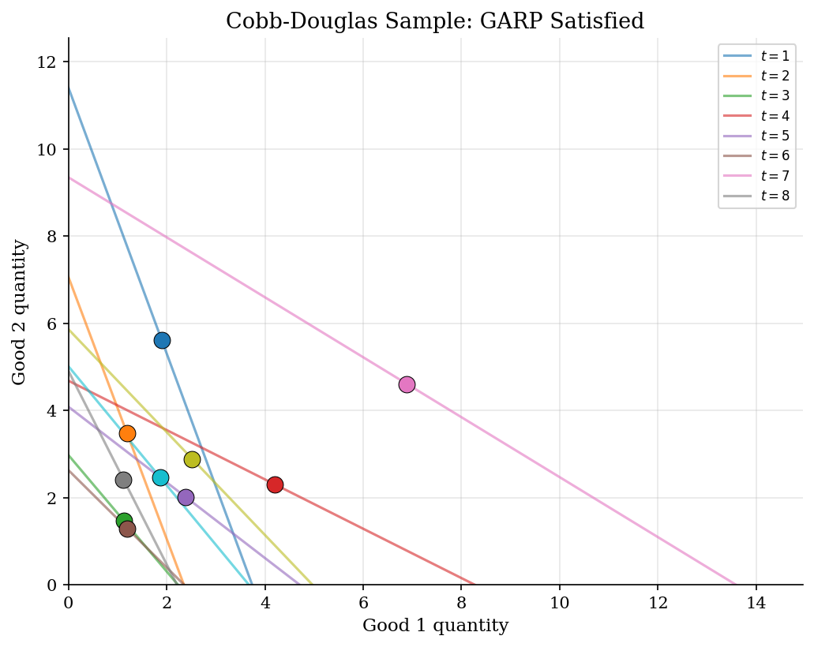
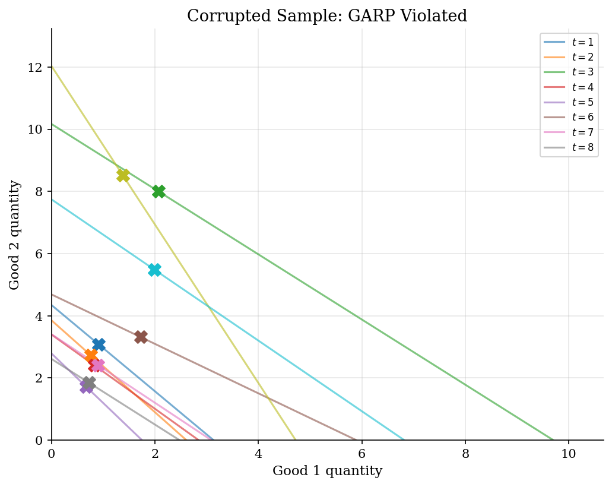
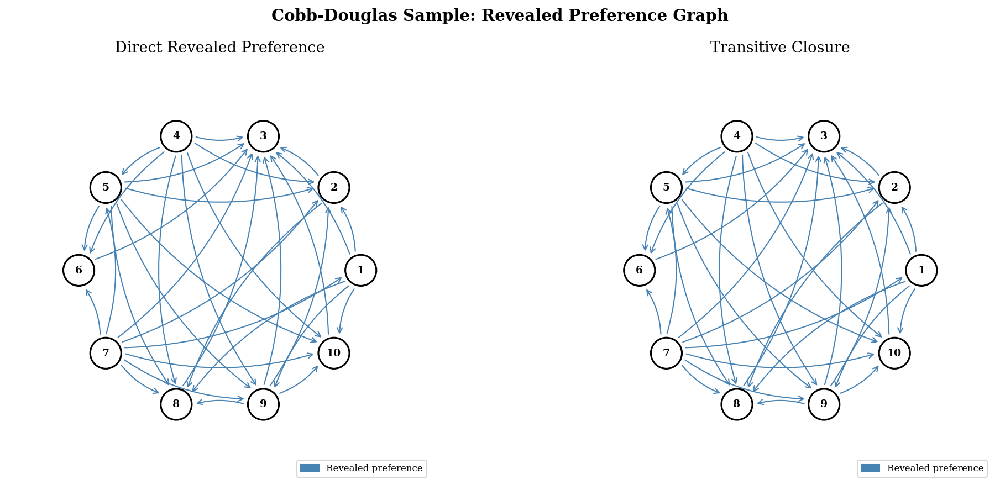
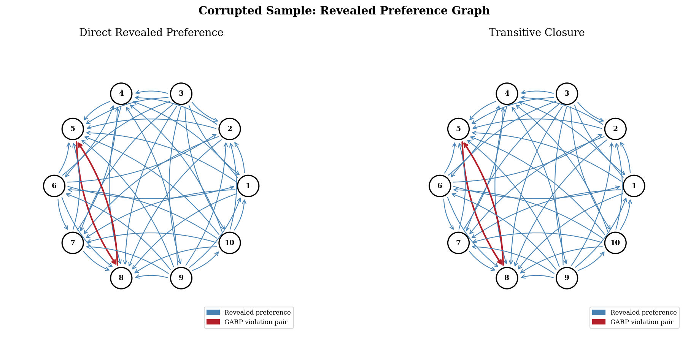

# Consumer Rationalizability with Afriat's Test

> Checking whether finite bundle choices can come from one stable utility function.

## Overview

Prices and budgets change across shopping trips. Each trip leaves one chosen bundle, so the data show choices under different budget sets. The economic question is whether one stable utility function could have chosen all bundles.

The object is a finite revealed-preference relation. If bundle $x_j$ was affordable when $x_i$ was chosen, the data reveal $x_i$ as weakly preferred to $x_j$. A violation appears when chained comparisons return to a bundle that was strictly cheaper at a later budget.

The computation builds that relation, closes it transitively, and checks the GARP contradiction. The run compares a rational Cobb-Douglas sample with one corrupted sample.

## Equations

Let $\mathcal{D}=\{(p_t,x_t)\}_{t=1}^T$ denote the observed data. Price vectors are positive, and bundles are nonnegative. Expenditure at observation $t$ is $m_t=p_t\cdot x_t$.

Direct revealed preference is written as $iRj$:
$$
p_i\cdot x_i \geq p_i\cdot x_j .
$$
The bundle $x_j$ was affordable when $x_i$ was chosen.

Let $R^{\ast}$ denote the transitive closure of $R$. GARP rules out this pair of statements:
$$
iR^{\ast}j
\quad\text{and}\quad
p_j\cdot x_j > p_j\cdot x_i .
$$
The first statement says $x_i$ is revealed at least as good as $x_j$ through a chain of budgets. The second says that, at budget $j$, $x_i$ was strictly cheaper than the bundle actually chosen.

Afriat's theorem makes this finite test enough. If GARP holds, the data are rationalizable by a monotone concave utility function.

## Model Setup

| Object | Value | Role in the exercise |
|---|---|---|
| Observations $T$ | 10 | Budget-choice pairs in the two worked examples |
| Goods $L$ | 3 | Three-good bundles, with figures projected onto goods 1 and 2 |
| Cobb-Douglas weights | 0.337, 0.328, 0.335 | Ground-truth rational benchmark |
| Corrupted sample | 2 violations | Two chosen bundles are swapped until GARP fails |
| Rational benchmark | 0 violations | Utility-maximizing Cobb-Douglas choices should always pass GARP |

## Solution Method

The code uses the graph version of Afriat's test. Nodes are observed budgets and bundles. An edge $i\to j$ means bundle $x_j$ was affordable when $x_i$ was chosen. Warshall's algorithm then fills in every indirect comparison.

```text
Input: prices p_t and chosen bundles x_t for t=1,...,T
Output: pass/fail GARP decision and violating observation pairs

1. For each pair (i,j), set R[i,j] = 1 if p_i . x_i >= p_i . x_j.
2. Initialize R_star = R.
3. For each intermediate node k:
       for each origin i and destination j:
           set R_star[i,j] = R_star[i,j] or (R_star[i,k] and R_star[k,j]).
4. For each reachable pair (i,j), flag a violation if p_j . x_j > p_j . x_i.
5. The data pass GARP exactly when the violation set is empty.
```

The Cobb-Douglas sample passes with 0 violations. The corrupted sample fails with 2 violating pairs.

## Results

The first pair of figures plots the residual budget line for goods 1 and 2, holding the third good fixed. Rational data can look irregular across budgets without creating a strict cycle.

In the rational benchmark, every observation comes from the same Cobb-Douglas preference vector. Prices and income vary, but the budget comparisons do not contradict one another.



After two bundles are swapped, the same price variation now creates a strict revealed-preference cycle. The failure is a logical inconsistency under the maintained utility-maximization model.



The graph view shows the test directly. An arrow from $i$ to $j$ means $x_j$ was affordable when $x_i$ was chosen. The right panel adds indirect comparisons. Red arrows mark strict GARP contradictions.

The rational sample has many revealed-preference links, especially after transitive closure. None returns to a strictly cheaper rejected bundle.



In the corrupted sample, transitive revealed preference points one way while a later budget strictly reveals the reverse comparison. Those pairs reject rationalizability for the full dataset.



## Takeaway

Afriat's test asks whether finite household choice data can still be read as utility maximization after all budget comparisons are linked. Passing GARP does not identify a unique utility function. It says some monotone concave utility function can rationalize the observed bundles. Failing GARP says no such utility function rationalizes the full dataset.

## References

- Afriat, S. N. (1967). The Construction of Utility Functions from Expenditure Data. *International Economic Review*, 8(1), 67-77.
- Varian, H. R. (1982). The Nonparametric Approach to Demand Analysis. *Econometrica*, 50(4), 945-973.
