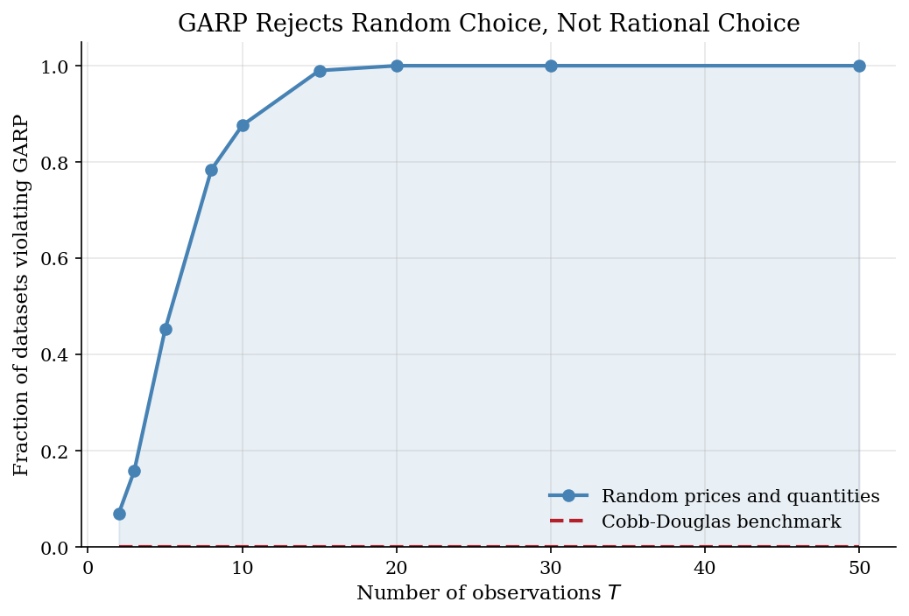

# Consumer Rationalizability with Afriat's Test

> Checking whether finite bundle choices can come from one stable utility function.

## Overview

Picture a household observed over several shopping trips. Prices for three goods move, the budget changes, and each trip leaves one chosen bundle. An economist may first want a modest answer before estimating a demand curve: could one stable utility function have made all of these choices optimal?

The data answer through budget comparisons. At trip $i$, the chosen bundle $x_i$ costs exactly the observed expenditure. If another observed bundle $x_j$ was affordable at the same prices, then choosing $x_i$ reveals it as at least as good as $x_j$. The hard part is that these comparisons travel through chains: $x_i$ can reveal a preference for $x_k$ through intermediate budgets even when the direct comparison is missing.

Afriat's theorem makes that chain logic decisive. The sample is rationalizable by a locally nonsatiated, monotone, concave utility function exactly when revealed-preference chains avoid a strict return cycle. The computation builds the revealed-preference graph, takes its transitive closure, and checks the GARP contradiction. The run compares a Cobb-Douglas sample, a corrupted sample, and random choices to show when the test accepts or rejects rationalizability.

## Equations

Let the data be $\mathcal{D}=\{(p_t,x_t)\}_{t=1}^T$, where $p_t\in\mathbb{R}_{++}^L$ and $x_t\in\mathbb{R}_{+}^L$. Expenditure at observation $t$ is $m_t=p_t\cdot x_t$.

Observation $i$ is directly revealed weakly preferred to observation $j$, written $iRj$, when
$$
p_i\cdot x_i \geq p_i\cdot x_j .
$$
The bundle $x_j$ was affordable when $x_i$ was chosen.

Let $R^{\ast}$ denote the transitive closure of $R$. GARP requires that no pair $(i,j)$ satisfies both
$$
iR^{\ast}j
\quad\text{and}\quad
p_j\cdot x_j > p_j\cdot x_i .
$$
The first statement says $x_i$ is revealed at least as good as $x_j$ through a chain of budgets. The second says that, at budget $j$, $x_i$ was strictly cheaper than the bundle actually chosen.

Afriat's inequalities give the constructive equivalent condition. The data are rationalizable if and only if there exist numbers $u_t$ and $\lambda_t>0$ such that
$$
u_i-u_j \leq \lambda_j p_j\cdot(x_i-x_j)
\quad \forall i,j .
$$
When those inequalities are feasible, a rationalizing utility can be written as
$$
\widehat U(x)=\min_j\{u_j+\lambda_j p_j\cdot(x-x_j)\}.
$$
This run checks GARP directly; the neighboring [preference-recoverability](../preference-recoverability/) tutorial uses the Afriat numbers to draw preference bounds.

## Model Setup

| Object | Value | Role in the exercise |
|---|---|---|
| Observations $T$ | 10 | Budget-choice pairs in the two worked examples |
| Goods $L$ | 3 | Three-good bundles, with figures projected onto goods 1 and 2 |
| Cobb-Douglas weights | 0.337, 0.328, 0.335 | Ground-truth rational benchmark |
| Corrupted sample | 2 violations | Two chosen bundles are swapped until GARP fails |
| Power exercise | 500 trials | Random independent prices and quantities for each $T$ |
| Rational benchmark | 0 violations | Utility-maximizing Cobb-Douglas choices should always pass GARP |

## Solution Method

The code uses the graph version of Afriat's theorem. Nodes are observed budgets and bundles. An edge $i\to j$ means bundle $x_j$ was affordable when $x_i$ was chosen, so the data reveal $x_i$ to be weakly preferred. Warshall's algorithm then fills in every indirect comparison. That reachability step turns scattered pairwise budget facts into the finite restriction an economist can interpret.

```text
Input: prices p_t and chosen bundles x_t for t=1,...,T
Output: pass/fail GARP decision and violating observation pairs

1. For each pair (i,j), set R[i,j] = 1 if p_i . x_i >= p_i . x_j.
2. Initialize R_star = R.
3. For each intermediate node k:
       for each origin i and destination j:
           set R_star[i,j] = R_star[i,j] or (R_star[i,k] and R_star[k,j]).
4. For each reachable pair (i,j), flag a violation if p_j . x_j > p_j . x_i.
5. The data pass GARP exactly when the violation set is empty.
```

The algorithm costs $O(T^3)$. That cost is small for the examples here, and the objects map cleanly to the theory. In larger revealed-preference panels, the same comparison matrix can be handled with sparse graph operations or specialized reachability routines.

The Cobb-Douglas sample passes with 0 violations. The corrupted sample fails with 2 violating pairs.

## Results

The first pair of figures plots the residual budget line for goods 1 and 2, holding the third good at its observed quantity. The projection is not the full three-good budget set, but it makes the revealed-preference comparison visible. Rational data can look irregular across budgets without creating a strict cycle.

In the rational benchmark, every observation comes from the same Cobb-Douglas preference vector. The chosen bundles need not line up on a smooth two-dimensional curve because prices and income vary, but the budget comparisons do not contradict one another.


After two bundles are swapped, the same price variation now creates a strict revealed-preference cycle. The failure is not a bad functional-form fit; it is a logical inconsistency under the maintained utility-maximization model.


The graph view is often the cleanest way to read the test. An arrow from $i$ to $j$ means the data reveal $x_i$ to be weakly preferred to $x_j$. The right panel adds indirect comparisons. Red arrows mark pairs involved in the strict GARP contradiction.

The rational sample has many revealed-preference links, especially after transitive closure, but none of those links returns to a strictly cheaper rejected bundle. That is the finite-data content of GARP.


In the corrupted sample, transitive revealed preference points one way while a later budget strictly reveals the reverse comparison. Those red pairs are enough to reject rationalizability for the whole dataset.


The power exercise asks whether this test has bite. Independent random prices and quantities are not an economic model; they are a useful null for seeing how quickly arbitrary behavior violates revealed preference. The Cobb-Douglas line is the known rational benchmark.

Random behavior begins to fail with only a few observations and is almost always rejected by $T=50$. The zero line is the ground-truth rational benchmark: utility-maximizing Cobb-Douglas choices satisfy GARP by construction.



The matrix records the same object algebraically. `R` is a direct budget comparison; `R*` is an indirect comparison added by transitive closure. Because this sample is rationalizable, these chains never produce a strict GARP contradiction.

**Pairwise revealed-preference relation in the Cobb-Douglas sample**

|        | Obs 1   | Obs 2   | Obs 3   | Obs 4   | Obs 5   | Obs 6   | Obs 7   | Obs 8   | Obs 9   | Obs 10   |
|:-------|:--------|:--------|:--------|:--------|:--------|:--------|:--------|:--------|:--------|:---------|
| Obs 1  | --      | R       | R       |         |         |         |         | R       | R       | R        |
| Obs 2  |         | --      | R       |         |         |         |         | R       |         |          |
| Obs 3  |         |         | --      |         |         |         |         |         |         |          |
| Obs 4  |         | R       | R       | --      | R       | R       |         | R       | R       | R        |
| Obs 5  |         | R       | R       |         | --      | R       |         | R       | R       | R        |
| Obs 6  |         |         | R       |         |         | --      |         |         |         |          |
| Obs 7  | R       | R       | R       |         | R       | R       | --      | R       | R       | R        |
| Obs 8  |         |         | R       |         |         |         |         | --      |         |          |
| Obs 9  |         | R       | R       |         |         |         |         | R       | --      | R        |
| Obs 10 |         |         | R       |         |         |         |         |         |         | --       |

## Takeaway

Afriat's test asks whether finite household choice data can still be read as utility maximization after all observed budget comparisons are linked. Passing GARP does not identify a unique utility function, and it does not say preferences are Cobb-Douglas or smooth in any parametric sense. It says the observed choices can be ordered by some monotone concave utility function. Failing GARP has a different interpretation: under the maintained revealed-preference assumptions, no single utility function in that class can rationalize the full dataset.

This tutorial is the entry point for the revealed-preference sequence. Use [preference recoverability](../preference-recoverability/) when the data pass and the question is what utility or welfare bounds are implied. Use [Houtman-Maks](../houtman-maks-rational-subsets/) and the [money pump index](../money-pump-index/) when the data fail and the question is which observations drive the failure or how severe the cycle is.

## References

- Afriat, S. N. (1967). The Construction of Utility Functions from Expenditure Data. *International Economic Review*, 8(1), 67-77.
- Bronars, S. G. (1987). The Power of Nonparametric Tests of Preference Maximization. *Econometrica*, 55(3), 693-698.
- Varian, H. R. (1982). The Nonparametric Approach to Demand Analysis. *Econometrica*, 50(4), 945-973.
- Varian, H. R. (2006). Revealed Preference. In M. Szenberg et al. (Eds.), *Samuelsonian Economics and the Twenty-First Century*. Oxford University Press.
