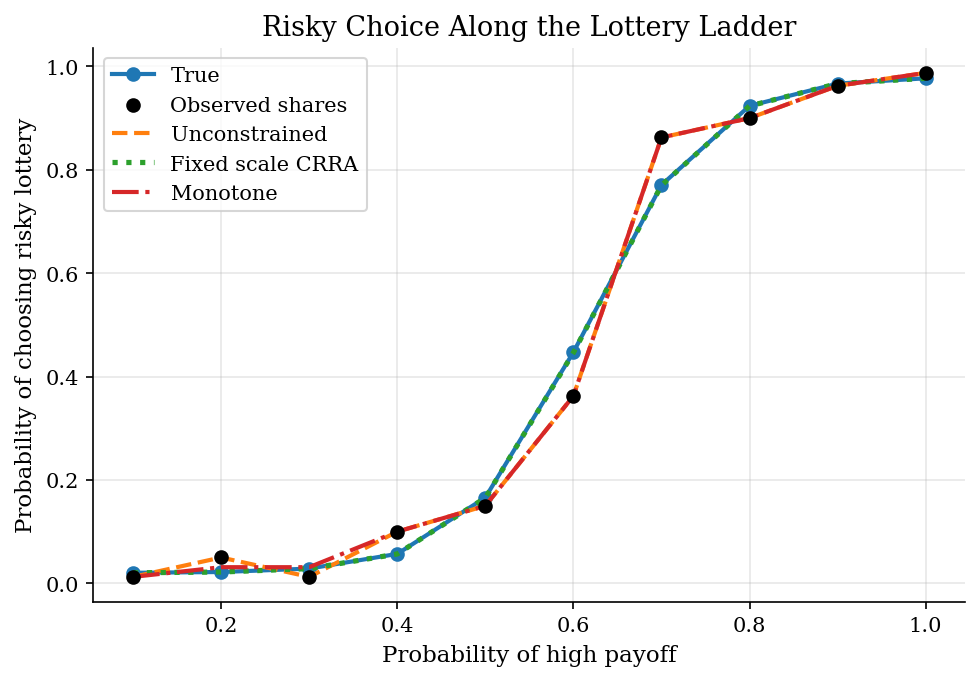
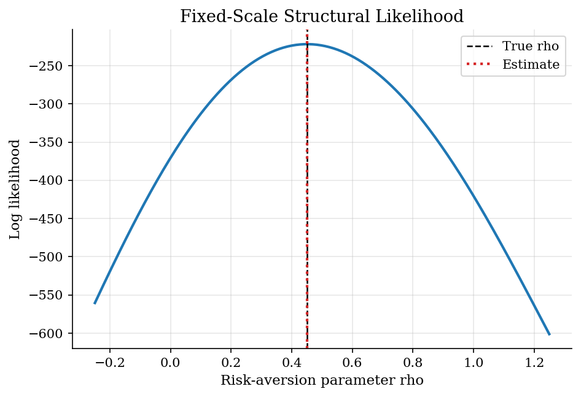
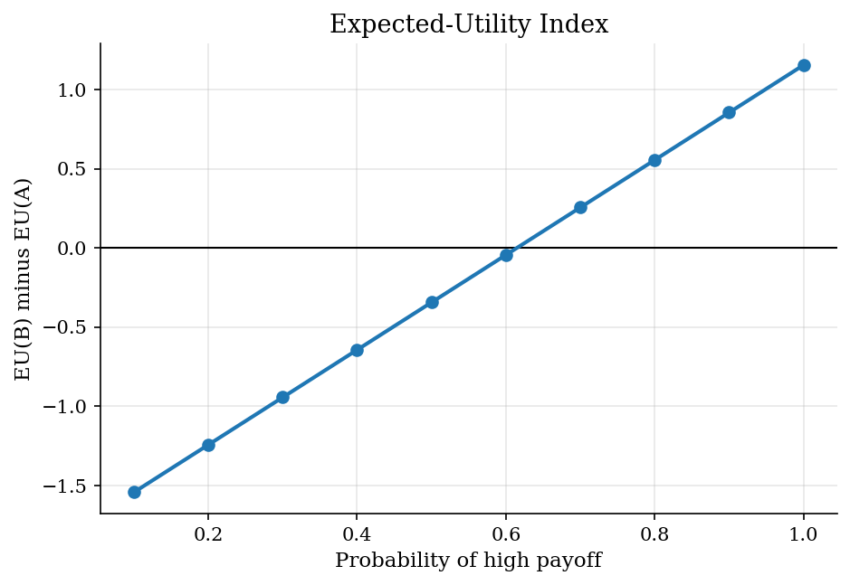

# Lottery Risk Aversion with Monotone Choice

## Overview

A Holt-Laury ladder gives subjects repeated choices between a safer lottery and a riskier lottery.

Each row changes only the probability of the high payoff. The object is the risky choice curve across rows.

Finite samples can make that curve fall in one row. We estimate CRRA risk aversion and enforce monotone row probabilities.

## Equations

At row $j$, the high payoff probability is $p_j$. The subject chooses between a
safer lottery $A$ and a riskier lottery $B$:

$$
A(p)=(2.00 \text{ with } p,\ 1.60 \text{ otherwise}),\qquad
B(p)=(3.85 \text{ with } p,\ 0.10 \text{ otherwise}).
$$

For CRRA utility,

$$
u(c;\rho)=\frac{c^{1-\rho}-1}{1-\rho},
\qquad \rho\neq 1.
$$

The expected utility index for choosing the risky lottery is

$$
\Delta EU(p;\rho)=E[u(B(p);\rho)]-E[u(A(p);\rho)].
$$

The fixed scale choice model is

$$
\Pr(d=1\mid p;\rho) =
\lambda + (1-2\lambda)\frac{1}{1+\exp[-s\,\Delta EU(p;\rho)]}.
$$

The monotone row logit estimates one logit $\alpha_j$ per row from binomial
counts $y_j$ out of $N_j$ choices:

$$
\ell(\alpha)=\sum_j y_j\log\Lambda(\alpha_j) + (N_j-y_j)\log[1-\Lambda(\alpha_j)].
$$

Here $\Lambda(\alpha_j)=1/(1+\exp(-\alpha_j))$ is the logistic function.

The shape restriction is

$$
\alpha_{j+1}\geq \alpha_j
\quad \text{for all adjacent rows }j.
$$

Since $\Lambda$ is monotone, probability ordering follows from logit ordering.
This gives
$\Pr(d=1\mid p_{j+1})\geq \Pr(d=1\mid p_j)$.

## Model Setup

| Primitive | Value | Economic role |
|--------|-------|------|
| Lottery rows | 10 | Probability ladder from 0.10 to 1.00 |
| Choices per row | 80 | Binomial observations for each lottery pair |
| True risk aversion | 0.45 | Data-generating CRRA curvature |
| True scale | 5.00 | Maps utility differences into stochastic choice |
| Lapse rate | 0.02 | Symmetric lower and upper error floor |
| Fixed scale estimator | scale = 5.00 | Recovers $\rho$ from the payoff index |
| Shape restriction | nondecreasing | Risky-choice probability cannot fall as $p$ rises |

## Solution Method

The CRRA logit is the structural fit. It searches over $\rho$ after the stochastic scale is fixed.

The monotone logit is the flexible fit. It maximizes the binomial likelihood subject to ordered row logits.

```text
Algorithm: monotone lottery-choice estimation
Input: rows (p_j, y_j, N_j), fixed scale s, lapse rate lambda
1. Simulate risky choice counts from CRRA probabilities.
2. Estimate saturated logits for each row.
3. Search over rho for the fixed scale CRRA likelihood.
4. Estimate row logits subject to alpha_{j+1} >= alpha_j.
5. Compare fitted curves and likelihood loss.
Output: fitted risky choice curves and model comparisons
```

## Results

At low high payoff probabilities, few subjects choose the risky lottery. The observed share falls from $p=0.20$ to $p=0.30$. The unconstrained fit repeats that step. The monotone fit pools the two rows.

The constrained curve removes the sample reversal.



The CRRA likelihood uses payoffs rather than row labels. With scale fixed at 5.0, the estimate is **0.451**. The true value is **0.450**.

The fixed scale turns the ladder into a likelihood for rho.



For the true $\rho$, the expected utility difference rises with the high payoff probability. It crosses zero where the risky lottery first gives higher expected utility. The monotone fit uses only this ordering implication.

The risky lottery becomes more attractive as the high payoff probability rises.



Equal adjacent monotone fits show where the inequality constraint binds.

**Row fit diagnostics**

|   Row |   High payoff probability |   Risky count |   Trials |   Observed share |   True probability |   Unconstrained fit |   Fixed-scale fit |   Monotone fit |
|------:|--------------------------:|--------------:|---------:|-----------------:|-------------------:|--------------------:|------------------:|---------------:|
|     1 |                       0.1 |             1 |       80 |           0.0125 |             0.0204 |              0.0125 |            0.0204 |         0.0125 |
|     2 |                       0.2 |             4 |       80 |           0.05   |             0.0219 |              0.05   |            0.0219 |         0.0313 |
|     3 |                       0.3 |             1 |       80 |           0.0125 |             0.0285 |              0.0125 |            0.0285 |         0.0313 |
|     4 |                       0.4 |             8 |       80 |           0.1    |             0.057  |              0.1    |            0.0568 |         0.1    |
|     5 |                       0.5 |            12 |       80 |           0.15   |             0.1659 |              0.15   |            0.1653 |         0.15   |
|     6 |                       0.6 |            29 |       80 |           0.3625 |             0.4471 |              0.3625 |            0.4461 |         0.3625 |
|     7 |                       0.7 |            69 |       80 |           0.8625 |             0.7707 |              0.8625 |            0.77   |         0.8625 |
|     8 |                       0.8 |            72 |       80 |           0.9    |             0.9237 |              0.9    |            0.9234 |         0.9    |
|     9 |                       0.9 |            77 |       80 |           0.9625 |             0.9668 |              0.9625 |            0.9667 |         0.9625 |
|    10 |                       1   |            79 |       80 |           0.9875 |             0.977  |              0.9875 |            0.977  |         0.9875 |

The monotone model gives up 0.99 likelihood points relative to the saturated fit. The CRRA model gives up more fit because one curve must explain all rows.

**Estimator comparison**

| Model                    |   Log likelihood |   Monotonicity violations |   Max probability error |   Estimated rho |   Rho error |   LL loss vs saturated |
|:-------------------------|-----------------:|--------------------------:|------------------------:|----------------:|------------:|-----------------------:|
| Unconstrained task logit |         -215.051 |                         1 |                 0.09185 |       nan       |   nan       |                0       |
| Fixed scale CRRA logit   |         -221.83  |                         0 |                 0.001   |         0.45074 |     0.00074 |                6.77875 |
| Monotone row logit       |         -216.044 |                         0 |                 0.09185 |       nan       |   nan       |                0.99276 |

## Takeaway

Risk aversion estimates need preference structure and noise control. The CRRA likelihood gives a single curvature estimate. The monotone logit keeps row flexibility while removing sample reversals. This helps when the ordering is credible but the CRRA curve is too tight.

## References

- [Holt, C. A. and Laury, S. K. (2002). Risk Aversion and Incentive Effects. *American Economic Review*, 92(5), 1644-1655.](https://doi.org/10.1257/000282802762024700)
- [Apesteguia, J. and Ballester, M. A. (2018). Monotone Stochastic Choice Models: The Case of Risk and Time Preferences. *Journal of Political Economy*, 126(1), 74-106.](https://doi.org/10.1086/695504)
