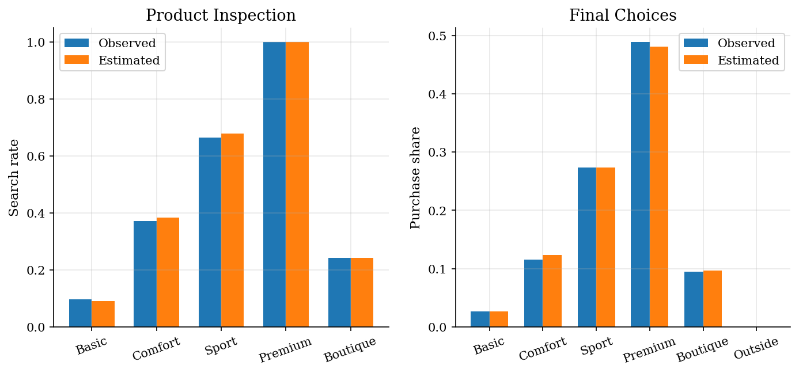
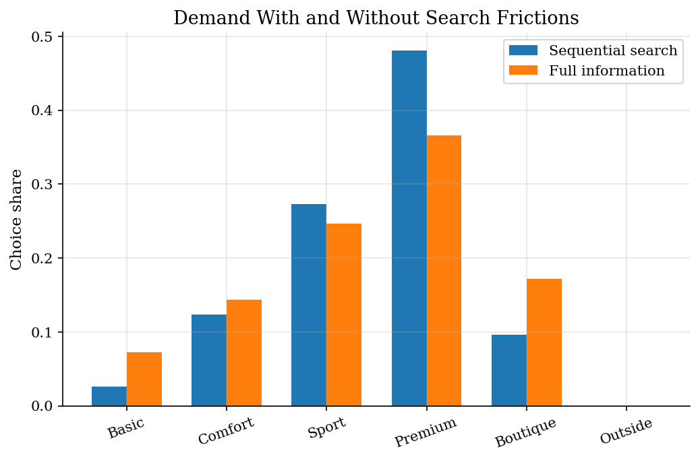
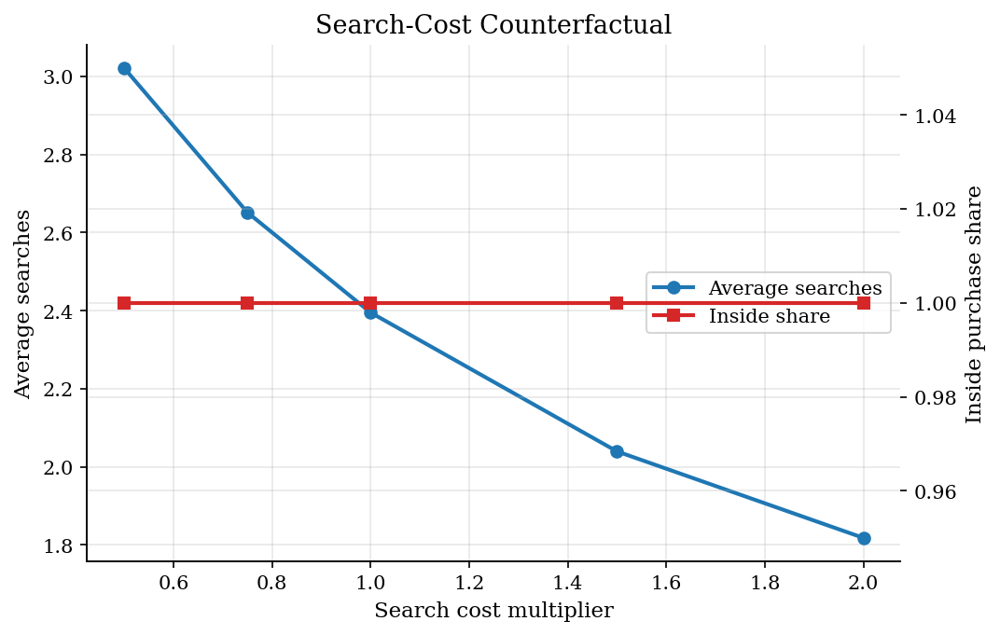

# Consumer Search with Sequential Inspection Costs

> Estimate search costs from observed search paths and purchases.

## Overview

A consumer does not see every product match value before choosing. She can inspect products one at a time, pay a search cost, remember what she has seen, and stop when further inspection is no longer worth it.

The tutorial implements the sequential search logic used in the empirical framework surveyed by Ursu, Seiler, and Honka. Search paths matter because they reveal more than final purchases. They help separate preference for a product from the cost of learning about it.

The primitive object is a consideration process. A product can be valuable if inspected, but still rarely bought because consumers do not pay to inspect it. That is why the data include both searched products and final purchases.

## Equations

There are $J$ inside products and an outside option with value zero. Product
$j$ has observable quality $q_j$, price $p_j$, and complexity $x_j$. Before
search, the consumer knows the product's mean match value

$$
\begin{aligned}
\mu_j
&=
\beta q_j - \alpha p_j,
\end{aligned}
$$

The term $\mu_j$ is not the utility from buying product $j$. It is the expected
value before the consumer learns whether the product is a good personal fit.
Inspection reveals an idiosyncratic match component, so the realized value is

$$
\begin{aligned}
u_{ij}
&=
\mu_j + \sigma \varepsilon_{ij},
\qquad \varepsilon_{ij}\sim N(0,1).
\end{aligned}
$$

The shock $\varepsilon_{ij}$ is consumer-specific. Two consumers can face the
same price and quality but learn different match values after inspection. This
is why search paths carry information beyond final purchases.

Inspecting product $j$ costs

$$
\begin{aligned}
c_j
&=
c_0 \exp(\gamma x_j),
\end{aligned}
$$

where $x_j$ is product complexity. Higher complexity raises the cost of
learning about the product, not the utility from owning it. The consumer pays
$c_j$ before observing $u_{ij}$.

With perfect recall, the consumer keeps every inspected value. The Weitzman
reservation value $z_j$ is the cutoff that makes the option value of inspecting
product $j$ equal to its search cost:

$$
\begin{aligned}
c_j
&=
E[\max(u_{ij}-z_j,0)].
\end{aligned}
$$

The expectation is over the unknown match draw for product $j$. A high $z_j$
means the product is worth inspecting early because it has high mean utility,
low search cost, or enough upside risk.

After some inspections, the consumer has an inspected set $S_i$ and a current
best value

$$
\begin{aligned}
b_i
&=
\max\{0,\max_{j\in S_i} u_{ij}\}.
\end{aligned}
$$

The outside option enters through the zero in $b_i$. If every inspected product
has negative realized value, the best available action is not to buy.

The search rule is a threshold rule. Among uninspected products, the consumer
looks at the product with the highest reservation value. If that value exceeds
$b_i$, she searches it and updates $S_i$ and $b_i$. If the highest remaining
reservation value is below $b_i$, every other uninspected product has even lower
option value, so she stops.

The simulated-moments estimator chooses

$$
\begin{aligned}
\hat\theta
&=
\arg\min_\theta
\left[m_{sim}(\theta)-m_{obs}\right]^{\top}
W
\left[m_{sim}(\theta)-m_{obs}\right].
\end{aligned}
$$

The observed moment vector $m_{obs}$ summarizes search and purchase behavior.
The simulated vector $m_{sim}(\theta)$ is built by simulating complete search
paths under the same stopping rule. In this tutorial the moments include product
search rates, purchase shares, average searches, and the probability of
stopping after one search.

The weighting matrix $W$ is diagonal in the implementation. Each moment is
scaled so that a small purchase or search rate does not dominate the objective
only because it is measured in smaller units.

In this exercise, the price taste $\alpha$, match-value scale $\sigma$, and
complexity slope $\gamma$ are fixed. The estimator recovers the quality taste
$\beta$ and the base search-cost level $c_0$. That two-parameter target keeps
the tutorial focused on the central identification problem: separating products
that consumers dislike from products that consumers rarely inspect.

## Model Setup

| Object | Value | Role |
|--------|-------|------|
| Products | 5 | Alternatives that can be inspected |
| Observed consumers | 4,000 | Synthetic search paths and purchases |
| Simulation consumers | 9,000 | Fixed draws for simulated moments |
| True quality taste | 1.18 | Preference weight on product quality |
| True base search cost | 0.080 | Cost level before complexity adjustment |
| Complexity slope | 0.48 | Fixed search-cost increase with product complexity |
| Match-value sd | 0.85 | Fixed uncertainty about product fit |

**Numerical settings**

| Setting | Value | Role |
|---------|-------|------|
| Optimizer | Nelder-Mead | Derivative-free search over quality taste and log base cost |
| Start | (0.95, log 0.09) | Initial quality taste and base search cost |
| Moment scale floor | 0.08 | Prevents tiny moments from dominating the criterion |
| Reservation bracket | [-8, 8] | Root-search bracket for the normal reservation equation |
| Max iterations | 220 | Nelder-Mead iteration cap |
| Tolerances | xatol=1e-04, fatol=1e-06 | Stopping rule for parameter moves and criterion changes |
| Counterfactual grid | [0.5, 0.75, 1.0, 1.5, 2.0] | Search-cost multipliers used in the policy experiment |

## Solution Method

The search rule has two layers. First, reservation values rank products before the consumer knows her idiosyncratic match values. Second, after each search, the realized match value updates the current best option. Search continues only when the best remaining reservation value is above that current best value.

For a normal match distribution, the reservation equation can be solved as a one-dimensional root. A high search cost lowers $z_j$ because the product must offer more option value before inspection is worthwhile. A high mean utility raises $z_j$ because the product is likely to be useful if inspected.

### Algorithm 1. Reservation order

**Inputs.** Product primitives $\{q_j,p_j,x_j\}_{j=1}^J$, trial parameter $\theta=(\beta,\ell_c)$, and fixed $(\alpha,\gamma,\sigma)$.

**Outputs.** Reservation values $\{z_j(\theta)\}_{j=1}^J$ and priority order $\pi(\theta)$.

1. Convert the log cost into a positive base search cost:

$$
c_0=\exp(\ell_c).
$$

2. For each product $j$, compute mean utility and search cost:

$$
\mu_j(\theta)=\beta q_j-\alpha p_j,
\qquad
c_j(\theta)=c_0\exp(\gamma x_j).
$$

3. Solve the standardized reservation equation:

$$
G(k_j)=c_j(\theta)/\sigma,
\qquad
G(k)=\phi(k)-k[1-\Phi(k)],
$$

4. Recover the reservation value:

$$
z_j(\theta)=\mu_j(\theta)+\sigma k_j.
$$

5. Sort products by reservation values. The priority order $\pi(\theta)$ satisfies

$$
z_{\pi_1}(\theta)\geq z_{\pi_2}(\theta)\geq\cdots\geq z_{\pi_J}(\theta).
$$

### Algorithm 2. Simulate one search path

**Inputs.** Reservation values $\{z_j(\theta)\}$, order $\pi(\theta)$, shocks $\{\varepsilon_{ij}\}_{j=1}^J$, mean utilities $\{\mu_j(\theta)\}_{j=1}^J$, and match-value scale $\sigma$.

**Outputs.** Inspected set $S_i$, terminal best value $b_i$, and purchase $y_i$.

1. Initialize the path with no inspected products:

$$
S_i=\varnothing,
\qquad
b_i=0,
\qquad
y_i=0.
$$

2. For step $h=1,\ldots,J$, take the next product in reservation order: $j=\pi_h(\theta)$.

3. If $z_j(\theta)\leq b_i$, stop search.

4. If $z_j(\theta)>b_i$, inspect product $j$ and update the inspected set:

$$
S_i\leftarrow S_i\cup\{j\}.
$$

5. Reveal the match value:

$$
u_{ij}(\theta)=\mu_j(\theta)+\sigma\varepsilon_{ij}.
$$

6. If $u_{ij}(\theta)>b_i$, update the best option:

$$
b_i\leftarrow u_{ij}(\theta),
\qquad
y_i\leftarrow j.
$$

7. If no stopping condition has been met, return to step 2 for the next product.

8. Return $S_i$, $|S_i|$, $b_i$, and $y_i$.

The estimator simulates the full path for many consumers at each parameter vector. It matches search rates and purchase shares, so the same product can be identified as hard to discover rather than simply low quality.

### Algorithm 3. Estimate $\theta$ by simulated moments

**Inputs.** Observed moments $m_{obs}$, fixed simulation shocks $\{\varepsilon_{sj}\}_{s=1,j=1}^{S,J}$, starting value $\theta_0$, and scale floor $a_{min}$.

**Output.** Simulated-moments estimate $\hat\theta$.

1. For each moment $\ell$, compute the scale:

$$
a_\ell=\max\{|m_{obs,\ell}|,a_{min}\}.
$$

2. Let Nelder-Mead propose a candidate $\theta^m=(\beta^m,\ell_c^m)$.

3. At $\theta^m$, compute $z_j(\theta^m)$ and $\pi(\theta^m)$ using Algorithm 1.

4. For each simulated consumer $s$, simulate
$\{S_s(\theta^m), b_s(\theta^m), y_s(\theta^m)\}$ using Algorithm 2.

5. Build the simulated moment vector:

$$
m_{sim}(\theta^m)=
\left(
\Pr_{sim}\{j\in S_s(\theta^m)\}_{j=1}^J,\,
\Pr_{sim}\{y_s(\theta^m)=j\}_{j=1}^J,\,
E_{sim}|S_s(\theta^m)|,\,
\Pr_{sim}\{|S_s(\theta^m)|=1\}
\right).
$$

6. Evaluate the scaled criterion:

$$
Q_S(\theta^m)=
\sum_\ell
\left(
\frac{m_{sim,\ell}(\theta^m)-m_{obs,\ell}}{a_\ell}
\right)^2,
\qquad
\hat\theta=\arg\min_\theta Q_S(\theta).
$$

7. Continue until Nelder-Mead stops and return $\hat\theta$.

Purchase data alone confound low demand with high search costs. Search paths help because a product can be attractive among consumers who inspect it but rarely inspected when its search cost is high.

## Results

The fitted model matches both product inspection and final choice. This matters because high-quality products can have low purchase shares either because they are unattractive or because few consumers pay to learn about them.

Full-information demand is the benchmark where every match value is observed for free. Sequential search shifts demand because some products never enter a consumer's consideration set.

Increasing search costs lowers the amount of inspection and pushes some consumers to stop earlier. The inside purchase share falls because consumers are less likely to discover a product match that beats the outside option.

Known-truth recovery is approximate because the estimator matches moments, not the exact likelihood. The residual table shows which observed search and purchase summaries drive the fit.

**Known-truth parameter recovery**

| Parameter             |   True |   Estimate |   Error | Status    |
|:----------------------|-------:|-----------:|--------:|:----------|
| Quality taste         |   1.18 |     1.193  |  0.013  | estimated |
| Base search cost      |   0.08 |     0.0791 | -0.0009 | estimated |
| Complexity cost slope |   0.48 |     0.48   |  0      | fixed     |

**Search and purchase moment fit**

| Moment                   |   Observed target |   Simulated at estimate |   Difference |
|:-------------------------|------------------:|------------------------:|-------------:|
| Search rate: Basic       |            0.0965 |                  0.0903 |      -0.0062 |
| Search rate: Comfort     |            0.3718 |                  0.3838 |       0.012  |
| Search rate: Sport       |            0.6645 |                  0.6787 |       0.0142 |
| Search rate: Premium     |            1      |                  1      |       0      |
| Search rate: Boutique    |            0.242  |                  0.2426 |       0.0006 |
| Purchase share: Basic    |            0.0268 |                  0.0259 |      -0.0009 |
| Purchase share: Comfort  |            0.1152 |                  0.1233 |       0.0081 |
| Purchase share: Sport    |            0.2735 |                  0.2733 |      -0.0002 |
| Purchase share: Premium  |            0.4895 |                  0.4811 |      -0.0084 |
| Purchase share: Boutique |            0.095  |                  0.0963 |       0.0013 |
| Purchase share: Outside  |            0      |                  0      |       0      |
| Average searches         |            2.3748 |                  2.3953 |       0.0206 |
| One-search rate          |            0.3355 |                  0.3213 |      -0.0142 |

**Search-cost counterfactuals**

|   Search cost multiplier |   Average searches |   Inside purchase share |   Outside share |
|-------------------------:|-------------------:|------------------------:|----------------:|
|                     0.5  |             3.0218 |                       1 |               0 |
|                     0.75 |             2.6519 |                       1 |               0 |
|                     1    |             2.3953 |                       1 |               0 |
|                     1.5  |             2.0396 |                       1 |               0 |
|                     2    |             1.818  |                       1 |               0 |

## Takeaway

Sequential search turns observed demand into a joint outcome of preferences and information acquisition. Search-path data are valuable because they show which products entered consideration before the purchase. That is the key empirical distinction between a search model and a full-information discrete choice model.

## References

- [Ursu, R., Seiler, S., and Honka, E. (2025). The sequential search model: A framework for empirical research. *Quantitative Marketing and Economics*, 23, 165-213.](https://doi.org/10.1007/s11129-024-09291-2)
- [Weitzman, M. L. (1979). Optimal Search for the Best Alternative. *Econometrica*, 47(3), 641-654.](https://doi.org/10.2307/1910412)
