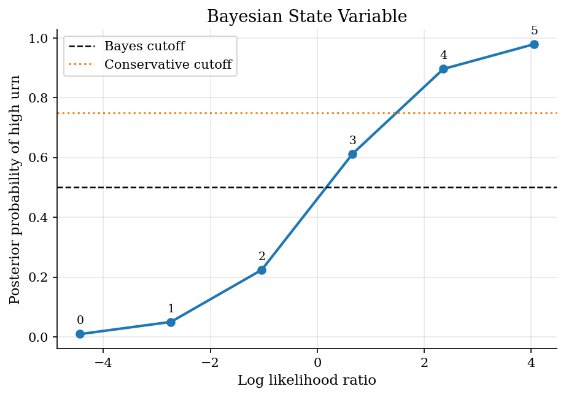
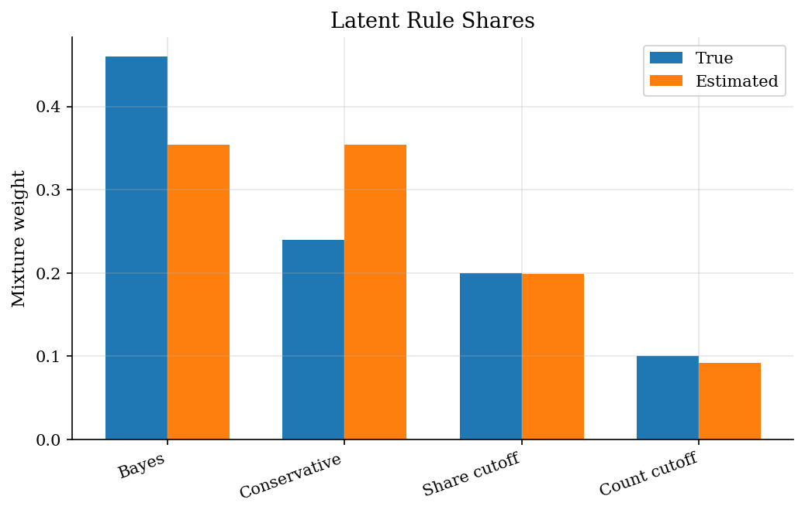
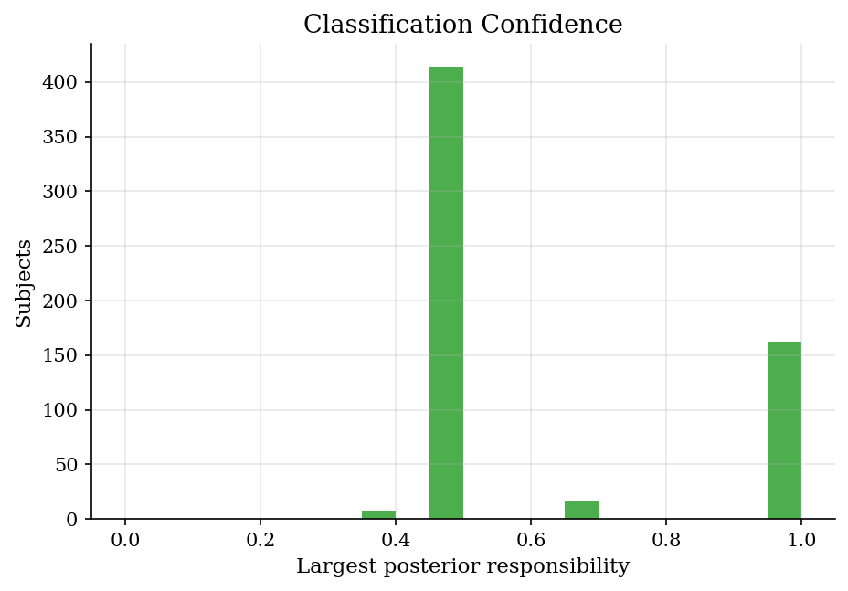

# Are People Bayesian? Decision-Rule Mixtures via EM

## Overview

In an urn experiment, a subject sees a small sample from one of two urns. The choice is whether the hidden state is high red.

The object is a decision rule. It maps red counts and sample sizes into a high-urn choice.

Bayes' rule gives a benchmark for each task. Repeated choices need EM because the researcher observes choices, not each subject's rule.

## Equations

Let $H$ denote the high-red urn and $L$ the low-red urn. A task draws $n$ balls
and observes $k$ red balls. Let $p_H$ and $p_L$ denote the red-ball probability
under urns $H$ and $L$. The likelihood-ratio statistic is

$$
\Lambda(k,n) =
\log \frac{\Pr(k\mid H,n)}{\Pr(k\mid L,n)} =
k\log\frac{p_H}{p_L} + (n-k)\log\frac{1-p_H}{1-p_L}.
$$

With prior $\pi_0=\Pr(H)$, Bayes' rule is

$$
\Pr(H\mid k,n) =
\frac{1}{1+\exp[-\{\log(\pi_0/(1-\pi_0))+\Lambda(k,n)\}]}.
$$

Rule $m$ maps the sufficient statistic and counts into a choice probability
$q_m(k,n)$. With subject $i$'s choices $d_{it}\in\{0,1\}$ (where $t$ indexes tasks), the panel likelihood
under rule $m$ is

$$
L_{im} =
\prod_t q_m(k_t,n_t)^{d_{it}}
[1-q_m(k_t,n_t)]^{1-d_{it}}.
$$

The finite-mixture likelihood is

$$
\ell(w)=\sum_i \log\left[\sum_m w_m L_{im}\right],
\qquad \sum_m w_m=1,\quad w_m\geq 0.
$$

The posterior probability that subject $i$ follows rule $m$ is

$$
\tau_{im} =
\frac{w_m L_{im}}{\sum_h w_h L_{ih}}.
$$

Here $h$ is a summation index ranging over the same rule set as $m$.

## Model Setup

| Object | Value | Role |
|--------|-------|------|
| Subjects | 600 | Repeated-choice panel units |
| Tasks per subject | 60 | Variation used to classify latent rules |
| Prior high urn | 0.45 | Baseline probability of state $H$ |
| Red probability under $H$ | 0.72 | Signal distribution for high urn |
| Red probability under $L$ | 0.32 | Signal distribution for low urn |
| Draw counts | 3, 4, 5, 6, 7, 8, 9, 12 | Signal-size variation separates Bayes and cutoff rules |
| Bayes-conservative separating tasks | 6 | Tasks with posterior between the two decision cutoffs |
| Tremble rate | 0.06 | Symmetric error around each deterministic rule |
| Latent rules | 4 | Bayesian and cutoff decision types |

## Solution Method

Each task is first reduced to the log likelihood ratio. This statistic is enough for the Bayesian posterior.

EM then estimates the shares of fixed candidate rules.

```text
Algorithm: EM for latent decision rules
Input: repeated choices d_it, task counts (k_t, n_t), candidate rules m=1,...,M
1. For each task, compute Lambda(k_t,n_t)
2. For each rule, compute q_m(k_t,n_t), the probability of choosing high
3. Initialize weights w_m = 1/M
4. Repeat until the log likelihood changes by less than the tolerance:
   E step: tau_im = w_m L_im / sum_h w_h L_ih
   M step: w_m = mean_i tau_im
5. Assign each subject to argmax_m tau_im
Output: mixture shares, posterior responsibilities, allocation accuracy
```

## Results

The likelihood ratio orders tasks by evidence for the high-red urn. With 5 draws, a count of three red balls crosses the Bayes threshold. It does not cross the conservative cutoff. Such tasks separate exact Bayesian updating from stricter rules.

Signal counts become posterior beliefs before classification.



EM estimates the population share of each fixed rule. The L1 distance between estimated and true weights is **0.028**. The estimate answers one heterogeneity question: how many subjects behave like each rule?

Repeated choices identify shares without observing rule labels.



Responsibilities give subject-level rule probabilities. Diffuse responsibilities mark choice histories that several rules can explain. Hard allocation accuracy is **0.998**. Bayes differs from the conservative rule on 6 tasks. It differs from the red-share rule on 4 tasks and the raw-count rule on 10 tasks.

Max responsibilities show how confident the type assignment is.



EM converges in 6 iterations; log likelihood is -8816.71.

**Latent rule weight recovery**

| Rule         | Definition                                                                        |   True weight |   Estimated weight |   Error |
|:-------------|:----------------------------------------------------------------------------------|--------------:|-------------------:|--------:|
| Bayes        | Choose high if the posterior probability of the high urn is at least one half.    |          0.46 |             0.4575 | -0.0025 |
| Conservative | Choose high only when the posterior probability of the high urn is at least 0.75. |          0.24 |             0.2523 |  0.0123 |
| Share cutoff | Choose high when at least half of sampled balls are red.                          |          0.2  |             0.2019 |  0.0019 |
| Count cutoff | Choose high when at least four sampled balls are red, ignoring sample size.       |          0.1  |             0.0883 | -0.0117 |

Rows are true simulated rules. Columns are posterior-modal assignments.

**True versus assigned latent rule counts**

| True rule    |   Bayes |   Conservative |   Share cutoff |   Count cutoff |
|:-------------|--------:|---------------:|---------------:|---------------:|
| Bayes        |     275 |              0 |              0 |              0 |
| Conservative |       0 |            151 |              0 |              0 |
| Share cutoff |       1 |              0 |            120 |              0 |
| Count cutoff |       0 |              0 |              0 |             53 |

Persists the runtime scalars quoted in the prose: the EM iteration count and log likelihood, and the number of tasks on which the Bayes rule differs from each alternative rule.

**EM and rule-separation diagnostics**

|   iterations |   log_likelihood |   bayes_conservative_split |   bayes_share_split |   bayes_count_split |
|-------------:|-----------------:|---------------------------:|--------------------:|--------------------:|
|            6 |         -8816.71 |                          6 |                   4 |                  10 |

## Takeaway

The likelihood ratio gives a task-level belief benchmark. EM uses repeated choices to estimate shares of latent decision rules. The method is useful when simple rules are meaningful but rule labels are unobserved.

## References

- [El-Gamal, M. A. and Grether, D. M. (1995). Are People Bayesian? Uncovering Behavioral Strategies. *Journal of the American Statistical Association*, 90(432), 1137-1145.](https://doi.org/10.1080/01621459.1995.10476622)
- [McLachlan, G. and Peel, D. (2000). *Finite Mixture Models*. Wiley.](https://doi.org/10.1002/0471721182)
