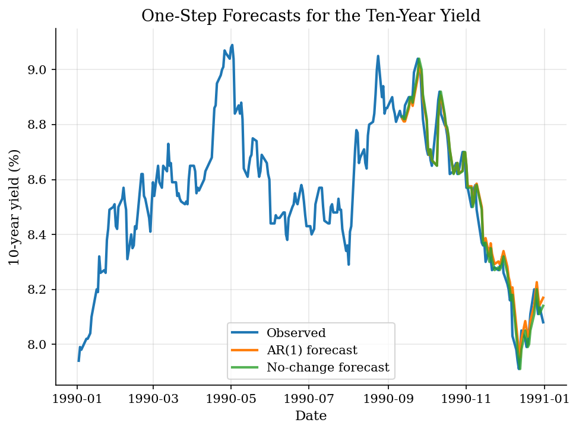
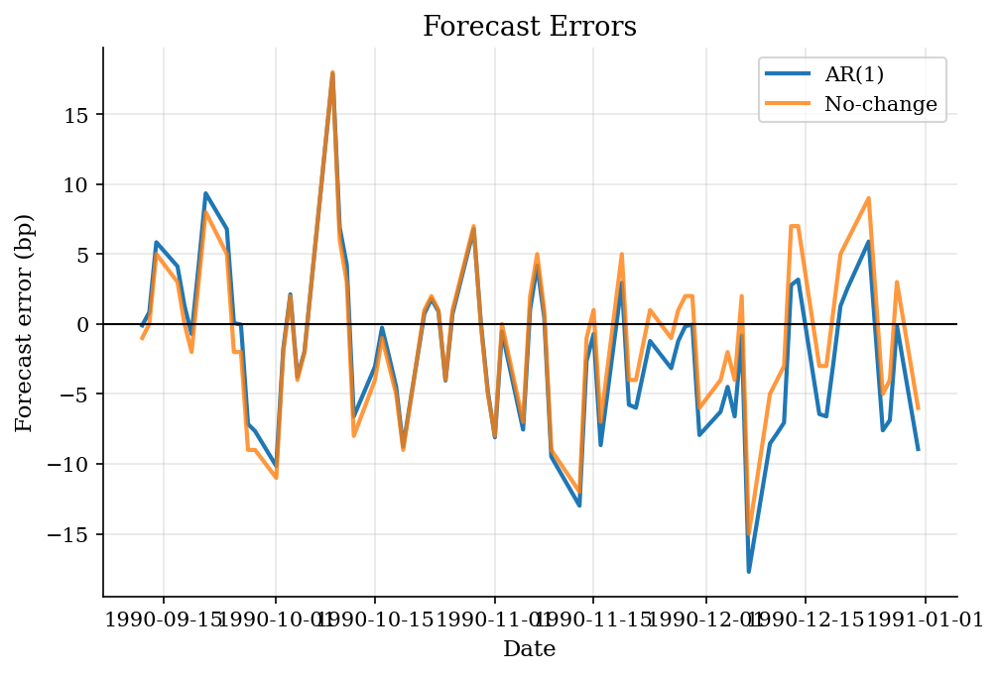

# AR(1) Forecasting for Treasury Yields

> A persistent-yield benchmark compared with a no-change forecast.

## Overview

Interest rates are often highly persistent: today's level contains substantial information about tomorrow's level. An AR(1) model puts that persistence in one coefficient, which controls how much the current yield carries into the next one-step prediction.

Because rates move slowly at daily horizons, the no-change forecast is the natural benchmark. A fitted autoregression has to improve on the forecast that simply sets tomorrow's yield equal to today's yield. The data are a static 1990 Treasury CMT snapshot, so the exercise is a compact benchmark rather than a full term-structure forecasting model.

## Equations

The AR(1) model is

$$
y_{t+1} = \alpha + \rho y_t + \epsilon_{t+1}.
$$

The one-step-ahead forecast is

$$
\widehat{y}_{t+1|t} = \widehat{\alpha} + \widehat{\rho} y_t.
$$

When $|\rho| < 1$, the stationary mean is

$$
\mu = \frac{\alpha}{1-\rho}.
$$

## Model Setup

| Object | Value |
|--------|-------|
| Series | 10-year Treasury yield |
| Data | Static 1990 Treasury CMT snapshot |
| Training share | 70% |
| Estimated $\rho$ | 0.944 |
| Benchmark | No-change forecast $y_{t+1} = y_t$ |

## Solution Method

AR(1) coefficients are estimated by least squares on the first 70% of the sample. Rolling one-step forecasts are evaluated on the remaining dates. The comparison forecast simply sets tomorrow's yield equal to today's yield.

## Results

With highly persistent rates, AR(1) and no-change forecasts can be close. That is an empirical feature: persistence makes simple benchmarks hard to beat at short horizons.


*Observed ten-year yield and one-step forecasts*

Forecast errors are the object to compare, not visual fit alone. A model with more structure should earn its place by improving out-of-sample errors.


*One-step forecast errors*

**Forecast accuracy**

| Model         |   RMSE (bp) | MAE (bp)   | Mean error (bp)   |   Test obs. |
|:--------------|------------:|:-----------|:------------------|------------:|
| AR(1)         |       5.95  | 4.56       | -1.91             |          75 |
| No-change     |       5.54  | 4.33       | -1.00             |          75 |
| Estimated rho |       0.944 |            |                   |         175 |

## Takeaway

AR(1) models are useful first forecasting tools because they force the persistence question into one parameter. For interest rates, a no-change forecast is often a tough baseline, so a more elaborate model should be judged against it.

## Reproduce

```bash
python run.py
```

## References

- [QuantEcon. AR(1) Processes.](https://intro.quantecon.org/ar1_processes.html)
