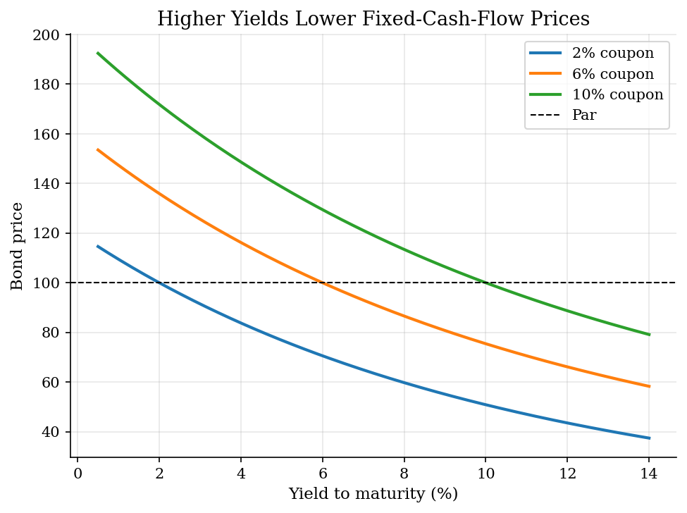
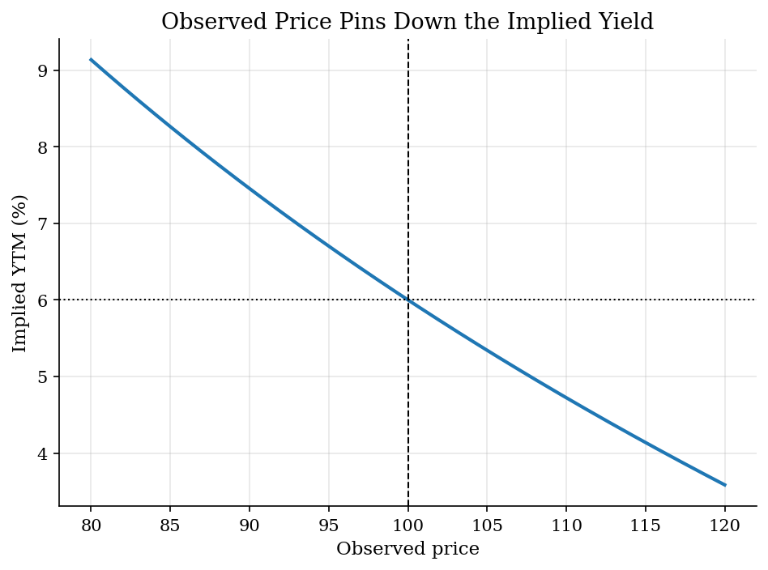

# Bond Prices and Yield to Maturity

> Pricing promised cash flows and solving for the yield that rationalizes price.

## Overview

Yield to maturity is the discount rate that makes the present value of a bond's promised payments equal to its current price. That makes it a useful summary rate, but it is not a guaranteed realized return unless the promised payments arrive and the holding-period assumptions are satisfied.

The source notebook listed several debt instruments separately. This version puts them in one cash-flow representation so the same present-value logic handles simple loans, discount bonds, fixed-payment loans, coupon bonds, and arbitrary cash flows.

## Equations

For promised cash flows $C_t$ paid at dates $t = 1,\ldots,T$, price is

$$
P = \sum_{t=1}^{T} \frac{C_t}{(1+y)^t}.
$$

The yield to maturity is the value of $y$ that solves this equation for an
observed price $P$. A perpetuity has the closed-form price

$$
P = \frac{C}{y},
\qquad
y = \frac{C}{P}.
$$

For a coupon bond with face value $F$, coupon rate $c$, and maturity $T$,

$$
P = \sum_{t=1}^{T} \frac{cF}{(1+y)^t} + \frac{F}{(1+y)^T}.
$$

## Model Setup

| Object | Value |
|--------|-------|
| Coupon-bond face value | 100 |
| Baseline coupon rate | 6% |
| Baseline maturity | 10 years |
| Yield grid | 0.5% to 14% |
| Root finder | Brent method on the present-value gap |

## Solution Method

All finite instruments are converted into payment times and cash-flow amounts. For a candidate yield, the script discounts each cash flow and compares the sum with the observed price. The YTM is found with a scalar root finder. The plots then hold the cash-flow schedule fixed while varying price, coupon, or yield.

## Results

The inverse price-yield relationship is mechanical: a higher discount rate lowers the present value of the same promised cash flows. Premium and discount status depend on how the coupon compares with the market yield.


*Coupon-bond price as yield changes*

For the same 6% coupon bond, a price below par implies a YTM above the coupon rate, while a price above par implies a YTM below the coupon rate.


*Yield to maturity implied by price*

The same present-value equation handles the source notebook's different debt instruments once each one is written as cash flows.

**Yield-to-maturity examples**

| Instrument          |     Price | YTM    |   PV at YTM | Interpretation                                     |
|:--------------------|----------:|:-------|------------:|:---------------------------------------------------|
| Simple loan         |   1000    | 1.60%  |     1000    | One final principal-plus-interest payment.         |
| Discount bond       |     95    | 1.03%  |       95    | No coupon; all payoff comes at maturity.           |
| Perpetuity          |     99    | 5.05%  |       99    | Closed-form yield is coupon divided by price.      |
| Fixed-payment loan  | 100000    | 7.00%  |   100000    | Equal annual payments amortize the loan.           |
| Coupon bond         |     95    | 10.84% |       95    | Coupon stream plus final face value.               |
| Arbitrary cash flow |    486.84 | 10.00% |      486.84 | YTM is still a root of the present-value equation. |

## Takeaway

YTM is best read as an implied discount rate for promised cash flows. It is useful because it compresses a price and cash-flow schedule into one number, but that compression hides reinvestment, default, call, tax, and holding-period issues.

## Reproduce

```bash
python run.py
```

## References

- [OpenStax. 10.2 Bond Valuation.](https://openstax.org/books/principles-finance/pages/10-2-bond-valuation)
- [CFA Institute. Fixed-Income Bond Valuation: Prices and Yields.](https://www.cfainstitute.org/insights/professional-learning/refresher-readings/2026/fixed-income-bond-valuation-prices-and-yields)
