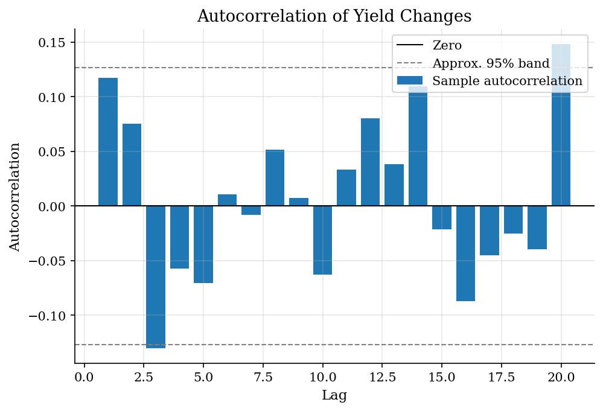
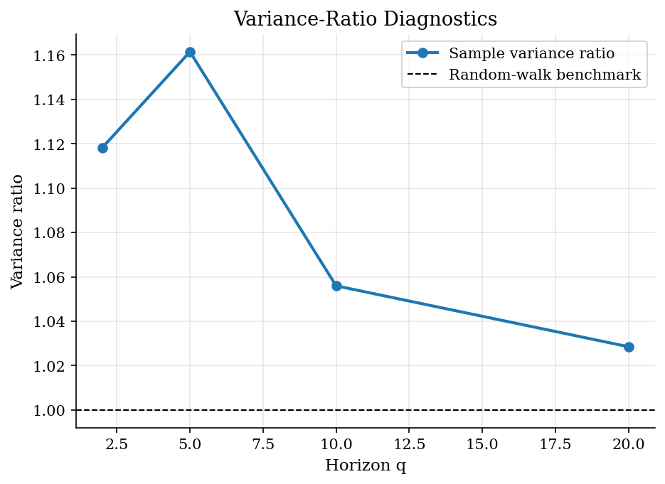

# Weak-Form Efficiency in Treasury Yield Changes

> Autocorrelation, variance-ratio, and one-lag forecast checks for a static Treasury CMT sample.

## Overview

Weak-form efficiency is a restriction on conditional predictability. Once the expected-return model is fixed, information already in past prices should not forecast the next excess return. With the offline data available here, the closest clean object is not a full bond return but the daily change in the ten-year Treasury constant-maturity yield.

The tutorial should therefore be read as a random-walk diagnostic for yield changes, not as a trading strategy or a replication of CRSP-style return tests. The [Treasury yield-curve tutorial](../treasury-yield-curve/) explains the CMT data object; the [Fama-Bliss-style regression](../fama-bliss-forward-regression/) asks a more structured term-premium predictability question.

## Equations

Let $y_t$ be the annualized ten-year CMT yield in percent on date $t$, and
define the one-day change

$$
\Delta y_t = y_t - y_{t-1}.
$$

Let $\mathcal{F}^{p}_t$ denote the information generated by lagged yield
changes. The teaching null is

$$
\mathbb{E}\!\left[\Delta y_{t+1}-\mu \mid \mathcal{F}^{p}_t\right] = 0,
$$

where $\mu$ is the unconditional drift in daily yield changes. A one-lag
linear check estimates

$$
\Delta y_{t+1} = \alpha + \beta \Delta y_t + \epsilon_{t+1},
$$

with $\beta=0$ under the simple no-predictability benchmark.

The sample autocorrelation at lag $k$ is

$$
\hat{\rho}_k =
\frac{\sum_{t=k+1}^{T}(\Delta y_t-\overline{\Delta y})
(\Delta y_{t-k}-\overline{\Delta y})}
{\sum_{t=1}^{T}(\Delta y_t-\overline{\Delta y})^2}.
$$

For horizon $q$, define the overlapping $q$-day change

$$
\Delta_q y_t = y_t-y_{t-q}
= \sum_{h=0}^{q-1}\Delta y_{t-h}.
$$

The variance ratio is

$$
\widehat{VR}(q) =
\frac{\widehat{\operatorname{Var}}(\Delta_q y_t)}
{q\,\widehat{\operatorname{Var}}(\Delta y_t)}.
$$

Independent increments imply $\rho_k=0$ and $VR(q)=1$. A rejection of those
restrictions is still a joint statement about market efficiency, expected
returns, and measurement.

## Model Setup

| Object | Value |
|--------|-------|
| Series | Daily 10-year Treasury CMT yield changes |
| Data | Static 1990 Treasury CMT snapshot |
| Date range for changes | 1990-01-03 to 1990-12-31 |
| Number of daily changes | 249 |
| Unit | Percentage-point changes; table reports basis points where stated |
| Autocorrelation lags | 1 to 20 |
| Variance-ratio horizons | 2, 5, 10, 20 days |
| Null reference | Random-walk increments with no lagged-price predictability |
| Interpretation | Weak-form diagnostic, not a bond-return backtest |

## Solution Method

The computation keeps the economic null visible. First form daily yield changes. Then ask three versions of the same question: do lagged changes forecast the next change, do autocorrelations drift away from zero, and does multi-day variance scale linearly with the horizon? The variance-ratio diagnostic follows the Lo-MacKinlay idea, but this tutorial reports the transparent ratio rather than the full heteroskedasticity-robust test statistic.

```text
Algorithm: weak-form diagnostics for Treasury yield changes
Input: dates t, ten-year CMT yields y_t, lags K, horizons Q
Output: autocorrelations, variance ratios, one-lag forecast regression, table
Sort observations by date
Form daily changes Delta y_t = y_t - y_{t-1}
Compute the sample drift mean(Delta y_t)
For each lag k = 1, ..., K:
    compute the sample autocorrelation rho_hat_k
For each horizon q in Q:
    form overlapping q-day changes Delta_q y_t
    compute VR_hat(q) = Var(Delta_q y_t) / (q Var(Delta y_t))
Estimate Delta y_{t+1} = alpha + beta Delta y_t + epsilon_{t+1}
Compare rho_hat_k with zero and VR_hat(q) with one
Read deviations as random-walk diagnostics, not as arbitrage profits
```

The reference lines in the figures are the random-walk benchmarks: zero autocorrelation, a rough finite-sample band of $\pm 2/\sqrt{T}$, and a variance ratio of one. Those are the right ground-truth objects for this diagnostic exercise; adding a finer grid would not turn CMT yield changes into realized holding-period returns.

## Results

The autocorrelation plot asks whether lagged yield changes contain useful forecast content. Most bars sit near zero. A few lags cross the rough $\pm 2/\sqrt{T}$ band of **0.127**, which is enough to flag serial-dependence diagnostics but not enough, by itself, to establish an exploitable market inefficiency.



The variance-ratio plot puts the same issue in horizon form. The ratios are above one at two and five days, with $VR(5)=1.161$, then move closer to the random-walk benchmark at longer horizons. The pattern says that short-run yield changes in this 1990 snapshot are mildly persistent, not that the sample has uncovered a free trading rule.



The table keeps the magnitudes auditable. The one-lag slope is positive but small, with an $R^2$ of **0.014**, about 1.4 percent of next-day variation. That is a different claim from saying prices are fully efficient or inefficient.

**Weak-form diagnostic summary**

| Diagnostic                |   Value |   Null benchmark |
|:--------------------------|--------:|-----------------:|
| Mean daily change (bp)    |   0.06  |                0 |
| Lag-1 predictive slope    |   0.118 |                0 |
| Predictive R-squared      |   0.014 |                0 |
| Variance ratio q=2        |   1.118 |                1 |
| Variance ratio q=5        |   1.161 |                1 |
| Variance ratio q=10       |   1.056 |                1 |
| Variance ratio q=20       |   1.029 |                1 |
| Regression intercept (bp) |   0.03  |                0 |

## Takeaway

Weak-form tests are useful because they make the no-predictability restriction concrete. In this static CMT sample, daily ten-year yield changes show mild short-run persistence, but the economic interpretation remains narrow: the null bundles market efficiency with the expected-return model, the choice of yield changes rather than bond returns, and the finite 1990 sample.

## References

- [Fama, E. F. (1970). Efficient Capital Markets: A Review of Theory and Empirical Work. Journal of Finance, 25(2), 383-417.](https://doi.org/10.2307/2325486)
- [Lo, A. W., and MacKinlay, A. C. (1988). Stock Market Prices Do Not Follow Random Walks. Review of Financial Studies, 1, 41-66.](https://web.mit.edu/~alo/www/Papers/lo-mackinlay-88.html)
