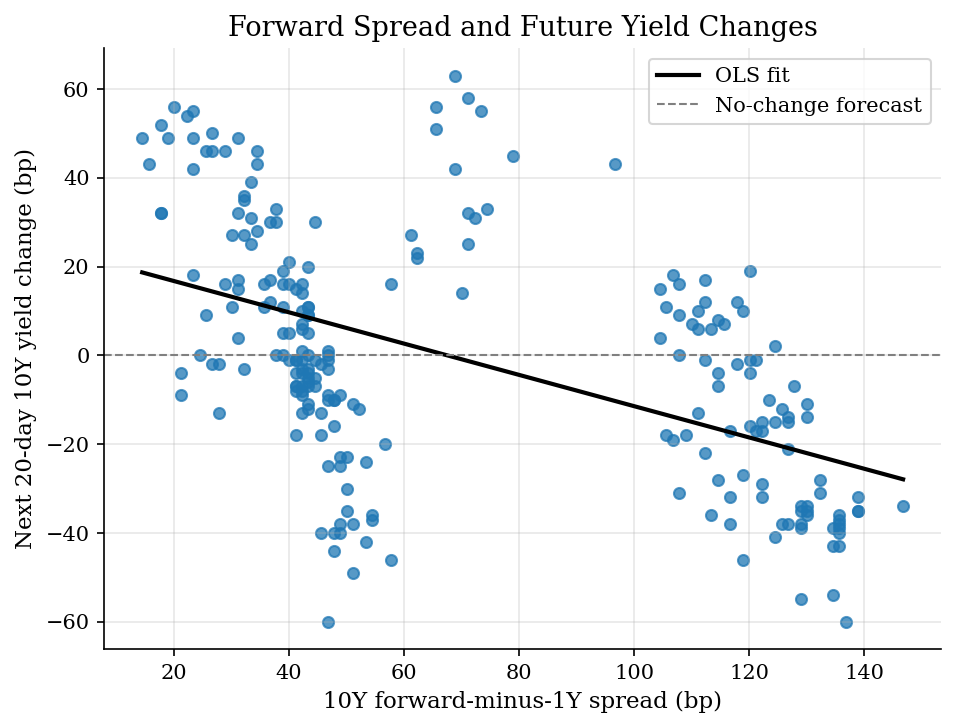
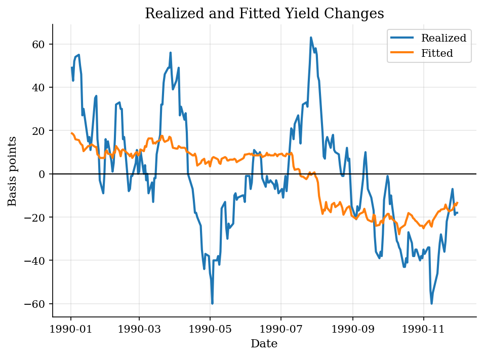

# Fama-Bliss-Style Forward Regressions

> A small term-structure predictability exercise using a static Treasury CMT snapshot.

## Overview

The expectations hypothesis links long rates and forward rates to expected future short rates, with risk premia determining how far the link is from a one-for-one prediction. Fama and Bliss use this idea to ask whether long-maturity forward rates contain information about future interest rates and bond returns.

The data here are a static 1990 Treasury CMT snapshot, not the CRSP zero-coupon bond panel needed for a full Fama-Bliss replication. The exercise approximates forward rates from observed par-yield maturities and asks whether the forward-minus-short spread predicts future yield changes over a short horizon.

## Equations

Let $y_t^1$ be the one-year yield and $y_t^n$ be an $n$-year yield. Using
continuously compounded rates, approximate the forward rate from year 1 to year
$n$ as

$$
f_t^{1,n} = \frac{n y_t^n - y_t^1}{n-1}.
$$

The predictive regression is

$$
y_{t+h}^n - y_t^n = \alpha_n + \beta_n (f_t^{1,n} - y_t^1) + \epsilon_{t+h}^n,
$$

with $h = 20$ trading days in this static dataset.

## Model Setup

| Object | Value |
|--------|-------|
| Data | Static 1990 Treasury CMT snapshot |
| Short rate | 1-year CMT rate |
| Long maturities | 2 Yr, 3 Yr, 5 Yr, 7 Yr, 10 Yr, 30 Yr |
| Forecast horizon | 20 trading days |
| Data limitation | CMT snapshot, not full Fama-Bliss replication |

## Solution Method

Percentage yields are converted to decimal rates, forward rates are approximated from one-year and longer-maturity yields, and separate OLS regressions are estimated by maturity. Because the data are par-yield CMT rates and cover only one year, the results should be read as mechanics and diagnostics rather than a published-style bond-risk-premium estimate.

## Results

For the ten-year maturity, the fitted slope is -0.35 and the R-squared is 0.261. The fitted relationship illustrates the regression mechanics; the short snapshot does not establish a stable term-structure premium.


*Ten-year forward-spread predictability regression*

A predictive regression can fit broad movement without becoming a trading rule. Overlapping horizons, short samples, and measurement choices matter.


*Realized versus fitted ten-year yield changes*

**Forward-regression coefficients by maturity**

| Maturity   |   Intercept (bp) |   Slope |   R-squared |   Obs. |
|:-----------|-----------------:|--------:|------------:|-------:|
| 2 Yr       |            60.92 |   -1.23 |       0.32  |    230 |
| 3 Yr       |            53.02 |   -1.07 |       0.4   |    230 |
| 5 Yr       |            31.77 |   -0.6  |       0.338 |    230 |
| 7 Yr       |            26.76 |   -0.4  |       0.279 |    230 |
| 10 Yr      |            23.77 |   -0.35 |       0.261 |    230 |
| 30 Yr      |            20.66 |   -0.29 |       0.212 |    230 |

## Takeaway

Forward rates are not just curve decoration: they can be used as predictors in term-structure regressions. But the interpretation is delicate. With this static snapshot, the result is a compact predictability exercise with clear data limits, not a full Fama-Bliss or Cochrane-Piazzesi replication.

## Reproduce

```bash
python run.py
```

## References

- [Fama, E. F., and Bliss, R. R. (1987). The information in long-maturity forward rates. American Economic Review, 77(4), 680-692.](https://www.econbiz.de/Record/the-information-in-long-maturity-forward-rates-fama-eugene/10015130928)
- [Campbell, J. Y., and Shiller, R. J. (1991). Yield Spreads and Interest Rate Movements: A Bird's Eye View. Review of Economic Studies, 58(3), 495-514.](https://doi.org/10.2307/2298008)
- [Cochrane, J. H., and Piazzesi, M. (2005). Bond Risk Premia. American Economic Review, 95(1), 138-160.](https://www.aeaweb.org/articles?id=10.1257/0002828053828581)
