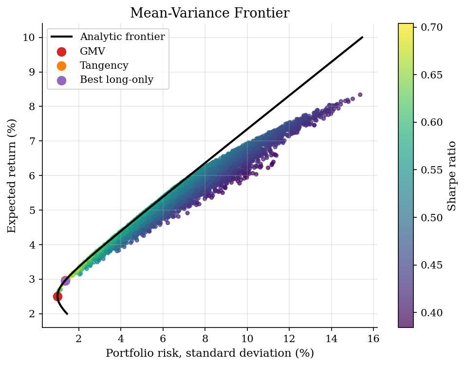
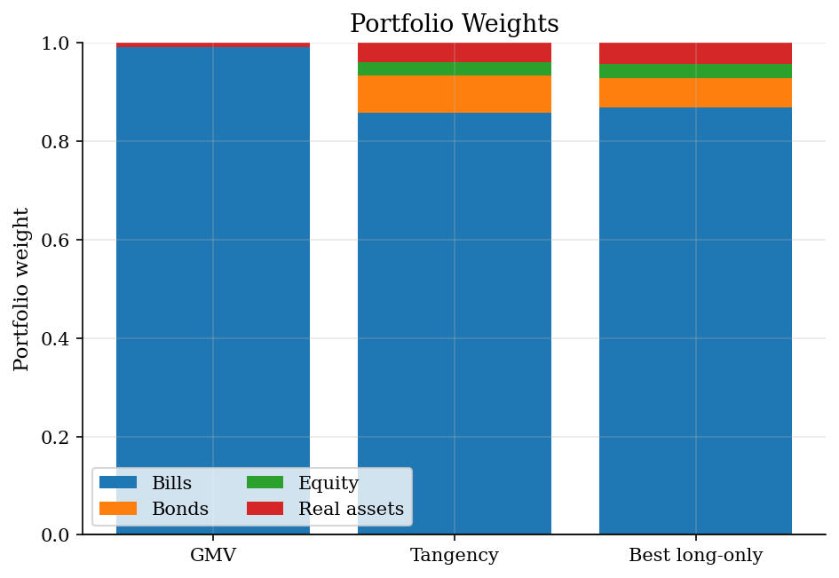

# Mean-Variance Portfolio Frontier

> Diversification, covariance, and the efficient frontier in a small portfolio model.

## Overview

The source notebook simulated random portfolio weights. This tutorial keeps that intuition but adds the analytic Markowitz frontier so the geometry is clear.

The inputs are synthetic annual expected returns, volatilities, and correlations. They are chosen for teaching, not investment advice. The important lesson is that risk depends on covariances and that the frontier is highly sensitive to estimated means and covariances.

## Equations

For portfolio weights $w$, expected return is

$$
\mu_p = w^\top \mu.
$$

Portfolio variance is

$$
\sigma_p^2 = w^\top \Sigma w.
$$

The efficient frontier solves the minimum-variance problem for each target
return:

$$
\min_w w^\top \Sigma w
\quad \text{subject to} \quad
w^\top \mu = \mu_p,\quad w^\top \mathbf{1} = 1.
$$

## Model Setup

| Asset | Expected return | Volatility |
|-------|-----------------|------------|
| Bills | 2.5% | 1.0% |
| Bonds | 4.5% | 6.0% |
| Equity | 8.5% | 16.0% |
| Real assets | 6.5% | 12.0% |
| Risk-free rate | 2.0% | Used for Sharpe ratios |

## Solution Method

The script simulates random long-only portfolios from a Dirichlet distribution and computes their mean, variance, and Sharpe ratio. It also solves the unconstrained Markowitz formulas for the global minimum-variance portfolio, the tangency portfolio, and the continuous frontier.

## Results

Random portfolios fill the feasible long-only region. The analytic frontier shows the best risk-return tradeoff when short positions are allowed by the formula.


*Simulated portfolios and analytic frontier*

The unconstrained tangency portfolio can use negative or levered positions. That is a mathematical frontier object, not a recommendation.


*Weights for selected portfolios*

**Selected portfolio summaries**

| Portfolio                       | Return   | Risk   |   Sharpe | Bills   | Bonds   | Equity   | Real assets   |
|:--------------------------------|:---------|:-------|---------:|:--------|:--------|:---------|:--------------|
| Global min variance             | 2.51%    | 1.00%  |     0.51 | 100.1%  | -0.7%   | -0.1%    | 0.8%          |
| Tangency                        | 2.97%    | 1.37%  |     0.71 | 85.8%   | 7.7%    | 2.6%     | 3.9%          |
| Best simulated long-only Sharpe | 2.96%    | 1.37%  |     0.7  | 87.0%   | 5.9%    | 2.9%     | 4.2%          |

## Takeaway

Markowitz's key insight is covariance. A portfolio is not just a weighted average of standalone risks, because assets move together. The practical caveat is equally important: frontiers are input-sensitive, especially to expected returns.

## Reproduce

```bash
python run.py
```

## References

- [Markowitz, H. (1952). Portfolio Selection. Journal of Finance, 7(1), 77-91.](https://doi.org/10.2307/2975974)
