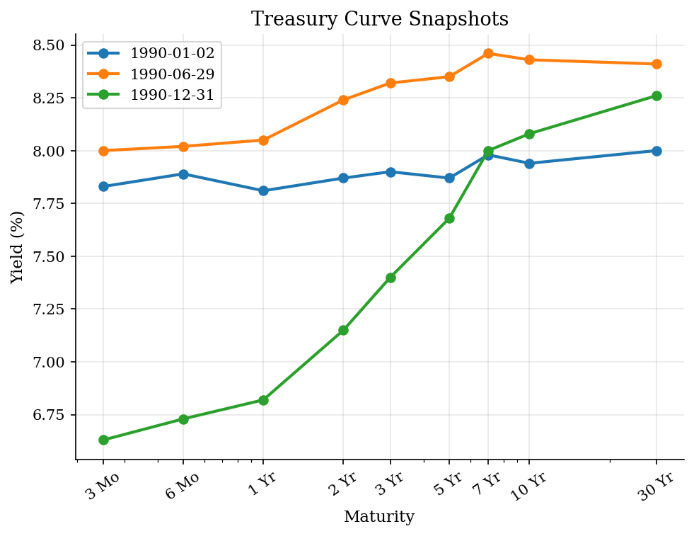
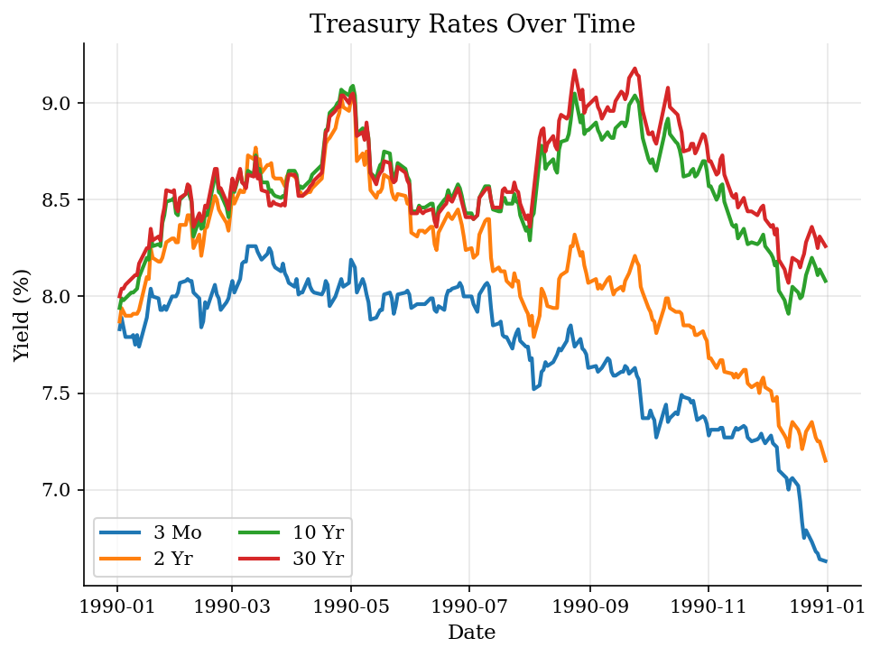
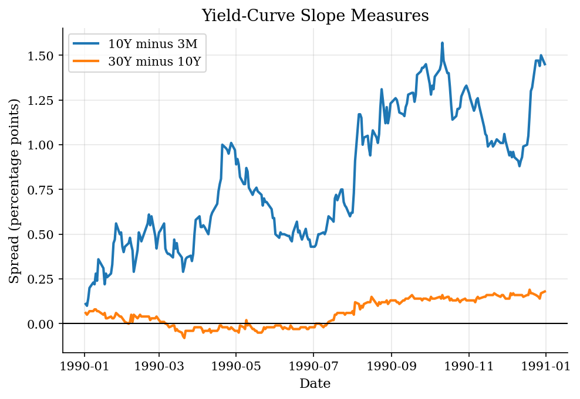

# Treasury Yield Curve Snapshots

> Static Treasury-rate data used to read level, slope, and curve shape.

## Overview

A yield curve records interest rates by maturity on a given date. Its level describes the broad height of rates, its slope compares long and short maturities, and its curvature captures how middle maturities sit relative to the ends of the curve.

The data are a static 1990 Treasury CMT snapshot. Treasury constant-maturity rates should be interpreted as par-yield-curve rates derived from market quotes and interpolation, not as raw transaction yields for one traded bond.

## Equations

One compact level measure is the ten-year yield:

$$
\text{Level}_t = y_{10,t}.
$$

A simple slope measure compares a long maturity with a short maturity:

$$
\text{Slope}_t = y_{10,t} - y_{3m,t}.
$$

A simple curvature measure compares the five-year yield with the line between
two-year and ten-year yields:

$$
\text{Curvature}_t = 2 y_{5,t} - y_{2,t} - y_{10,t}.
$$

These are descriptive statistics. They summarize curve shape but do not by
themselves identify risk premia or expected future short rates.

## Model Setup

| Object | Value |
|--------|-------|
| Data | Static 1990 Treasury CMT snapshot |
| Date range | 1990-01-02 to 1990-12-31 |
| Observations | 250 daily rows |
| Maturities | 3 Mo, 6 Mo, 1 Yr, 2 Yr, 3 Yr, 5 Yr, 7 Yr, 10 Yr, 30 Yr |
| Measurement | Constant-maturity par-yield rates |

## Solution Method

Dates are ordered from January to December 1990, and each daily row is treated as a cross-sectional curve. Selected snapshots show curve shape on particular dates; term spreads summarize how that shape moves over time.

## Results

A yield curve is a cross-section: it compares yields across maturities on the same date. Here the curve generally slopes upward during 1990, but the level and slope move over the year.


*Selected Treasury yield curves*

Time-series movement is different from curve shape. A maturity can rise or fall over time even when the cross-sectional curve remains upward sloping.


*Selected maturity yields over time*

Spreads summarize curve shape in one number. They are useful descriptors, but their interpretation depends on expectations, risk premia, and measurement.


*Treasury term spreads*

**Selected curve snapshots**

| Date       |   3 Mo |   6 Mo |   1 Yr |   2 Yr |   3 Yr |   5 Yr |   7 Yr |   10 Yr |   30 Yr |
|:-----------|-------:|-------:|-------:|-------:|-------:|-------:|-------:|--------:|--------:|
| 1990-01-02 |   7.83 |   7.89 |   7.81 |   7.87 |   7.9  |   7.87 |   7.98 |    7.94 |    8    |
| 1990-06-29 |   8    |   8.02 |   8.05 |   8.24 |   8.32 |   8.35 |   8.46 |    8.43 |    8.41 |
| 1990-12-31 |   6.63 |   6.73 |   6.82 |   7.15 |   7.4  |   7.68 |   8    |    8.08 |    8.26 |

**Spread summary statistics**

| Spread   |   Mean |   Min |   Max |   Std. dev. |
|:---------|-------:|------:|------:|------------:|
| 10Y-3M   |   0.81 |  0.1  |  1.57 |        0.37 |
| 30Y-10Y  |   0.06 | -0.08 |  0.19 |        0.08 |
| 5Y-2Y    |   0.21 | -0.09 |  0.53 |        0.19 |

## Takeaway

The Treasury curve is a compact picture of interest rates by maturity. The key interpretive discipline is to keep curve description separate from causal claims: level, slope, and curvature can be plotted directly, while expectations and risk premia require additional assumptions or regressions.

## Reproduce

```bash
python run.py
```

## References

- [U.S. Treasury. Treasury Yield Curve Methodology.](https://home.treasury.gov/policy-issues/financing-the-government/interest-rate-statistics/treasury-yield-curve-methodology)
- [U.S. Treasury. Daily Treasury Rates.](https://home.treasury.gov/resource-center/data-chart-center/interest-rates/TextView?type=daily_treasury_yield_curve)
