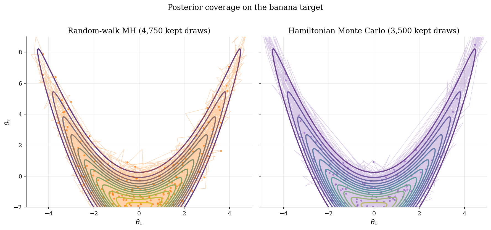
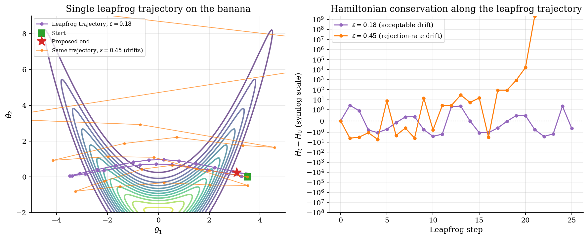
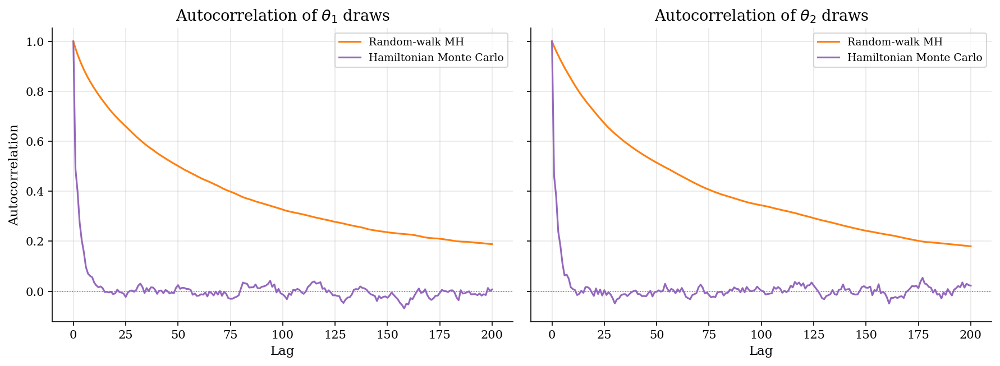

# Hamiltonian Monte Carlo on a Banana Posterior

## Overview

Random-walk Metropolis-Hastings is the workhorse of Bayesian inference. It needs only the posterior kernel and a proposal scale. It works well on roughly isotropic posteriors and breaks down on curved or strongly correlated ones. Each random-walk proposal is a local Gaussian step. On a curved ridge the chain either takes tiny steps that follow the ridge slowly or large steps that get rejected.

Hamiltonian Monte Carlo replaces the random-walk proposal with a deterministic trajectory simulated through Hamiltonian dynamics. Augment the parameter $\theta$ with a momentum $r$ and define a Hamiltonian that adds a kinetic term to the log posterior. Run leapfrog integration to simulate the dynamics, which preserves the Hamiltonian almost exactly. Accept the endpoint with a Metropolis correction that rejects only the small discretization error.

The proposal moves far across the posterior in one step. It follows the curvature of the log density because the trajectory uses the gradient. The acceptance rate stays high because the Hamiltonian is conserved. On hard posteriors like this banana, HMC reaches the same finite-chain error as random-walk MH with one or two orders of magnitude fewer effective evaluations.

HMC is the natural next step after the random-walk Metropolis-Hastings tutorial in `computational-methods/metropolis-hastings/`. It is also the right tool when a structural likelihood is differentiable and expensive: each gradient evaluation pays for itself many times over by amortizing the cost across the trajectory.

## Equations

Let $\theta \in \mathbb{R}^d$ denote the parameter we wish to sample and let $\pi(\theta \mid D)$ denote the posterior density given data $D$, known only up to a normalizing constant.
The target here is the *banana posterior* in dimension $d = 2$, defined generatively by

$$
\theta_1 \sim \mathcal{N}(0,\, \sigma_x^2),
\qquad
\theta_2 \mid \theta_1 \sim \mathcal{N}\big(\alpha\, (\theta_1^2 - \sigma_x^2),\, \sigma_y^2\big),
$$

with shape parameters $\sigma_x > 0$, $\sigma_y > 0$, and $\alpha \in \mathbb{R}$.
The joint log density follows from the conditional decomposition:

$$
\log \pi(\theta_1, \theta_2) = -\tfrac{\theta_1^2}{2 \sigma_x^2} - \tfrac{(\theta_2 - \alpha (\theta_1^2 - \sigma_x^2))^2}{2 \sigma_y^2} + \mathrm{const}.
$$

By construction $\mathbb{E}[\theta_1] = 0$ and, because $\mathbb{E}[\theta_1^2 - \sigma_x^2] = 0$, also $\mathbb{E}[\theta_2] = 0$.
The marginal variance of $\theta_2$ follows from the law of total variance.
Let $W = \theta_1^2 - \sigma_x^2$.
For $\theta_1 \sim \mathcal{N}(0, \sigma_x^2)$, $\mathrm{Var}(\theta_1^2) = 2 \sigma_x^4$ (fourth-moment identity), so $\mathrm{Var}(W) = 2 \sigma_x^4$.
Then

$$
\mathrm{Var}(\theta_2) = \mathbb{E}[\mathrm{Var}(\theta_2 \mid \theta_1)] + \mathrm{Var}(\mathbb{E}[\theta_2 \mid \theta_1])
= \sigma_y^2 + \alpha^2 \cdot \mathrm{Var}(W)
= \sigma_y^2 + 2 \alpha^2 \sigma_x^4.
$$

At the calibration used below ($\sigma_x = 2.0$, $\alpha = 0.50$, $\sigma_y = 1.0$), this gives $\mathrm{Var}(\theta_2) = 9.00$ analytically, providing a ground-truth check on each sampler.

Hamiltonian Monte Carlo augments $\theta$ with an auxiliary *momentum* variable $r \in \mathbb{R}^d$ of the same dimension as $\theta$.
The momentum is drawn from a $d$-variate Gaussian $\mathcal{N}(0, M)$, where $M \in \mathbb{R}^{d \times d}$ is a positive-definite *mass matrix*.
We use the identity mass matrix $M = I_d$ throughout, so $r \sim \mathcal{N}(0, I_d)$.
Define the *potential energy* $U$, *kinetic energy* $K$, and *Hamiltonian* $H$ by

$$
U(\theta) = -\log \pi(\theta \mid D),
\qquad
K(r) = \tfrac{1}{2}\, r^{\top} M^{-1} r,
\qquad
H(\theta, r) = U(\theta) + K(r).
$$

The names are by analogy with classical mechanics: a particle at position $\theta$ with momentum $r$ in a force field with potential $U$ has total energy $H$.
The augmented joint density $\tilde\pi(\theta, r \mid D) \propto \exp(-H(\theta, r))$ has $\pi(\theta \mid D)$ as its marginal in $\theta$, because the kinetic term factors out as an independent Gaussian in $r$.
Sampling from $\tilde\pi$ and discarding the momentum returns samples from $\pi$.

Hamilton's equations describe how $(\theta, r)$ evolves in continuous time $t$:

$$
\frac{d\theta}{dt} = \frac{\partial H}{\partial r} = M^{-1} r = r,
\qquad
\frac{dr}{dt} = -\frac{\partial H}{\partial \theta} = -\nabla U(\theta) = \nabla \log \pi(\theta \mid D).
$$

The sign $\nabla U(\theta) = -\nabla \log \pi(\theta \mid D)$ encodes that the dynamics moves uphill in $\log \pi$ when given enough kinetic energy, the way a ball rolls toward valleys in $U$ but can climb hills using stored momentum.
Two structural properties of the continuous dynamics drive the algorithm.
First, $H$ is conserved along trajectories:

$$
\frac{dH}{dt} = \nabla_{\theta} H \cdot \frac{d\theta}{dt} + \nabla_r H \cdot \frac{dr}{dt}
= \nabla_{\theta} H \cdot \nabla_r H - \nabla_r H \cdot \nabla_{\theta} H = 0.
$$

Second, the flow map $\Phi_t : (\theta_0, r_0) \mapsto (\theta_t, r_t)$ is *symplectic* and in particular volume-preserving in the $(\theta, r)$ phase space, so the Jacobian determinant $\lvert \det \nabla \Phi_t \rvert = 1$.
Volume preservation is the technical reason the Metropolis correction below has no Jacobian factor.

### Method 1: Hamiltonian Monte Carlo

Continuous Hamiltonian dynamics is unavailable in closed form, so we discretize it with the leapfrog integrator at step size $\varepsilon > 0$.
One leapfrog step from $(\theta_t, r_t)$ to $(\theta_{t+1}, r_{t+1})$ is a half momentum step, a full position step, and another half momentum step:

$$
r_{t + \tfrac{1}{2}} = \underbrace{r_t}_{\text{current momentum}} - \underbrace{\tfrac{\varepsilon}{2}\, \nabla U(\theta_t)}_{\text{half kick from the force at } \theta_t},
$$

$$
\theta_{t + 1} = \underbrace{\theta_t}_{\text{current position}} + \underbrace{\varepsilon\, r_{t + \tfrac{1}{2}}}_{\text{drift using the half-step momentum}},
$$

$$
r_{t + 1} = r_{t + \tfrac{1}{2}} - \underbrace{\tfrac{\varepsilon}{2}\, \nabla U(\theta_{t + 1})}_{\text{half kick from the force at the new position}}.
$$

The half-kick / drift / half-kick split is the design choice that makes the integrator work.
A naive Euler scheme would update momentum and position with the same force evaluation, breaking time reversibility and letting energy drift linearly in $\varepsilon$.
The symmetric split makes one leapfrog step invariant under the time reversal $(\theta, r) \mapsto (\theta, -r)$ followed by stepping with $-\varepsilon$, which is what buys both volume preservation and the $\mathcal{O}(\varepsilon^2)$ energy drift.
The leapfrog integrator inherits two key properties of the continuous flow.
It is *time-reversible*: applying it with $-\varepsilon$ to $(\theta_{t+1}, r_{t+1})$ returns $(\theta_t, r_t)$.
It is *symplectic*: it preserves the differential form $\sum_i d\theta_i \wedge dr_i$, which implies volume preservation in $(\theta, r)$-space.
What it does not preserve exactly is $H$.
Over $L$ leapfrog steps the Hamiltonian drifts by $\mathcal{O}(\varepsilon^2)$ rather than the $\mathcal{O}(\varepsilon)$ drift of a non-symplectic integrator, which is what makes HMC trajectories of moderate length still accept with high probability.

One HMC iteration starts from the current parameter $\theta_t \in \mathbb{R}^d$ and runs three substeps.
First, sample a fresh momentum $r \sim \mathcal{N}(0, I_d)$ independently of the chain history.
Second, run $L \ge 1$ leapfrog steps with step size $\varepsilon$ from $(\theta_t, r)$ to obtain a proposal $(\theta^{\star}, r^{\star})$.
Third, accept the proposal with Metropolis probability

$$
\alpha(\theta_t, r;\, \theta^{\star}, r^{\star}) = \min\Big\lbrace 1,\, \exp\big(\underbrace{H(\theta_t, r)}_{\text{energy at trajectory start}} - \underbrace{H(\theta^{\star}, r^{\star})}_{\text{energy at trajectory end}}\big) \Big\rbrace,
$$

setting $\theta_{t+1} = \theta^{\star}$ if accepted and $\theta_{t+1} = \theta_t$ otherwise.
The momentum is discarded after each iteration.
The energy difference inside the exponent is the only thing the accept-reject step looks at, which is exactly the discretization error the leapfrog integrator commits.
Three things are doing work in this expression.
The energy difference replaces the kernel ratio of Metropolis-Hastings because the augmented density is $\exp(-H)$ up to a constant, so the kernel ratio is $\exp(H_t - H^{\star})$.
There is no Jacobian factor because leapfrog is volume-preserving, so the change-of-variables determinant from $(\theta_t, r)$ to $(\theta^{\star}, r^{\star})$ is exactly one.
The proposal ratio that would normally appear is also one because the leapfrog map run forward and the same map run backward are inverses of each other, by time-reversibility.
This rule satisfies detailed balance for the augmented target $\tilde\pi$ (the same detailed-balance derivation as in Method 2 of `computational-methods/metropolis-hastings/`, applied here to the augmented $(\theta, r)$ density).
If continuous-time dynamics were used the energy difference would be exactly zero and the acceptance rate would be one.
The leapfrog discretization introduces an $\mathcal{O}(\varepsilon^2)$ error in $H$ and the Metropolis step rejects exactly when that error is large.

### Method 2: Random-walk Metropolis-Hastings (comparison)

Random-walk Metropolis-Hastings is the gradient-free baseline.
It uses no momentum and no gradient.
At step size $s > 0$ a symmetric Gaussian proposal draws

$$
\theta^{\star} = \theta_t + s\, \eta_t,
\qquad \eta_t \sim \mathcal{N}(0, I_d),
$$

and accepts with

$$
\alpha(\theta_t, \theta^{\star}) = \min\lbrace 1,\, \pi(\theta^{\star} \mid D) / \pi(\theta_t \mid D) \rbrace.
$$

This is identical to Method 2 of `computational-methods/metropolis-hastings/`; we repeat it here so the per-evaluation comparison against HMC is direct and uses the same banana target.
On a banana ridge, each random-walk step is approximately isotropic in $\theta$.
The chain crosses the ridge in many small steps, autocorrelations decay slowly, and effective sample size per evaluation is small.
HMC follows the ridge with one trajectory and pays $L$ gradient evaluations per iteration in return.

## Model Setup

| Object | Value | Role |
|--------|-------|------|
| Banana parameters $(\sigma_x, \alpha, \sigma_y)$ | (2.0, 0.50, 1.0) | Curvature and width of the ridge |
| Analytical marginal $\mathrm{Var}(\theta_1)$ | 4.00 | From $\theta_1 \sim \mathcal{N}(0, \sigma_x^2)$ |
| Analytical marginal $\mathrm{Var}(\theta_2)$ | 9.00 | $\alpha^2 \cdot 2 \sigma_x^4 + \sigma_y^2$ |
| Analytical marginal means | $(0, 0)$ | Symmetric in $\theta_1$, centered conditional |
| HMC step size $\varepsilon$ | 0.18 | Leapfrog discretization |
| HMC leapfrog steps $L$ | 25 | Trajectory length |
| HMC draws | 4,000 (burn-in 500) | Number of HMC iterations |
| RW-MH proposal scale $s$ | 0.60 | Local Gaussian step |
| RW-MH draws | 40,000 (burn-in 2,000) | More draws so total target calls are comparable |
| Starting point | $(3.0, 4.0)$ | Off-ridge, both samplers must equilibrate |

## Solution Method

Hamiltonian Monte Carlo replaces the random-walk proposal with a leapfrog trajectory. Random-walk Metropolis-Hastings is included as the comparison baseline because the difference is exactly the point of HMC.

### Method 1: Hamiltonian Monte Carlo

Each HMC iteration is a momentum resample, a leapfrog trajectory, and a Metropolis accept-reject. The leapfrog integrator interleaves momentum half-steps with position full-steps; the order matters because two half-steps in the momentum bracket one position step, so the integrator is time-reversible at each substep and conserves volume in $(\theta, r)$-space. Volume preservation is the technical reason the Metropolis correction needs only the energy difference and not a Jacobian. Discarding the momentum after every iteration marginalizes it out and leaves the $\theta$-chain stationary on the target posterior. On a well-tuned trajectory the leapfrog energy drift is tiny and acceptance rates of 0.7 to 0.9 are typical.

```text
Algorithm: One HMC iteration
Input : current theta_t, step size eps, leapfrog steps L
Output: next theta_{t+1}
  draw r ~ N(0, I)
  # Leapfrog trajectory from (theta_t, r)
  q, p = theta_t, r
  p <- p - 0.5 * eps * grad_U(q)
  for i = 1, ..., L:
      q <- q + eps * p
      if i < L:
          p <- p - eps * grad_U(q)
  p <- p - 0.5 * eps * grad_U(q)
  theta_star, r_star = q, p
  # Metropolis accept-reject
  H_t    = -log pi(theta_t)    + 0.5 * r^T r
  H_star = -log pi(theta_star) + 0.5 * r_star^T r_star
  alpha  = min(1, exp(H_t - H_star))
  if uniform() < alpha: theta_{t+1} = theta_star else theta_{t+1} = theta_t
```

Step size $\varepsilon$ controls discretization error. Too large, and the Hamiltonian drifts and acceptance collapses. Too small, and the trajectory barely moves and each iteration spends $L$ gradient evaluations for a tiny exploration step. The number of steps $L$ controls trajectory length $L\,\varepsilon$; long trajectories explore aggressively but at higher cost and with a risk of trajectory U-turn, which is the motivation for the No-U-Turn Sampler that automates $L$.

HMC fails on multimodal posteriors with isolated modes. Hamiltonian dynamics is local; it does not jump between separated basins of probability mass any more than a random walk does. It also fails when the gradient is unavailable or unreliable, which is why HMC is the wrong tool for black-box objectives where Bayesian optimization (`numerical-methods/bayesian-optimization/`) wins instead.

### Method 2: Random-walk Metropolis-Hastings (comparison)

Random-walk MH is the comparison. It uses no gradient and no momentum. On the banana target each proposal is an isotropic Gaussian step that can be aligned with the ridge only by chance. The chain crosses the ridge by accumulating many small steps, the autocorrelation decays slowly, and the effective sample size per target evaluation is small.

```text
Algorithm: One RW-MH iteration
Input : current theta_t, proposal scale s
Output: next theta_{t+1}
  draw eta ~ N(0, I)
  theta_star = theta_t + s * eta
  alpha = min(1, exp(log pi(theta_star) - log pi(theta_t)))
  if uniform() < alpha: theta_{t+1} = theta_star else theta_{t+1} = theta_t
```

The full algorithm is documented in `computational-methods/metropolis-hastings/`, which also pairs RW-MH with the closed-form Beta-Binomial conjugate model as the sanity check. Here the same sampler is run on a harder target so the gradient-aware HMC can dominate it directly.

## Results

Both samplers explore the banana ridge from the same starting point $(3.0, 4.0)$, off the ridge. Random-walk MH spends 40,000 target evaluations and accepts 67.1% of proposals. Its retained draws zigzag along the ridge in many small isotropic steps, so the chain looks rough and the autocorrelation in $\theta_1$ decays slowly. Hamiltonian Monte Carlo spends 103,974 gradient evaluations across 3,500 retained draws. Each leapfrog trajectory traces a smooth arc along the ridge, so consecutive draws are far apart in posterior geometry but joint-density compatible.



The left panel shows a single leapfrog trajectory at the tuned step size $\varepsilon = 0.18$ and the same trajectory at a larger step size $\varepsilon = 0.45$. The tuned trajectory traces the curved ridge cleanly and lands near the true posterior in 25 steps. The detuned trajectory drifts off the ridge as discretization error accumulates. The right panel plots the Hamiltonian over the same trajectories. At the tuned step size $H$ stays within a small interval, so the Metropolis correction accepts almost every proposal. At the large step size $H$ drifts by several units, which translates into acceptance rates near zero.



The autocorrelation plots show how quickly each chain forgets where it was. For $\theta_1$, the HMC autocorrelation drops to near zero within 10 lags, while random-walk MH stays correlated out beyond 200 lags. Effective sample size for $\theta_1$ is 726 for HMC across 3,500 draws and 203 for RW-MH across 38,000 draws. HMC delivers an order-of-magnitude better effective-sample efficiency on the banana ridge.



The method-comparison table normalizes both samplers on the same banana target. Mean errors are absolute deviations from the analytical marginal means at zero. Acceptance and ESS are read directly off the kept draws.

Each row records one sampler. The HMC chain uses fewer draws but yields larger effective sample sizes thanks to long, high-acceptance trajectories. The cost metric differs by sampler: RW-MH counts target evaluations, HMC counts gradient evaluations, because those are the dominant per-step costs in each.

**HMC versus random-walk MH on the banana posterior**

| Method                  |   Draws |   Acceptance rate |   Mean error x |   Mean error y |   ESS x |   ESS y | Target evaluations   | Gradient evaluations   |
|:------------------------|--------:|------------------:|---------------:|---------------:|--------:|--------:|:---------------------|:-----------------------|
| Random-walk MH          |   38000 |             0.671 |          0.097 |          0.34  |     203 |     201 | 40000.0              |                        |
| Hamiltonian Monte Carlo |    3500 |             0.991 |          0.04  |          0.082 |     726 |     841 |                      | 103974.0               |

The leapfrog step-size sweep shows the trade-off behind HMC tuning. Acceptance drops sharply once $\varepsilon$ pushes the discretization error past the implicit Metropolis tolerance. Effective sample size is largest at a step size that keeps acceptance around 0.6 to 0.8, which matches the asymptotic-optimal acceptance results in the HMC literature.

Each row is a short HMC run at a different step size with the same number of leapfrog steps. The sweet spot trades off discretization error against trajectory length.

**Leapfrog step-size sweep for HMC on the banana posterior**

|   Leapfrog step size |   Acceptance rate |   Mean error x |   Mean error y |   ESS x |   ESS y |
|---------------------:|------------------:|---------------:|---------------:|--------:|--------:|
|                 0.05 |             0.999 |          0.24  |          0.217 |      51 |      63 |
|                 0.1  |             0.998 |          0.022 |          0.11  |     121 |     136 |
|                 0.15 |             0.997 |          0.002 |          0.034 |     212 |     229 |
|                 0.2  |             0.989 |          0.066 |          0.031 |     201 |     421 |
|                 0.25 |             0.986 |          0.063 |          0.014 |     331 |     581 |
|                 0.3  |             0.963 |          0.064 |          0.136 |     220 |     817 |
|                 0.35 |             0.944 |          0.152 |          0.086 |     241 |     600 |

## Takeaway

Hamiltonian Monte Carlo is gradient-based MCMC. It works best when the log posterior is differentiable and the geometry of the posterior is curved or strongly correlated. On the banana target it delivers an order of magnitude better effective sample size per gradient evaluation than random-walk Metropolis-Hastings.

HMC pays for its gains with two requirements. It needs gradients of the log posterior, which means autodiff or analytical derivatives. It needs tuning: the leapfrog step size $\varepsilon$ and trajectory length $L$ are coupled, and the sweet spot is narrow. Production samplers like NUTS automate $L$ via no-U-turn termination and adapt $\varepsilon$ via dual averaging during warm-up, but the underlying mechanics are the leapfrog and the Metropolis correction implemented here.

HMC fails on multimodal posteriors with isolated modes. Hamiltonian dynamics is local: a leapfrog trajectory cannot tunnel through low-density regions any more than a random walk can. On the two-regime mixture in `computational-methods/metropolis-hastings/` HMC would not solve the mode-crossing problem; tempered or parallel-tempered variants are needed instead.

The pairing of expensive structural objectives and sample-efficient samplers is the broader theme. When the likelihood is differentiable, HMC is the right tool: gradient information is reused across the trajectory. When the likelihood is a black box without gradients, Bayesian optimization on a Gaussian-process surrogate is the right tool: function evaluations are reused through the surrogate model. Random-walk Metropolis-Hastings is the floor that both methods are designed to beat when their preconditions hold.

## References

- Duane, S., Kennedy, A. D., Pendleton, B. J., and Roweth, D. (1987). *Hybrid Monte Carlo*. Physics Letters B, 195, 216-222.
- Neal, R. M. (2011). *MCMC Using Hamiltonian Dynamics*. In Brooks, S., Gelman, A., Jones, G., and Meng, X.-L. (eds.), *Handbook of Markov Chain Monte Carlo*, CRC Press, 113-162.
- [Hoffman, M. D. and Gelman, A. (2014). The No-U-Turn Sampler: Adaptively Setting Path Lengths in Hamiltonian Monte Carlo. *JMLR*, 15, 1593-1623.](https://jmlr.org/papers/v15/hoffman14a.html)
- Betancourt, M. (2017). *A Conceptual Introduction to Hamiltonian Monte Carlo*. arXiv:1701.02434.
- Gelman, A., Carlin, J. B., Stern, H. S., Dunson, D. B., Vehtari, A., and Rubin, D. B. (2013). *Bayesian Data Analysis*, 3rd edition. CRC Press, Ch. 12 on HMC.
- **See also.** The random-walk Metropolis-Hastings baseline in Method 3 above is the same algorithm developed in Method 2 of `computational-methods/metropolis-hastings/`, which also runs the Beta-Binomial conjugate sanity check the sampler has to pass. When the log posterior is differentiable but evaluating it (and its gradient) is expensive, HMC is the right tool; when it is a black box without gradients and the goal is to maximize rather than sample, the Gaussian-process surrogate plus Expected Improvement in `numerical-methods/bayesian-optimization/` is the gradient-free analogue.
