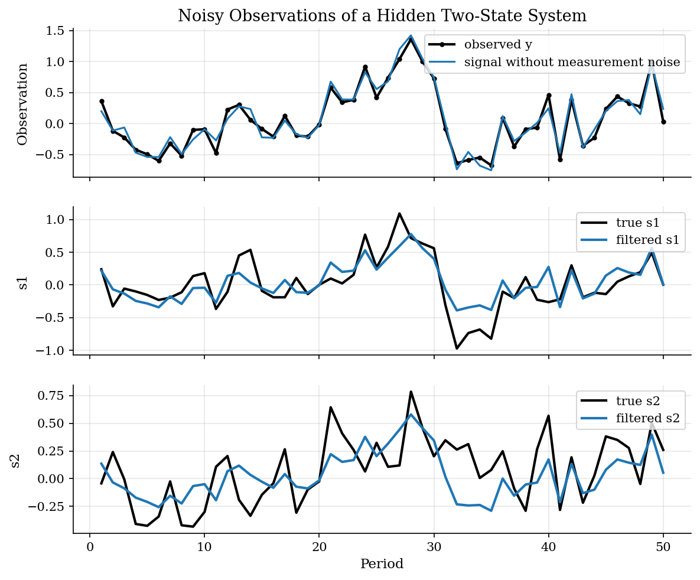
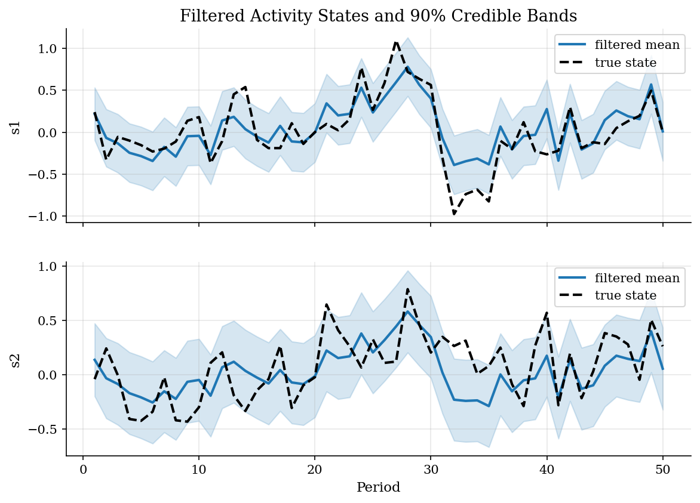
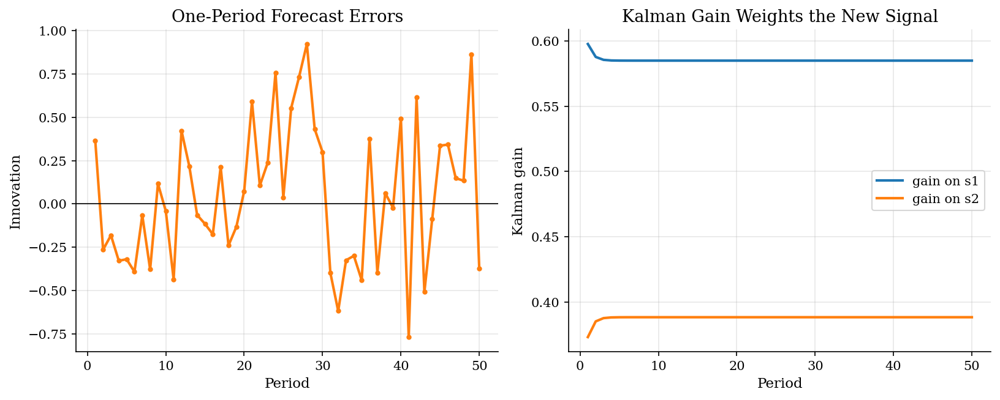

# Nowcasting a Latent Business-Cycle State by Kalman Filtering

## Overview

A policy team tracks current activity before the full national accounts arrive. It sees a noisy indicator, such as a survey or spending series.

The target is a latent business-cycle state. The indicator reveals part of that state, but it also includes measurement noise.

The filter keeps a distribution, not just a fitted line. Its mean is the nowcast and its covariance records how much uncertainty remains after the current signal.

The computational need is recursive inference. After each signal, the filter updates the nowcast, its covariance, and the likelihood.

## Equations

Let $s_t$ collect two latent components of economic activity. The researcher
observes a scalar indicator $y_t$ that loads on both components and adds
measurement noise:

$$
y_t = \Psi s_t + u_t, \qquad u_t \sim N(0, R).
$$

The hidden state follows a linear transition equation:

$$
s_t = \Phi s_{t-1} + \epsilon_t, \qquad \epsilon_t \sim N(0, Q).
$$

Given data through $t-1$, the filter predicts the next state and its covariance:

$$
\begin{aligned}
\hat{s}_{t|t-1} &= \Phi \hat{s}_{t-1|t-1}, \\
P_{t|t-1} &= \Phi P_{t-1|t-1}\Phi' + Q.
\end{aligned}
$$

The new signal produces a forecast surprise, a signal variance, and a Kalman
gain:

$$
\begin{aligned}
\nu_t &= y_t - \Psi\hat{s}_{t|t-1}, \\
S_t &= \Psi P_{t|t-1}\Psi' + R, \\
K_t &= P_{t|t-1}\Psi'(\Psi P_{t|t-1}\Psi' + R)^{-1}, \\
\hat{s}_{t|t} &= \hat{s}_{t|t-1} + K_t\nu_t, \\
P_{t|t} &= P_{t|t-1} - K_t\Psi P_{t|t-1}.
\end{aligned}
$$

The likelihood contribution is the Gaussian density of $\nu_t$ under variance
$S_t$. The same scalar density is what maximum-likelihood estimation uses when
the state-space parameters are unknown.

## Model Setup

| Object | Value |
|--------|-------|
| Latent state $s_t=(s_{1t}, s_{2t})$ | two activity components |
| Observed signal $y_t$ | noisy indicator of current activity |
| Loading matrix $\Psi$ | [1.0, 0.9] |
| Transition matrix $\Phi$ | diag(0.4, 0.5) |
| Measurement std | 0.10 |
| Process std | (0.30, 0.25) |
| Periods | 50 |
| Initial state | $s_0 = (0,0)$ |

## Solution Method

The simulation draws the true latent path and the noisy observed indicator. The filter starts from zero and makes a one-period forecast. It compares the forecasted indicator with observed $y_t$. The Kalman gain moves the state estimate toward that surprise.

The prediction step asks what the state should look like before seeing the new signal. The update step asks how surprising the signal is relative to that prediction. A precise signal or an uncertain prior produces a larger gain; a noisy signal produces a smaller gain. The same forecast error also contributes the likelihood increment used for estimation.

```text
Algorithm: nowcasting a latent state with the Kalman filter
Input: observations y_t, transition Phi, loading Psi, covariances Q and R
Output: filtered means, filtered covariances, innovations, likelihood
Initialize s_hat_{0|0} and P_{0|0}
for t = 1, ..., T:
    predict state:      s_hat_{t|t-1} = Phi s_hat_{t-1|t-1}
    predict covariance: P_{t|t-1} = Phi P_{t-1|t-1} Phi' + Q
    innovation:         nu_t = y_t - Psi s_hat_{t|t-1}
    innovation var:     S_t = Psi P_{t|t-1} Psi' + R
    gain:               K_t = P_{t|t-1} Psi' S_t^{-1}
    update state:       s_hat_{t|t} = s_hat_{t|t-1} + K_t nu_t
    update covariance:  P_{t|t} = P_{t|t-1} - K_t Psi P_{t|t-1}
    add log p(nu_t; 0, S_t) to the likelihood
```

## Results

The observed indicator mixes hidden activity with measurement error. The filter separates persistent state movements from noise.



The posterior covariance shows uncertainty about each latent component after period t.



Forecast errors drive the updates. The Kalman gain settles near constants set by signal and state noise.



The table compares filtered state means with the simulated hidden states.

**Filter diagnostics**

| State          | RMSE   | Mean abs error   | Mean posterior std   |   90% band coverage |
|:---------------|:-------|:-----------------|:---------------------|--------------------:|
| s1             | 0.2297 | 0.1754           | 0.2114               |                0.86 |
| s2             | 0.2447 | 0.2106           | 0.2286               |                0.92 |
| log likelihood |        |                  |                      |              -25.73 |

The total log likelihood for the simulated sample is -25.73. The estimated path follows the two hidden components from one noisy scalar indicator. The covariance and gain decide how much each signal moves the nowcast.

## Takeaway

When an economic state is hidden, smoothing the raw series is not enough. A state-space model says how the state moves and how noisy signals are. The Kalman filter updates the conditional state distribution one observation at a time.

## References

- [Kalman, R. E. (1960). A New Approach to Linear Filtering and Prediction Problems. *Journal of Basic Engineering*, 82(1), 35-45.](https://doi.org/10.1115/1.3662552)
- [Durbin, J. and Koopman, S. J. (2012). *Time Series Analysis by State Space Methods*, 2nd ed. Oxford University Press.](https://doi.org/10.1093/acprof:oso/9780199641178.001.0001)
