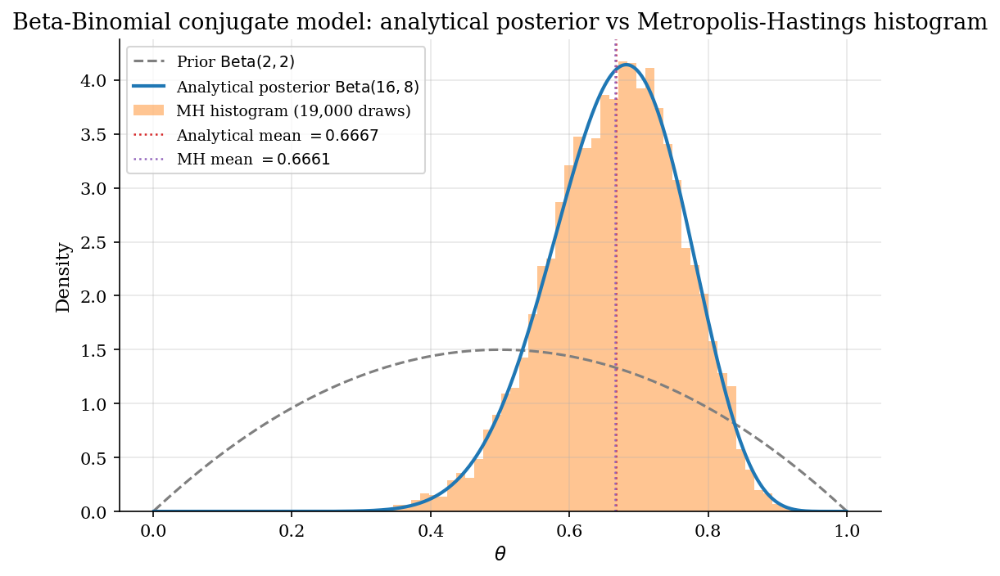
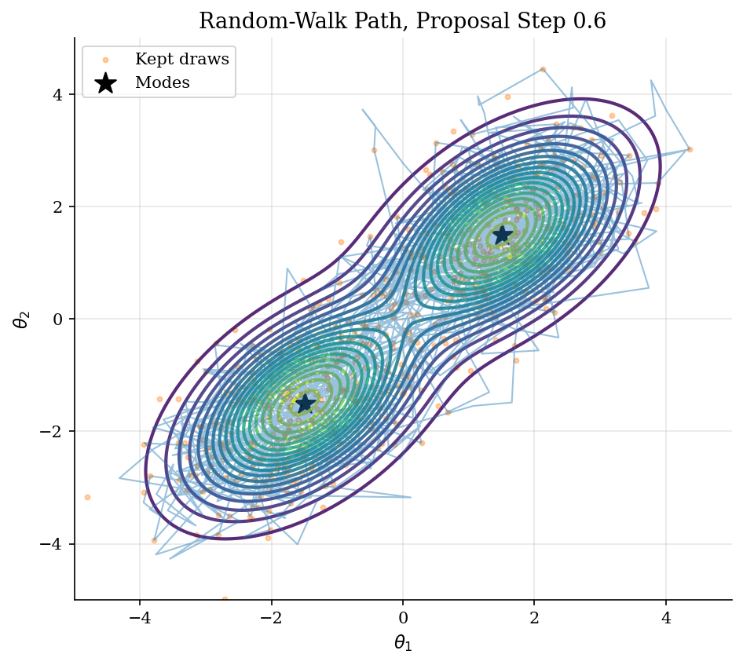
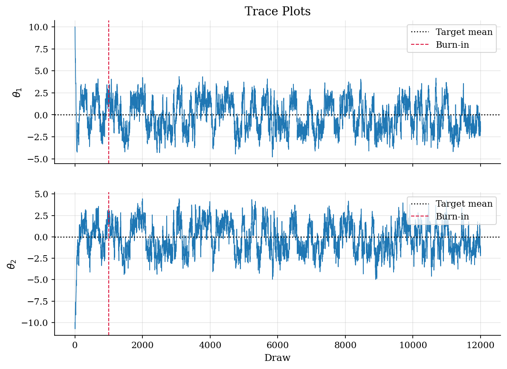
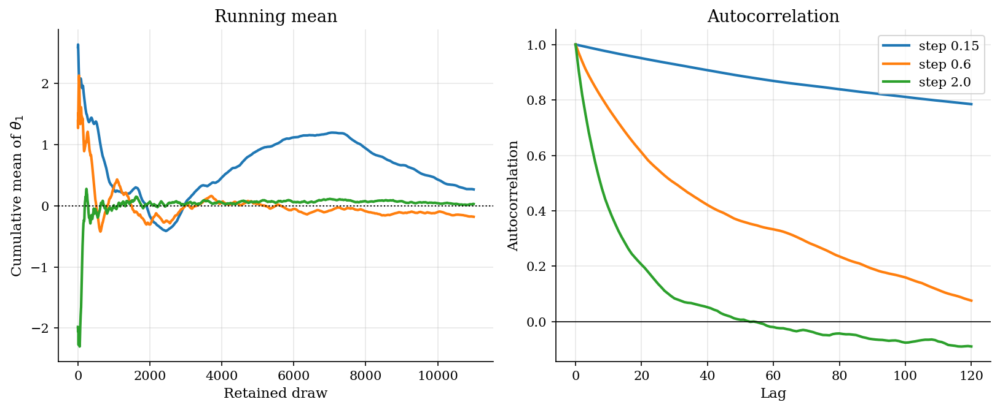

# Posterior Sampling: Conjugate Bayes and Metropolis-Hastings

## Overview

Bayesian inference replaces a single estimate with a posterior distribution over parameters. Posterior averages are the objects of interest: predictive means, counterfactual welfare, structural elasticities. When the prior and the likelihood are conjugate, the posterior is available in closed form and the averages are analytical. When they are not, the posterior is known only up to a normalizing constant and the averages require a sampler.

This tutorial walks both cases. The first method is the Beta-Binomial conjugate model, where the posterior is a Beta distribution and every moment is in closed form. It is the canonical first Bayesian example. It also serves as a controlled sanity check on the Markov-chain sampler that follows: running Metropolis-Hastings on the same model should recover the closed-form posterior to within finite-sample noise. If it does not, the sampler is wrong before we ever apply it to a harder problem.

The second method is random-walk Metropolis-Hastings on a two-component Gaussian mixture. The mixture stands in for a structural posterior where two parameter regions fit the same data. There is no closed form. The sampler is the only tool, and the diagnostics on it are how we tell whether posterior averages weight the regimes correctly or report a regime artifact.

## Equations

Let $\theta \in \Theta$ denote a parameter (scalar or vector) and let $D$ denote observed data.
Bayes' rule combines a likelihood $L(D \mid \theta)$ with a prior density $p_0(\theta)$ into a posterior density

$$
p(\theta \mid D) = \frac{\overbrace{L(D \mid \theta)}^{\text{likelihood}}\, \overbrace{p_0(\theta)}^{\text{prior}}}{\underbrace{\int_{\Theta} L(D \mid \theta')\, p_0(\theta')\, d\theta'}_{\text{marginal likelihood } m(D)}}.
$$

The numerator $L(D \mid \theta)\, p_0(\theta)$ is the posterior kernel, the only thing the sampler needs.
The denominator is the marginal likelihood $m(D)$, an integral over $\Theta$ that is usually intractable.
That intractability is the whole reason MCMC exists: the sampler in Method 2 evaluates the kernel and never the marginal likelihood, because the kernel ratio cancels the unknown normalizing constant.
Closed-form posteriors arise when the prior is conjugate to the likelihood (Method 1).
Otherwise we sample (Method 2).

### Method 1: Beta-Binomial conjugate posterior

The Beta-Binomial model has scalar parameter $\theta \in (0, 1)$ interpreted as the probability of a binary outcome.
The prior is a Beta distribution with shape parameters $\alpha > 0$ and $\beta > 0$:

$$
\theta \sim \mathrm{Beta}(\alpha, \beta),
\qquad
p_0(\theta) = \frac{\theta^{\alpha - 1} (1 - \theta)^{\beta - 1}}{B(\alpha, \beta)},
\qquad
B(\alpha, \beta) = \int_0^1 u^{\alpha - 1} (1 - u)^{\beta - 1}\, du.
$$

The Beta function $B(\alpha, \beta)$ is the normalizing constant of the prior; it equals $\Gamma(\alpha)\Gamma(\beta) / \Gamma(\alpha + \beta)$ in terms of the Gamma function but we never need that form explicitly.
The data are $n \ge 1$ independent Bernoulli trials with $k \in \lbrace 0, 1, \ldots, n \rbrace$ successes, so $D = (y_1, \ldots, y_n)$ with $y_i \in \lbrace 0, 1 \rbrace$ and $k = \sum_i y_i$.
The likelihood is the binomial mass function

$$
L(D \mid \theta) = \binom{n}{k}\, \theta^k (1 - \theta)^{n - k}.
$$

Multiplying prior and likelihood, the kernel collects all $\theta$-dependent factors and the binomial coefficient and Beta-function denominators are absorbed into the normalizing constant:

$$
p(\theta \mid D) \propto \theta^{\alpha - 1} (1 - \theta)^{\beta - 1} \cdot \theta^k (1 - \theta)^{n - k}
= \theta^{\alpha + k - 1} (1 - \theta)^{\beta + n - k - 1}.
$$

The kernel has Beta form, so the posterior is itself Beta with updated parameters:

$$
\theta \mid D \sim \mathrm{Beta}(\alpha + k,\, \beta + n - k).
$$

Writing $\alpha_{\mathrm{post}} = \alpha + k$ and $\beta_{\mathrm{post}} = \beta + n - k$, the posterior moments are available in closed form.
The posterior mean is

$$
\mathbb{E}[\theta \mid D] = \frac{\alpha_{\mathrm{post}}}{\alpha_{\mathrm{post}} + \beta_{\mathrm{post}}} = \underbrace{\frac{\alpha + \beta}{\alpha + \beta + n}}_{\text{prior weight}} \cdot \underbrace{\frac{\alpha}{\alpha + \beta}}_{\text{prior mean}} + \underbrace{\frac{n}{\alpha + \beta + n}}_{\text{data weight}} \cdot \underbrace{\frac{k}{n}}_{\text{sample fraction}}.
$$

Written this way the posterior mean is a convex combination of the prior mean and the sample fraction, with weights summing to one.
The prior weight $(\alpha + \beta)/(\alpha + \beta + n)$ shrinks toward zero as the sample size grows, so a Bayesian with a flat prior and a large dataset reports essentially the sample fraction.
This is the same shrinkage logic that drives the Gaussian-process posterior in [`numerical-methods/bayesian-optimization/`](../../numerical-methods/bayesian-optimization/): in both models the posterior mean is a weighted average of a prior anchor and a data-driven estimate, weighted by their respective precisions.
The posterior variance is

$$
\mathrm{Var}[\theta \mid D] = \frac{\alpha_{\mathrm{post}}\, \beta_{\mathrm{post}}}{(\alpha_{\mathrm{post}} + \beta_{\mathrm{post}})^2\, (\alpha_{\mathrm{post}} + \beta_{\mathrm{post}} + 1)}.
$$

The tail probability $P(\theta > t \mid D)$ for $t \in (0, 1)$ is one minus the regularized incomplete Beta function

$$
P(\theta > t \mid D) = 1 - I_t(\alpha_{\mathrm{post}}, \beta_{\mathrm{post}}),
\qquad
I_t(a, b) = \frac{1}{B(a, b)} \int_0^t u^{a - 1} (1 - u)^{b - 1}\, du.
$$

These three moments are computed in code without any Monte-Carlo simulation, which is what makes Method 1 the controlled sanity check for Method 2 below.
The same Bayesian update machinery, in a different geometry, drives the Gaussian-process posterior in [`numerical-methods/bayesian-optimization/`](../../numerical-methods/bayesian-optimization/): there the prior is over an unknown function and conditioning a joint Gaussian replaces the Beta-Binomial conjugacy.

#### Worked example

To make the update concrete on a tiny dataset, take an uninformative prior $\alpha = \beta = 1$ (the uniform $\mathrm{Beta}(1, 1)$) and observe $k = 3$ successes in $n = 4$ trials.
The posterior is $\mathrm{Beta}(1 + 3,\, 1 + 4 - 3) = \mathrm{Beta}(4, 2)$ with mean $4/6 = 0.667$.
The prior mean is $1/2$ and the sample fraction is $3/4 = 0.75$; the posterior mean lies between them, leaning toward the sample fraction because the data weight $4/6$ dominates the prior weight $2/6$.

On the calibration used in the rest of this tutorial ($\alpha = 2$, $\beta = 2$, $n = 20$, $k = 14$) the posterior is $\mathrm{Beta}(16, 8)$ with mean $0.6667$ and variance $0.00889$.

### Method 2: Random-walk Metropolis-Hastings on a mixture posterior

The second target is a posterior over $\theta = (\theta_1, \theta_2) \in \mathbb{R}^2$ given by a two-component Gaussian mixture:

$$
\pi(\theta \mid D) = \omega\, \phi(\theta;\, \mu_1, \Sigma) + (1 - \omega)\, \phi(\theta;\, \mu_2, \Sigma),
$$

where $\omega \in (0, 1)$ is the mixing weight, $\mu_1, \mu_2 \in \mathbb{R}^2$ are the component means, $\Sigma \in \mathbb{R}^{2 \times 2}$ is the shared component covariance, and the bivariate normal density is

$$
\phi(\theta;\, \mu, \Sigma) = \frac{1}{2 \pi \sqrt{\lvert \Sigma \rvert}}\, \exp\left(-\tfrac{1}{2} (\theta - \mu)^{\top} \Sigma^{-1} (\theta - \mu)\right).
$$

The two components stand in for two structural regimes that fit the same data.
There is no closed-form posterior moment generator: the moments depend on the mixture and we cannot integrate against $\pi$ analytically.

Random-walk Metropolis-Hastings constructs a Markov chain $(\theta_t)_{t \ge 0}$ whose stationary distribution is $\pi(\theta \mid D)$ using only pointwise evaluations of the kernel.
Given current state $\theta_t \in \mathbb{R}^d$ (with $d = 2$ here), a Gaussian random-walk proposal draws

$$
\theta^{\star} = \theta_t + s\, \eta_t,
\qquad
\eta_t \sim \mathcal{N}(0, I_d),
\qquad
\eta_t \in \mathbb{R}^d,
$$

where $s > 0$ is the proposal scale and $I_d$ is the $d \times d$ identity matrix.
Because the proposal density $q(\theta^{\star} \mid \theta_t)$ is symmetric, the Metropolis-Hastings acceptance probability simplifies to the kernel ratio capped at one:

$$
\alpha(\theta_t, \theta^{\star}) =
\min\bigg\lbrace 1,\, \underbrace{\frac{\pi(\theta^{\star} \mid D)}{\pi(\theta_t \mid D)}}_{\text{kernel ratio, marginal cancels}} \bigg\rbrace.
$$

The marginal likelihood $m(D)$ appears in both the numerator and denominator of the kernel ratio and cancels exactly, which is why the sampler never needs to evaluate the partition function.
This rule satisfies detailed balance: for any pair $(\theta, \theta')$ the joint density of "current state and proposal" is symmetric under swapping the two, since

$$
\pi(\theta)\, q(\theta' \mid \theta)\, \alpha(\theta, \theta')
= \pi(\theta')\, q(\theta \mid \theta')\, \alpha(\theta', \theta).
$$

Detailed balance implies that $\pi$ is the stationary distribution of the resulting chain.
The acceptance ratio depends only on the kernel ratio, so the marginal likelihood $m(D)$ cancels.
That is the load-bearing reason MH works without ever computing the partition function.
The same algorithm applies to the conjugate model above with the bound $\theta \in (0, 1)$ enforced by rejecting proposals outside the unit interval; running it there is how we verify the sampler before applying it to the harder mixture target.

For curved or strongly correlated posteriors the random walk mixes slowly and effective sample size per evaluation is small; the gradient-based proposal in [`computational-methods/hamiltonian-monte-carlo/`](../../computational-methods/hamiltonian-monte-carlo/) is the fix when $\nabla \log \pi$ is available.

Retained draws from the chain approximate posterior averages of any integrable function $g : \Theta \to \mathbb{R}$:

$$
\mathbb{E}[g(\theta) \mid D] \approx \frac{1}{T - T_{\mathrm{burn}}}\, \sum_{t = T_{\mathrm{burn}} + 1}^{T} g(\theta_t).
$$

The approximation is exact in the limit $T \to \infty$.
On a finite run it is only as good as the chain's mixing, which on multimodal targets is governed by how often the chain crosses between modes.

## Model Setup

| Object | Value | Role |
|--------|-------|------|
| **Method 1 Beta-Binomial** | | |
| Prior $\mathrm{Beta}(\alpha, \beta)$ | (2, 2) | Weak symmetric prior |
| Sample size $n$ | 20 | Binomial trials |
| Successes $k$ | 14 | Observed |
| Closed-form posterior | $\mathrm{Beta}(16, 8)$ | Analytical |
| Posterior mean | 0.6667 | $\alpha_{\mathrm{post}} / (\alpha_{\mathrm{post}} + \beta_{\mathrm{post}})$ |
| Posterior variance | 0.00889 | Analytical |
| MH proposal scale | 0.10 | Bounded random walk on $(0, 1)$ |
| MH draws | 20,000 | After burn-in of 1,000 |
| **Method 2 mixture** | | |
| Posterior interpretation | Two empirically plausible structural regimes | |
| $\mu_1$ | (1.5, 1.5) | First-regime mean |
| $\mu_2$ | (-1.5, -1.5) | Second-regime mean |
| $\Sigma$ | [[1.0, 0.5], [0.5, 1.0]] | Within-regime covariance |
| Mixing probability $\omega$ | 0.5 | Regime weight |
| MH draws | 12,000 | After burn-in of 1,000 |
| MH starting point | (10.0, -10.0) | Far from both modes |
| MH proposal steps | [0.15, 0.6, 2.0] | Tuning sweep |

## Solution Method

The two methods share the same Metropolis-Hastings machinery on top of different posterior kernels. The first is the conjugate model where the answer is known. The second is the mixture where it is not.

### Method 1: Conjugate Beta-Binomial

Beta-Binomial conjugacy gives the posterior in one line of algebra: a Beta prior with parameters $(\alpha, \beta)$ combined with $k$ successes in $n$ trials returns a $\mathrm{Beta}(\alpha + k,\, \beta + n - k)$ posterior. The posterior moments follow from the Beta family and need no simulation.

```text
Algorithm: Conjugate update for the Beta-Binomial model
Input : prior parameters alpha, beta; data n, k
Output: posterior parameters and analytical moments
  alpha_post = alpha + k
  beta_post  = beta  + n - k
  mean       = alpha_post / (alpha_post + beta_post)
  variance   = alpha_post * beta_post /               ((alpha_post + beta_post)^2 * (alpha_post + beta_post + 1))
```

We run a one-dimensional random-walk Metropolis-Hastings chain on the same posterior as a sanity check. The proposal is a Gaussian step bounded to the unit interval by rejecting any move outside $(0, 1)$. After 1,000 burn-in draws and 19,000 retained draws, the chain's empirical mean and variance should match the closed-form values to within a few percent. If they do not, either the proposal scale is too small to mix or the acceptance rule is implemented wrong. Either way, no further conclusions from the same sampler are trustworthy.

### Method 2: Random-walk Metropolis-Hastings on a mixture posterior

Random-walk Metropolis-Hastings needs the posterior kernel at the current and proposed parameter values. The normalizing constant cancels from the acceptance ratio. The script runs three proposal scales to expose the tuning trade-off on the mixture target.

```text
Algorithm: random-walk Metropolis-Hastings
Input: log posterior kernel ell(theta), proposal scale s, initial theta_0, draws T
Output: draws from pi(theta | D), plus mode-crossing summaries
1. Set theta = theta_0 and compute ell(theta)
2. For t = 1, ..., T:
       propose theta_star = theta + s * eta_t, eta_t ~ N(0, I)
       compute log alpha = ell(theta_star) - ell(theta)
       accept theta_star with probability min(1, exp(log alpha))
       otherwise repeat the current theta
3. Drop burn-in draws
4. Report acceptance, mode switches, posterior mean error, and ESS
```

Proposal scale $s$ controls local move size. Tiny steps accept often but cross modes slowly. Large steps cross low-density regions more often, but many proposals are rejected. The known mixture mean lets the code measure finite-chain error.

For high-dimensional Gaussian targets the asymptotically optimal acceptance rate is roughly 0.23 (Roberts, Gelman, and Gilks 1997). That result is why tuning advice for $s$ usually targets acceptance between 0.2 and 0.5. On bimodal targets like this one, the rule is a guide but not a guarantee, because what limits the chain is mode-jumping rather than local mixing.

Two diagnostics measure these chain qualities. Effective sample size turns the autocorrelated chain into an equivalent count of independent draws. Let $\rho_t = \mathrm{Corr}(\theta_s, \theta_{s+t})$ denote the stationary lag-$t$ autocorrelation of a coordinate of the chain. The integrated autocorrelation time is $\tau = 1 + 2 \sum_{t \ge 1} \rho_t$ and the effective sample size for a chain of length $T$ is $\mathrm{ESS} = T / \tau$. We estimate $\tau$ from the sample autocorrelations and truncate the sum at the first nonpositive lag, the standard initial-positive-sequence estimator. Mode switches count how often the chain crosses between regimes. Together these checks say whether posterior averages weight the structural regimes correctly or report a regime artifact.

## Results

The Beta-Binomial calibration uses prior $\mathrm{Beta}(2, 2)$ and data 14 successes in 20 trials. The closed-form posterior is $\mathrm{Beta}(16, 8)$ with mean 0.6667 and variance 0.00889. The Metropolis-Hastings histogram overlays the analytical posterior tightly. Empirical mean is 0.6661 (error 0.0005). Empirical variance is 0.00901 (error 0.00012). Acceptance rate is 0.695, within the rule-of-thumb band for one-dimensional random-walk MH. The match is the licence to trust the same sampler on a target where no closed form exists.



Three posterior summaries on the same Beta-Binomial model. The analytical column is the closed form. The MH column is from the bounded random-walk chain.

**Conjugate-model posterior moments: analytical vs Metropolis-Hastings**

| Quantity                 |   Analytical |   MH empirical |   Absolute error |
|:-------------------------|-------------:|---------------:|-----------------:|
| Posterior mean           |      0.6667  |        0.6661  |          0.0005  |
| Posterior variance       |      0.00889 |        0.00901 |          0.00012 |
| Posterior P(theta > 0.5) |      0.9534  |        0.9517  |          0.0017  |

With proposal step 0.6, the chain visits both regimes and accepts 69.9% of proposed moves.



The traces show burn-in, mode crossing, and persistence in the retained draws.



The running mean and autocorrelation show how proposal scale changes finite-chain error.



The true posterior mean is zero. Each coordinate has marginal variance 3.25 because the modes are far apart.

**Proposal-scale diagnostics on the mixture target**

|   Proposal step |   Acceptance rate |   Mode switches |   Mean error |   ESS theta1 |   ESS theta2 |
|----------------:|------------------:|----------------:|-------------:|-------------:|-------------:|
|            0.15 |             0.918 |              71 |        0.374 |           24 |           23 |
|            0.6  |             0.699 |             319 |        0.255 |          120 |          118 |
|            2    |             0.304 |             689 |        0.048 |          467 |          494 |

On the mixture target the middle proposal step 0.6 is the one used in the path and trace plots. It gives acceptance 69.9% and moves between regimes. The smallest proposal accepts most often but crosses modes slowly. The largest proposal has lower acceptance, more mode switches, and the smallest mean error. The table shows why acceptance rate alone is not enough. Unlike the conjugate model, there is no closed-form posterior mean to compare against; we know the analytical mean here only because we set the mixture by hand. In a real structural application the diagnostics in the table are all we have.

## Takeaway

Conjugate Bayes is the right tool when the model permits it. The Beta-Binomial posterior is one line of algebra, and every moment is analytical. Conjugate families exist for many useful pairs: Beta-Bernoulli for proportions, Normal-Normal for known-variance Gaussian means, Gamma-Poisson for counts, and conjugate priors on the linear-regression coefficient vector. When conjugacy is available, use it.

Metropolis-Hastings is the workhorse when conjugacy is not. It turns a posterior kernel into draws without ever computing the normalizing constant. It needs only that the kernel can be evaluated pointwise. It is what makes Bayesian inference practical for structural models, latent-variable models, and any posterior with a nonstandard shape.

Run the sampler on a conjugate problem first. The conjugate model has analytical moments, so the empirical mean and variance from the chain can be checked exactly. If the sampler fails on a tractable problem, it cannot be trusted on an intractable one. If it passes, the same machinery transfers to the mixture target and to structural posteriors with similar geometry.

Finite-chain diagnostics matter on multimodal targets. The mixture chain can still weight regimes incorrectly even after thousands of draws. Trace plots, cumulative means, mode switches, and autocorrelation are the routine checks. They are what stand between a posterior average and a regime artifact, and they extend naturally to gradient-based samplers like Hamiltonian Monte Carlo for harder posteriors.

Random-walk Metropolis-Hastings, Hamiltonian Monte Carlo, and Bayesian optimization are three corners of the same problem: doing inference when each evaluation of the posterior or likelihood is expensive. Random-walk MH is the gradient-free, posterior-sampling tool that this tutorial introduces. Hamiltonian Monte Carlo in [`computational-methods/hamiltonian-monte-carlo/`](../../computational-methods/hamiltonian-monte-carlo/) is the gradient-aware posterior-sampling alternative for curved or strongly correlated posteriors. Bayesian optimization in [`numerical-methods/bayesian-optimization/`](../../numerical-methods/bayesian-optimization/) is the gradient-free alternative when the goal is to *maximize* the posterior or any other expensive black-box objective rather than to sample it.

## References

- Gelman, A., Carlin, J. B., Stern, H. S., Dunson, D. B., Vehtari, A., and Rubin, D. B. (2013). *Bayesian Data Analysis*, 3rd edition. CRC Press, Ch. 2 on single-parameter conjugate models and Ch. 11 on MCMC.
- [Metropolis, N. et al. (1953). Equation of State Calculations by Fast Computing Machines. *Journal of Chemical Physics*, 21(6), 1087-1092.](https://doi.org/10.1063/1.1699114)
- [Hastings, W. K. (1970). Monte Carlo Sampling Methods Using Markov Chains and Their Applications. *Biometrika*, 57(1), 97-109.](https://doi.org/10.1093/biomet/57.1.97)
- [Chib, S. and Greenberg, E. (1995). Understanding the Metropolis-Hastings Algorithm. *The American Statistician*, 49(4), 327-335.](https://doi.org/10.1080/00031305.1995.10476177)
- Roberts, G. O., Gelman, A., and Gilks, W. R. (1997). *Weak Convergence and Optimal Scaling of Random Walk Metropolis Algorithms*. Annals of Applied Probability, 7, 110-120.
- **See also.** Method 1 of this tutorial is the closed-form Bayesian baseline. Method 2 is the Markov-chain sampler. Hamiltonian Monte Carlo on a curved banana posterior is in [`computational-methods/hamiltonian-monte-carlo/`](../../computational-methods/hamiltonian-monte-carlo/), which repeats the Method 2 algorithm here as its random-walk baseline. Gaussian-process Bayesian optimization for expensive black-box maximization is in [`numerical-methods/bayesian-optimization/`](../../numerical-methods/bayesian-optimization/), which uses the same prior-times-likelihood-equals-posterior framework as Method 1 here but over an unknown function instead of a scalar probability.
