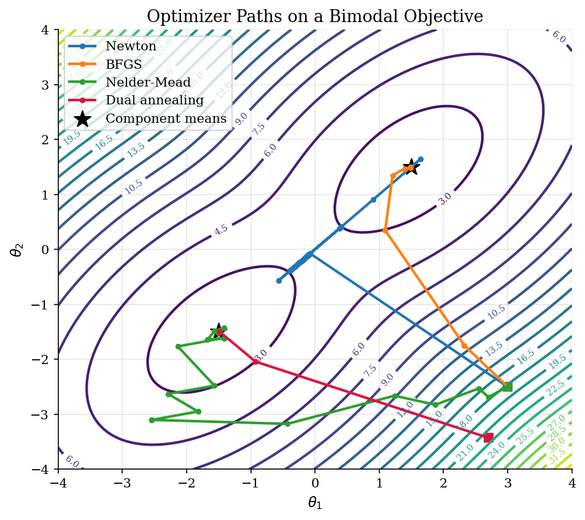
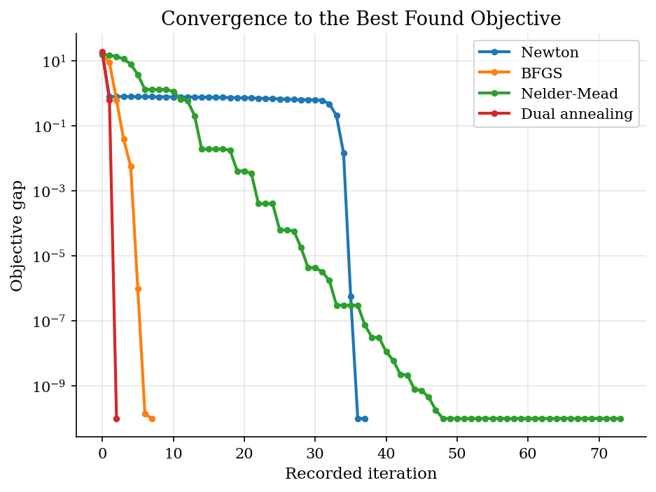
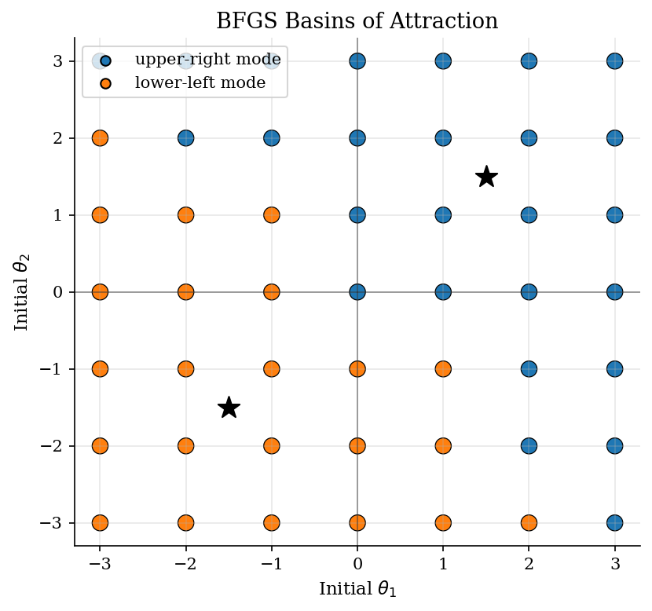

# Multimodal Likelihood Optimization

> How local and global optimizers behave on a small structural-estimation objective.

## Overview

Structural estimation often reduces to minimizing a sample criterion or maximizing a likelihood over parameters. The economic object is the parameter vector, not the optimizer. The optimizer matters because the criterion may be flat, curved unevenly, or have several empirically plausible optima.

This tutorial uses a two-dimensional negative log likelihood built from a mixture of two Gaussian regimes. The two regimes have equal weight, so the objective has two equally good modes. That symmetry is artificial, but useful: it separates the economic warning from implementation detail. A local method answers 'where does this starting value lead?' while a global or multi-start procedure asks whether the answer is stable across the surface.

## Equations

Let $\theta=(\theta_1,\theta_2)$ denote a parameter vector. As a small stand-in
for a likelihood from a latent-regime model, the target density is a mixture of
two bivariate normals:

$$
\begin{aligned}
p(\theta)
&= \omega \phi(\theta; \mu_1, \Sigma) \\
&\quad + (1-\omega)\phi(\theta; \mu_2, \Sigma).
\end{aligned}
$$

The estimator minimizes the negative log likelihood:

$$
\min_{\theta \in \mathbb{R}^2} f(\theta),
\qquad
f(\theta) = -\log p(\theta).
$$

Newton's method uses local curvature around the current parameter guess:

$$
\theta_{n+1} = \theta_n - H_f(\theta_n)^{-1}\nabla f(\theta_n).
$$

BFGS approximates the Hessian from gradient changes, Nelder-Mead moves a simplex without
derivatives, and simulated annealing accepts occasional uphill moves to reduce dependence on
one local basin of attraction.

## Model Setup

| Object | Value |
|--------|-------|
| $\mu_1$ | (1.50, 1.50) |
| $\mu_2$ | (-1.50, -1.50) |
| $\Sigma$ | [[1.0, 0.5], [0.5, 1.0]] |
| Mixing probability $\omega$ | 0.5 |
| Local-method start | (3.00, -2.50) |
| Global search box | $[-5,5]^2$ |

## Solution Method

All methods see the same criterion $f(\theta)$. The comparison is deliberately controlled: Newton, BFGS, and Nelder-Mead start from the same off-diagonal point, while dual annealing searches over the full box before a local polish.

```text
Algorithm: optimizer diagnostics for a multimodal criterion
Input: objective f(theta), starting value theta_0, search box B
Output: candidate estimates, paths, basin diagnostics
1. Run local optimizers from theta_0:
       Newton: update with a regularized Hessian and backtracking line search
       BFGS: update an inverse-Hessian approximation from gradient changes
       Nelder-Mead: move a simplex using only objective values
2. Run global search over B with stochastic uphill moves and local polishing
3. For each candidate theta_hat, record f(theta_hat) and the nearest known mode
4. Restart BFGS on a grid of initial values to map basins of attraction
5. Treat instability across starts as evidence about the criterion, not just code
```

The analytic component means provide a ground-truth diagnostic for this example. In empirical work the same role is played by multi-start checks, profile likelihoods, moment-residual plots, or economically motivated restrictions.

## Results

The same objective can make algorithms look very different. Local methods move quickly once their local model is useful. Global search explores the box before settling near one of the modes.



Fast convergence is conditional on being in a good basin and having a stable local approximation. A low iteration count is not the same thing as a global guarantee.



A local optimizer does not just solve an objective; it solves an objective from a starting point. Multi-start checks are a cheap diagnostic for multimodality.



All local methods start at the same point; dual annealing searches over a box.

**Optimizer outcomes**

| Method         | Start         | Solution       | Mode        |   Objective |   Distance to mode |   Iterations | Success   |
|:---------------|:--------------|:---------------|:------------|------------:|-------------------:|-------------:|:----------|
| Newton         | (3.00, -2.50) | (1.49, 1.49)   | upper-right |     2.38467 |            0.01082 |           38 | True      |
| BFGS           | (3.00, -2.50) | (1.49, 1.49)   | upper-right |     2.38467 |            0.01082 |            7 | True      |
| Nelder-Mead    | (3.00, -2.50) | (-1.49, -1.49) | lower-left  |     2.38467 |            0.01082 |           74 | True      |
| Dual annealing | box [-5,5]^2  | (-1.49, -1.49) | lower-left  |     2.38467 |            0.01082 |           80 | True      |

The best objective found is 2.38467. Because the two mixture weights are equal, the criterion has two equally good estimates near the two component means. The important comparison is not which label wins, but how much each method depends on local geometry and initialization. The basin map makes that dependence visible: BFGS is fast, but its answer is conditional on the initial guess.

## Takeaway

Optimization is part of the empirical specification. A point estimate from a local optimizer is only as credible as the criterion around it and the starting-value checks behind it. Smooth, well-identified problems reward derivative-based methods. Rough or multimodal criteria call for multi-start runs, diagnostics, and sometimes a global search pass before interpreting the estimate economically.

## References

- [Nocedal, J., and Wright, S. J. (2006). *Numerical Optimization*, 2nd ed. Springer.](https://doi.org/10.1007/978-0-387-40065-5)
- [Goffe, W. L., Ferrier, G. D., and Rogers, J. (1994). Global Optimization of Statistical Functions with Simulated Annealing. *Journal of Econometrics*, 60(1-2), 65-99.](https://doi.org/10.1016/0304-4076(94)90038-8)
- [Virtanen, P. et al. (2020). SciPy 1.0: Fundamental Algorithms for Scientific Computing in Python. *Nature Methods*, 17, 261-272.](https://doi.org/10.1038/s41592-019-0686-2)
